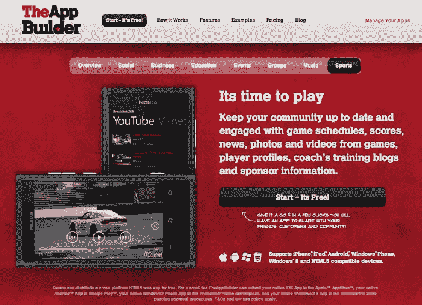
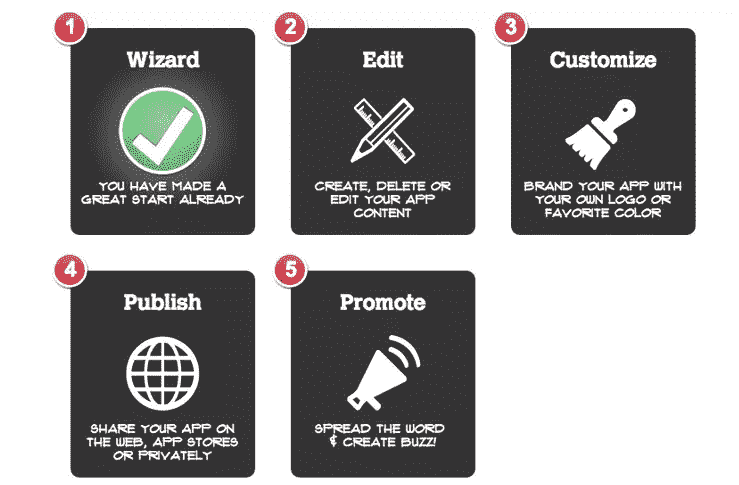
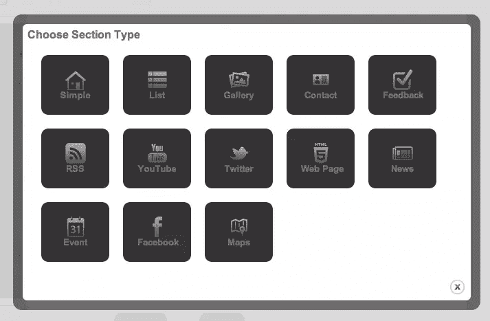
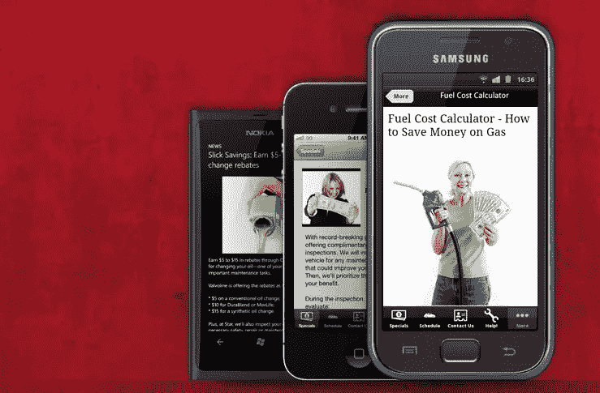

# 对 AppBuilder 联合创始人的采访

> 原文：<https://www.sitepoint.com/theappbuilder-windows-phone-8-app-playground-geolocation-and-more-updates/>

那些梦想成功创业的人最好关注一下 [TheAppBuilder](http://theappbuilder.com/) 。这是一个这样的故事，几个精明的开发人员发现了一个市场缺口，并提出了一个执行良好的成功解决方案。

自从[我和 AppBuilder 团队聊天](https://www.sitepoint.com/theappbuilder-interview-with-matthew-david/)以来，已经过去了大约 6 个月。从那时起，我就一直关注 JamPot 的更新，我必须说，他们一直在努力工作，产品现在已经完全改变了。虽然他们的业务核心仍然在于提供一个超级简单的工作流程来创建多平台移动应用程序，但他们已经实现了一些重大的变化和新功能。

这次，我采访了 JamPot 的联合创始人迈克尔·巴尔(Michael Barr)。我们讨论了他们的最新进展和未来计划。

  

 *****显而易见的问题:整件事是怎么开始的？***

大约两年前开始的。只有我和另一个技术专家。我们都曾在 IT 社区的不同部门工作过。我主要参与构建内容管理 web 解决方案。我们都被要求开始为一些客户考虑移动解决方案。我们聚在一起说:一定有更好的方法来快速构建移动应用程序。

当时我们主要专注于 iOS 应用。我非常喜欢用 Objective-C 构建东西，但是并不是每个人都有这些技能。因此，从那里我们巩固了这个想法，获得了资金，并找到了几个志同道合的家伙。长话短说:我们把 AppBuilder 带到了今天的位置。这远远超出了我们的预期。

***说说你和你原来做的 CMS 的故事。AppBuilder 可以被看作是一种 CMS。它们之间有什么联系？***

那是在北爱尔兰一家名为[web lief](http://www.webbelief.com/Services.aspx)的小公司。它专注于交付基于。NET 平台。这种商业模式在内容管理网站收费合理的时代是成功的。然而，每个人都知道这将是一个短暂的网络时代。许多解决方案不再是开发人员的工具，而是直接迎合最终用户。

这正是我们在 AppBuilder 背后的想法。在我们看到 FrontPage 或 Dreamweaver 等专业软件和 WordPress 等 CMS 选项对行业的影响后，我们不想再开发另一个开发工具。我们希望允许任何人创建一个应用程序，就像 WordPress 在网站上一样。我们想迎合那些只想在移动市场上占有一席之地的小企业主。他/她可能没有编码技能，但是他们真的不需要任何技能来使用 AppBuilder。那些想要更进一步并掌握一些 HTML5 技能的人可以使用一些非常奇特的技术。我们甚至看到人们使用 HTML5 canvas 构建和嵌入游戏。

******

 **您是否计划实施某种电子商务解决方案来帮助应用程序所有者通过应用程序提升业务？

我们有一个相当广泛的路线图，包含一些令人兴奋的想法。支付是我们目前正在考虑的事情之一。人们不断询问我们如何在应用程序中实现购买。我们正在关注支付和电子商务领域的一些大公司，看看我们如何实施他们的技术。还有一些其他有趣的第三方解决方案，我们也希望在我们的应用中启用。

***让我们继续更新。上次我跟你们谈话的时候，这个产品刚刚上市。在过去的 6 个月中，产品的发展如何？***

当我回头看，看到发生了多少事情，这几乎是可怕的！

在早期，为了在所有主要平台上发布应用程序，我们必须使用一些特定的工具。其中之一是 Adobe Air 平台，它确实帮助我们处理了 Android 和 iOS。虽然 Air 很好地介绍了跨平台开发的世界，但我们使用的应用程序质量不够好，我们的客户对交叉编译解决方案提供的用户体验也不满意。

从那以后，我们转向了完全原生的客户端:iOS 用 Objective-C，Android 用 Java，Windows Phone 用 C#。我们还推出了新的 Windows 8 客户端，我们是第一家支持原生 Windows 8 应用的应用构建公司。(查看 Windows 8 商店中的史蒂夫鲍尔默应用程序。)这尤其有趣，因为微软非常关注 PC、平板电脑和手机之间的过渡，并为用户提供一致的用户界面和环境，不管他们选择什么设备来消费他们的内容。

有一段时间，我们保留 Adobe Air 作为桌面编辑器，但后来我们意识到，如果我们把所有东西都转移到完全基于网络的界面，效果会好得多。这可能是最大的变化。整个应用程序创建流程从头到尾完全基于网络，甚至可以从平板电脑上访问。

我们还添加了一个全新的模板机制。为了实现这一点，我们真的必须了解人们如何使用我们的应用程序生成器。如果你开始创建一个应用程序，你会在 AppBuilder 向导中发现的第一件事就是选择模板。如果你要为一家餐馆创建一个应用程序，你可以选择餐馆/酒吧模板，它配备了相关的选项卡和功能。当然，您可以在几个步骤之后定制所有这些。我们计划允许我们的用户提交他们自己设计的高级模板，其他人可以购买。这将是一个伟大的方式，让我们的社区反馈，甚至回报一点他们的时间投资。

最令人兴奋的新功能之一是地图。这是设置您的业务或任何即将举行的活动的地理位置的简单方法。这也可以在兼容设备上的增强现实视图中显示。到目前为止，它一直只使用谷歌地图的 API，然而随着 iOS6 的推出，它也将与苹果的地图后端合作。

我们还添加了一些其他新的部分。画廊提供了一个简单的解决方案来上传和管理您的照片。如果你想上传一系列产品，列表是非常有用的。我们也为事件做了一个单独的部分。除了 Twitter 和脸书，我们还有 YouTube gallery，可以方便地访问您的视频。当然，如果你需要任何额外的功能，你可以添加一个 HTML5 标签，并应用你自己的定制代码。

我们还推出了私人应用。我们看到了不是为公众设计的企业应用的需求。这些为选定的用户群提供了一种发布新闻和更新的方式，我们正在与一些大型企业客户合作，这些客户希望通过定制的移动应用程序向员工发布内部信息。

我们最近的更新之一包括嵌套。这允许用户在一个标准的列表视图中放置任何类型的模块，这为创建非常强大的应用程序开辟了一个可能性的世界。例如，一个内容部分可以包含许多子图库，一个新闻提要可以分解成不同的子部分，用户甚至可以创建包含类别和子类别的产品目录。

***目前你看到 NFC(近场通信)有什么潜力吗？***

当然，我们也许可以用它做一些伟大的事情，但是我们需要等到制造商在硬件方面赶上来。然后技术可以成为主流，它将是值得处理的。

你是否还在追随不同平台的外观和 UX，还是打算走自己的路？

我们仍然完全是原生的，而且我们已经更加紧密地接受了各种操作系统的特性和行为。我们的 Android 应用程序现在与 JellyBean 的原生 UI 一致，iOS 应用程序为您带来了 iOS 用户熟悉的独特的 iPhone。

如果你开发了一个应用程序，你也会得到一个 iPad 测试版。这是为这种更快更大的设备量身定制的略有不同的住宿。最主要的一点是，应用程序所有者只需要关注内容，我们做的是在尽可能多的主要平台上发布应用程序的艰苦工作。

***您计划通过其他方式让社区参与进来吗？***

在接下来的几个月里，我们计划开放一个开发者 API。这将允许人们通过 web 服务发现应用程序结构，这将允许开发人员为我们目前不支持的设备构建本机客户端。

现在你可以免费提供 HTML5 版本的应用程序。你是否看到人们对 web 解决方案的兴趣越来越大，而不是本地解决方案？

我们开始看到网络解决方案的大幅增长，而在本地方面可能会有所放缓。这部分是由于应用程序商店严格的审批程序。苹果、谷歌和微软真的想控制上市，这有时会使获得批准变得困难。不一定是因为内容本身，而是应用的结构和行为。

如果你组装一个 HTML5 web 应用程序，你几乎可以自由地做任何你想做的事情。这种免费、简单的解决方案允许普通人为生日聚会等目的创建应用程序，或者让非营利组织以一种真正经济高效的方式与他们的社区保持联系。一些高端应用可能需要访问只有本机代码才能允许的硬件，但 HTML5 正在迅速缩小与本机代码的差距。

目前，我们有超过 50，000 个应用程序提交，我们每天都会看到更多。我们真的很幸运，没有在广告上投入任何特别的努力就有这样的势头。

您是否使用 AppBuilder 创建过任何应用程序？**您是否认为 HTML5 的功能越来越接近本机代码，或者您认为真正健壮的应用程序将总是需要 Objective-C、Java 或 C#来满足他们的需求？
****** 

## ******分享这篇文章******