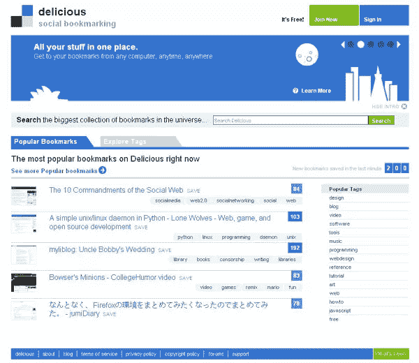

# 新的美味终于来了

> 原文：<https://www.sitepoint.com/thethe-new-delicious-is-finally-here/>

差不多 [11 个月](http://www.techcrunch.com/2007/09/06/exclusive-screen-shots-and-feature-overview-of-delicious-20-preview/)之后[美味](http://www.delicious.com/)公布了其重新设计的屏幕截图，新网站终于上线了。Del.icio.us 现在也重定向到 delicious.com，该网站称这是为了处理他们多年来看到的“del.icio.us 的无数不同的混淆和拼写错误”。

据 [Delicious blog](http://blog.delicious.com/blog/2008/07/oh-happy-day.html) 报道，除了主要的设计革新，该网站现在也将因为闪亮的新后端而变得更快，并且他们已经改进了搜索。

> 我们彻底改革了我们的搜索引擎，使它更快更强大。搜索过去需要很长时间才能返回结果；现在他们非常快。新的搜索引擎也更智能，更社会化:你可以在你的一个标签、另一个用户的公共书签或你的社交网络中搜索。现在更容易利用你朋友的专业知识和兴趣，更不用说整个美味社区了。

然而，漂亮的新设计是重新推出的最引人注目的部分。美味团队表示，这意味着“在精神上与旧的相似。”在这种情况下，它保留了原始 del.icio.us 页面的基本布局，但一切都更加现代。网站上的[新内容页面](http://delicious.com/help/whatsnew)提供了这些变化的一个很好的概述。

你认为这个新设计怎么样？请在评论中告诉我们。

## 分享这篇文章