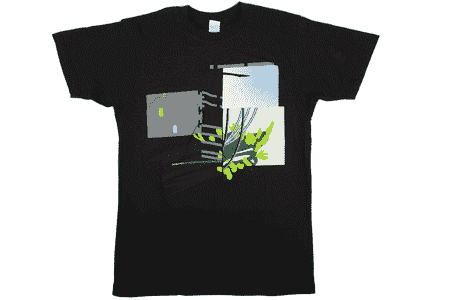

# Threadless 去上学:大学助理牧师衬衫收集

> 原文：<https://www.sitepoint.com/threadless-goes-to-school-college-curates-shirt-collection/>

总部位于芝加哥的 t 恤店 [Threadless](http://www.threadless.com/) 无疑是过去十年中最辉煌的互联网企业之一。对于那些不熟悉的人来说，Threadless 是一个电子商务网站，旨在举办每周一次的 t 恤设计大赛。设计师提交衬衫创意，顾客投票选出他们想做的衬衫。获胜的衬衫限量印刷，设计师将获得现金和免费衬衫奖励。这种模式的美妙之处在于，投票确保了在衬衫印刷之前就有一群顾客准备购买——网站出售的每件衬衫都经过预先审查，并有一个有保证的市场。

上个月，Threadless 推出了一个名为 Select Series 的衍生网站。该网站为自 2006 年以来就存在的无线 t 恤特别系列提供了一个永久的家，这些 t 恤由无线员工管理，而不是通过通常的投票选择方法选择印刷。与 Threadless 不同，在 Threadless 中，不知名的艺术家可以通过用户投票过程成名，Select 系列打印一些艺术和设计界最知名的名字的 t 恤，如 CreaturesInMyHead.com 的安德鲁·贝尔。

现在，该网站将推出一系列由著名的罗德岛设计学院的艺术教授设计的衬衫，所有这些衬衫都以“新”为主题由大学校长约翰·梅达策划的四件教授 t 恤今晚在大学的一个画廊展出，并将在 risd | works store——一家出售 risd 学生和教授作品的商店——和从周一开始的 Select 系列网站上出售。

前田在一份新闻稿中说:“我们是这个由学习者、实干家和导师组成的令人惊叹的社区的一部分，这个社区以令人疲惫的强度追求人类表达的艺术和哲学——以及新鲜感。”“与 Threadless 的这个项目是一个很好的机会来共同探索这个适时的主题。我们正处于美国的选举季节，一场由明显的变革愿望推动的运动正在兴起。人性和创新精神驱动我们对新口味和新感觉的渴望，所有这些都可以合成为新的视角和新的体验。”

Threadless 计划在持续的基础上为精选系列提供客座策展人，RISD 收藏的收益将有利于向学校的奖学金基金捐赠 1.5 万美元。虽然看到 Threadless 扩展到艺术界并让艺术家们有更多的创作自由是很棒的，他们给 RISD 如此可观的捐赠也是很棒的，但有点令人失望的是，这些衬衫是由教授而不是学生创作的。

下面的 GIF 动画展示了 RISD 系列的四件 t 恤。

## 分享这篇文章