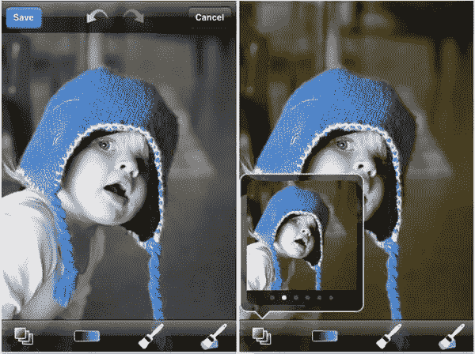
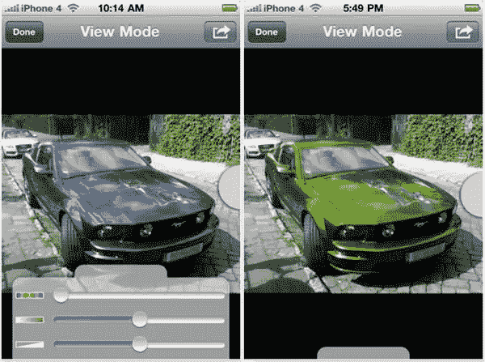
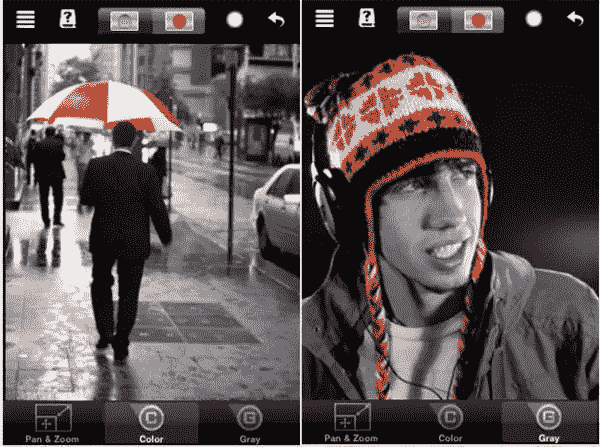

# 三款用于给照片重新上色的 iPhone 摄影应用

> 原文：<https://www.sitepoint.com/three-iphone-photography-apps-for-re-coloring-your-photographs/>

如果你喜欢用 iPhone 拍照，这里有三个应用程序可以让你轻松地改变照片的颜色。所有这些应用程序的成本都很低，这本身就很有吸引力，但使用起来也很有趣。

**ColorBlast**

ColorBlast 允许用户隔离和着色一个对象，而将照片的其余部分保留为黑白。该应用程序使用选择性颜色技术，用户可以刷上一种指定的颜色，而不必担心刷到物体的边缘，也不会涂上其他颜色。不要不小心画到线外。

给黑白图像上的对象着色后，您可以继续对其进行处理，并给黑白图像着色以产生棕褐色或钴色效果。

App Store 上的 Color Blast 售价 1.99 美元。

**重新上色**

[重新着色](http://www.recolor.info/)允许你改变照片中物体的颜色。用户点击他们想要改变的彩色区域，然后使用界面将色调和饱和度改变为任何需要的颜色。

这些功能包括:

*   彩色物体的图像分割和自然着色
*   低分辨率快速预览的实时编辑
*   交互式色调调整
*   交互式饱和度调整
*   通过移除饱和度来移除图像中的颜色
*   通过提高某些区域的颜色来增加图像的生动性
*   编辑过的图像会自动保存，以后可以继续使用
*   适合您设备性能的低分辨率和高分辨率模式
*   将您的作品保存到照片图库

App Store 的重新上色售价 1.99 美元。

**彩色飞溅**

ColorSplash 与 ColorBlast 的相似之处在于，它可以让您降低整张照片的饱和度，然后用您想要的颜色重新着色。该应用程序的功能包括:

*   在脸书、Flickr 或 Twitter 上分享您编辑过的图片
*   保存多个会话以便以后继续工作
*   撤消任意数量的意外笔刷笔划
*   另一种查看模式是用红色突出显示将保持颜色的区域。这使得更容易看到和调整彩色和黑白区域之间的边界。
*   从 4 种不同的笔刷(硬边或软边、不透明或透明)中选择
*   横向或纵向工作。

应用商店的 ColorSplash 售价 1.99 美元

您以前使用过这些应用程序吗？你觉得他们怎么样？还有哪些 iPhone 摄影 app 推荐？

## 分享这篇文章