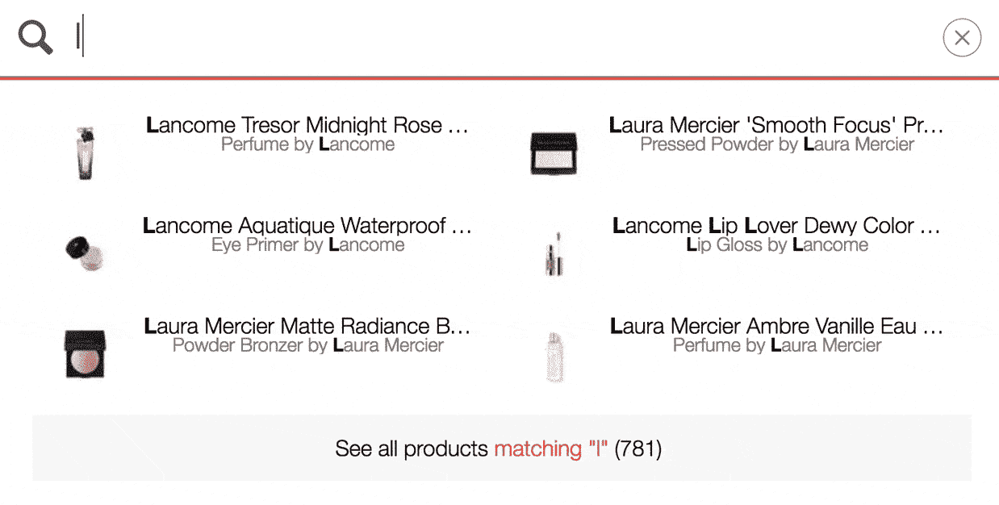

# 为你的企业建立终极搜索，就像谷歌和亚马逊一样

> 原文：<https://www.sitepoint.com/three-pillars-of-search/>

*本文由 [Algolia](https://www.algolia.com) 赞助。感谢您对使 SitePoint 成为可能的赞助商的支持。*

当公司想到搜索时，他们会想到谷歌。他们在 SEO 和 SEM 上投入了大量资金来增加流量——同时，他们自己的搜索体验仍然被忽视。与谷歌和亚马逊相比，Shopify 和 WordPress 等平台上的默认搜索选项显得苍白无力。问题是，当大多数人想到改进他们自己的网站搜索时，他们会考虑雇佣一个搜索工程师团队来创建一个超个性化的、机器学习的、预测性的搜索体验——要么现在就投入巨资，要么坚持默认搜索，对吗？不对。

如果你的网站内的客户旅程不是最佳的，那么投资推动网站的流量是一个坏主意——如果你在想“我的搜索流量占我的网站的百分比很低，所以我为什么要担心它？”那么你的网站搜索可能会得到改善。记住:2016 年， [93%的互联网体验都是从搜索](https://www.searchenginejournal.com/24-eye-popping-seo-statistics/42665/)开始的。

你可能犯的最大错误不是认为“搜索对我客户的数字体验不重要；它认为需要一个搜索工程师团队来创造一个伟大的搜索体验。

如果你从这篇文章中学到了什么，那就是这个:**2017 年，搜索不是后端，而是体验。伟大搜索体验的未来掌握在 UX 设计师&前端工程师手中。**

自 2012 年以来，Algolia 一直致力于让任何工程师都能在我们的托管搜索引擎上构建出色的搜索体验，为全球数以千计的网站和产品提供搜索支持。在那段时间里，我们教育了我们的客户什么是拥有伟大搜索体验的必要条件——伟大的搜索不仅仅是花哨的算法或超定制。

搜索是一个非常直观的过程。用户不会逐个功能地分析搜索体验——事实上，你的产品的大多数用户可能会说搜索栏本身就是功能，而不是组成搜索栏的各种组件——这意味着你的用户在第一次尝试后就直观地知道你的搜索是好是坏。体面搜索和优秀搜索的区别在于搜索的三大支柱——速度、相关性和设计。

## 毫秒很重要

Algolia 在不到 35 毫秒的时间内提供了全球任何地方 99%的搜索结果—[问问我们的客户](http://algolia.com/customers)。回答“多快才算够快？”需要一点“如何”和一点“为什么”，但让我们从后者开始:

为什么毫秒很重要:

*   100 毫秒的延迟花费了亚马逊 1%的销售额
*   500 毫秒的延迟耗费了谷歌 10%的流量
*   10 秒:数字消费者的注意力持续时间

让你的观众参与进来，这是一场与时间的赛跑。在旅程中的任何一步，如果用户感觉到停滞，他们就会流失——尤其是在搜索领域，他们已经下意识地将你的搜索体验与谷歌和亚马逊进行了对比。

你要么和用户期望的一样快，他们甚至不会注意到，要么你慢一些，他们会注意到。

在对话中，如果有人快速回答你的问题，对话会流畅地继续；如果有人漫不经心地盯着你看了足够长的时间，你会问自己“他们怎么这么久才来？”对话中断，对话主题从您感兴趣的内容变成了“为什么要花这么长时间？”

“如何”更具有可操作性。当谈到搜索查询返回结果的速度时，有三个因素很重要:

1.  查询必须经过的距离
2.  为确定相关性而必须查询的记录的大小
3.  用于确定相关性的算法的复杂性

对于内部解决方案，查询到用户的距离取决于托管站点服务器的存放位置。让服务器遍布全球来优化网站加载速度是没有意义的，所以你需要在主要市场复制你的搜索解决方案来优化搜索速度。

*眨眼大约是 180 毫秒*

创建即时搜索——即按即输的搜索体验，在击键后结果会立即出现——需要以比眨眼更快的速度提供结果。你的目标应该是 99%的查询在 35 毫秒内显示。

对于像 Algolia 这样的托管解决方案，你会希望确保你有一个[分布式搜索网络](https://www.algolia.com/infra)(DSN)——你的搜索栏的 CDN 它允许你在全球每个角落的多达 50 台服务器上复制你的搜索索引，这取决于你的用户来自哪里。

## 保持这些记录小

记录越小，通过引擎的速度就越快。像 Algolia 这样的搜索引擎搜索 100 万个单段文本块比搜索 10，000 个 100 段文本块更快——它还可以增加相关性，指出查询在给定文本中的匹配位置。

保持一个精简的搜索机器意味着拥有一个精简的搜索算法。Algolia 使用平局打破算法——一系列简单的嵌套函数，只有在前一个函数的排名输出出现平局时，每个函数才会相继触发。这意味着，如果你的第一个函数——比方说，地理搜索，与用户的距离——为每个结果返回一个唯一的排名，没有任何联系，那么这个函数就在那里停下来，很快，而且不影响相关性。

像 Elastic Search & Solr 这样的搜索引擎框架使用的是浮点评分算法，开发者自己编写。这些可以从足够简单开始，但是随着每一次迭代和改进——这里有一点打字错误容忍，那里有一点同义词处理——算法变得更庞大和更慢，而不一定更相关。

## 关联

相关性意味着找到你要找的东西。有两件事是相关的:

*   **文本相关性**:查询与记录中可搜索单词的匹配程度
*   **业务相关性**(即你的业务指标):销售额/浏览量/点赞数、特色商品、价格、日期……

不是所有的搜索引擎都是一样的，同样，每个搜索体验都有自己独特的文本和商业相关性的平衡。最重要的是，您使用的搜索框架应该能够处理这两种不同类型的数据点。

除了根据对用户最重要的业务/虚荣指标进行排序之外，您还需要确保处理一些更具语义性的挑战:

*   错别字容忍度:不要让自动更正毁了一个完美的搜索体验。
*   搜索“套头衫”的英国用户应该会找到你收集的精彩“毛衣”
*   **长查询**:搜索“褪色的蓝色牛仔裤”的用户不应该空手而归，因为你只有“褪色的牛仔裤”

每个搜索体验的相关性都是独一无二的，了解你的用户在搜索什么，找到&没有找到比任何调整或修改你的排名算法更有价值。

Algolia 为所有用户提供了一个分析仪表板，除了提供关键数字外，还可以帮助您找到没有结果或结果很少的查询——这通常是用户最大的沮丧来源，也是决定在网站上集中精力的最佳起点。此外，因为 Algolia 使用平局打破算法而不是浮点分数，所以相关性可以直接在仪表板内进行微调和迭代，而不需要对每个微小的变化都修改代码。

## 设计

搜索栏的用户界面/UX 可能是最重要的支柱，但也是最容易被忽视的——也就是说，因为搜索通常关注的是排名优化和速度，而不是体验。但是，如果用户每次都必须按“回车”来获得搜索结果，那么拥有闪电般快速的相关搜索又有什么好处呢？

以下是我们为获得出色搜索体验而采取的一些最佳做法:

*   **输入搜索结果**:每一次击键都应该产生结果。当结合巨大的速度时，用户感觉搜索结果随着每一次击键都在自我完善。
*   **强调结果**:理解你得到回应的“原因”和得到正确的结果一样重要。顶部的结果仅仅是因为查询出现在该记录的辅助属性中而出现的吗？有条件地显示并高亮显示，这样用户就知道他们看到给定结果的原因。
*   **在结果中提供上下文**:如果你在你的排名算法中使用商业指标——流行度、价格、可用性——确保通过在搜索结果中显示这些指标让用户看到。就当是凸显你的排名公式吧！
*   **占位符文本**:让你的用户知道他们可以搜索什么，在他们开始输入之前，在搜索栏中留下占位符文本，例如:“乔治·克鲁尼，老无所依，戏剧，1920 年代”
*   多类别搜索:用户成功的途径越多，找到他们想要的东西的机会就越大。即使你只是搜索 WordPress 博客中的文章，允许用户通过作者、类别、标题&标签进行搜索意味着你让用户按照他们想要的方式进行搜索，而不是让他们学习你的搜索是如何工作的。

像大多数创造性职业一样，在幕后，设计是一系列非常具体的步骤。这个清单是为了让你有一个漂亮的搜索，当你尝试你最喜欢的搜索栏(甚至是 SitePoint)时，把这些设计元素留在你的脑海里。少了什么？你有什么问题？设计如何回答这些问题呢？

## 结论

对于你的终端用户来说，搜索是本能的——要么成功，要么失败。对你来说，如果你知道要找什么，搜索会很容易。你不一定要成为搜索专家才能拥有出色的搜索体验。在 Algolia，我们相信搜索的未来在伟大的 UX/用户界面，这就是为什么 Algolia 的集成预配置了设计最佳实践。托管搜索平台为你照顾速度，并使调整相关性成为任何人都可以做的事情，以便你可以专注于建立一个伟大的应用程序体验。

无论你如何构建搜索，搜索栏都是一样的。定义伟大搜索的支柱——速度、相关性和设计——不是由 Algolia、谷歌或任何其他参与者决定的。它们是由用户决定的，无论你是谷歌、亚马逊还是任何其他应用，他们都希望搜索体验能够正常运行。

## 分享这篇文章