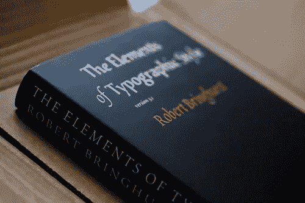
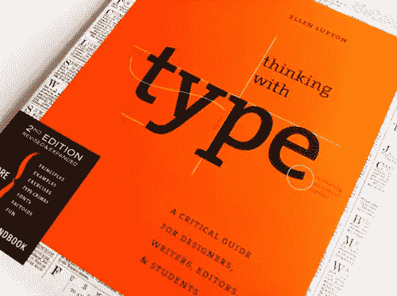
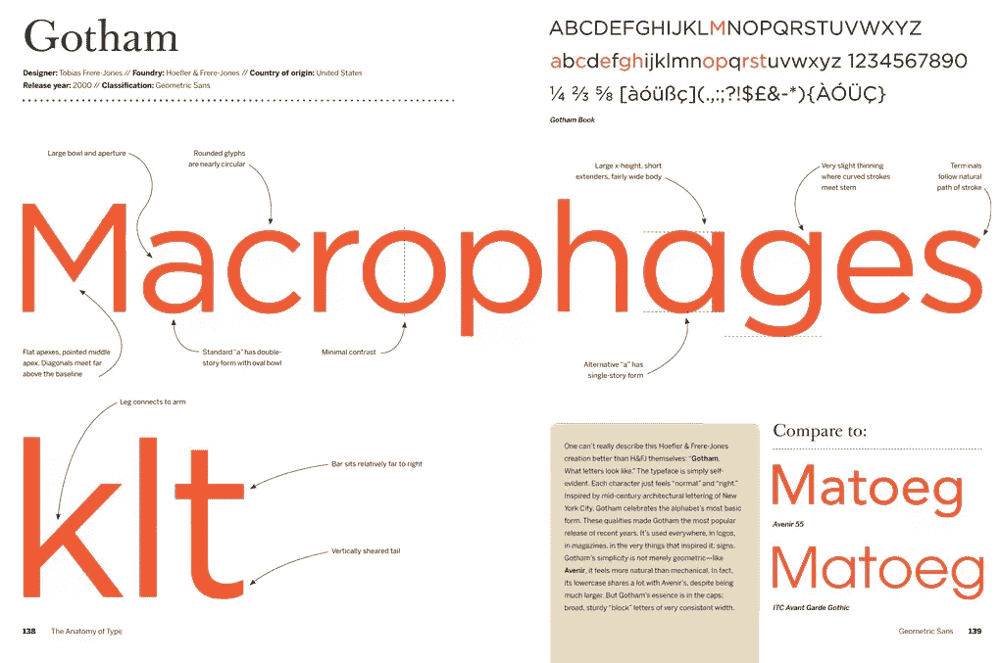

# 所有前端人员都应该阅读的三本书(为什么)

> 原文：<https://www.sitepoint.com/three-typography-books-frontend-people-read/>

2006 年，总部位于瑞士的信息架构师奥利弗·雷琴斯坦估计，网络上 95%的信息都是基于文本的。因此，他推断网页设计 95%是排版。

尽管摄影记者、网飞和 Youtube 可能会有不同的看法，但在 2014 年，绝大多数基于网络的交流——文章标题、在线书籍、推文、社交更新、论坛帖子和博客——仍然是页面上的书面语言。

这意味着无论你是一名专业设计师还是一名兼职涂鸦者，坚如磐石的排版技巧都可以让你在网页设计中走得更远。

像任何伟大的艺术一样——绘画、雕塑、诗歌、摄影——掌握在空间中排列字体的微妙之处是一个终生的过程，你可能永远无法完成对所有传统技术以及更现代方法的掌握。

也就是说，今天，我将推荐一批印刷书籍，每个设计师——无论是新手还是其他人——都可以在他们的书架上使用。

**旁注:**

就在我们看这些书之前，推荐这些书，而不链接到你能找到它们的地方，似乎是不合逻辑的。我们宁愿支持[电子前沿基金会(EFF)](https://www.eff.org/about) 警惕捍卫我们的集体言论自由、隐私、创新和消费者权利，而不是使用任何 SitePoint 附属代码(我们没有这样的代码)。

因此，我们在下面的任何书籍链接中使用 EFF 的会员代码。

## 印刷风格的要素

《印刷风格的要素》由加拿大印刷工人(诗人——这个人喜欢文字)罗伯特·布林赫斯特撰写，1992 年由哈特利&马克森出版社出版。这是我最常听到的被称为“印刷工人的圣经”的印刷书籍。

在这本书里，罗伯特创造了所有排列字体的最重要技术的完美总结，给读者许多来之不易的关于字体、字形、风格和设计的技巧。

这本书不仅仅是关于方法和图形原理的讨论；事实上，Bringhurst
也从哲学的角度分析了文字的概念，让读者思考印刷术在历史、社会和交流中的作用。

许多解释图像和方案的出现以及作者对细节的深刻关注深化了主题。我强烈推荐这本书，因为它会给你扎实的排版背景，同时挖掘出许多你可能从未听说过的字体、术语和技术。

*   [排版风格的要素](http://www.amazon.com/Elements-Typographic-Style-Robert-Bringhurst/dp/0881791326?tag=electronicfro-20 "Amazon link to 'The Elements of Typographic Style'")
*   罗伯特·布林赫斯特
*   出版日期:1992 年

## 用类型思考

我推荐你的下一本书是《用类型思考的*》，作者是艾伦·勒普顿，2010 年由“普林斯顿建筑出版社”出版。*

这本书内容非常广泛，面向所有设计师，从在校学生到专业人士。这是一种通过印刷术世界的解释性旅程，在理论和实践上有一个很好的平衡。

Ellen 讲述了字体、间距、对齐和字体设计的历史，并对所有字体进行了详细的分类。

你还可以找到许多脚注、图表、例子、图像甚至练习，它们给你大量的机会，让你不费吹灰之力地学习新的技术原理，并立即付诸实践。

这本书分为三大部分:“信”、“网格”和“文本”。每一部分都是对其主要关注的主题的深入分析，但 Lupton 从未放松对大图的关注，更喜欢展示每个主题与总体排版的联系。

我认为这本书非常值得你关注，因为它将为你提供关于最古老的和更现代的练习的大量知识。

*   [用类型思维](http://www.amazon.com/Thinking-Type-2nd-revised-expanded/dp/1568989695/?tag=electronicfro-20 "Amazon link to 'Thinking with Type'")
*   艾伦·勒普顿
*   发布时间:2010 年

## 字体剖析:100 种字体的图解指南

我要给你们看的最后一本书是这一系列中最新的一本书，这是一本与众不同的书——《T1 型解剖》，作者是斯蒂芬·科尔斯，由哈珀设计公司于 2012 年出版。在这篇文章中，作者分析了 100 种不同的字体，为我们提供了关于每个细节、关键特征、字体粗细等等的宝贵信息。

这些字体被分成 15 组，然后通过大规模图像的帮助进行检查，这些图像与他自己的观点形成证据的笔记和评论结合在一起。

科尔斯不仅为我们提供了关于字体的技术和图形建议，事实上，他还分享了它们的历史和一些好奇心，以及每页使用不同的颜色，使浏览成为一种乐趣。这本可以成为一本精美的咖啡桌书。

*   [解剖型](http://www.amazon.com/The-Anatomy-Type-Graphic-Typefaces/dp/0062203126/?tag=electronicfro-20 "Amazon link to 'The Anatomy of Type'")
*   斯蒂芬·科尔斯
*   发布时间:2012 年

### 但是如果你只能选择一个呢？

啊，经典的荒岛问题！

所以，如果我只能拿走这些精彩书籍中的一本，我认为它将会是(也许是有争议的)斯蒂芬·科尔斯的《型解剖学》。尽管其他的书都很棒，*《字体的剖析》非常简洁的结构让它几乎立刻成为帮助你为你的项目选择正确字体的宝贵财富，而不会犯常见的和容易避免的错误。*

## 分享这篇文章