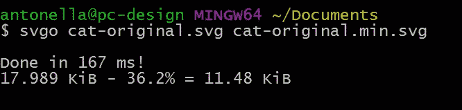
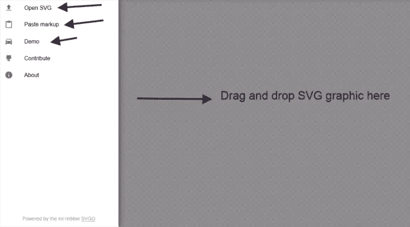
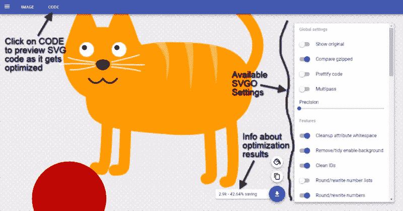

# 用 SVGO 减小 SVG 文件大小的三种方法

> 原文：<https://www.sitepoint.com/three-ways-decreasing-svg-file-size-svgo/>


*本文是与 [SiteGround](https://www.siteground.com/sitepoint-recommended?afcode=97a975da3502771c04e59cbae092b1dd&campaign=svg-size) 合作创作的系列文章的一部分。感谢您对使 SitePoint 成为可能的合作伙伴的支持。*

在这篇文章中，我提出了三种方法，SVGO 让你优化 SVG 图形，使它们适合网络使用。

## 为什么需要优化 SVG

SVG(也称为可缩放矢量图形)是一种独立于分辨率的图形格式。不基于像素的最大优势是 SVG 在我们闪亮的视网膜屏幕设备上看起来很棒，在响应迅速的网络上也很好用。

如果像我一样，你不是一个图形设计师，你可能会发现自己从各种知识共享或公共领域的在线资源中抓取现成的 SVG。这样做的一个不利之处是，这些艺术品通常不是在考虑网络的情况下制作的。这意味着你可能会发现它们充斥着过于复杂的路径和类似 Photoshop 的效果。此外，由于 SVG 是基于 XML 的，深入研究源代码通常会发现许多不必要的标记。除了我对干净代码根深蒂固的热爱，复杂性和膨胀增加了文件大小，对网站性能产生了负面影响。

不要认为如果你自己画 SVG，你就完全没问题了。尽管最新版本的 Adobe Illustrator 可以导出相当干净的 SVG 标记，但旧版本以及一些不同的矢量图形编辑器仍然会在标记中加入不必要的注释、doctype 声明和专有属性。

下面是图形编辑器生成的代码的一个实例来说明这一点:

```
<svg 
  xmlns:rdf="https://www.w3.org/1999/02/22-rdf-syntax-ns#"
  xmlns:svg="https://www.w3.org/2000/svg" 
  xmlns="https://www.w3.org/2000/svg"
  xmlns:inkscape="http://www.inkscape.org/namespaces/inkscape" 
  viewBox="0 0 1000 1000" version="1.1">

  <g inkscape:label="Katze" inkscape:groupmode="layer" id="layer1" transform="translate(0,-52.362183)">

  ... More code here

  </g>

</svg>
```

相反，你真正需要的是:

```
<svg 
  xmlns="https://www.w3.org/2000/svg"
  viewBox="0 0 1000 1000">

  <g id="layer1" transform="translate(0,-52.362183)">

  ... More code here

  </g>

</svg>
```

此外，如果在 CSS 或 JavaScript 中不使用*层 1* ，也可以去掉`<g>`标签上的`id`属性。

就个人而言，我赞成对 SVG 代码进行一些手工清理。但是，不用担心，优化工作中最乏味和重复的部分很容易自动完成。

## 什么是 SVGO？

毫无疑问，目前最流行的工具是 SVGO。

SVGO 运行在 [Node.js](https://nodejs.org/en/) 上，这是一个异步、事件驱动的运行时，用于构建可扩展的网络应用。为了使用 SVGO，你不需要知道如何用 Node.js 构建应用程序。但是，您需要使用计算机的命令行用户界面(CLI)。

SVGO 允许您通过启用或禁用其插件来启用或禁用特定的优化。

例如，如果你想从 SVG 图形中移除空属性，你必须启用 [`removeEmptyAttrs.js`插件](https://github.com/svg/svgo/blob/master/plugins/removeEmptyAttrs.js)。

你可以在 GitHub 上的[项目的自述文件中看到 SVGO 所有可用插件的完整列表。](https://github.com/svg/svgo)

有很多方法可以将 SVGO 集成到您的开发工作中。在接下来的内容中，我将只讨论你可以选择的三个选项。

## #1.只有 Node.js 和 SVGO

要开始使用 SVGO，只需通过下载与您的操作系统对应的最新稳定版本来安装 [Node.js](https://nodejs.org/en/) ，并按照安装程序中的说明进行操作。

接下来，你可以使用 [`npm`、节点的包管理器](https://www.npmjs.com/)安装 SVGO。在终端中键入以下命令:

```
npm install -g svgo
```

现在，您已经在您的计算机中全局安装了 SVGO，因此您可以在任何地方使用它。

要优化 SVG 文件，请在终端中键入:

```
svgo yoursvgfile.svg
```

用您希望优化的 SVG 文件的名称替换`yoursvgfile.svg`。然而，以这种方式使用工具会破坏原始文件，这是我不推荐的。事实上，您可能希望对原始文件进行更改，而销毁所有特定于编辑器的代码可能会阻止您使用图形程序的编辑功能。因此，最佳实践是生成一个新的优化文件，而不覆盖原来的文件。为此，请键入以下命令:

```
svgo yoursvgfile.svg yoursvgfile.min.svg
```

现在，您有两个 SVG 文件:`yoursvgfile.svg`，这是原始文件，和`yoursvgfile.min.svg`，这是优化的 SVG 文件。

我刚刚执行了这一步，SVGO 让我知道，仅用了 167 毫秒，它就创建了原始文件的优化副本。后者重 17.9 Kb，而优化副本重 11.48 Kb，节省了 36.2%的空间:



如果你在文本编辑器中打开`yoursvgfile.min.svg`，你会看到更少的代码，这意味着文件更小。太好了！

您还可以使用`-f`标志将 SVGO 指向整个文件夹，如下所示:

```
svgo -f ../path/to/folder/with/svg/files
```

要自定义 SVGO 生成的输出，请启用许多可用的插件。例如:

```
svgo yoursvgfile.svg --enable='removeComments,mergePaths'
```

上面的命令通过删除注释和合并源代码中的多个路径来创建一个优化版本的`yoursvgfile.svg`。

## #2.将 SVGO 集成到您的 Gulp 工作流程中

目前广泛采用的前端工作流包括一个任务运行器，它执行自动化操作，如将 Sass 编译成 CSS、缩小脚本等。

最受欢迎的任务运行程序之一是 [Gulp](http://gulpjs.com/) ，它功能强大，实现快速。

多亏了`gulp-svgmin`，很容易将 SVGO 与你基于 Gulp 的工作流程集成在一起。

你用`npm`安装`gulp-svgmin`:

```
npm install gulp-svgmin
```

svgmin 的基本 gulp 任务如下所示:

```
var gulp = require('gulp');
var svgmin = require('gulp-svgmin');

gulp.task('default', function () {
  return gulp.src('logo.svg')
    .pipe(svgmin())
    .pipe(gulp.dest('./out'));
});
```

上面的代码，您添加到您的 Gulp 配置文件中，`Gulp.js`，使用`logo.svg`，调用`svgmin`来优化它，并将其输出到一个专用的文件夹中。

你可以在 GitHub 页面上找到更多清晰的例子。如果你对 Gulp 还不太熟悉，但是你想快速了解它，不要错过 Giulio Mainardi 的[Gulp . js](https://www.sitepoint.com/introduction-gulp-js/)介绍，它提供了一个简单易懂的演示。

## #3.SVG OMG:SVGO 的在线 GUI 版本

命令行工具很实用，可以快速完成工作。然而，在优化 SVG 图形时，没有什么比预览更好的了。

预览的好处是，当一个特定的优化由于过于激进而降低了图形质量时，您会立即意识到。因此，您有机会快速调整相应的设置，以便在制作缩小副本之前生成最佳输出。

由[杰克·阿奇博尔德](https://twitter.com/jaffathecake)出场

这是 SVGO 的一个免费在线 GUI ( [图形用户界面](https://en.wikipedia.org/wiki/Graphical_user_interface))版本(SVGOMG 代表 SVGO 缺失 GUI):



SVGOMG 接口。

要开始，选择以下三种方式中的任何一种:

*   将 SVG 图形拖放到上图中灰色的大方格区域
*   使用计算机的文件上传功能打开 SVG
*   将 SVG 标记粘贴到指定的菜单区域。

或者您可以点击 *Demo* 来使用已经为您提供的演示 SVG 文件试用该应用程序。

一旦你这样做了，你可以调整工具的设置，这与 SVGO 的插件相对应，并立即预览它们对图形质量和文件大小/千字节节省的影响。



SVGOMG 在行动。

最大的好处是，如果你的优化做得太过分，图像开始损坏，你可以马上采取行动，把问题扼杀在萌芽状态。

如果你点击应用程序左上方菜单中的*代码*，你还可以得到 SVGOMG 在你的文件中修改代码的即时反馈。

您还可以在原始图形和优化版本之间切换，这有助于您进行有用的比较。

SVGOMG 的最后一个巧妙之处是，它也可以利用服务人员的技术离线工作。

## 结论

如果您关心干净的代码和网站性能，并且您应该这样做，那么优化您的 SVG 图形以便在 web 上使用是必须的。

在这篇文章中，我向你指出了使用 SVGO 优化网站 SVG 图形的三种方法。还有很多，例如:

*   SVGO 的 Grunt 插件
*   Atom-SVGO ，Atom 的 SVGO 插件
*   崇高-SVGO ，崇高文本的 SVGO 插件
*   [SVGO-Inkscape](https://github.com/juanfran/svgo-inkscape) ，使用 SVGO 从 Inkscape 导出干净的 SVG
*   还有更多。

你如何使用 SVGO？你的 SVG 优化工作流程是怎样的？点击下面的评论框来分享。

## 分享这篇文章