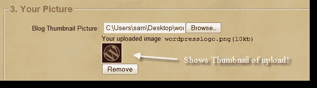

# 显示图片上传的缩略图

> 原文：<https://www.sitepoint.com/thumbnail-image-upload-ajaxphp/>



**更新 18/11/2012:** 本次上传的新版本现已在此 **[JQUERY AJAX 图片上传缩略图示例](http://www.jquery4u.com/ajax/image-upload-example/)** 。

这就是如何向表单添加文件/图像上传工具，让 AJAX 用 PHP 存储文件，并向用户返回一个显示在表单上的缩略图版本。很好。

## 它是如何工作的

1.  用户从表单输入字段中选择一个文件/图像
2.  jQuery 发送带有文件/图像的 AJAX 请求
3.  PHP 创建一个缩略图版本，并以 JSON 格式发回 url
4.  jQuery 在表单上显示缩略图版本

## [计] 下载

*   [jquery 4 u-file-uploader-thumbnail . zip](https://github.com/sdeering/jQuery-Ajax-Thumbnail-Image-Upload)

*   doajaxfileupload.php
*   ajaxfileupload.php
*   jquery.php
*   form-html.php

[下载源文件](https://github.com/sdeering/jQuery-Ajax-Thumbnail-Image-Upload) [看现场演示](http://blogoola.com/signup/)

## jQuery 代码–jQuery . js

```
/*******************************************************************
  JS - PREVIEW IMAGE
*******************************************************************/
function previewImage(str) {
	//alert(str);
	ajaxFileUpload();
}

function removeImage() {
	//alert("Image Removed");
	$("#imagethumb").html('');
	$("#removebutton").hide();
	$("#supportedfiles").show();
	var tid = $("Input[name=allocatedimagename]").val();
	//remove the temporary image files created by the image
	$.get("/php/deleteblogthumb.php",{thumb_name: tid, type: 'js-blog'}, function(data){
		//alert(data);
	});

	$("Input[name=allocatedimagename]").val('');
	$("Input[name=blogpic]").val('');
}

function ajaxFileUpload() {
    //starting setting some animation when the ajax starts and completes
    $("#loading")
    .ajaxStart(function(){
        $(this).show();
    })
    .ajaxComplete(function(){
        $(this).hide();
    });

    /*
        prepareing ajax file upload
        url: the url of script file handling the uploaded files
                    fileElementId: the file type of input element id and it will be the index of  $_FILES Array()
        dataType: it support json, xml
        secureuri:use secure protocol
        success: call back function when the ajax complete
        error: callback function when the ajax failed

            */
    $.ajaxFileUpload
    (
        {
            url:'doajaxfileupload.php',
            secureuri:false,
            fileElementId:'blogpic',
            dataType: 'json',
            success: function (data, status)
            {
                if(typeof(data.error) != 'undefined')
                {
                    if(data.error != '')
                    {
                        alert(data.error);
                    }else
                    {
                        //alert(data.loc);
                        //show the preview of image
						var imageloc = '<span class="normaltext">Your uploaded image: <samp>'+data.name+'('+data.size+'kb)'+'</samp><br /></span>';
						$("#imagethumb").html(imageloc); //add
						$("#removebutton").show();
						$("#supportedfiles").hide();
						//save the allocated image name for use with the process signup script
						$("Input[name=allocatedimagename]").val(data.loc);
                    }
                }
            },
            error: function (data, status, e)
            {
                alert(e);
            }
        }
    )

    return false;

}
```

## jQuery 代码–Ajax file upload . js

```
jQuery.extend({

    createUploadIframe: function(id, uri)
	{
			//create frame
            var frameId = 'jUploadFrame' + id;

            if(window.ActiveXObject) {
                var io = document.createElement('');
                if(typeof uri== 'boolean'){
                    io.src = 'javascript:false';
                }
                else if(typeof uri== 'string'){
                    io.src = uri;
                }
            }
            else {
                var io = document.createElement('iframe');
                io.id = frameId;
                io.name = frameId;
            }
            io.style.position = 'absolute';
            io.style.top = '-1000px';
            io.style.left = '-1000px';

            document.body.appendChild(io);

            return io			
    },
    createUploadForm: function(id, fileElementId)
	{
		//create form 
		var formId = 'jUploadForm' + id;
		var fileId = 'jUploadFile' + id;
		var form = $('');	
		var oldElement = $('#' + fileElementId);
		var newElement = $(oldElement).clone();
		$(oldElement).attr('id', fileId);
		$(oldElement).before(newElement);
		$(oldElement).appendTo(form);
		//set attributes
		$(form).css('position', 'absolute');
		$(form).css('top', '-1200px');
		$(form).css('left', '-1200px');
		$(form).appendTo('body');		
		return form;
    },

    ajaxFileUpload: function(s) {
        // TODO introduce global settings, allowing the client to modify them for all requests, not only timeout 
        s = jQuery.extend({}, jQuery.ajaxSettings, s);
        var id = new Date().getTime()        
		var form = jQuery.createUploadForm(id, s.fileElementId);
		var io = jQuery.createUploadIframe(id, s.secureuri);
		var frameId = 'jUploadFrame' + id;
		var formId = 'jUploadForm' + id;		
        // Watch for a new set of requests
        if ( s.global && ! jQuery.active++ )
		{
			jQuery.event.trigger( "ajaxStart" );
		}            
        var requestDone = false;
        // Create the request object
        var xml = {}   
        if ( s.global )
            jQuery.event.trigger("ajaxSend", [xml, s]);
        // Wait for a response to come back
        var uploadCallback = function(isTimeout)
		{			
			var io = document.getElementById(frameId);
            try 
			{				
				if(io.contentWindow)
				{
					 xml.responseText = io.contentWindow.document.body?io.contentWindow.document.body.innerHTML:null;
                	 xml.responseXML = io.contentWindow.document.XMLDocument?io.contentWindow.document.XMLDocument:io.contentWindow.document;

				}else if(io.contentDocument)
				{
					 xml.responseText = io.contentDocument.document.body?io.contentDocument.document.body.innerHTML:null;
                	xml.responseXML = io.contentDocument.document.XMLDocument?io.contentDocument.document.XMLDocument:io.contentDocument.document;
				}						
            }catch(e)
			{
				jQuery.handleError(s, xml, null, e);
			}
            if ( xml || isTimeout == "timeout") 
			{				
                requestDone = true;
                var status;
                try {
                    status = isTimeout != "timeout" ? "success" : "error";
                    // Make sure that the request was successful or notmodified
                    if ( status != "error" )
					{
                        // process the data (runs the xml through httpData regardless of callback)
                        var data = jQuery.uploadHttpData( xml, s.dataType );    
                        // If a local callback was specified, fire it and pass it the data
                        if ( s.success )
                            s.success( data, status );

                        // Fire the global callback
                        if( s.global )
                            jQuery.event.trigger( "ajaxSuccess", [xml, s] );
                    } else
                        jQuery.handleError(s, xml, status);
                } catch(e) 
				{
                    status = "error";
                    jQuery.handleError(s, xml, status, e);
                }

                // The request was completed
                if( s.global )
                    jQuery.event.trigger( "ajaxComplete", [xml, s] );

                // Handle the global AJAX counter
                if ( s.global && ! --jQuery.active )
                    jQuery.event.trigger( "ajaxStop" );

                // Process result
                if ( s.complete )
                    s.complete(xml, status);

                jQuery(io).unbind()

                setTimeout(function()
									{	try 
										{
											$(io).remove();
											$(form).remove();	

										} catch(e) 
										{
											jQuery.handleError(s, xml, null, e);
										}									

									}, 100)

                xml = null

            }
        }
        // Timeout checker
        if ( s.timeout > 0 ) 
		{
            setTimeout(function(){
                // Check to see if the request is still happening
                if( !requestDone ) uploadCallback( "timeout" );
            }, s.timeout);
        }
        try 
		{
           // var io = $('#' + frameId);
			var form = $('#' + formId);
			$(form).attr('action', s.url);
			$(form).attr('method', 'POST');
			$(form).attr('target', frameId);
            if(form.encoding)
			{
                form.encoding = 'multipart/form-data';				
            }
            else
			{				
                form.enctype = 'multipart/form-data';
            }			
            $(form).submit();

        } catch(e) 
		{			
            jQuery.handleError(s, xml, null, e);
        }
        if(window.attachEvent){
            document.getElementById(frameId).attachEvent('onload', uploadCallback);
        }
        else{
            document.getElementById(frameId).addEventListener('load', uploadCallback, false);
        } 		
        return {abort: function () {}};	

    },

    uploadHttpData: function( r, type ) {
        var data = !type;
        data = type == "xml" || data ? r.responseXML : r.responseText;
        // If the type is "script", eval it in global context
        if ( type == "script" )
            jQuery.globalEval( data );
        // Get the JavaScript object, if JSON is used.
        if ( type == "json" )
            eval( "data = " + data );
        // evaluate scripts within html
        if ( type == "html" )
            jQuery("").html(data).evalScripts();
			//alert($('param', data).each(function(){alert($(this).attr('value'));}));
        return data;
    }
})
The PHP Code – doajaxfileupload.php
$ratio2)	{
          $thumb_w=$new_w;
          $thumb_h=$old_y/$ratio1;
        }
        else	{
          $thumb_h=$new_h;
          $thumb_w=$old_x/$ratio2;
        }

          // we create a new image with the new dimmensions
        $dst_img=ImageCreateTrueColor($thumb_w,$thumb_h);

        // resize the big image to the new created one
        imagecopyresampled($dst_img,$src_img,0,0,0,0,$thumb_w,$thumb_h,$old_x,$old_y);

        // output the created image to the file. Now we will have the thumbnail into the file named by $filename
        if(!strcmp("png",$ext))
          imagepng($dst_img,$filename);
        else
          imagejpeg($dst_img,$filename);

          //destroys source and destination images.
        imagedestroy($dst_img);
        imagedestroy($src_img);
       }

       // This function reads the extension of the file.
       // It is used to determine if the file is an image by checking the extension.
       function getExtension($str) {
               $i = strrpos($str,".");
               if (!$i) { return ""; }
               $l = strlen($str) - $i;
               $ext = substr($str,$i+1,$l);
               return $ext;
       }

        //reads the name of the file the user submitted for uploading
       $image=$_FILES[$fileElementName]['name'];

 	// if it is not empty
 	if ($image)
 	{
 		// get the original name of the file from the clients machine
 		$filename = stripslashes($_FILES[$fileElementName]['name']);

 		// get the extension of the file in a lower case format
 	 	$extension = getExtension($filename);
 		$extension = strtolower($extension);
 		// if it is not a known extension, we will suppose it is an error, print an error message
 		//and will not upload the file, otherwise we continue
 		if (($extension != "jpg")  && ($extension != "jpeg") && ($extension != "png"))
 		{
 			$error .= 'Unknown extension!';
 			$errors=1;
 		}
 		else
 		{
 			// get the size of the image in bytes
 			// $_FILES['image']['tmp_name'] is the temporary filename of the file in which
			//the uploaded file was stored on the server
 			$size=getimagesize($_FILES[$fileElementName]['tmp_name']);
 			$sizekb=filesize($_FILES[$fileElementName]['tmp_name']);

 			//compare the size with the maxim size we defined and print error if bigger
 			if ($sizekb > MAX_SIZE*1024)
 			{
 				$error .= 'You have exceeded the size limit!';
 				$errors=1;
 			}
 			else {

              //we will give an unique name, for example the time in unix time format
            $image_name=time().'.'.$extension;
            //the new name will be containing the full path where will be stored (images folder)
            $newnameimg/masters/".$image_name;
            $copied = copy($_FILES[$fileElementName]['tmp_name'], $newname);
            //we verify if the image has been uploaded, and print error instead
            if (!$copied)
            {
              $error .= 'Copy unsuccessfull!';
              $errors=1;
            }
            else
            {
              // the new thumbnail image will be placed in images/thumbs/ folder
              $thumb_nameimg/thumbs/thumb_'.$image_name;
              // call the function that will create the thumbnail. The function will get as parameters
              //the image name, the thumbnail name and the width and height desired for the thumbnail
              $thumb=make_thumb($newname,$thumb_name,40,40);

              //also add the users pic
              $thumb_nameimg/thumbs/thumb_'.$image_name;
              $thumb=make_thumb($newname,$thumb_name,110,110);

            }}
        }
 			}

      //--------- END SECOND SCRIPT --------------------------------------------------------------------

      //return variables to javascript
			$filename = $_FILES[$fileElementName]['name'];
			$filesize = round(($sizekb/1000), 0);
			$fileloc = $thumb_name;
			//for security reason, we force to remove all uploaded file
			@unlink($_FILES[$fileElementName]);
	}
	$return_JSON = "";
	$return_JSON .= "{";
	$return_JSON .=				"error: '" . $error . "',n";
	$return_JSON .=				"name: '" . $filename . "',n";
	$return_JSON .=				"size: '" . $filesize . "',n";
	$return_JSON .=				"loc: '" . $fileloc . "'n";
	$return_JSON .= "}";
	echo $return_JSON;
?>

        The HTML Code
<label for="blogpic">Blog Thumbnail Picture:</label>
          <input type="file" size="23" id="blogpic" name="blogpic" onChange="javascript:previewImage(this.value)"/>
          <div id="preview-image">
              <div id="imagethumb"></div>
              <input type="text" id="allocatedimagename" name="allocatedimagename" />
              <div id="loading" style="visibility:hidden"></div>
              <div id="supportedfiles"><p class="nomargin">Supported file types: jpg, jpeg, png (max 1mb) <br />Your image will be resized to 110 by 110 px (40 by 40 for blog thumbs)</p></div>

              <div id="removebutton"><button id="buttonremove" onclick="javascript:removeImage()"*gt;Remove</button></div>
          </div>
        </div> 
```

## 分享这篇文章