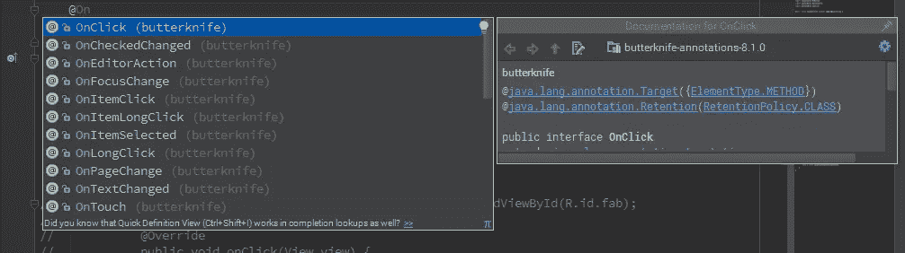
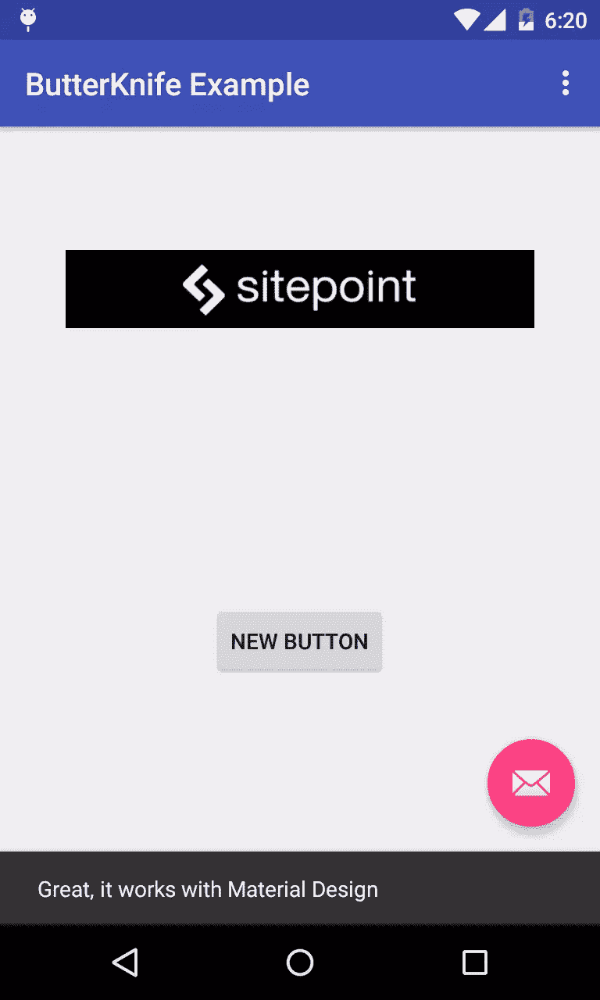
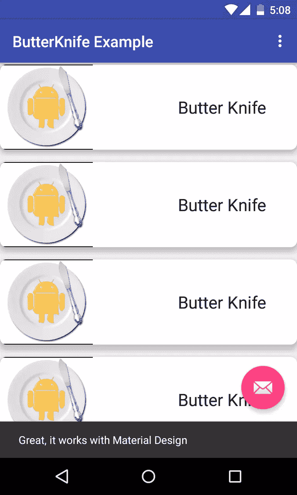

# 用安卓黄油刀整理和优化你的 Java 代码

> 原文：<https://www.sitepoint.com/tidying-code-with-android-butterknife/>

*本文于 2016 年 7 月更新，以反映 Android Butter Knife 的更新。*

创建代码有时会令人沮丧。开发人员必须处理视觉上没有吸引力的冗余编码。在本文中，我将介绍一个用于 Android 开发的注入库，它可以帮助创建更漂亮的代码和版本 8 中引入的最新更新。 [Android Butter Knife](https://github.com/JakeWharton/butterknife) 是 Jake Wharton 为 Android 创建的开源视图“注入”库。


Butter Knife 小巧、简单、轻便，它让开发人员的生活更加轻松。它允许开发人员在任意的`objects`、`views`和`OnClickListeners`上执行注入，这样他们就可以专注于编写有用的代码。把安卓黄油刀当做一个还原库。它用`@Bind()`代替了`findViewById`，用`@onClick()`代替了`set^^^^Listener`调用，使得代码更加清晰易懂。Butter Knife 支持关注逻辑而不是粘合代码，并通过减少冗余编码来减少开发时间。

## 为 Android 黄油刀配置您的项目

在开始使用黄油刀之前，您需要配置您的 Android 项目。

在项目级别打开 *build.gradle* 并添加以下依赖项

```
 dependencies {
        ...
        classpath 'com.neenbedankt.gradle.plugins:android-apt:1.8'
    } 
```

打开 *build.gradle(Module:app)* (模块级)，添加以下依赖项。

```
dependencies {
    ...
    compile 'com.jakewharton:butterknife:8.1.0'
    apt 'com.jakewharton:butterknife-compiler:8.1.0'
} 
```

并应用插件:

```
apply plugin: 'android-apt'

android {
    ...
} 
```

最后同步 Gradle。

## 黄油刀在行动

现在您已经配置了 Butter Knife，是时候继续学习这个注入库可以提供的主要特性了:

1.  绑定视图和资源
2.  事件监听器
3.  列表适配器，`RecyclerView`实现

## 为什么要用黄油刀

这个库的目标是帮助开发人员编写更好的代码，它通过减少在`Activity`类的`onCreate`方法和`Fragment`类的`onCreateView`方法中使用的代码来做到这一点。

```
@Override
protected void onCreate(Bundle savedInstanceState) {
    super.onCreate(savedInstanceState);
    //...
    ButterKnife.bind(this);
    //...
} 
```

```
@Override
public View onCreateView(LayoutInflater inflater, ViewGroup container,
                         Bundle savedInstanceState) {
    // Inflate the layout for this fragment
    View view = inflater.inflate(R.layout.fragment_blank, container, false);
    ButterKnife.bind(this, view);
    return view;
} 
```

在这两种情况下，Butter Knife 绑定到指定的 Android `Activity`或`View`目标，以正确地作用于这些类中指定的注射。所有的视图查找代码行和动作监听器都在别处实现，让这些方法尽可能的干净。

## 绑定视图和资源

Butter Knife 用`@BindView`替换了标准的`findViewById`调用，后面跟着一个视图 ID，它自动在相应的布局中投射相应的视图。这种代码表示方式使代码更加紧凑，可读性更好。

下面是这种“注入”的一个例子:

```
@BindView(R.id.imageView) ImageView image;
@BindView(R.id.button) Button button; 
```

对于`String`、`Drawable`和维度(`dimen`、`value`等)等 app 资源也可以这样做。以下是所有可能用黄油刀装订的。

```
@BindString(R.string.title) String title;
@BindDrawable(R.drawable.sitepoint) Drawable sitepointDrawable;
@BindColor(R.color.colorPrimary) int primaryColor; 
```


## 事件监听器

Butter Knife 也使得设置 Android 布局`Views`的事件监听器变得容易，并且从键`onCreate`和`onCreateView`方法中移除了监听器实现。

这里有一个例子:

```
@OnClick(R.id.button)
public void ButtonClick() {
    //Perform some action
} 
```

这并不局限于`click`事件，这里是你可以设置的所有其他事件。



## 材料设计

对于本教程的其余部分，我将侧重于在材料设计视图和组件中注入黄油刀特征。

打开 *Android Studio* ，创建一个带有*基本活动*的应用。

还有什么比`FloatingActionButton`更好的测试组件呢？

```
public class MainActivity extends AppCompatActivity {

    //FloatingActionButton
    @BindView(R.id.fab)
    FloatingActionButton FAB;

    @OnClick(R.id.fab)
    public void SnackbarNotification(View view) {
        Snackbar.make(view, "Great, it works with Material Design", Snackbar.LENGTH_LONG)
                .setAction("Action", null).show();
    }

    //...
 } 
```

正如你在下图中看到的，它的工作方式和你预期的一样。



## 适配器

黄油刀与[列表适配器](http://jakewharton.github.io/butterknife/#non-activity)配合良好，但它是否也能与其他材料设计类似的组件配合，如`RecyclerView`适配器？

构建一个`RecyclerView`的过程是漫长而复杂的，所以我建议你先阅读我的[文章](https://www.sitepoint.com/mastering-complex-lists-with-the-android-recyclerview/)解释如何做。

我将重点关注`RecyclerView`中与黄油刀相关的部分、`ViewHolder`和视图绑定。这个例子的完整代码可以在 [GitHub](https://github.com/sitepoint-editors/Butter-Knife-Example) 上获得。

一个`RecyclerView`的`ViewHolder`示例如下所示(在*Recycler _ View _ adapter . Java*中)。

```
public class View_Holder extends RecyclerView.ViewHolder {

    @BindView(R.id.cardView)
    CardView cv;
    @BindView(R.id.textView)
    TextView title;
    @BindView(R.id.imageView)
    ImageView imageView;

    View_Holder(View itemView) {
        super(itemView);
        ButterKnife.bind(this, itemView);
    }
} 
```

这个`ViewHolder`类表示`RecyclerView`的一行，布局如下( *row_layout.xml* )。

```
<android .support.v7.widget.CardView xmlns:android="http://schemas.android.com/apk/res/android"
    xmlns:app="http://schemas.android.com/apk/res-auto"
    android:id="@+id/cardView"
    android:layout_width="match_parent"
    android:layout_height="wrap_content"
    android:layout_marginBottom="@dimen/activity_vertical_margin"
    app:cardCornerRadius="8dp"
    app:cardElevation="8dp">

    <imageview android:id="@+id/imageView"
        android:layout_width="120dp"
        android:layout_height="110dp"
        android:layout_alignParentTop="true"
        android:layout_centerHorizontal="true"
        android:background="@color/abc_input_method_navigation_guard"
        android:src="@drawable/butterknife"></imageview>

    <textview android:id="@+id/textView"
        android:layout_width="wrap_content"
        android:layout_height="wrap_content"
        android:layout_gravity="center|right"
        android:layout_marginRight="40dp"
        android:text="Large Text"
        android:textAppearance="?android:attr/textAppearanceLarge"></textview>

</android> 
```

在一个`Activity`类中绑定`RecyclerView`并提供数据给它的`Adapter`(在*MainActivity.java*)。

```
 @BindView(R.id.recyclerview)
    RecyclerView recyclerView; 
```

```
 @Override
    protected void onCreate(Bundle savedInstanceState) {
        super.onCreate(savedInstanceState);
        //...
        ButterKnife.bind(this);

        //Setup the RecyclerView
        List<data> data = new ArrayList<>();
        for (int i = 0; i < 15; i++) {
            //Generate 15 data elements
            data.add(new Data("Butter Knife", R.drawable.butterknife));
        }
        Recycler_View_Adapter adapter = new Recycler_View_Adapter(data, getApplication());
        recyclerView.setAdapter(adapter);
        recyclerView.setLayoutManager(new LinearLayoutManager(this));

    } 
```



## 结论

Android Butter Knife 帮助你创建更干净、更整洁的代码，处理大量丑陋的样板代码，Android 因此变得臭名昭著。你在你的项目中尝试过吗？我很想知道你是否觉得它有用。

## 分享这篇文章