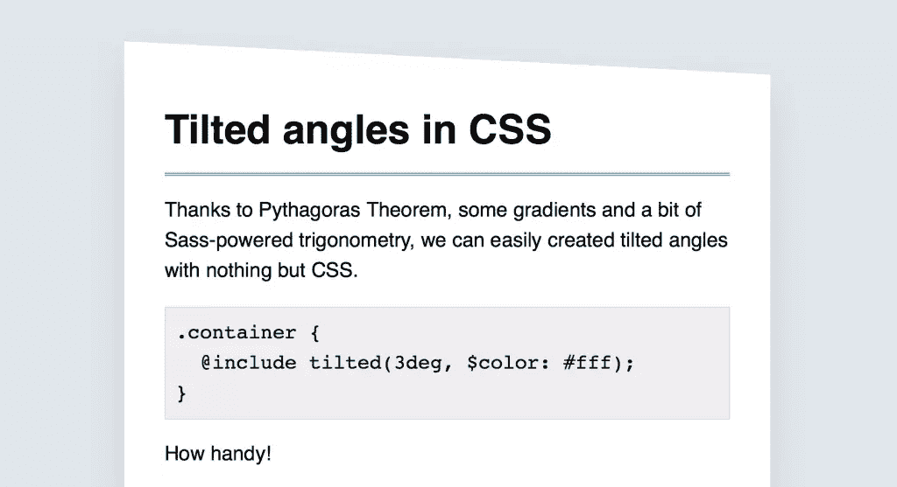
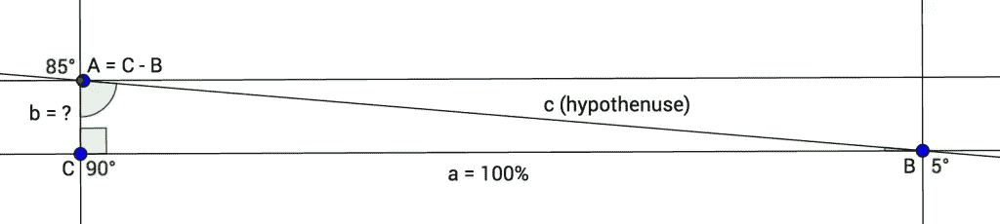

# Sass 中的倾斜角度

> 原文：<https://www.sitepoint.com/tilted-angles-in-sass/>

最近，我不得不在一个网站上工作，大量使用倾斜角度作为其设计指南的一部分。“倾斜的角度”，我指的是这些部分的顶部或底部边缘不完全水平，而是有点倾斜。



有相当多的方法可以实现这一点。你可以使用 base 64 编码的图像作为背景，但是这很难定制(颜色，角度等)。).

另一种方法是倾斜和/或旋转绝对定位的伪元素，但如果有一件事我不想处理，那就是倾斜变换。天啊，没有。

当使用 Sass 时，您可以使用编码动态生成的 SVG 的[角边](https://github.com/josephfusco/angled-edges)库。它工作得非常好，但是它需要固定的宽度和高度，以像素表示，这让我有点困扰。

我也很想看看我是否以及如何能够实现这一点。我最终得到了一个令我非常自豪的解决方案，尽管它对于简单的场景来说可能有点过度设计了。

## 有什么想法？

我的想法是对绝对定位的伪元素应用半透明半实心的渐变。梯度的角度定义了倾斜角。

```
background-image: linear-gradient($angle, $color 50%, transparent 50%);
```

这被打包在一个 mixin 中，该 mixin 将背景颜色应用于容器，并基于给定的角度生成一个具有正确渐变的伪元素。很简单。你会这样使用它:

```
.container {
  @include tilted($angle: 3deg, $color: rgb(255, 255, 255));
}
```

我面临的主要问题是确定伪元素应该有多高。起初，我把它作为 mixin 的一个参数，但我最终在每个新的角度进行了反复试验，以找出伪的最佳高度。不理想。

就在我准备把整个事情翻过来的时候，我决定把笔记本电脑放在一边，拿起笔和纸开始涂鸦，想弄清楚背后的公式。我花了一段时间(和一些谷歌搜索)才记起高中时学过的三角学，但最终我做到了。

为了避免不得不猜测或想出好的近似值，伪元素的高度是从给定的角度计算的。当然，这一切都是用一些小技巧和大量几何学完成的。我们走吧。

## 计算伪元素的高度

相信我，我告诉你这不会太难。我们知道的第一件事是我们有一个全角伪元素。梯度线将字面上是伪的对角线，所以我们最终得到一个矩形三角形。

我们把它命名为 ABC，其中`C`是直角，`B`是已知角(`$angle`角)，因此`A`是`C - B`。如该图所示，我们试图找出`b`是什么。



要做到这一点，我们需要找到`c`(梯度线，又名假设线)的值，它是`a`(底边，100%)的长度除以`A`角的正弦值(例如，`B = 5°`、`A`为 85°)。

```
c = a / sin(C - B)
```

从那里，我们不得不使用毕达哥拉斯定理:

> 斜边(直角的对边)的平方等于其他两条边的平方之和。

因此，另一边之一的平方等于假设的平方减去第三边的平方。所以`b`的平方等于`c`的平方减去`a`的平方。

```
b² = c² - a²
```

最后，`b`的长度等于`c`的平方的平方根减去`a`的平方。

```
b = √(c² - a²)
```

就是这样。我们现在可以构建一个小的 Sass 函数，根据给定的角度计算伪元素的高度。

```
@function get-tilted-height($angle) {
  $a: (100% / 1%);
  $A: (90deg - $angle);
  $c: ($a / sin($A));
  $b: sqrt(pow($c, 2) - pow($a, 2));

  @return (abs($b) * 1%);
}
```

*注:`pow()`、`sqrt()`和`sin()`函数可以来自 [Sassy-Math](https://github.com/at-import/Sassy-math) 、 [Compass](http://compass-style.org/) 或 [custom](https://unindented.org/articles/trigonometry-in-sass/) [sources](http://thesassway.com/advanced/inverse-trigonometric-functions-with-sass) 。*

## 建立倾斜的混音

我们已经完成了最困难的部分，相信我！最后要做的是构建实际的`tilted()` mixin。它接受一个角度和一个颜色作为参数，并生成一个伪元素。

```
@mixin tilted($angle, $color) {
  $height: get-tilted-height($angle);

  position: relative;
  background-color: $color;

  &::before {
    content: '';
    padding-top: $height;
    position: absolute;
    left: 0;
    right: 0;
    bottom: 100%;
    background-image: linear-gradient($angle, $color 50%, transparent 50%);
  }
}
```

这里需要注意一些事情:mixin 将`position: relative`应用于容器，为伪元素定义位置上下文。当在绝对或固定元素上使用这个 mixin 时，可能值得考虑从 mixin 中删除这个声明。

mixin 将背景色和 pseudo 的渐变应用到容器本身，因为它们必须同步。

最后，伪元素的高度必须通过`padding-top`(或`padding-bottom`)而不是`height`来传递。由于高度是根据父项的宽度用百分比表示的，所以我们不能依赖`height`(因为它是根据父项的高度计算的)。

## 最后的想法和更进一步

对于本文，我选择了简单版本的 mixin，它可能缺乏灵活性，并且在理论上可能会出现以下问题:

*   不可能在已经使用了它的`::before`伪元素的元素上使用它。这可以通过添加一个可选参数来指定伪元素来解决，默认为`before`。
*   不可能在容器底部显示倾斜的边缘，因为`bottom: 0`目前在 mixin 核心中是硬编码的。这可以通过向 mixin 传递一个额外的位置来解决。

此外，我现有的版本使用基于 Sass 的数学函数，因为它是在 Jekyll 项目中，不允许我扩展 Sass 层。如果使用 node-sass，您可以通过 [Eyeglass](https://github.com/sass-eyeglass/eyeglass) 或 [sassport](https://github.com/davidkpiano/sassport) 轻松地将这些函数从 JavaScript 传递到 Sass，这肯定会好得多。

我希望你喜欢它！如果你能想到任何改进它的方法，请在评论中分享。:)

通过 [CodePen](http://codepen.io) 上的 SitePoint ( [@SitePoint](http://codepen.io/SitePoint) )查看 CSS 中的笔[倾斜角度。](http://codepen.io/SitePoint/pen/dppJzX/)