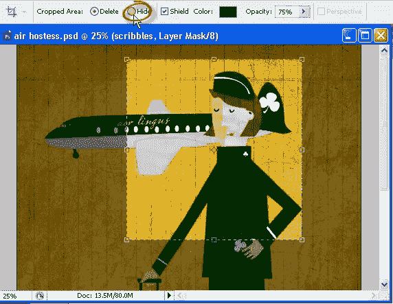
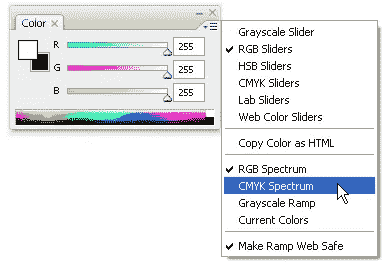
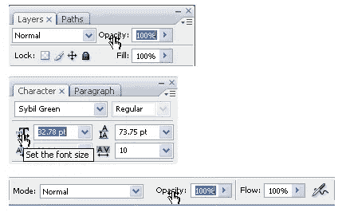

# 三个节省时间的 Photoshop 技巧

> 原文：<https://www.sitepoint.com/time-saving-photoshop-tips/>

开始新的一周，这里有三个不同但省时的 Photoshop 制作技巧，你可以在编辑图像时使用。

**保住你的庄稼**

当您选择裁剪工具(C)来裁剪图像时，请查看屏幕顶部工具选项栏上的可用选项。

当你选择一个要裁剪的区域时(只要它不在[背景层](https://www.sitepoint.com/remove-background-photoshop/)上)，你会看到一个删除裁剪区域或隐藏的选项。这里真正酷的事情是，如果您选择隐藏，它会将图像窗口裁剪到裁剪的大小，但裁剪掉的区域仍然存在，因此您可以使用移动工具将裁剪掉的区域拖回视图中。

**两个调色板合二为一**

当您在 Photoshop 中打开调色板时，您可以看到两个东西:一组可用于创建自己的颜色的滑块，以及一个允许您使用吸管快速挑选颜色的色带。这里的提示是，您可以将颜色滑块设置为一种颜色模式，例如 RGB，将色带设置为另一种模式，例如灰度或 CMYK。另一个快速提示是，如果您想在渐变上快速旋转颜色模式，而不必返回到调色板菜单，您可以按住 Shift 键单击渐变。

**停止摆弄田地**

通常，当您在 Photoshop(或任何其他 Adobe 产品)中工作时，您会经常需要更改位于小字段(如字符调板或工具选项栏)中的值。当你点击字段，高亮显示，删除当前值并输入新值时，它们会让你慢下来。这里的提示是，只需单击字段的名称，Photoshop 将自动为您高亮显示整个字段，您可以在高亮显示的顶部键入新值。

所以你有它。Photoshop 的三个小而有用的省时技巧。

## 分享这篇文章