# 在 Notepad++中使用 jQuery 开发的 10 个技巧

> 原文：<https://www.sitepoint.com/tips-developing-jquery-notepad/>

从我记事起，Notepad++就一直是我最喜欢的用 JavaScript 编码的免费编辑器。这里是我在用 Notepad++开发时获得的一些技巧。

## 1.使用 Notepad++快速比较代码

这个特性对于快速发现文件之间发生了什么代码变化非常有用。首先在 Notepad++编辑器中打开两个相邻的文件(或者复制粘贴到一个新文件中进行快速比较)。

然后选中第一个文件按 ALT+D 或点击菜单中的 ***插件>比较>比较***

[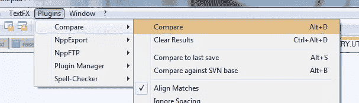](https://www.sitepoint.com/wp-content/uploads/jquery4u/2011/09/notepadplus-quick-compare.png)

如果文件匹配，你会得到一个弹出窗口说“文件匹配”。否则，如果差异出现在突出显示的右侧窗格中，您可以轻松地双击它们来查看代码。

[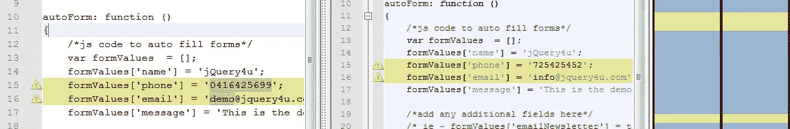](https://www.sitepoint.com/wp-content/uploads/jquery4u/2011/09/notepadplus-compare-lines.png)

然后要摆脱比较窗口按 CTRL+ALT+D 或点击菜单中的 ***插件>比较>清除结果***

如果你愿意，你也可以水平观看！只需右键单击分隔线列，然后单击

[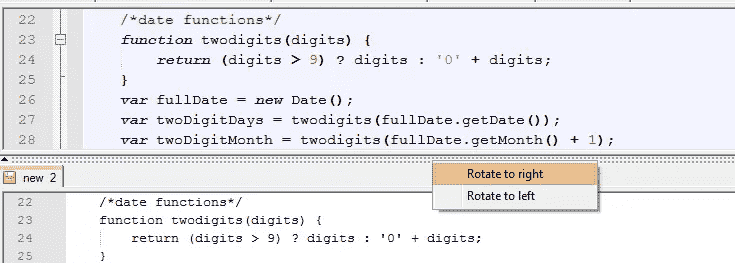](https://www.sitepoint.com/wp-content/uploads/jquery4u/2011/09/notepadplus-compare-horizonal.png)

## 2.记事本++中有用的键盘快捷键

只是一些我在开发时使用的快速键盘快捷键。

1.  **F11**–将代码切换到没有顶部菜单的全屏。要切换回来，只需再次按 F11。F12 做同样的事情，但不是全屏。
2.  **CTRL+D**–快速复制将当前行粘贴到下一行。
3.  **CTRL+Q**–快速注释掉 jQuery 代码行。再次按 CTRL+Q 取消注释。
4.  **SHIFT +右箭头**–快速选择字符。
5.  **CTRL + SHIFT +右箭头键**–快速选择单词。
6.  **三次左键点击**–快速选择整行。
7.  **CTRL+A**–快速选择整张单据。
8.  **ALT+F2**–快速谷歌搜索。
9.  **ALT+0**–快速将所有代码压缩成块。若要展开代码块，请按 SHIFT+ALT+0

[更多键盘快捷键](http://sourceforge.net/apps/mediawiki/notepad-plus/index.php?title=Keyboard_And_Mouse_Shortcuts)

## 3.Notepad++有用的免费插件

有很多免费的 Notepad++插件可以做一些很棒的事情，从简单的拼写检查和颜色选择器到 FTP 同步和目录搜索。以下是我的一些最爱:

*   许多非常有用的功能，如代码清理、整理、缩小等。最早的，最好的之一。
*   [Multi Clipboard](http://sourceforge.net/projects/npp-plugins/files/MultiClipboard/MultiClipboard_2.0.0_unicode_dll.zip)–Multi Clipboard 插件实现了多个(10)文本缓冲区，通过复制和/或剪切文本来填充。
*   [切换](http://f0dder.dcmembers.com/nppplugs/npp_plugins.zip)–简单地在任何相关文件之间切换，如果你用热键设置了一些摘录，这是非常有用的。
*   这个插件可以解码调色板上像素的颜色，并将其 RGB 粘贴到编辑器中。
*   [search infiles](http://sourceforge.net/projects/npp-plugins/files/SearchInFiles/SearchInFiles_1_12_dll.zip)——允许用户找到在代码本身深处堆积了大量过量信息的文件。

要安装插件，只需下载。dll 文件并解压到文件夹*“app notepad ++ plugins”*。

[Wiki 目录下的记事本++插件](http://sourceforge.net/apps/mediawiki/notepad-plus/index.php?title=Plugin_Central)
[Sourceforge 下载列表](http://sourceforge.net/projects/npp-plugins/)

## 4.使用 Notepad++精简您的代码

这是一个非常有用的特性，可以快速[缩减 jQuery 代码](http://jsmini.com/)。只需执行以下操作:

*   ***编辑>空白操作>修剪页眉和尾部空格***
*   ***编辑>空白操作>删除不必要的空白和 EOL***

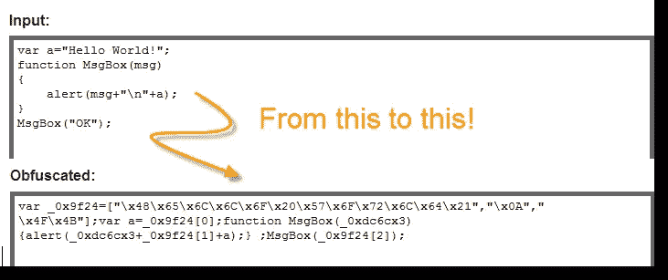
另见:其他方法[缩小/隐藏你的 JavaScript 代码](http://www.jquery4u.com/security/hide-jquery-source-code/)。

## 5.使用 Notepad++整理你的代码

之前我已经发布了如何使用 Notepad++让你的 jQuery 代码变得漂亮。从主菜单中简单选择***TextFX>TextFX Edit>rein dent c++ Code**。
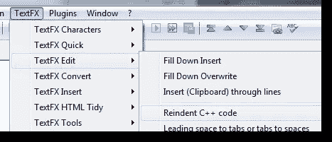*

不过，我发现了一个很棒的在线工具，叫做 [Javascript unpacker 和 beautiier](http://www.jspretty.com/)。这个工具实际上让你的 JS 源代码看起来很漂亮，值得一提。

## 6.Notepad++的 TortoiseSVN 插件

[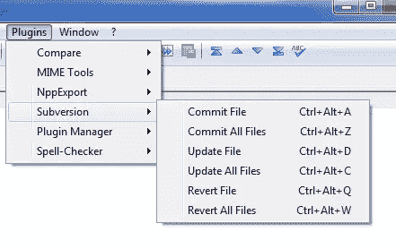](https://www.sitepoint.com/wp-content/uploads/jquery4u/2011/09/tsvn-screenshot.png) 
确保安装了 TortoiseSVN，并且已经安装了最新版本的 Notepad++。

该插件以压缩 dll 的形式出现。只需解压缩 dll 并将其放在 Notepad++ plugins 目录中。对于典型安装，它将位于以下位置:“C:程序文件记事本++插件”。下次你启动 Notepad++时，插件会自动加载。

该插件应该可以在 Windows XP、Vista 和 7 下运行。支持 32 位和 64 位操作系统。如果您在这些系统或其他系统上发现任何错误，请发表评论，我会看看能否解决它们。

我注意到有时 Notepad++的自动更新程序认为插件需要更新。这通常会导致新版本被 1.0 版本覆盖。如果您更新到 1.1 或 1.2，当 Notepad++提示您使用此插件时，请不要使用它的自动更新功能。

[下载](http://www.switchonthecode.com/sites/default/files/319/source/NPPSvnSource_v1.2.zip)

## 7.记事本++维基

[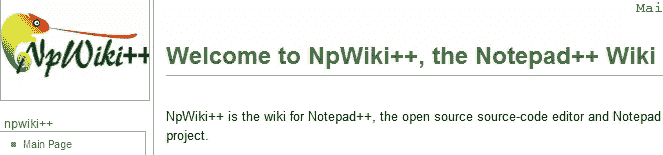](https://www.sitepoint.com/wp-content/uploads/jquery4u/2011/09/notepadplus-wiki.png)

在 Notepad++里被一些技术性的东西卡住了？不要紧张，只要访问 Notepad++ wiki，上面可能会有一些帮助你解决问题的内容。

[记事本++维基](http://sourceforge.net/apps/mediawiki/notepad-plus/index.php?title=Main_Page)

## 8.在 Notepad++中将语言设置为 JavaScript

不要忘记改变你的编码语言，这样内置的语法荧光笔就可以发挥它的魔力了！

[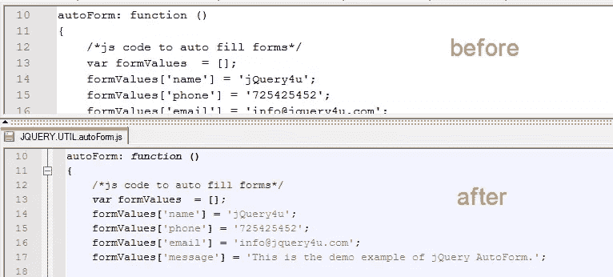](https://www.sitepoint.com/wp-content/uploads/jquery4u/2011/09/notepadplus-language.png)

## 9.删除行号

有时，当从其他网站复制代码时，我们最终会得到愚蠢的行号，为了使用这些代码，必须手动删除它们。记事本++拯救世界！

***TextFX > TextFX 工具>删除行号或首字***

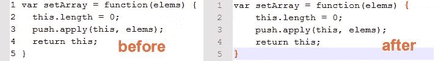

## 10.自动换行

如果你喜欢所有代码都在屏幕上可见，并且讨厌滚动条(我知道我讨厌滚动条),那么这很有用！).

只需点击自动换行按钮或从主菜单中选择 ***查看>自动换行*** 。

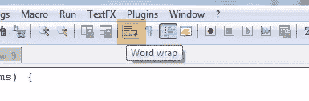

## 11.快速复制文件名，文件路径

只是多一个提示，这是一个巨大的时间节省。
***右击文件头(tab) >点击完整文件路径到剪贴板***
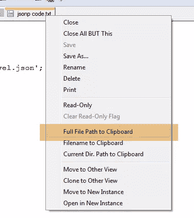

## 结论

就是这样！希望你已经从 Notepad++中学到了一些新的东西，以帮助你将来的 jQuery 开发。如果你知道我错过了什么，请发表评论。

[免费获得 Notepad++版](http://notepad-plus-plus.org/download/v5.9.3.html)

## 分享这篇文章