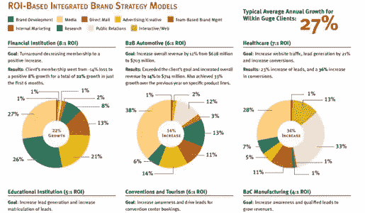

# 说服客户品牌升级的时候到了

> 原文：<https://www.sitepoint.com/tips-for-convincing-a-client-that-its-time-for-a-brand-upgrade/>

你遇到过带着丑宝宝的人吗？我有。我想到的那个丑陋的婴儿有一个巨大的脑袋，古怪的耳朵，它看起来总是对着每个人皱眉头。这只是一个丑陋的婴儿，但你永远无法让父母相信它是丑陋的。如果(出于某种奇怪的原因)你尝试，他们不会听到一个字。

同样的，你有没有和一个品牌很丑的客户合作过？丑陋的品牌有多种形式——过时的标志、丑陋的标志、荒谬的标志、不完整的品牌标识、不一致的品牌信息等等。说服客户是时候进行品牌升级了，这可能会有一些风险。如果你说他们的品牌难看，他们可能会认为是针对他们个人的。

事实上，我最近有一个客户，他的商标真的很丑。该品牌的其余部分相当整齐划一，但该标志阻碍了整个品牌的发展。当我带着更新的想法去找他们时，除了老板，每个人都很兴奋。来一探究竟吧，十年前生意刚起步的时候，店主自己用 Microsoft Paint 做的 logo。所以，他在感情上非常依恋它。除了承诺通过商标更新大幅增加利润之外，我说什么也不能说服他是时候进行商标更新了。

尽管你尽了最大努力，有时你还是无法让你的客户相信品牌升级的好处。希望，你会发现自己更经常地处于一个更好的环境中，有一个倾听你想法的客户。无论你的客户是思想开放还是对商标或品牌升级的想法封闭，以下是一些让“丑宝宝”的演讲更顺利的技巧。

### 不要称这个品牌为“丑宝贝”

即使你不用“丑陋的宝贝”这个词，甚至不用“丑陋”这个词，错误的做法是带着枪去见客户。你永远不知道谁的妈妈设计了最初的品牌和/或标志，所以你可能在更深的层面上侮辱了某人。我承认这是显而易见的，但我认为这是值得强调的:不要当着客户的面称一个品牌为“丑宝贝”。

### 给他们看看标准

我发现，当我将客户的品牌与一个更好/更新/完整的品牌进行对比时，更容易说服客户是时候进行品牌升级了。将品牌分解为基本元素，如品牌名称、颜色、徽标、标语、字体、语气、信息以及任何其他相关的元素，并进行并排比较，以客观地说明当前品牌的缺点和巨大的改进空间。

当客户看到自己的品牌与一个成熟品牌相邻时，他们可能会立即相信品牌升级已经准备就绪。在最坏的情况下，这是一种开始谈论提高他们品牌的可能性的委婉方式。做好准备；他们可能想要你当场推荐，所以利用这个绝佳的机会，在不惹怒任何人的情况下推销品牌升级。

基本上，这就像把一个丑陋的婴儿贴在一个可爱的婴儿旁边来帮助形成对比。当严酷的事实从对比中显露出来时，如果客户的世界有点崩溃，不要感到惊讶。只是在那里支持和爱他们…理论上来说，当然。

### 给我钱

通常，当与决策者打交道时，你必须说他们的语言。底线是他们的底线，他们经常认为设计工作是不必要的和昂贵的，尤其是如果他们已经有现成的设计。你可能必须从财务上证明品牌更新将如何转化为提高品牌认知度、品牌参与度、营销工作的投资回报、效率和其他合理的论点。

但是要做好准备——这是他们的领地和语言。如果你带着一个不够深刻的观点走进去，他们会就此指责你，你会失去可信度。从这一点开始，他们可能会把你视为一个寻求销售设计的设计师，而不是一个精明的顾问，提供真正有价值的帮助，符合他们的营销目标*和*他们的财务状况。所以，在试图谈钱之前，先做好功课。确保你能向他们展示一些案例研究或其他研究来支持你的主张。这是他们的世界，所以你必须遵守他们的规则。

### 给他们看时间表

不，不是脸书时间线，虽然那也可能有帮助。我说的是向他们展示其他相关品牌是如何随着时间的推移而演变的。当你能证明其他品牌已经根据需要做出了改变和转变时，这会让他们更容易接受改变的想法。别人做到了，你也能做到。如果其他品牌已经进化，你的品牌也应该进化。

确保保持它的相关性。你可能想展示一个直接竞争对手是如何发展的，或者他们所在行业的其他品牌是如何变化的。但是，避免比较与客户所在行业无关的品牌。商务人士已经学会了用类比和对比的方式思考(一般来说，就是这样)。因此，要聪明地选择你作为一个不断发展的品牌的时间表，并确保这些例子几乎不可能被认为是不相关的。

### 总之…

有时你得到一个丑陋的婴儿，你不得不假装它很漂亮…不知何故。但当涉及到与一个丑陋的品牌合作时，你不必微笑着和其他人一起走。当然，一点小技巧大有帮助，但是赢得客户的信任并仔细说明品牌重塑的价值可以让你帮助他们做出明智的决定。所以，给他们看看！

记住你的听众:商业决策者。并排比较，底线，并展示其他品牌如何随着时间的推移而演变，是润滑齿轮的好方法。你可能需要给他们一些时间，但要坚持下去。最终他们会让步或者给你一个“绝对不行”直到你听到“不”，继续帮助他们看清他们丑陋的孩子。

你是如何设法让客户看到光明的？当客户看到他们心爱的品牌丑陋不堪时，他们会崩溃，有没有这样的恐怖故事？

## 分享这篇文章