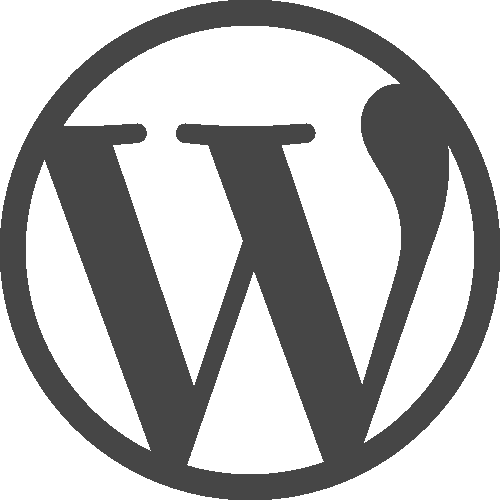

# 保护 WordPress 的 10 个技巧

> 原文：<https://www.sitepoint.com/tips-to-secure-wordpress/>

保持 WordPress 的安全是很重要的，这样可以确保你的网站不被破坏。正常运行时间最大化，您的数据是安全的，并且您的站点尽可能快速可靠地运行。



今天我们将看看 10 种方法来帮助提高和维护你的 WordPress 网站的安全性，从最简单的开始，到一些更高级的技巧来帮助你保护 WordPress。

## 用户安全性

攻击者试图进入的一个关键区域是 WordPress 管理界面。如果一个恶意用户能够以管理员身份登录，他们就可以对你的网站为所欲为。

有些人会尝试使用暴力攻击登录，通过设置僵尸网络(攻击者控制的许多计算机)使用不同的用户名和密码组合重复尝试登录到您的网站。

这里有一些你可以做的改变来帮助保护 WordPress 管理界面:

### 1.使用唯一、安全的用户名和密码

避免使用默认的*管理员*用户名。当你建立一个新的 WordPress 站点时，你可以选择你自己的用户名，如果你安装的是一个旧版本(你真的应该升级，我们稍后会讲到)，或者你已经将你的用户名设置为*管理员*，你可以使用一个 WordPress 插件，比如[用户名转换器](https://wordpress.org/plugins/username-changer/ "WordPress Username Changer")，将你的用户名更改为更安全的名称。您还可以创建一个具有管理员权限的新用户，并删除旧的“admin”用户名。

尽量避免常见的用户名，如*管理员*，你的网站名称或你的名字。

对于密码，选择由字母、数字和字符组成的复杂密码很重要。不要选择与您的用户名、网站名称或简单的单词相似的密码。避免使用字典中的单词，最好使用随机的字符串。一个好的密码管理工具将帮助您安全地生成、存储和使用这些复杂的密码。

或者，在保持足够复杂性的同时，记住密码的一种简单方法是使用语音密码生成器(例如[this](http://tools.arantius.com/password "Phonetic Password Generator"))。

### 2.使用双因素身份验证

双因素身份验证(称为 2FA，有时称为两步验证)要求用户不仅要使用用户名和密码登录，还要使用一次性生成的唯一代码，并通过短信或 iOS/Android 应用程序发送到设备(通常是智能手机)。

我们已经在[谷歌认证器教程](https://www.sitepoint.com/2-step-verification-wordpress-using-google-authenticator/ "Google Authenticator Tutorial")中介绍了如何设置 2FA。

### 3.验证用户是人类

reCAPTCHA 表单要求用户输入他们在图像中看到的文本，这是阻止僵尸网络试图暴力登录你的 WordPress 站点的有效方法。僵尸网络通常不能自动完成登录过程的这一部分，因此它有助于阻止他们访问您的网站。

我们已经在这里介绍了[如何在你的 WordPress 登录过程中实现“无验证码重新获取”。](https://www.sitepoint.com/no-captcha-integration-wordpress/ "noCAPTCHA Integration for WordPress")

### 4.密码保护 wp-login.php

如果你是一个更高级的 WordPress 用户或开发者，并且你对一些服务器端的改变感到满意，你可以在 WordPress 登录屏幕显示之前要求一个服务器端的登录。

这提供了另一层安全性，我们已经在我们的[防止对 WordPress 网站的暴力攻击](https://www.sitepoint.com/preventing-brute-force-attacks-against-wordpress-websites/ "Preventing Brute Force attacks against WordPress websites")文章中介绍了如何做到这一点。

## 代码安全性

无论你是为你的网站开发你自己的主题或插件，还是使用第三方的东西，重要的是所使用的代码是安全的，不会为潜在的攻击敞开大门。

不安全的代码，不遵循最佳实践，可能会导致攻击者能够控制你的 WordPress 站点的一部分或全部。

有几种方法可以帮助我们确保代码的完整性和安全性:

### 5.保持 WordPress 的更新

从 WordPress 3.7 开始，次要版本——包括安全和维护——自动适用。然而，你也可以扩展它来自动安装主要的 WordPress 版本，通过添加以下内容到你的站点的`wp-config.php`文件中:

```
define( 'WP_AUTO_UPDATE_CORE', true );
```

虽然这看起来是个好主意，但它可能会导致新安装的 WordPress 版本和你现有的主题和/或插件不兼容。为这类事情维护一个测试环境总是一个好主意。

有第三方工具可以连接到你的 WordPress 网站，让你从一个统一的界面管理所有的 WordPress 安装。最棒的是，你可以一键安装 WordPress、主题和插件更新:

*   [iThemes Sync](https://ithemes.com/sync/ "iThemes Sync") (最多 10 个站点免费)
*   [ManageWP](http://managewp.com "ManageWP") (最多 5 个站点免费)

为了进一步阅读，我们发表了关于如何保持你的 WordPress 网站最新的文章:

*   更新 WordPress 的指南
*   [如何在 WordPress 中配置自动更新](https://www.sitepoint.com/configure-automatic-updates-wordpress/ "How to Configure Automatic Updates in WordPress")

### 6.明智地选择你的主题和插件

选择积极维护和定期更新的主题和插件很重要。虽然这并不能保证安全，但这意味着如果在一个主题或插件中发现了安全漏洞，它将会很快得到解决和更新。

还要检查插件的详细描述，因为有些插件会由第三方(如 Sucuri)进行安全审计，这有助于让你安心。

### 7.开发主题和插件

无论你是 WordPress 开发新手，还是已经使用 WordPress 开发了一段时间的主题和/或插件，遵循 WordPress 安全最佳实践是很重要的。

从净化数据、使用随机数到坚持 WordPress 角色和功能，保持与 WordPress 开发最佳实践同步是很重要的:

*   [在 WordPress](https://www.sitepoint.com/sanitizing-escaping-validating-data-in-wordpress/ "Sanitizing, Escaping and Validating Data in WordPress") 中净化、转义和验证数据
*   [保护自己免受流氓 WordPress 插件的攻击](https://www.sitepoint.com/protect-yourself-from-rogue-wordpress-plugins/ "Protect Yourself from Rogue WordPress Plugins")

## 托管安全性

由于改进了用户认证和我们代码的质量，你的 WordPress 安装更加安全，同样重要的是确保你有良好的支持，安全，托管。

### 8.使用托管主机

现在有几家公司提供托管 WordPress 主机服务，比如 WP Engine、SiteGround 和 Media Temple。虽然你通常会比传统的共享或非托管主机支付更高的费用，托管主机将有助于保持你的网站安全。

例如，如果存在已知的安全漏洞，WP 引擎将自动更新 WordPress 和关键插件，并禁用已知会导致性能和安全问题的插件。与大多数托管 WordPress 主机一样，它们提供基于硬件的防火墙和配置，以确保分布式拒绝服务(DDoS)攻击不会使你的网站瘫痪。

一些用户可能会觉得这种方法很烦人，但它确实提供了安心和专业知识来确保你的 WordPress 网站保持运行。

### 9.确保文件和文件夹权限正确

如果你没有使用托管网络主机，确保 WordPress 文件和文件夹有正确的所有权和权限是很重要的。这不仅可以让 WordPress 保持更新，还可以防止攻击者利用糟糕的文件安全性控制你的网站。

作为一个基本指南，WordPress 文件夹应该总是拥有`0755`权限，WordPress 文件应该总是拥有`0644`权限——尽管这可能因主机而异。

如果你在尝试安装插件或上传新媒体时遇到错误，**不要试图将任何文件夹权限设置为`0777`** 。相反，请与您的 web 主机合作，确保 PHP 以正确的用户运行，并且文件夹属于同一用户。

如果你有 shell 权限，你可以运行一些命令来确保 WordPress 是安全的:

```
find /path/to/your/wordpress/install/ -type d -exec chmod 755 {} \;
find /path/to/your/wordpress/install/ -type f -exec chmod 644 {} \;
```

如果你知道应该拥有 WordPress 文件和文件夹所有权的用户和组，使用:

```
sudo chown -R username:group /path/to/your/wordpress/install
```

### 10.服务器端强化

对于管理自己的虚拟主机的高级用户，您还可以:

*   确保您的数据库用户只能访问选择、插入、更新和删除权限
*   使用强数据库用户名和密码
*   不允许在 WordPress 中编辑服务器端文件，方法是将`define('DISALLOW_FILE_EDIT', true);`添加到你的`wp-config.php`文件中

一些虚拟主机可以为你执行这些操作——这总是值得一问的。

关于 WordPress 和服务器加固的更多信息，请查看 WordPress Codex 文档中关于[加固 WordPress](http://codex.wordpress.org/Hardening_WordPress "Hardening WordPress") 的内容。

## 结论

在这篇文章中，我们介绍了保护 WordPress 网站的 10 个技巧，从基本的用户认证到编码实践和主机设置。对于更高级的用户，我们已经提到了一些高级加固技术，可以用来确保 WordPress 尽可能的安全。

另一个值得考虑的选择是使用安全插件，如 WordFence 或防弹安全。可供选择的有很多，而且都有各自的优缺点，所以最好做一些研究，找到一个最符合你要求的。我们已经在这里介绍了一些更为[高级的安全插件选项。](https://www.sitepoint.com/wordpress-security-plugins/)

此外，记住预防胜于治疗总是值得的，只需要一个小错误就可以通过黑客入侵 WordPress 安装导致数据丢失。因此，安装一个 WordPress 备份服务是至关重要的，比如 VaultPress 和 BackupBuddy，这样你的网站在受到攻击或出错时可以很容易地恢复。在我们的[WordPress 维护权威指南](https://www.sitepoint.com/definitive-guide-to-wordpress-maintenance/)中，我们涵盖了备份的主题，以及更多内容。

## 分享这篇文章