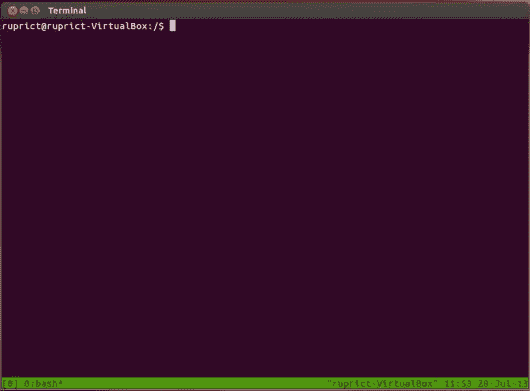
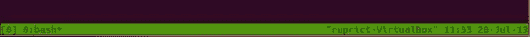
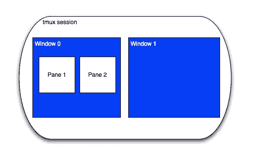
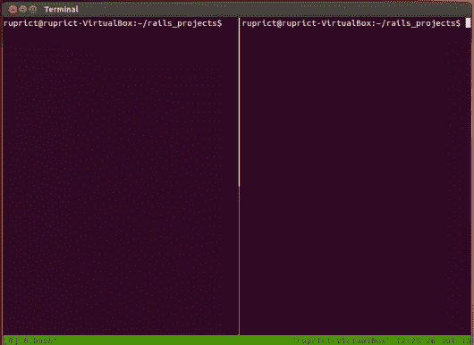
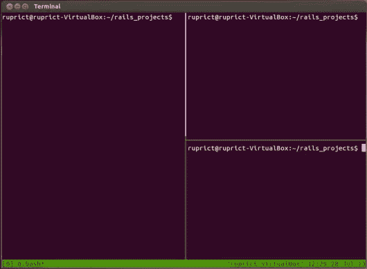
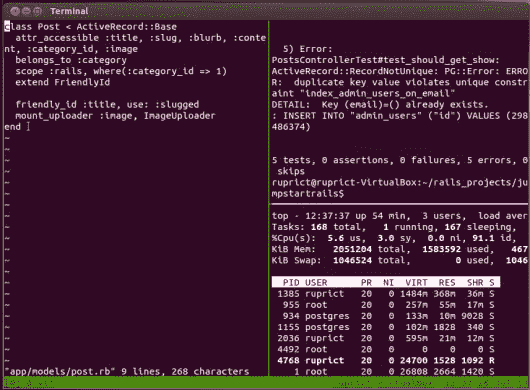
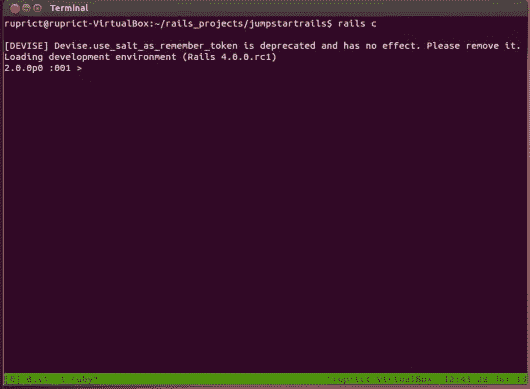
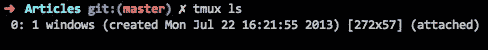

# Tmux:简单的开始

> 原文：<https://www.sitepoint.com/tmux-a-simple-start/>

[https://w.soundcloud.com/player/?url=https%3A//api.soundcloud.com/tracks/296598536&auto_play=false&hide_related=false&show_comments=true&show_user=true&show_reposts=false&visual=true](https://w.soundcloud.com/player/?url=https%3A//api.soundcloud.com/tracks/296598536&auto_play=false&hide_related=false&show_comments=true&show_user=true&show_reposts=false&visual=true)

通过我们的教程[在 SitePoint 上用 RSpec](https://www.sitepoint.com/premium/screencasts/setting-up-automated-testing-with-rspec) 设置自动化测试来学习更多关于 ruby 的知识。

一年中有几次，我发现一些改变或增强我的开发环境的东西。过去几年的例子有: [Github](http://github.com) ，vim， [zsh](http://www.zsh.org) (更具体的说， [on-my-zsh](https://github.com/robbyrussell/oh-my-zsh) 。)

大约在去年的某个时候，我开始使用另一个开发转换器: [Tmux](http://tmux.sourceforge.net/) 。tmux 是什么？根据它的网站:

> tmux 是一个终端多路复用器。什么是终端多路复用器？它可以让你在一个终端的几个程序之间轻松切换，分离它们(它们在后台保持运行)并重新连接到不同的终端。做更多的事情。

我第一次从埃文·莱特( [@elight](http://twitter.com/elight) )那里了解到 tmux，是在很久以前我让他和我一起做[结对编程的时候。我惊讶于 tmux 让我和 Evan 的实时合作变得如此简单。我的反应有点像解冻的穴居人。我对这项技术惊叹不已，认为只有像埃文这样的高级生物才能拥有这种力量。我把它放在“有一天”的清单上，然后回到我的石碑上。

十有八九，你可能已经听说过 tmux。然而，你可能不会每天都使用它。如果你认为 tmux 太复杂(我的意思是，拜托,“多路复用器”这个词太吓人了),那么我在这里向你展示将 tmux 放入你的工作流程是多么容易。](https://www.sitepoint.com/loccasions-pair-programming/)

### 简单安装

首先，你需要 tmux (DERP)。根据您的平台，有多种(简单的)方法来执行安装:

#### mac os x

使用[自制](http://brew.sh)。你就完成了。

#### Ubuntu/Debian

有 Ubuntu 包所以，`sudo apt-get install tmux`可以，但是安装包是 1.7，我们很想要 1.8。要得到 1.8，做以下事情(感谢[这篇文章](http://askubuntu.com/questions/273013/how-to-install-new-tmux-1-8-on-ubuntu-12-10-or-12-04)):

```
$ sudo add-apt-repository ppa:pi-rho/dev
$ sudo apt-get update
$ sudo apt-get install tmux
```

如果你得不到 1.8 或者不想添加 PPA，这没什么大不了的。你将会错过 1.8 中添加的一个很酷的特性，我稍后会解释。

#### Windows 操作系统

不行，除非你使用 [Cygwin](http://www.cygwin.com/) 或者安装一个带有*nix 发行版的虚拟机，然后按照 Ubuntu 的说明操作。

键入以下命令以确保一切正常。

```
$ tmux -V
tmux 1.8
```

万岁！安装了 tmux！

### 简单用法

使用 tmux 就像输入`tmux`一样简单。当你这样做的时候，它看起来就像你的屏幕清空了，你又回到了同一个终端提示符下。可能有点反气候，但你刚刚穿过镜子。



你们当中观察力比较敏锐的人会注意到，终端底部有一个绿色条。



如果你认为这是 tmux 的状态行，那你就对了。现在，它告诉我日期、时间、主机、打开了哪些“窗口”(只有 1 个名为“0:bash”)，以及会话的名称(“0”)。

当不带任何参数启动 tmux 时，它使用一个从零开始的列表来命名会话，对于当前的每个 tmux 会话，该列表都递增 1。正如您可能已经猜到的那样，您可以随意命名您的会话，但是我们今天不会讨论这个问题。

状态栏也可以被配置成显示更多的信息，使用不同的颜色，以及许多其他的东西。然而，在本文中，我们将只关注窗口和窗格。

### 没有窗格，就没有收获

我已经提到了像“会话”、“窗口”和“窗格”这样的词。当您运行 tmux 时，它会创建一个新的 tmux 会话。简单地说，tmux 会话是窗口和窗格的容器。一个窗口包含一个或多个窗格。



每个窗格和每个窗口都是一个虚拟终端，只是碰巧窗口可以包含窗格。窗格和窗口也可以交换位置，所以窗格可以变成窗口，窗口可以变成窗格。

当开始使用 tmux 时，我建议您将终端分成 1-3 个窗格作为“编辑”窗口，并在各自的窗口中运行其他进程(如 rails 控制台或跟踪日志文件)。这就是我们今天要走的路。

### 应用程序中的窗口

我们开始吧。启动一个终端，进入应用程序的根目录。我在这里使用的是 Rails 应用程序，但这并不重要。

现在，输入`tmux`。

这是第一个窗口，将是我们会话的“编辑”窗口。我想看看编辑、我的测试以及`top(1)`对时事的看法。通过键入以下命令将当前窗口分成两个窗格:

```
CTRL+B % 
```

哇哦。那个组合键有点神秘，不是吗？是的，但是没关系。学习 tmux 命令与学习其他任何东西没有什么不同，它们可以很容易地改变。

然而，值得注意的是，该宏的`CTRL+B`部分被称为“前缀”。`CTRL+B`是 tmux 的默认前缀，但是知道大多数人都改了也不会奇怪。

您的终端现在应该看起来像这样:



现在，我们想把右边的窗格分成两个垂直堆叠的窗格。光标应该在右侧窗格中。类型:

```
CTRL+B " 
```

您的终端应该是这样的:



有了窗格设置，需要启动每个窗格的命令。由于您的光标现在在底部的右侧窗格中，键入`top`并观察 top fire up。好的，切换到右上方的窗格，输入一个命令。对我来说，我将使用`rake test`，但是我通常会使用[守卫](https://github.com/guard/guard)或类似的东西让这个面板运行自动化测试。

但是，在这样做之前，您需要知道如何切换窗格，不是吗？要从底部右侧窗格移动到顶部右侧窗格:

```
CTRL+B <UP ARROW> 
```

相同的前缀，命令的新后缀。这个更有意义一点。若要向上移动，请使用向上箭头。现在键入命令来启动您的测试。

你能想出如何移动到左侧窗格吗？一旦你这样做，启动你的编辑器。我用 VIM，所以我输入`vim`。

这是我的编辑面板:



好了，编辑面板完成了。*专业提示*:如果您使用的是 tmux 1.8，您可以通过键入以下命令将当前窗格切换到全屏模式:

```
CTRL+B  z 
```

我喜欢这个特性，因为这意味着当测试失败时，我可以全屏显示我的测试，并更容易地浏览窗格，然后在完成后将它恢复到原来的大小。

现在，我将快速向您展示如何添加一个窗口，以便您可以在 tmux 会话中启动与您的应用程序相关的其他服务。要添加新窗口:

```
CTRL+B c 
```

你现在是在一个无窗格(哈！)终端，状态栏显示两个窗口(0 和 1)。在这里启动 rails 控制台或任何你喜欢的东西。



使用相同的组合键添加任意多的窗口。当您想要在 windows 0 和 1 之间切换时，请键入:

```
CTRL+B <window number> 
```

其中*为 0 或 1。*

 *现在你可以随心所欲地来回跳跃。

### 末日即将来临

我要提到的最后一件事是你如何脱离和结束一个会话。当你在一个会话中时，你是“附属于”它的。`tmux`命令创建一个新会话并连接当前终端。要分离，请键入:

```
CTRL+B d 
```

你会看到类似`[detached]`的东西，然后你会回到你的无状态栏、常规、旧的终端。如果您键入`tmux ls`，您将看到一个会话列表:



你在那个环节中运行的所有东西仍然在继续运行。您可以通过键入以下命令重新连接它:

```
tmux attach -t 0
```

其中,`-t`代表“目标”,`0`是会话名称。现在，继续并再次分离。

要结束/终止会话，请键入

```
tmux kill-session -t 0
```

这将结束会话，因此如果您执行另一个`tmux ls`，您将看到零个会话正在运行。顺便说一下，如果你在一个会话中退出了所有的窗口，这个会话也会退出。

### 后续步骤

本文只是略述了 tmux 能为您做些什么。然而，您可以应用您今天所学的知识，并且在您的开发环境中更加高效，而不需要再花一秒钟的时间来学习 tmux。

但是，你不是那种人，对吗？一旦你对你在这里学到的东西感到满意，这就是我建议你接下来要做的:

*   买 [Tmux 的书](http://pragprog.com/book/bhtmux/tmux)看完。太棒了。
*   创建您的 *.tmux.conf* 文件，并开始更改 tmux 以满足您的需求。有很多例子，这让 tmux 变得更好。
*   查看 [tmuxinator](https://github.com/aziz/tmuxinator) 来设置命名的 tmux 环境，用一个简单的命令在一个新的会话中启动一堆窗格和窗口。
*   将程序与使用 tmux 作为实时协作方式的人配对。太令人兴奋了。

### 包裹

本文的目标是让您以尽可能简单的方式使用 tmux。我现在开始启动 tmux 来做几乎所有的事情。我喜欢将一个窗口分割成多个窗格，并且不用离开当前窗口就能快速运行命令的便利性。我想你会发现它同样有用。

通过我们的教程[在 SitePoint 上用 RSpec](https://www.sitepoint.com/premium/screencasts/setting-up-automated-testing-with-rspec) 设置自动化测试来学习更多关于 ruby 的知识。* 

## *分享这篇文章*