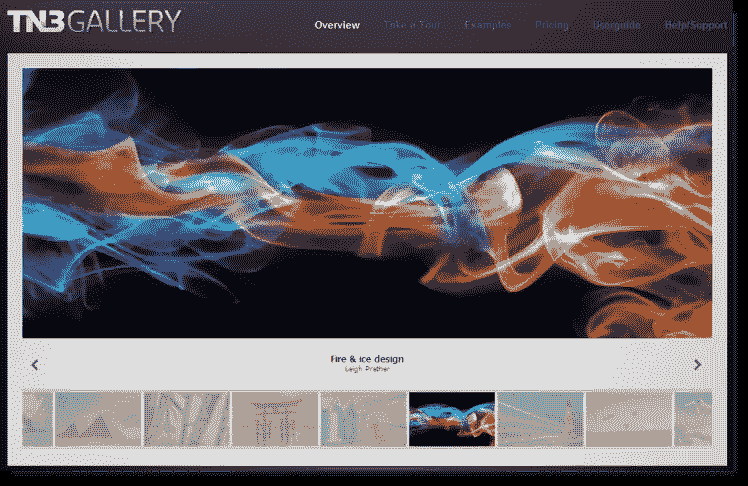

# TN3 画廊——排名第一的专业影像画廊

> 原文：<https://www.sitepoint.com/tn3-gallery-html-customizable-image-gallery/>

TN3 图库是用 jQuery 开发的基于 HTML 的可定制图片图库。我知道你在想什么…不是另一个图片库插件。 **TN3 不是普通的图片画廊！**这是一种新型图片库，这也是你应该将它作为主要图片库选择的原因。

[TN3 图库演示](http://www.tn3gallery.com/examples/)

## 特征

*   出色的装载速度
*   高级相册视图:全屏是惊人的！
*   电影图像过渡
*   用户友好的皮肤选择
*   专业外观和感觉
*   使用 TN3 API 完全可定制
*   使用 XML 加载您的图库

## 易于安装

这个图库很容易安装，只需要最新版本的 jQuery，下载包中包含了用于创建图库的 jQuery 插件。加载你的皮肤到 TN3 文件夹，然后你就可以开始了！网站上有非常详细的安装说明。

[快速入门指南](http://www.tn3gallery.com/quick-start/)

## 定价选项

免费版包括你的网站或博客所需的所有基本功能。但是，如果您想要高级功能和更多选项来扩展您的大型相册，有专业的和多站点的选项，价格非常优惠！

[定价选项](http://www.tn3gallery.com/pricing)

### 这真的是一个惊人的 jQuery 开发。不相信我？自己看吧！

## 分享这篇文章