# 6 个调试 React Native 的工具

> 原文：<https://www.sitepoint.com/tools-for-debugging-react-native/>

调试是软件开发必不可少的一部分。通过调试，我们知道什么是错的，什么是对的，什么是对的。调试提供了一个机会来评估我们的代码，并在它们被推向生产之前修复问题。

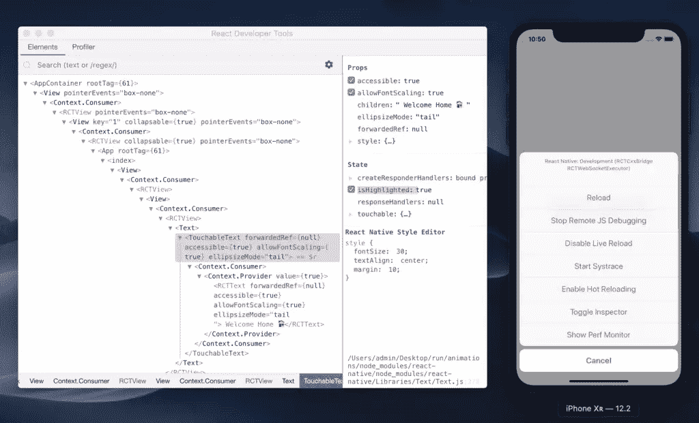

在 React Native 世界中，调试可能以不同的方式和使用不同的工具来完成，因为 React Native 由不同的环境(iOS 和 Android)组成，这意味着存在各种各样的问题和调试所需的各种工具。

由于 React 原生生态系统的大量贡献者，许多调试工具都是可用的。在这个简短的指南中，我们将从开发人员菜单开始，探索最常用的菜单。

> 调试比一开始写代码要难两倍。因此，如果你尽可能聪明地编写代码，从定义上来说，你没有足够的聪明去调试它。布莱恩·w·克尼根

## 开发人员菜单

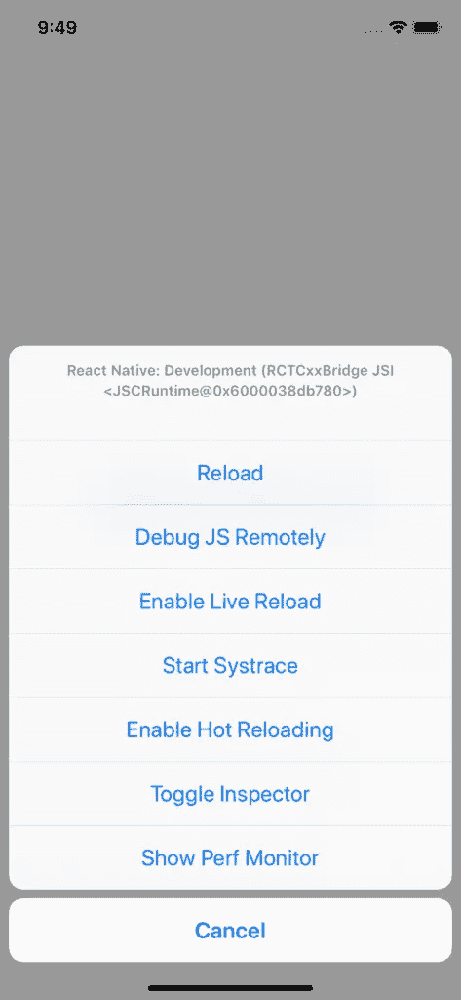

应用内开发者菜单是你调试 React Native 的第一个入口，它有很多选项，我们可以用来做不同的事情。让我们分解每个选项。

*   **重新加载**:重新加载应用
*   **远程调试 JS**:打开到 JavaScript 调试器的通道
*   **启用实时重新加载**:点击保存，使应用程序自动重新加载
*   **启用热重装**:监视已更改文件中累积的更改
*   **切换检查器**:切换检查器界面，它允许我们检查屏幕上的任何 UI 元素及其属性，并呈现一个具有其他选项卡的界面，如 networking，它向我们显示 HTTP 调用，以及一个 performance 选项卡。

## 黄色盒子和红色盒子

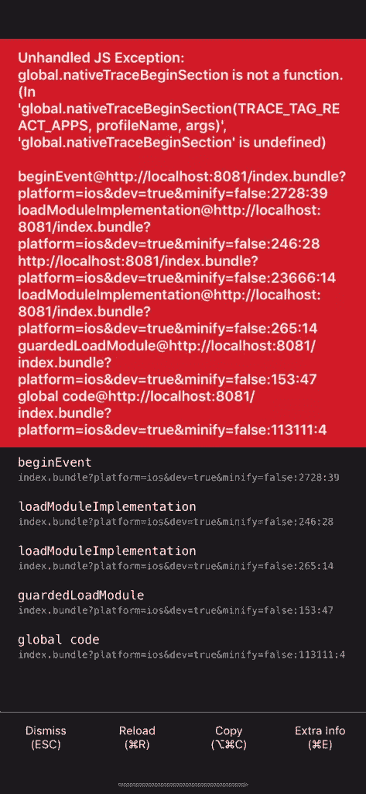

**红框**用于显示错误。每次应用程序抛出错误时，都会显示一个红框和错误的描述。写`console.error`就可以随时显示。但它在生产中不起作用，这意味着如果在那个环境中发生错误，应用程序将崩溃并停止运行。

红盒子是你的朋友。关于它的一个有用的事情是，它显示错误并给你如何修复它的建议，这在控制台中是找不到的。例如，我会经常编写一个 React Native 不支持的样式属性，或者一个用于特定元素的属性——比如为`View`元素设置`backroundImage`。`Redbox`会抛出一个错误，但是它也会显示您可以应用到`View`的受支持的样式属性列表。

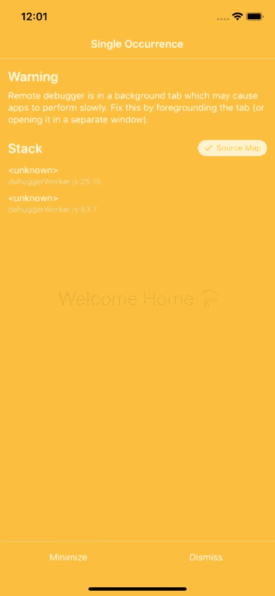

**黄框**用于显示警告。您可以通过在应用程序的根目录下的`index.js`中添加如下所示的代码行来禁用它们。但是不建议这样做，因为黄盒非常有用。它们会警告您诸如性能问题和不推荐使用的代码之类的问题。您可以使用`react-native`中的**黄盒**元素来显示特定的警告。

```
import {YellowBox} from 'react-native';
YellowBox.ignoreWarnings(['Warning: ...']); 
```

大多数黄盒警告都与代码中的一些不良行为有关。例如，您可能会收到一个警告，提示您在卸载组件时没有删除某个`eventListener`,或者您已经弃用了如下特性和依赖项:

```
warning: ViewPagerAndroid has been extracted from react-native core and will be removed in a future release. It can now be installed and imported from '@react-native-community/viewpager' instead of 'react-native'. See https://github.com/react-native-community/react-native-viewpager 
```

修复这些问题将防止许多错误，并将提高您的代码质量。

你可以在官方文档中了解更多关于调试 React Native 的信息。

## Chrome 的开发工具

Chrome 可能是你想到的第一个调试 React Native 的工具。使用 Chrome 的 DevTools 来调试 web 应用程序是很常见的，但我们也可以使用它们来调试 React Native，因为它是由 JavaScript 支持的。

要使用 Chrome 的 DevTools 和 React Native，首先要确保你连接到同一个 Wi-Fi，然后如果你使用的是 macOS，按`command` + `R`，或者在 Windows/Linux 上按`Ctrl` + `M`。当开发者菜单出现时，选择`Debug Js Remotely`。这将打开默认的 JS 调试器。

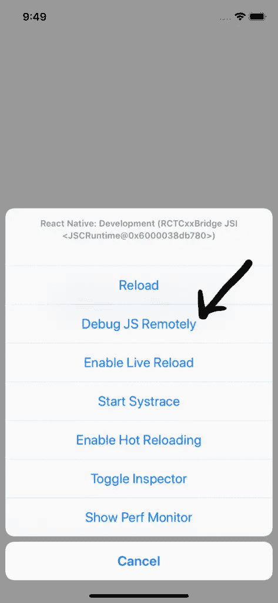

然后在 Chrome 中查看这个地址`http://localhost:8081/debugger-ui/`。您应该会看到这个页面:

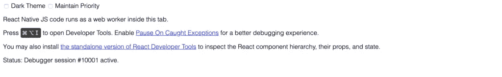

您可能需要在 Android 上进行一些故障排除。

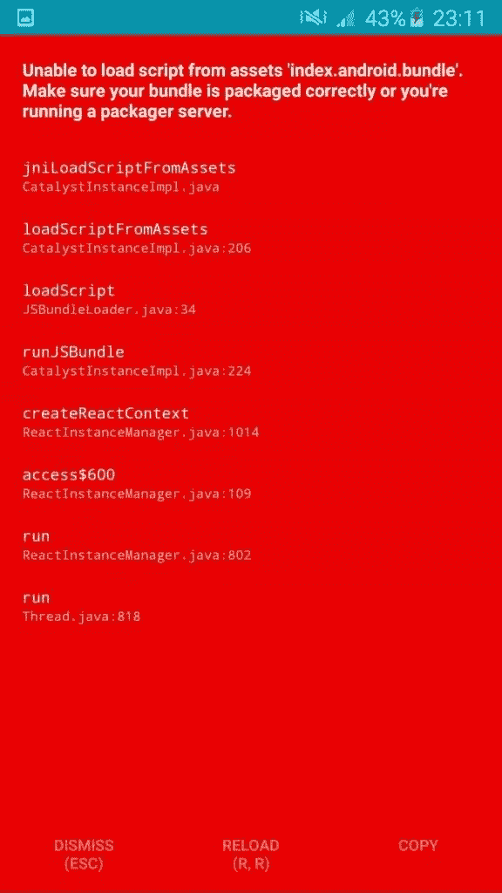

要解决这个问题，请确保您的机器和设备连接在同一个 Wi-Fi 上，然后将`android:usesCleartextTraffic="true"`添加到`android/app/src/main/AndroidManifest.xml`。如果这对您不起作用，请查看以下链接了解其他解决方案:

*   [堆栈溢出](https://stackoverflow.com/questions/42064283/react-nativecould-not-connect-to-development-server-on-android)
*   [GitHub](https://github.com/facebook/react-native/issues/15388)

成功连接到 Chrome 后，您可以简单地切换 Chrome 检查器。

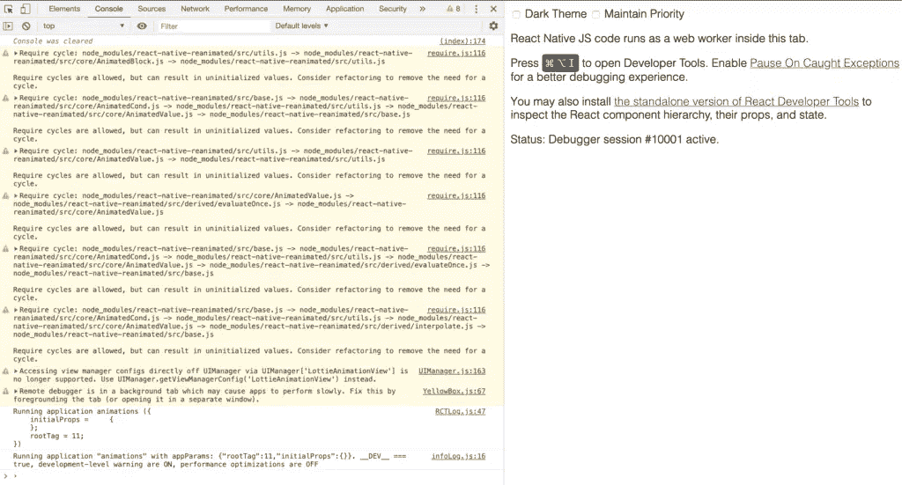

然后看一下你的 React 原生 app 的日志。也看看 Chrome 的 DevTools 提供的其他功能，并像使用任何 Web 应用程序一样使用 React Native。

将 Chrome 的 DevTools 与 React Native 配合使用的一个限制是，你不能像调试 web 应用程序时那样调试样式和编辑样式属性。在检查 React 的组件层次结构时，与 React 的 devtools 相比，它也是有限的。

## React 开发人员工具

要使用 React 的开发者工具调试 React Native，需要使用桌面应用。您可以通过运行以下命令在项目中全局或本地安装它:

```
yarn add react-devtools 
```

或 npm:

```
npm install react-devtools --save 
```

然后通过运行`yarn react-devtools`启动应用程序，这将启动应用程序。

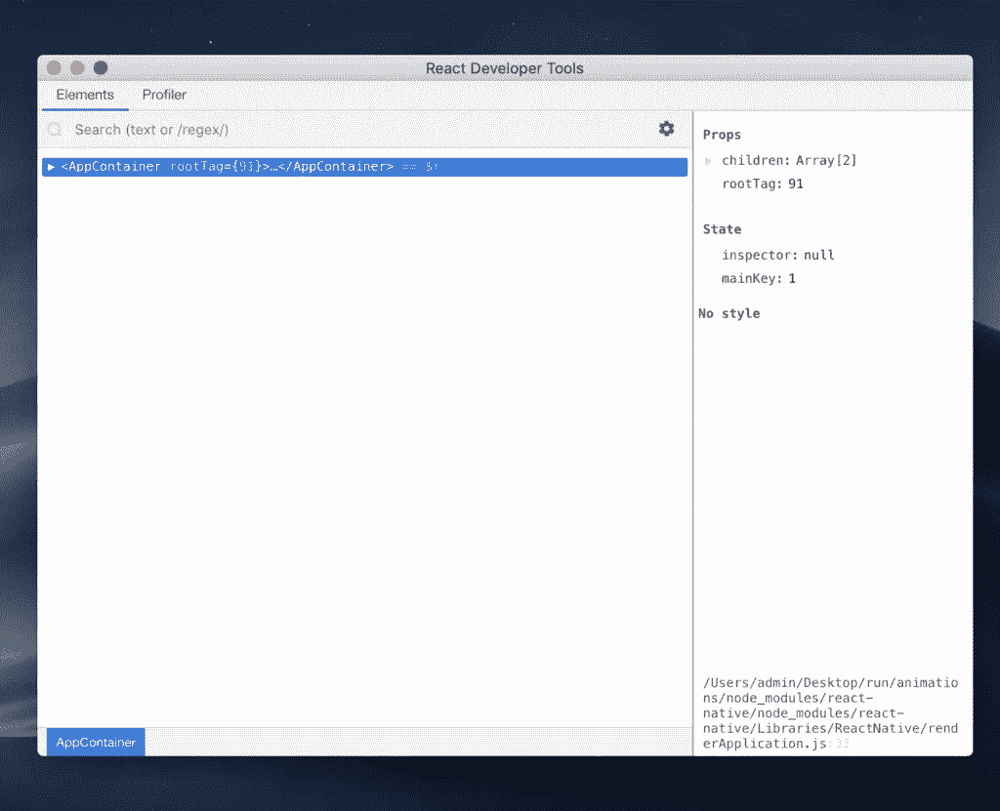

React 的开发者工具可能是调试 React Native 的最佳工具，原因有二:

*   它允许调试 React 组件。
*   它使得在 React Native 中调试样式成为可能(这些开发人员工具中我最喜欢的特性！).新的[版本](https://github.com/facebook/react-devtools/blob/master/packages/react-devtools/README.md)附带了这个功能，也可以与开发者菜单中的 inspector 一起使用。以前，编写样式并等待应用程序重新加载才能看到更改是一个问题。现在，我们可以调试和实现样式属性，无需重新加载应用程序就可以立即看到更改的效果。

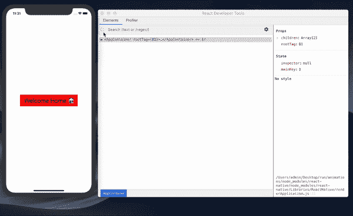

你可以点击了解更多关于使用 React 的开发者工具应用[的信息。](https://github.com/facebook/react-devtools/blob/master/packages/react-devtools/README.md)

## 反应本机调试器

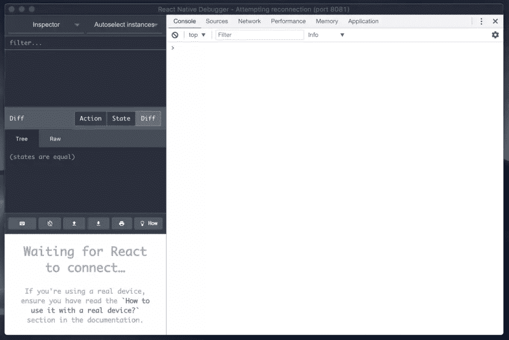

如果你在 React 本地应用中使用 Redux， [React 本地调试器](https://github.com/jhen0409/react-native-debugger)可能是适合你的调试器。这是一个独立的桌面应用程序，可以在 macOS、Windows 和 Linux 上运行。它在一个应用程序中集成了 Redux 的 DevTools 和 React 的开发者工具，因此您不必使用两个单独的应用程序进行调试。

[React Native 调试器](https://github.com/jhen0409/react-native-debugger)是我最喜欢的调试器，也是我在 React Native 工作中经常使用的一个。它有一个用于 Redux 的 DevTools 的接口，在那里可以看到 Redux 日志和操作，还有一个用于 React 的开发者工具的接口，在那里可以检查和调试 React 元素。你可以在这里找到安装说明。你可以像打开 Chrome 的 inspector 一样连接这个调试器。

在 Chrome 的 DevTools 上使用 React 原生调试器有一些优势。例如，你可以从 Dev 菜单切换检查器来检查 React 原生元素和编辑样式，这在 Chrome 的 DevTools 中是不可用的。

## 反应本机 CLI

您也可以使用 React Native CLI 进行一些调试。你可以用它来显示应用程序的日志。点击`react-native log-android`会显示 Android 上 **db logcat** 的日志，在 iOS 中查看日志可以运行`react-native log-ios`，使用`console.log`可以将日志发送到终端:

```
console.log("some error🛑") 
```

然后，您应该会在终端中看到日志。

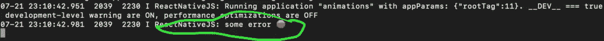

通过在终端上运行`react-native info`,您可以使用 React Native CLI 获得一些关于您在应用程序中使用的库和依赖项的相关信息。它向我们显示了一些关于您正在使用的工具的有用信息。例如，下面是运行`react-native info`时的输出示例:

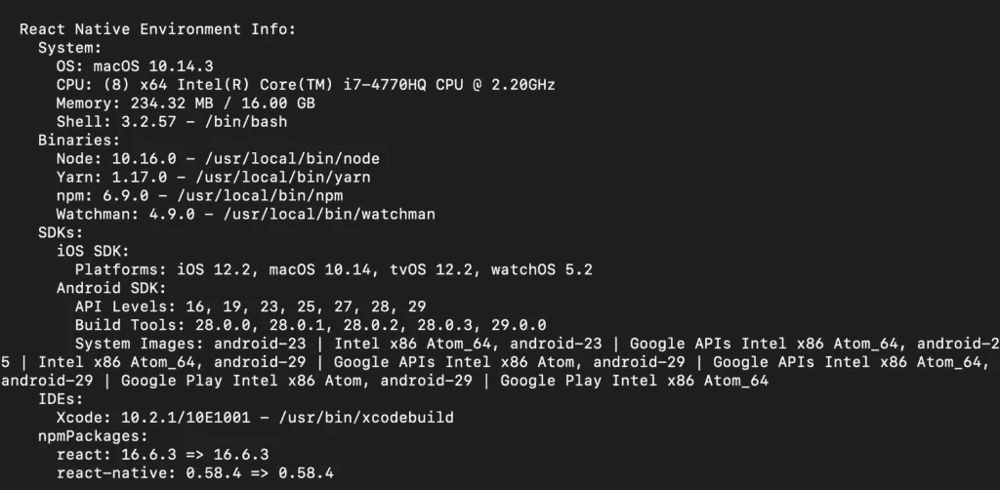

您可以使用此信息来修复由项目中使用的工具的版本不匹配导致的一些错误，因此使用此命令检查环境信息总是有好处的。

## 摘要

除了我们在这里看到的工具之外，还有很多调试 React Native 的工具。这真的取决于你的项目的具体需求。我主要使用 [React 本机调试器桌面](https://github.com/jhen0409/react-native-debugger),因为我经常使用 Redux，它在一个应用程序中结合了一系列工具，非常棒，而且节省时间。

如果你想谈论更多关于 React Native 的调试工具和 React Native 的一般情况，请在 Twitter 上联系我。我很想收到你的来信！

## 分享这篇文章