# 管理密码的 12 个工具

> 原文：<https://www.sitepoint.com/tools-for-managing-your-passwords/>

跟踪你的密码可能是一场噩梦，没有人喜欢把它们都写在一张任何人都能找到的纸上。幸运的是，有许多针对各种情况的密码管理解决方案:在浏览器中、在你的 iPhone 上、在网络上等等记住它们。

我们已经为各种平台收集了 12 个最好的，所以你一定会找到一个适合你的需求。

## Adobe AIR 应用程序

**[Ginz](http://www.adobe.com/cfusion/marketplace/index.cfm?event=marketplace.offering&offeringid=15361&marketplaceid=1)** : Ginz 是一个简单的应用程序，可以让你轻松地添加、删除、更改或搜索存储的项目。你也可以用密码保护你的整个目录。

[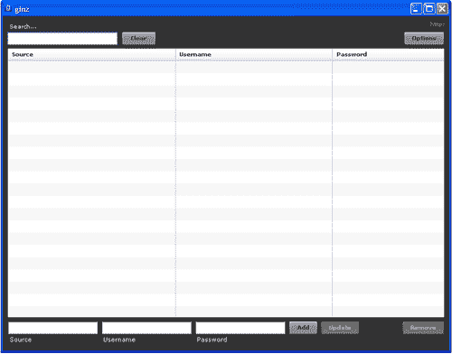](https://blogs.sitepointstatic.com.s3.amazonaws.cimg/lists/passwords/ginz.gif)

**[pass pack Desktop](http://www.adobe.com/cfusion/marketplace/index.cfm?event=marketplace.offering&offeringid=10123&marketplaceid=1)**:pass pack Desktop 可以让你对密码进行排序，给密码加标签以便于搜索，标记为收藏夹等等。如果您有 Passpack 帐户，您可以将密码同步到您的在线帐户。

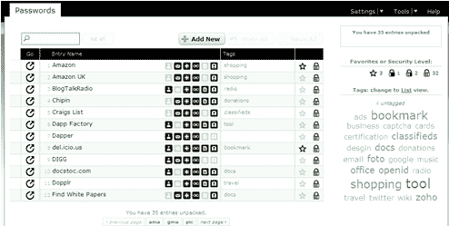

## 跨平台应用

KeePass : KeePass 是一个开源程序，允许你用一个主密码或一个密钥文件来保护你的密码。它主要用于 Windows，但也有用于 Linux 和 Mac OSX 的版本不那么健壮。你也可以使用 PocketPC、Symbian、BlackBerry 和 PalmOS 版本的手机。

[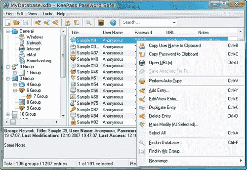](https://blogs.sitepointstatic.com.s3.amazonaws.cimg/lists/passwords/keepass.png)

LastPass : LastPass 可以与 Internet Explorer 和 Firefox 一起使用，在多台电脑之间同步你的密码。所有密码在离开您的电脑之前都会被加密，因此即使是 LastPass 也无法在他们的服务器上读取它们。该工具有助于生成强密码，允许你从手机访问，与其他密码管理器的进口&出口和更多。

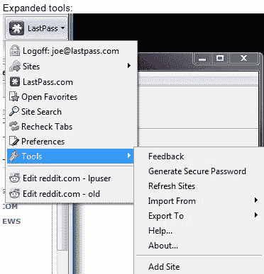

**[PasswordVault](http://www.lavasoftware.com/passwordvault.html)**:256 位加密对某些人来说是不够的，因此 password vault 为您提供 896 位加密，以确保您的密码得到更多保护。该程序有 Linux、Mac 和 Windows 版本，可以在多种浏览器上运行，同时还允许你在不同的电脑上同步数据。

[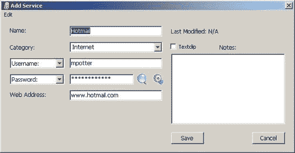](https://blogs.sitepointstatic.com.s3.amazonaws.cimg/lists/passwords/passwordvault.jpg)

:robo form 与 Internet Explorer 6、7、8 和 Firefox 2、3、3.5 一起工作，帮助你管理密码、填写表格、生成新密码、加密你的信息等等。

[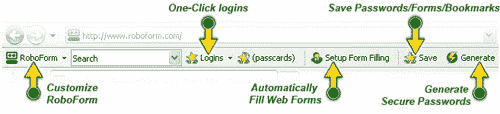](https://blogs.sitepointstatic.com.s3.amazonaws.cimg/lists/passwords/roboform.jpg)

## Firefox 插件

**[password maker](https://addons.mozilla.org/en-US/firefox/addon/469)**:password maker 帮你创建新密码，保护旧密码。密码不会存储在任何地方，而是被反复计算，因此没有任何东西可以被黑客攻击或破解。该扩展还可以填写表格，让你一键访问等等。

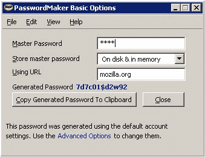

**[安全登录](https://addons.mozilla.org/en-US/firefox/addon/4429)** :安全登录与 Firefox 中内置的密码管理器一起工作，并通过允许您创建多个帐户、一键登录、表单自动填充等等来增加所有数据的用途。

[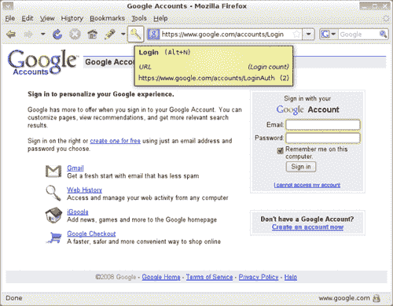](https://blogs.sitepointstatic.com.s3.amazonaws.cimg/lists/passwords/securelogin.png)

Sxipper : Sxipper 可以让你一键登录网站，还可以选择存储哪些工作、个人或任何你选择的信息。所有数据都安全地存储在您的计算机上，无需与第三方网站进行交互。

[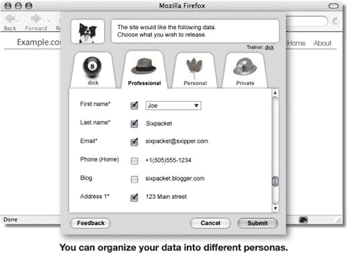](https://blogs.sitepointstatic.com.s3.amazonaws.cimg/lists/passwords/Sxipper.jpg)

## iPhone 和 iPod Touch 应用程序

**[e wallet–安全密码管理器](http://itunes.apple.com/WebObjects/MZStore.woa/wa/viewSoftware?id=284721352&mt=8)** : eWallet 为您提供了您想要的所有密码管理器功能，包括生成强密码、保护现有密码、存储敏感的信用卡信息、允许您从应用程序启动知名网站以避免网络钓鱼诈骗以及许多其他功能。如果您愿意，还可以选择将数据同步到桌面。

[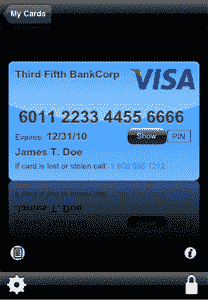](https://blogs.sitepointstatic.com.s3.amazonaws.cimg/lists/passwords/ewallet.gif)

**[Wallet Pro](http://itunes.apple.com/WebObjects/MZStore.woa/wa/viewSoftware?id=284950097&mt=8)**:Wallet Pro 使用 256 位加密来帮助您保护密码，允许与 memngo.com 和多部 iPhones 同步，设置多个配置文件来为不同的数据生成不同的加密密钥，等等。

## Mac 应用程序

**[1 密码](http://agilewebsolutions.com/products/1Password)** :几乎任何一个和你谈论密码管理的 Mac 用户都会马上脱口而出“1 密码！”这个解决方案的好处是，它不仅提供表单填写，而且还允许您存储购物时使用的信用卡资料。Palm OS 和 iPhone 用户可以为他们各自的设备下载应用程序，随身携带他们的信息。

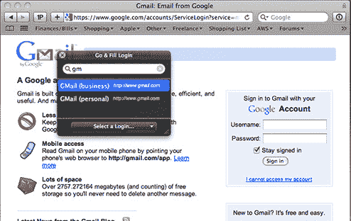

## 分享这篇文章