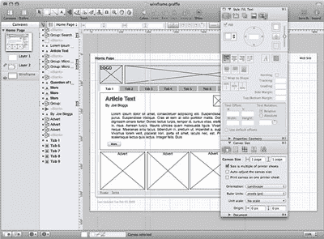
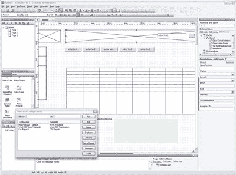

# 16 种原型和线框设计工具

> 原文：<https://www.sitepoint.com/tools-prototyping-wireframing/>

这篇文章写于 2009 年，至今仍是我们最受欢迎的帖子之一。如果你热衷于学习更多关于线框图的知识，你可能会对这篇最近关于免费在线线框图工具的文章很感兴趣。

近年来，帮助你记录和设计网站的工具数量激增。似乎我们都需要一个触手可及的线框或原型工具(至少在设计领域)。所以为了帮你省下找工作的辛苦，我列出了这个清单。它可以扩展，所以如果你使用一个未列出的应用程序，请让我知道，我会把它添加到列表中。

这些工具通常分为两类:

*   专用应用程序
*   多功能应用

在这两类工具中，我发现不同工具的有用性差异很大；有些只适用于图表和线框，而其他人只侧重于原型。最优秀的人拥有这两种能力甚至更多。

## 专用应用程序

### 1.矢量图绘制软件

我将提前声明，我不是一个大风扇 [Visio](http://office.microsoft.com/en-us/visio/default.aspx) (价格:从 259 美元，演示可用)；我在各种项目中不时地使用它，但我总是发现它既麻烦又耗时。

Visio 最初是作为 MS Word 的一个附加组件开始的，它满足了对业务和技术图表工具的需求，并最终发展成为独立的产品状态。Visio 的优势仍然在图表文档领域；作为一个原型工具，它的功能充其量是有限的。然而，Visio 和 Omigraffle(如下)一样，特别适合从 CSV 文件生成[内容地图。在 Visio 2007 的最新版本中，UML 插件的加入使得 UML 的导入更加顺畅。](http://www.boxesandarrows.com/view/the_lazy_ia_s_guide_to_making_sitemaps)

Visio 还产生了许多附加工具；Swipr (免费的)是最相关的，因为它允许将线框和屏幕流快速导出到可点击的 HTML 原型中。这对于一次性创建整个原型非常方便，并且在导出后不必将它链接在一起。

Visio 仅在 Windows 平台上可用。

### 2.OmniGraffle Pro

是的，我这里有点偏颇；我很喜欢 OmniGraffle(价格:199 美元，有试玩版)，尤其是最新版本。OmniGraffle 最适合作为线框、屏幕流和内容地图的工具。它还可以用作原型工具，能够链接画布(页面)。这允许您在 OmniGraffle 的一次操作中生成一个完整的 HTML 原型。通过使用 notes 功能，您可以轻松地注释和完成原型对象的规范文档。

OmniGraffle 提供了一系列丰富的 Visio 导入和导出功能，允许跨平台团队兼容。它还允许您通过完全可定制的基于规则的布局功能从 CSV 或 XML 文件导入基本内容结构；这对于记录大型且不断变化的内容地图尤其方便。

对 OmniGraffle 的支持得到了一个大型在线社区的补充，这可以从 [Graffletopia](http://www.graffletopia.com/) 上的可用资源中得到证明。OmniGraffle 只适用于 Mac。

### 3.Axure RP Pro

Axure 已经迅速成为用户体验和信息架构社区的宠儿。该应用程序允许您构建线框模型，记录功能规范，并生成原型，所有这些都使用内置的版本控制系统。

Axure 是一个非常快速的线框和原型生成系统，我个人发现它很快就收回了成本——在提高生产率方面——尽管它的价格处于中等水平。

Axure 在设计界面时提供了完全的灵活性，从标准的小部件到定制的构建，再到开放的画布。然而，Axure 真正的杀手级功能是生成丰富的 HTML 原型和状态间类似 Ajax 的交互。这有点像 Dreamweaver 和它的 JavaScript 一代，但是很好。

提醒一句:如果你真的去查看你的 HTML 原型，它生成的代码不是为胆小的人准备的，不应该被考虑用于测试原型之外。

对我来说，一个缺点是它只能在 Windows 上运行。如果它在 Mac 上可用，我会很高兴使用 Axure。

### 4.iris pro

iRise (价格:6，995 美元起，提供演示)是第一款上市的同类产品，有优点也有缺点。iRise 产品套件在功能上非常像 Axure，而且从价格上看，显然是面向企业级市场的。

除了价格，我不喜欢 iRise 的一点是用户界面。这可能是个人偏好，但是你会认为如果你要为用户体验专家制作一个工具，你至少要确保 UI 是正确的。iRise 受到使用旧 GUI 方法和技术的遗留界面的困扰。我认为它确实需要大修。

不过，如果你正在考虑与非常大的团队合作，并且需要一套全面的产品来跨越你的整个原型开发生命周期，那么 iRise 是值得一看的。

### 5.铅笔

Pencil(免费)是一个 Firefox 插件，声称可以让你构建线框和原型。作为一个原型制作工具，它非常好，允许你快速地组装一个相当高保真的模型。但是，请注意，您仍然需要为 Pencil 制作视觉设计元素，因为它依赖于拖放预先制作的图形元素。

Pencil 附带的输出线框元素倾向于基于 Windows 桌面应用程序的外观。这对于 web 应用程序来说确实是不理想的，但是您可以用自己的页面元素来修改这一点。

Pencil 的另一个缺点是它的导出功能只提供几种图像格式。这意味着 Pencil 不是一个真正的交互式原型开发工具。

### 6.智能绘图

SmartDraw (价格:297 美元起，提供演示)是在商业图表领域销售的，它不是一个真正专用的线框和原型应用程序，但这并不意味着它应该被完全抛弃。

它处于市场的低端，所以与 Axure 相比，它的功能会减少。SmartDraw 的目标市场与 Visio 或 OmniGraffle 相同，它有一个标准的模板套件和一些自动生成功能。对于原型，SmartDraw 允许您向页面添加简单的动态元素，最终输出为 PDF 文件。不允许在原型上表示状态之间的转换。

SmartDraw 仅适用于 Windows，提供了一定程度的 MS-Office 套件集成。

### 7.模拟屏幕

MockupScreens (价格:79 美元起，提供演示)是一个 Windows 专用的应用程序。它主要关注于从一系列基于常见屏幕元素的线框中构建简单的原型。

原型功能是有限的，并且只能在 MockupScreens 应用程序中使用。我注意到，您可以将屏幕导出为图像文件或非常有限的 HTML 渲染。该产品在成本和功能方面处于市场的最低端，但这可能符合您的需求。

**Go to page:** [1](/tools-prototyping-wireframing) | [2](/tools-prototyping-wireframing-2/)

## 分享这篇文章