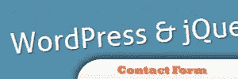
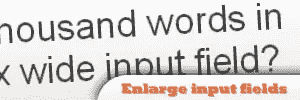
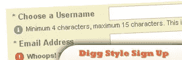
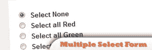
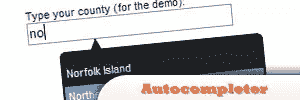
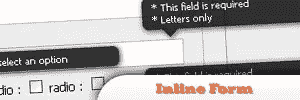
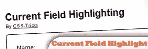
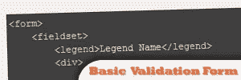

# 十大 jQuery 表单选择

> 原文：<https://www.sitepoint.com/top-10-jquery-form-selection/>

In the world of web developing, **the form is considered one of the most important parts of a website**. It is widely used for interaction between you and your web page visitors. jQuery can help enhance this. Once again, I’ve gathered a set of 10 forms that can help you ease your projects.Related Posts:

*   [**10 个 jQuery 插件改进 HTML 表单**](http://www.jquery4u.com/html/10-jquery-plugins-improve-html-forms/)
*   [**jQuery 表单> 30 个例子和插件**](http://www.jquery4u.com/forms/30-jquery-forms/)

## [1。jQuery AJAX 删除](http://papermashup.com/jquery-ajax-delete/)

您可以使用 Ajax 添加内容，但是删除它们是如此痛苦。现在，本教程是关于使用 jQuery 删除它们的。

来源

## [2。没有插件的联系表单](http://trevordavis.net/blog/tutorial/wordpress-jquery-contact-form-without-a-plugin/)

在 wordpress 中创建你自己的 jQuery 联系人表单插件！

来源

  

## [3。放大焦点上的输入字段](http://www.jankoatwarpspeed.com/post/2009/03/06/Enlarge-input-fields-on-focus.aspx)

在 200 像素宽的文本区域中键入长文本。

[来源](http://www.jankoatwarpspeed.com/post/2009/03/06/Enlarge-input-fields-on-focus.aspx)

## [4。创建一个 Digg 风格的注册表单](http://designshack.co.uk/tutorials/creating-a-digg-style-sign-up-form)

有一个 Digg 网站风格的克隆本教程。

[来源](http://designshack.co.uk/tutorials/creating-a-digg-style-sign-up-form)

## [5。构建一个伟大的登录表单](http://net.tutsplus.com/javascript-ajax/build-a-top-panel-with-jquery/)

当你点击一个链接时，让一个登录面板出现。

[来源](http://net.tutsplus.com/javascript-ajax/build-a-top-panel-with-jquery/)

## [6。多个选择表单元素](http://www.chromaticsites.com/blog/jquery-tutorial-selecting-multiple-select-form-elements-on-the-fly/)

通过本教程增强表单的可用性。

[来源](http://www.chromaticsites.com/blog/jquery-tutorial-selecting-multiple-select-form-elements-on-the-fly/)

## 7.自动完成器(不再可用)

使用 jQuery 创建文本字段自动补全。

## [8。jQuery 内嵌表单验证](http://www.position-absolute.com/articles/jquery-form-validator-because-form-validation-is-a-mess/)

通过刷新页面来验证表单。

[来源](http://www.position-absolute.com/articles/jquery-form-validator-because-form-validation-is-a-mess/)

## [9。表单中当前字段高亮显示](http://css-tricks.com/improved-current-field-highlighting-in-forms/)

提高表单的可用性，并在视觉上增强它们。

[来源](http://css-tricks.com/improved-current-field-highlighting-in-forms/)

## 10。一个基本的 jQuery 版本表单

从头开始创建您自己的验证表单。

[来源](http://webcloud.se/article/Form_validation_with_jQuery_from_scratch/)

## 分享这篇文章