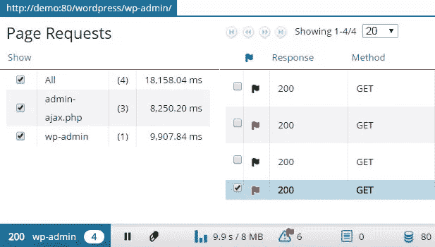
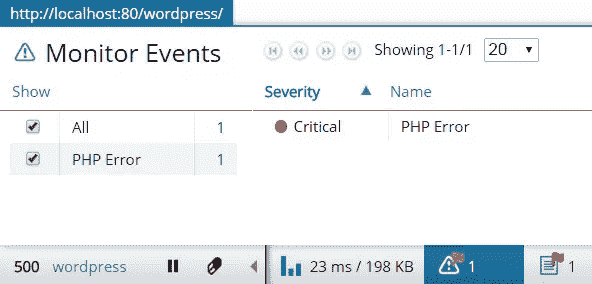
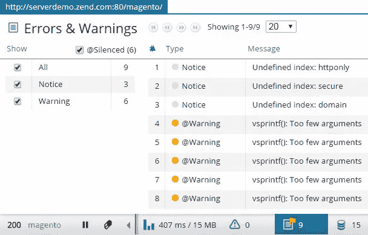
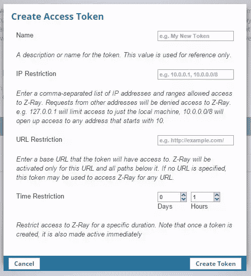
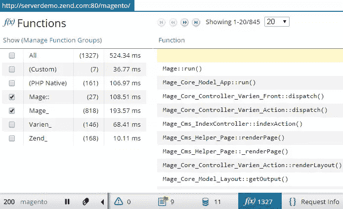
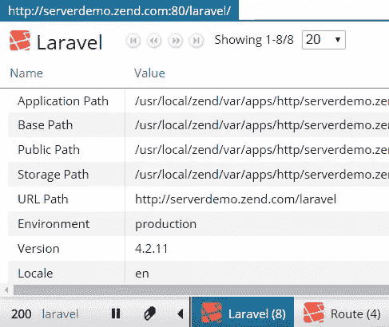
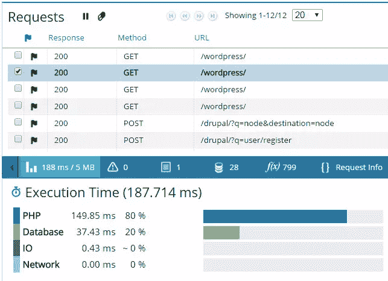
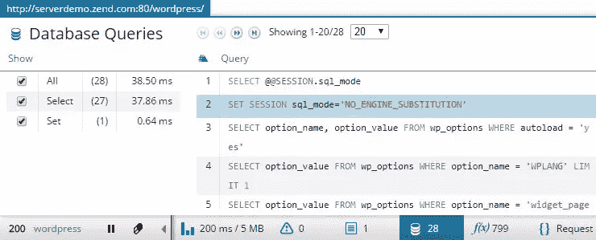

# 要检查的十大 Z 射线特征

> 原文：<https://www.sitepoint.com/top-10-z-ray-features-check/>

这篇文章是由从事 Zend 服务器项目的开发人员写的。我们非常热衷于 SitePoint 的编辑独立性，但是偶尔我们会刊登一些直接使用我们最喜欢的工具的人的文章。

俗话说，需要是发明之母。

对于 PHP 开发人员来说，没有比可见性更大的需求了。但是今天的开发人员在开发和调试他们的应用程序时面临着一个艰难的选择。要么使用简单的方法，比如打印、调试信息，或者将其存储在日志文件中，要么使用多种调试/分析工具，这些工具很笨拙，需要开发人员做大量的工作。

不管怎样，这意味着时间。访问 PHP 日志花费的时间。访问 SQL 查询花费的时间。花在寻找一个导致瓶颈或应用崩溃的坏函数或 PHP 错误上的时间。

本文介绍了 **Z-Ray** 的 10 大特性，这是一项来自 [Zend](http://www.zend.com) 的创新技术，通过给予开发者对其代码前所未有的洞察力，使 PHP 开发变得更快更容易，以及他们开发顶级应用所需的可见性。

## 关于 Zend 服务器

Zend Server 是一个移动和 web PHP 应用的集成应用平台。它包括一个高级和安全的 php 堆栈(与 php.net 的 PHP 完全兼容，基于相同的源代码)，有超过 80 个流行的 PHP 扩展和库。

Zend Server 包括帮助您开发、调试、部署和监控 PHP 应用程序的工具，以及用于优化性能、可伸缩性和可靠性的高级功能。

Zend Server 支持 Apache、NGINX 和 IIS Web 服务器，并作为本机包提供给所有领先的 Linux 发行版、Windows、MAC OS X 和 IBM i 环境，包括 AWS 等云环境。

Zend Server 支持任何 PHP 代码，并提供对这些代码的深入了解，包括流行的 PHP 应用程序和框架，如 WordPress、Magento、Drupal、Zend Framework、Symfony 和 Laravel。

关于什么是 Zend Server 以及如何安装它的更多信息，请参见此[概述](https://www.sitepoint.com/getting-know-zend-server-7/)。

## Z 射线是什么？

Z-Ray 是一个 Zend 服务器组件，它监控对 Web 服务器的请求，然后在浏览器底部的漂亮工具栏中显示页面请求的所有细节，包括构建页面所涉及的所有 PHP 脚本。

Z-Ray 被注入到来自 PHP 应用程序的响应中，并显示在你的浏览器中。你根本不需要调整你的代码或者改变你的开发工作流程——只需要在浏览器甚至移动设备上打开你的应用程序。

Z-Ray 的设计是非侵入性的——如果你不关心页面的诊断，它小到可以忽略。但是如果您这样做了，它就在您的指尖上——充满了关于刚刚呈现的页面的数据——而不必显式地运行任何额外的工具或重新创建请求。如果发生了严重错误或事件，Z-Ray 还会通过显示红旗图标来试图引起您的注意。

## z 射线的十大

本文的其余部分将概述 Z-Ray 的 10 大特性。在本文的最后，您将找到有用的链接，您可以查看这些链接来了解其他 Z-Ray 特性。让我们开始倒计时！

### 10.页面请求

Z-Ray 中的页面请求面板列出了从您的页面发送到 Web 服务器的所有请求，以及关于它们的响应、方法、路径、花费的时间和执行的 DB 查询数量的信息。如果在执行过程中发生了错误，您会知道它，因为在请求旁边会出现一个彩色的标志。

如果有多个请求，比如 ajax 调用，您可以从 requests 列表中选择一个特定的子请求。然后，Z-Ray 会进行相应的过滤，并只显示该请求的数据。

### 9.执行时间和内存消耗

不确定在处理数据库查询时浪费了多少服务器时间？Z-Ray 中的执行时间和内存峰值面板是了解请求如何消耗服务器资源的好方法。它显示内存使用的峰值，并给出请求的明细(PHP、数据库、IO、网络),帮助您理解 web 服务器是如何处理请求的。

### 8.监控事件

Z-Ray Monitor Events 面板为您提供了可能由请求触发的任何 Zend Server“监控事件”的列表，提醒您 PHP 错误、高内存使用率、缓慢的请求执行等等，如您在 Zend Server 中的监控规则所定义的。[关于 Zend 服务器监控的更多信息…](http://files.zend.com/help/Zend-Server/zend-server.htm#monitor.htm)

您可以在 Zend Server UI 中看到事件的完整细节——只需单击事件的相应图标。如果事件触发了代码跟踪，也可以直接从 Z-Ray 访问它。[关于 Zend 服务器代码跟踪的更多信息…](http://files.zend.com/help/Zend-Server/zend-server.htm#code_tracing_concept.htm)

### 7.错误和警告

访问 PHP 日志并不是一种非常流行的调试方法。这很尴尬，而且很费时间。Z-Ray 中的错误和警告面板通过显示未被捕获的异常、PHP 自身生成的错误或其核心函数创建的错误来省去您的麻烦。您将能够看到错误的创建时间、类型和实际的错误消息。

这个面板的一个很好的特性是能够看到被@操作符屏蔽的表达式条目。要查看这些条目，您只需选择左侧过滤区域中的“@静音”复选框。

单击右边的回溯图标会显示错误的完整回溯，让您更全面地了解出错的原因。

### 6.请求信息

在 Z-Ray 请求信息面板中，您将获得关于请求的大量信息。

首先，您将获得代码中使用的 PHP 超全局变量的列表。因此，例如，您将能够容易地识别您的会话或 COOKIE 超全局变量的值是否改变了，以及如何改变的，包括变量的实际大小。

此外，您将能够看到请求头、原始发布数据(如果有的话)以及响应头和正文。

### 5.生产中的 z 射线

Z-Ray 允许开发人员在开发周期的早期和投入生产之前分析代码并识别错误。然而，Z-Ray 也可以安全地用于生产中，使用在应用程序的 URL 中作为 GET 参数传递的访问令牌。

使用 Zend Server 用户界面可以很容易地管理和创建访问令牌，并且可以对每个 IP 地址、每个 URL 和特定时间段进行限制。

### 4.功能

应用程序在执行过程中可以调用成百上千个 PHP 函数。了解速度慢或性能差的功能对于分析性能至关重要。

在 Z 射线函数面板中，您将能够看到在请求过程中调用的所有 PHP 函数；它们的名称、被调用的次数、在函数范围内花费的时间，包括和不包括在子函数中花费的时间，等等。

可以使用默认过滤器根据函数组和名称空间过滤函数。您也可以创建自己的函数过滤器。这里看[如何。此外，与 Z-Ray 中的其他面板一样，信息可以根据列标题进行排序，因此很容易快速识别慢功能等。](http://files.zend.com/help/Zend-Server/zend-server.htm#configuring_z-ray.htm)

为了使分析和与同事共享更容易，在角落里有一个导出按钮，用于生成基于 HTML 的报告。

### 3.应用/框架支持和可扩展性

Z-Ray 最有意思的特性之一是扩展它的能力。

使用扩展 API(可从 [GitHub](https://github.com/zend-server-extensions/Z-Ray-Documentation) 获得)，你可以插入自己的 Z 射线扩展，或者定制现有的扩展。因此，无论您正在开发什么应用程序，或者您正在使用什么平台/框架，您都可以让 Z-Ray 跟踪和显示您认为会优化您的开发工作流程的信息。

事实上，这个功能被用来为 Z-Ray 配备对流行的 PHP 应用程序和框架的内置支持，如 WordPress、Magento、Drupal、ZF1、ZF2、Symfony、Laravel 等等。这意味着，如果你正在开发这些应用程序/框架中的一个，Z-Ray 将自动显示带有应用程序/框架特定信息的附加面板。

所有这些都是现成的，不需要您进行任何额外的配置。只需在浏览器中打开应用程序。

开发 Z-Ray 扩展的过程非常简单，可以归结为几行代码。查看这个教程，了解它有多简单。

Z-Ray 的生态系统每周都在增长，PHP 社区贡献了越来越多的扩展，包括对 [Joomla](https://github.com/yireo/Z-Ray-Joomla) 、 [OPcache](https://github.com/janatzend/Z-Ray-OPcache) 、 [Doctrine2](https://github.com/sandrokeil/Z-Ray-Doctrine2) 、 [Redis](https://github.com/janatzend/Z-Ray-Redis) 、 [OroCRM](https://github.com/orocrm/zray) 等的扩展。

### 2.调试移动设备和 API

对于在浏览器中打开的应用，所有上述信息都由 Z 射线显示。但是移动应用呢？如果你正在开发 API 和 Web 服务呢？

非基于浏览器的请求显示在 Z-Ray Live 上！–Zend Server 用户界面中的专用页面。在开发过程中，从加载该页面的那一刻起，Z-Ray 将记录并显示向网络服务器发出的任何请求，无论其来源是浏览器、移动设备还是网络服务客户端。在浏览器中打开的应用程序显示的所有信息也会显示在这里，没有例外。

在这个视频中仔细看看这有多简单—[使用 Z-Ray Live 开发移动应用和 API！](https://www.youtube.com/watch?v=akOPEBvpu9s)

### 1.数据库查询

数据库查询是 PHP 开发人员最热衷的 Z-Ray 特性之一，这也是我把它列在第一位的原因。在某种程度上，这个面板象征着 Z-Ray 的全部意义——为您提供关于您的应用程序的关键信息，而这些信息在以前是非常困难和耗时的。

Database Queries 面板完美地概括了请求执行的所有 SQL 查询，显示了关于每个查询的无价信息，例如查询的绑定值、结果、花费的时间以及受影响的行数。

尽管在开发和调试过程中，获取页面已经执行的查询列表通常是极其重要的，但现实情况是，如果没有 Z-Ray，获取它通常是不容易或不实际的。出于安全考虑，针对公司数据库进行开发的开发人员可能无法访问数据库查询日志。一些数据库(比如 SQLite)甚至没有查询日志。即使您有权访问查询日志，从您正在查看的页面中提取特定运行的查询也可能不容易，因为查询日志包含来自所有不同页面的所有查询的混合，也可能来自同时使用该数据库的其他开发人员。因此，Z-Ray 的上下文查询列表更加强大，同时也非常易于使用。

为了更全面地了解代码是如何执行的，您还可以为查询生成一个完全详细的、可打印的回溯。如果您使用数据库抽象层，这一点尤其有用——在这种情况下，仅仅通过查看文件名和被调用的行号可能无法确定查询来自哪里。

## 有用的链接

以下是一些你会觉得有用的额外信息来源:
*现场演示:[WordPress](http://serverdemo.zend.com/wordpress)|[Drupal](http://serverdemo.zend.com/drupal)|[Magento](http://serverdemo.zend.com/magento)|[ZF2](http://serverdemo.zend.com/zf2SampleAppl)|[Laravel](http://serverdemo.zend.com/laravel)|
*[Z 射线视频](https://www.youtube.com/playlist?list=PLCYlUTOY-57UfOVljMzAzwdbAVmjhB5D6)*
*[Z 射线扩展 API](https://github.com/zend-server-extensions/Z-Ray-Documentation)
*[Zend.com](http://www.zend.com)

### 反馈

由于 Z-Ray 是一个正在进行的项目，您可以通过以下渠道发送您的评论或想法:
zs-feedback@zend.com | daniel.be@zend.com |[@ proudboffin](https://twitter.com/proudboffin)

要了解如何编写自己的 Z 射线扩展，请参见本[教程](https://github.com/zend-server-extensions/Z-Ray-Documentation)。

## 分享这篇文章