# 2013 年 100 大 jQuery 插件(第 4/5 部分)

> 原文：<https://www.sitepoint.com/top-100-jquery-plugins-year-2013-part-45/>

从 100 开始倒数，以下是我们认为的 2013 年最好的 jQuery 插件。**这里是 40-20 个条目**。注意:如果在 2013 年进行了重大升级，一些旧插件可能会出现。

## 40.平均菜单

隐藏或显示子菜单。要用 MeanMenu 换出的目标导航元素。方向调整(倾斜设备时，居中菜单将重新定位)。控制 MeanMenu 激活时的屏幕宽度。展开/折叠子导航

[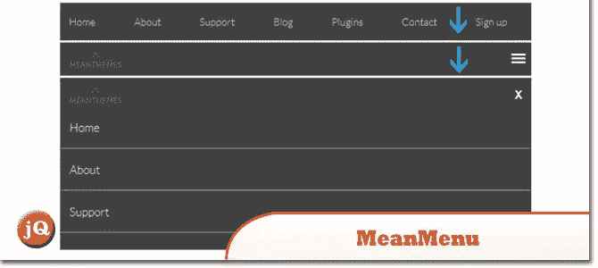](http://www.meanthemes.com/plugins/meanmenu/) 
[来源](http://www.meanthemes.com/plugins/meanmenu/) [演示](http://www.meanthemes.com/demo/meanmenu/demo.html)

## 39.争论

一个反应灵敏的，触摸友好的 jQuery 插件来处理你的图片。一个实验性的插件，可以让你像一个真正的牛仔一样抓取你的一堆照片。

[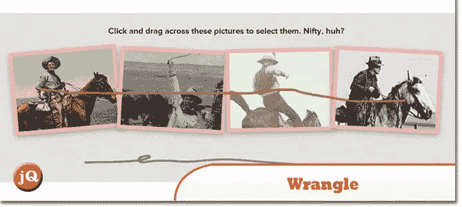](http://zurb.com/playground/wrangle-jquery-plugin) 
[源+演示](http://zurb.com/playground/wrangle-jquery-plugin)

## 38\. tiltShift.js

一个 jQuery 插件，使用 CSS3 图像过滤器来复制倾斜移位效果。这是一个概念验证，目前只适用于 Chrome 和 Safari 6。

[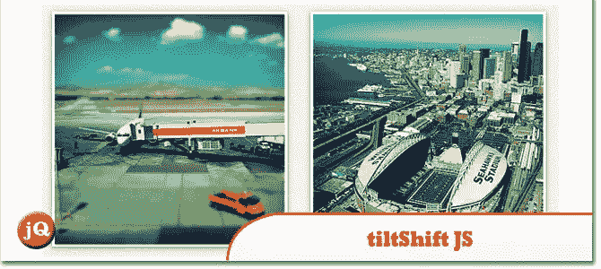](http://www.noeltock.com/tilt-shift-css3-jquery-plugin/) 
[源+演示](http://www.noeltock.com/tilt-shift-css3-jquery-plugin/)

## 37.tidyTime.js

一个 jQuery 插件，为用户提供了一种更友好的显示时间更新的方式！花点时间，把它变成更人性化的对话，比如“刚过中午”。现在是晚上 8 点 15 分，已经快下午 4 点半了，才过了 25 到 6”多。

[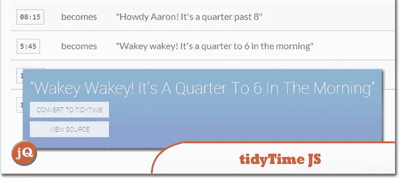](http://git.aaronlumsden.com/tidytime.js/) 
[源+演示](http://git.aaronlumsden.com/tidytime.js/)

## 36.颜色样本

一个免费使用的 jQuery 插件

[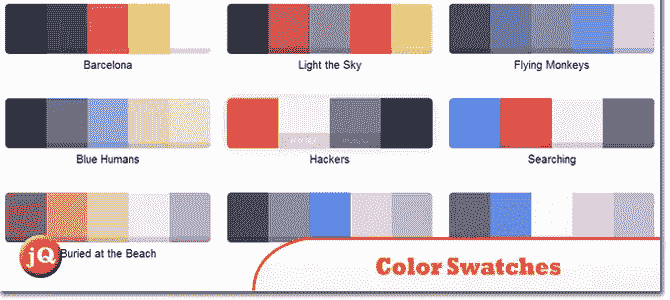](http://maxmackie.github.io/jquery.swatches/) 
[源+演示](http://maxmackie.github.io/jquery.swatches/)

## 35.可视化验证码

这是最容易实现的安全验证码，用图像代替文本，拖放功能，移动友好，视网膜就绪，并考虑到可访问性。

[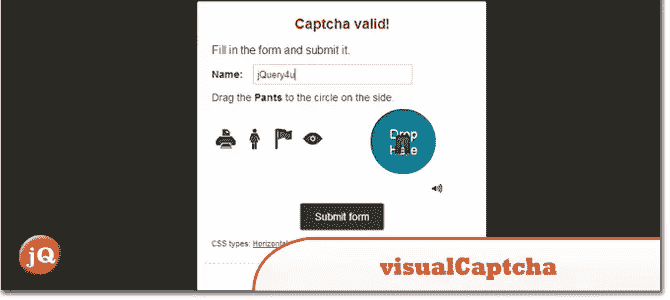](http://visualcaptcha.net/) 
[来源](http://visualcaptcha.net/) [演示](http://demo.visualcaptcha.net/)

## 34.Gridster.js

一个 jQuery 插件，允许从跨越多列的元素构建直观的可拖动布局。您甚至可以动态地在网格中添加和删除元素。

[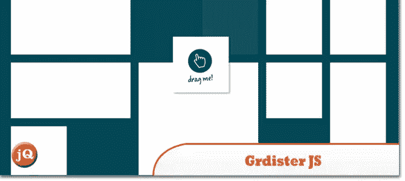](http://gridster.net/) 
[来源](http://gridster.net/) [演示](http://gridster.net/#demos)

## 33.地铁菜单

Metro Menu 将帮助您创建一个强大的时尚菜单。这个插件是响应性和可定制的。您可以更改颜色、动画、位置、关闭方法等。

[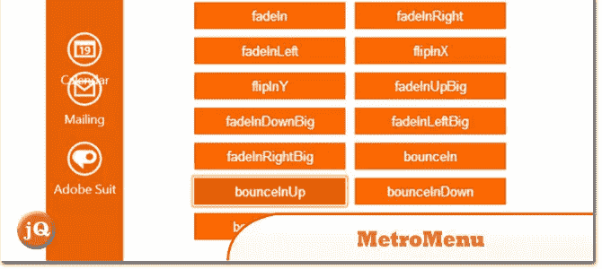](http://codecanyon.net/item/metro-menu/full_screen_preview/4476162?ref=sdeering) 
[源+演示](http://codecanyon.net/item/metro-menu/full_screen_preview/4476162?ref=sdeering)

## 32.ALERTIFY.js

JavaScript 警报/通知系统

[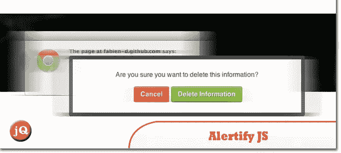](http://fabien-d.github.io/alertify.js/) 
[源+演示](http://fabien-d.github.io/alertify.js/)

## 31.Wookmark jQuery 插件

一个 jQuery 插件，用于创建动态的多列布局。

[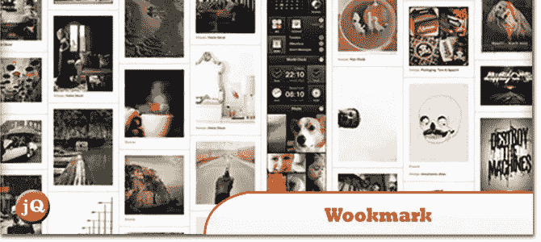](http://www.wookmark.com/jquery-plugin) 
[源+演示](http://www.wookmark.com/jquery-plugin)

## 30.铁磁滑块 2

一个免费的 jQuery 插件，允许你以一种不寻常的和酷的方式组织网站的内容，并以滑动效果浏览它们。

 
[来源](http://www.alessandroferrini.it/lab/jQueryPlugins/ferroSlider/docs/) [演示](http://www.alessandroferrini.it/lab/jQueryPlugins/ferroSlider/docs/docs.php#demos)

## 29.工具栏。射流研究…

允许您快速创建用于 web 应用程序和网站的工具提示样式工具栏。使用 twitter 引导图标可以很容易地定制工具栏，并在工具栏显示和图标数量方面提供灵活性。

[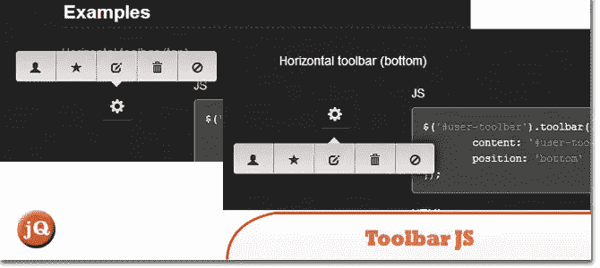](http://paulkinzett.github.io/toolbar/) 
[源+演示](http://paulkinzett.github.io/toolbar/)

## 28.jQuery 屏幕键盘

这是一个简单的屏幕键盘，由 JavaScript/jQuery 提供支持。

[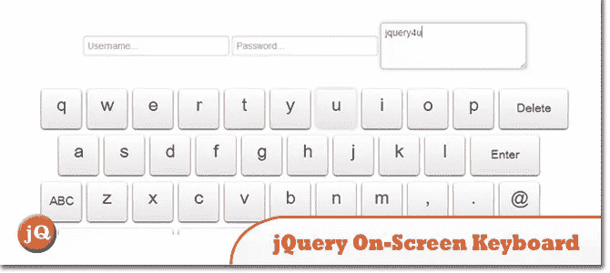](https://www.sitepoint.com/jquery-on-screen-keyboard/) 
[源+演示](https://www.sitepoint.com/jquery-on-screen-keyboard/)

## 27.工具情报提供者

一个强大、灵活的 jQuery 插件，使您能够轻松地创建语义化的、现代化的工具提示，并借助 CSS 的力量得到增强。

[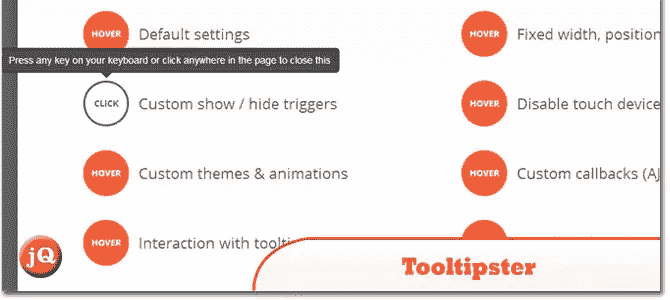](http://iamceege.github.io/tooltipster/) 
[来源](http://iamceege.github.io/tooltipster/) [演示](http://iamceege.github.io/tooltipster/#demos)

## 26.全页. js

一个简单易用的插件，用于创建全屏滚动网站(也称为单页网站)。它允许创建全屏滚动网站，以及在网站的各个部分添加一些横向滑块。

[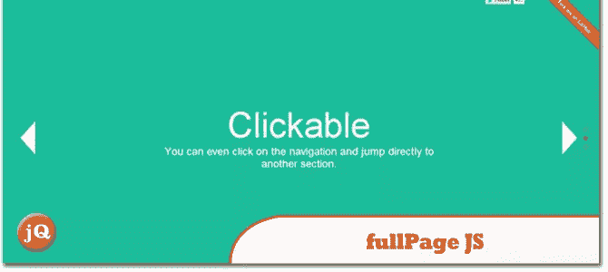](http://alvarotrigo.com/fullPage/#firstPage) 
[源+演示](http://alvarotrigo.com/fullPage/#firstPage)

## 25.非终点直道

一个简单的 jQuery 插件，允许你在任何页面或元素上添加一个动态调整大小的，支持幻灯片显示的背景图片

[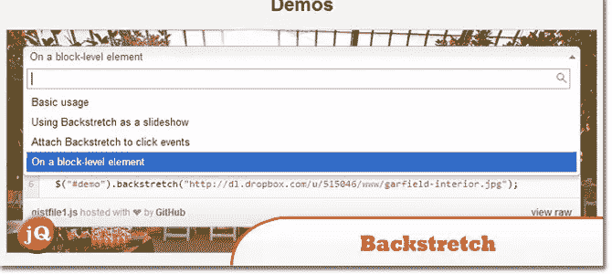](http://srobbin.com/jquery-plugins/backstretch/) 
[源+演示](http://srobbin.com/jquery-plugins/backstretch/)

## 24.jQuery 拼写检查器

jQuery 拼写检查器是一个轻量级插件，可以用来检查表单域或 DOM 树中文本的拼写。

[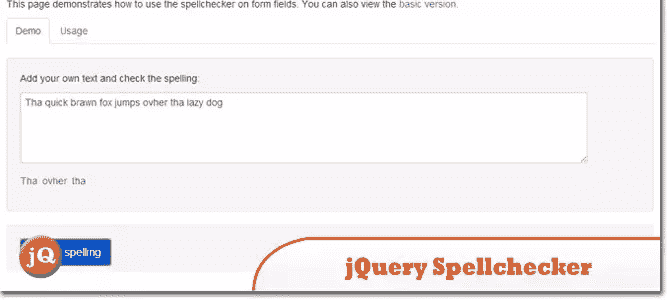](http://jquery-spellchecker.badsyntax.co/) 
[源+演示](http://jquery-spellchecker.badsyntax.co/)

## 23.流型。射流研究…

最完美的响应式网页排版:基于元素宽度的字体大小和行高。

[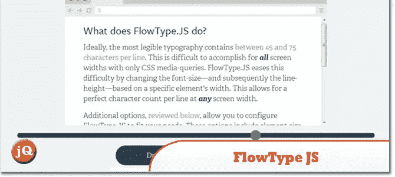](http://simplefocus.com/flowtype/) 
[源+演示](http://simplefocus.com/flowtype/)

## 22.伊切克

jQuery 和 Zepto 的超级定制复选框和单选按钮。

[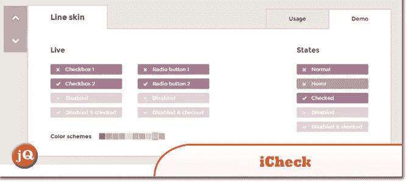](http://fronteed.com/iCheck/) 
[源+演示](http://fronteed.com/iCheck/)

## 21.jQueryStripe

一个 jQuery 插件，用于创建一个很酷的条纹图库对象。

[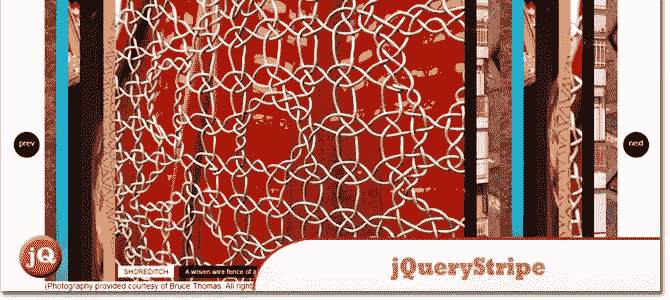](http://fliptopbox.com/demo/stripe/) 
[源+演示](http://fliptopbox.com/demo/stripe/)

## 分享这篇文章