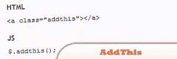
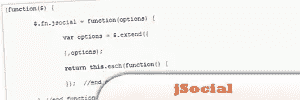
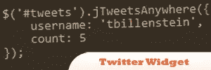
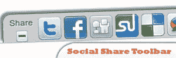
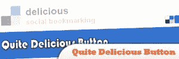
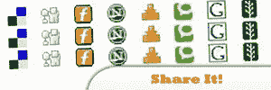
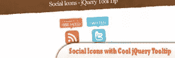
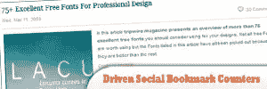
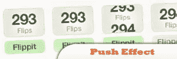

# 15 大 jQuery 社交网络

> 原文：<https://www.sitepoint.com/top-15-jquery-social-networks/>

Social networking is one of the best and free ways for increase traffic on our blog, interacts with your friends and relatives in different places. Social media optimization doesn’t only allow discovering and reading the content and information but also encourages you to share the knowledge what you have. This post includes some of social jquery plugins and tutorials. Enjoy!

 

## [1 .jQuery AddThis 外挂程式](http://plugins.jquery.com/project/AddThis)

这是 AddThis 小部件的 jQuery 实现，可从 AddThis 获得。作为第一个版本，tahis 只使用基本选项，允许你把它放在你的网站上。

来源

 

## [2。推特链接](http://plugins.jquery.com/project/tweetlink)

让你的访客在推特上发布你的内容变得简单。当点击 TweetLink 按钮或链接时，它会自动使用 bit.ly 缩短当前页面的 URL，并将用户发送到已经填充了状态框的 Twitter。

来源

 

## [3。书签](http://plugins.jquery.com/project/bookmark)

与任意数量的书签网站共享您的页面。功能包括以下内容:完整和紧凑版本，可定制的网站列表，轻松添加新的/其他网站，可选的“收藏夹”和“电子邮件”链接，并为当前页面以外的页面添加书签。

来源

 

## [4。jSocial](http://www.amberweinberg.com/create-a-jquery-plugin-for-social-networking/#jquery)

插件处理剩下的事情；创建所有的链接，并建立一个漂亮的列表，完成匹配图标，你在网上的任何地方。

来源

 

## [5。所以所以社交插件。由 jQuery 和 YQL 提供支持](http://johnpatrickgiven.com/jquery/soSoSocial/)

Yahoo Query Language 从你的各种社交网络中收集 RSS 提要，并将其分类为“活动提要”。它基本上从你的社交网络活动中创造了一个新闻源。

来源

 

## [6。移动块](http://playground.mobily.pl/jquery/mobily-blocks.html)

允许您简单地创建一个无序列表，作为一个令人印象深刻和时尚的动画圈。

来源

 

## 7 .[。BubbleUp jQuery 插件为你的菜单增添趣味](http://aext.net/2010/04/bubbleup-jquery-plugin/)

这个插件现在更加灵活，易于定制，并且可以在所有主流的网络浏览器上使用任何尺寸的图片。

来源

 

## [8。支持@Anywhere 的 jQuery Twitter 小部件](http://thomasbillenstein.com/jTweetsAnywhere/)

jTweetsAnywhere 是一个 jQuery Twitter 小部件，它简化了 Twitter 服务到站点的集成。只需几行 JavaScript 代码，您就可以
显示来自用户订阅源和用户列表的推文
显示 Twitter 搜索结果
呈现自动刷新的实时/实时报价
构建可分页的推文订阅源
将可定制的推文框集成到您的网站
让您的访问者直接从您的网站关注您
使用 Twitter 处理安全认证

[来源](http://thomasbillenstein.com/jTweetsAnywhere/)

 

## [9。jQuery 社交分享工具栏](http://csscreator.com/content/jquery-social-share-toolbar)

了解如何使用 jQuery 和 CSS3 构建自己的社交共享工具栏。工具栏应该在浏览器的右下角可见。如果你悬停在工具栏上，它会向上滑动，单击最小化按钮，它几乎会消失，单击其中一个图标，你会被带到该社交网站的登录页面或共享页面。

来源

 

## 10。相当美味的按钮——一个 jQuery 插件

这是一个分享计数按钮，鼓励人们在 Delicious 上为您的内容添加书签。虽然美味提供了自己的按钮。

来源

 

## [11。jQuery:分享一下！](http://joanpiedra.com/jquery/shareit/)

显示社会书签图标的 jQuery 插件。

来源

 

## [12。带有酷炫 jQuery 工具提示的社交图标](http://durdandesign.com/social-icons-with-cool-jquery-tooltip/)

本教程将带您了解如何为 RSS 和 Twitter 等社交图标创建一个简单的 jQuery 动画工具提示。

来源

 

## 13。一个 Twitter 列表驱动的粉丝页面

在本教程中，您现在可以创建并编辑一个 twitter 用户列表，让其他人更容易立即关注。

来源

 

## [14。jQuery 驱动的社会书签计数器](http://www.tripwiremagazine.com/2009/04/how-to-jquery-driven-social-bookmark-counters.html)

提供了一个关于如何创建基于 jQuery 的社会化书签计数器的教程。大多数人通常都很忙，这意味着博客或网站的读者不会把时间浪费在那些不太好的文章上。

来源

 

## 15。推送效应:用 jQuery 改善社交投票工具的视觉反馈

挖，投票，嗡嗡，转发，喜欢，撞，喊。这些无处不在的社交工具已经成为决定集体受欢迎程度的事实机制。当你使用这些工具将一个物品的受欢迎程度提高一个单位时，在视觉反馈方面几乎没有变化。大多数只是即时更新值，而其他人(Digg)执行一点淡入淡出效果。

来源

## 分享本文