# 自由职业者和小企业的五大会计工具

> 原文：<https://www.sitepoint.com/top-5-accounting-tools-freelancers-small-businesses/>

作为一名开发人员，您可能不太喜欢做会计工作。我也不是。幸运的是，现代工具可以在许多方面提供帮助。这仍然需要一些时间，但是在本文中，我将向您介绍几个旨在将管理时间减到最少的工具。所有这些工具都面向自由职业者和小企业。

## 特征

所有经过审核的工具都附带:

*   **开票&费用**:记账的基础。
*   **进口银行交易** : tll 允许出口，有的甚至采用自动进口。
*   **报表**:销售报表、费用概览、税务汇总等等。
*   **免费试用或免费账户**:你可以免费试用所有这些工具 14 或 30 天，无需信用卡(LessAccounting 除外，它确实需要信用卡)。

其中一些还提供:
–**时间跟踪**:通常与开具发票相结合，根据收集的小时数发送账单。
–**估算/报价**:向潜在客户发送建议书，成功后将其转换为发票。
–**工资单**:跟踪你的员工或雇佣的自由职业者。
–**手机**:有些提供扫描收据的应用，有些提供时间追踪和记账的应用。

有趣的是，它们都没有在一个开箱即用的产品中提供所有这些功能。因此，由你来决定什么是你认为最重要的，或者你想把额外的时间花在什么地方。

我将看看包括了哪些功能，以及要花多少钱(提示:其中一些工具是免费的)。更重要的是，我会看每个产品的特色。当五个产品如此相似时，一切都归结于可用性。让我们看看他们是如何比较的。

## 波浪

让我首先说，即使你一点也不喜欢作为一个应用的 [Wave](https://www.waveapps.com/) ，你也不得不承认他们有一个漂亮的销售页面。

Wave 提供了所有必要的功能，除了时间跟踪(顺便说一下，这真的很遗憾)。它完全免费，除了工资表和支付功能，价格都很低。这是广告支持的，但至少广告通常是相关的。

### 为什么选择 Wave？

### 自动交易导入

在我的情况下，我添加了我的贝宝账户。运行了一段时间后，我得到了一个交易列表。有些甚至已经被分类了。

只要你的银行或支付提供商支持自动交易，你就可以开始了。

### 发票/经常性/估计

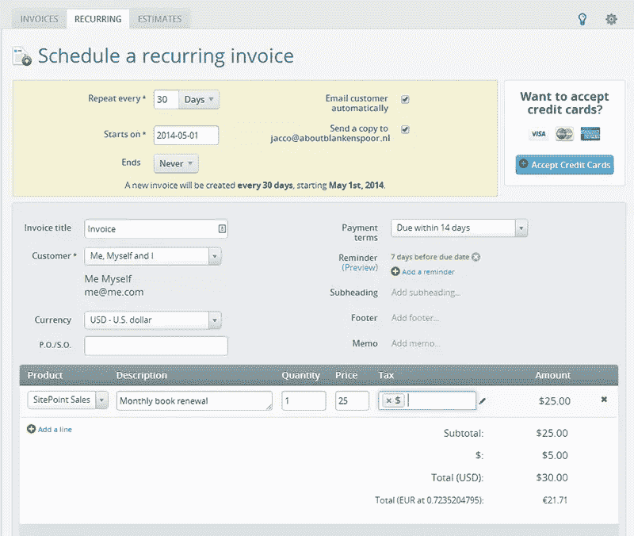

都很方便。您可以将估算转换为发票，并且可以设置经常性发票。

只需很低的费用，您甚至可以通过信用卡收款，这样客户就可以立即支付您的发票。

### 收入

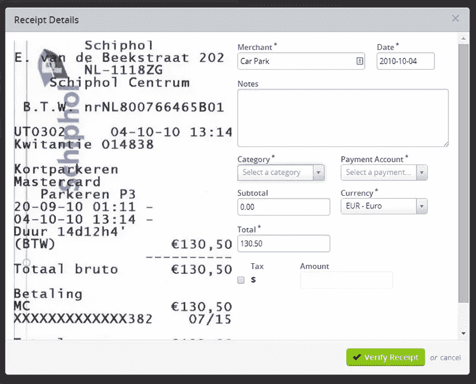

这个功能真的让我印象深刻。我使用了一个非个性化的电子邮件地址来发送我的收据。他们把它连接到我的帐户，因为我用了我的帐户的电子邮件地址。到目前为止没什么神奇的。

几分钟后，收据出现在我的账户上，Wave 已经知道那是停车费。我只需要补充一些额外的细节，仅此而已。收据本身会保存在您的帐户中，以供将来参考。很管用。您也可以使用手机应用程序，或手动上传收据。

### 工资单

Wave 附带了一个低价工资选项。你可以用这个来计算工资和税收，甚至支付。

## 新书

[FreshBooks](http://www.freshbooks.com/) 非常接近于支持上面列出的所有功能，*除了*用于工资单。此外，交易必须手动导入。

这里有一个工资单的附加软件，但是它的价格比 FreshBooks 本身要高，fresh books 每月 19.95 美元，最多可以有 25 个客户。

### 为什么选择 FreshBooks？

### 移动的

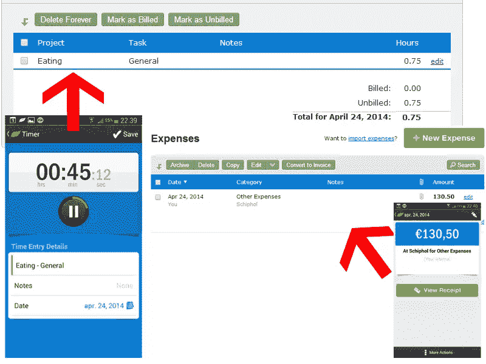

FreshBooks 是唯一一款拥有全功能移动应用的工具。有了这个应用程序，你可以跟踪你的时间，拍下你的发票，并做完整的会计工作。它与桌面版本完美同步，正如你在我的截图中看到的。

### 时间跟踪

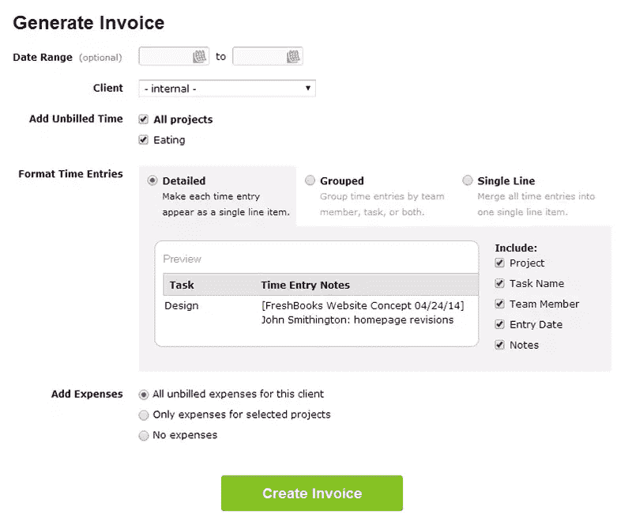

您可以在手机和桌面上使用计时器。任务完成后，您可以将其附加到特定项目、任务和/或客户端。到了付款的时候，你就可以用详细的时间记录开一张发票。

### 邮票

他们把它藏在销售页上，但是你可以直接从新书上购买和使用好的旧邮票和信封，给需要打印发票的客户。你甚至不需要自己打印和发送——这一切都由 FreshBooks 处理，只收取少量费用。

## Zoho 图书公司

Zoho Books 是第二个提供除工资单以外所有功能的竞争者。您可以设置自动银行导入，并轻松对其进行分类。

它的移动应用程序拥有所有必要的功能。它可以用来添加记录，如发票，费用和付款，并允许时间跟踪。

Zoho 有一个定价方案，每个组织每月固定收费 24 美元。

### 为什么选择 Zoho Books？

### 无限一切

这意味着无限的项目，客户，最重要的是:用户。你的员工都可以使用同一个账户，而不需要花费你额外的钱。这对于时间跟踪非常有用。

相比之下，在 FreshBooks 上，每增加一个用户，你每月要支付 10 美元。

### 客户端门户

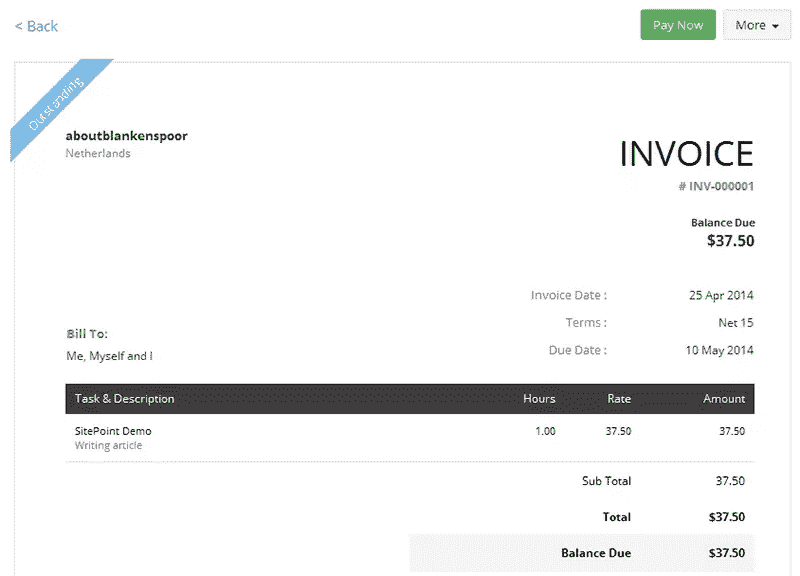

这个很先进。您的客户可以登录查看您的估价和他们的发票。在他们看到您的发票后，它会记录在您的发票历史记录中—您会知道客户何时看到了他们的账单。如果需要，他们甚至可以对您的发票进行评论。

### 交易的自动分类

正常的分类已经完美地执行了(您甚至可以上传每笔交易的收据)。您还可以设置规则来扫描交易的特定细节，并立即对其进行分类。

### 可用性

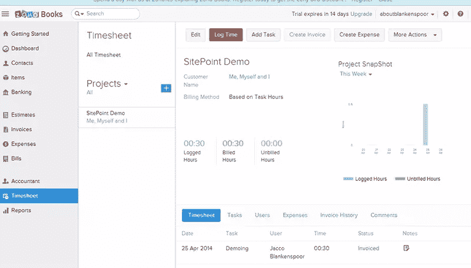

Zoho Books 当然在这一点上得分。这个工具看起来很棒，而且运行完美。一切都有据可查，解释清楚。你真的可以在几分钟内开始。

例如，整个计费过程轻而易举。从跟踪时间到发送最终发票，只需点击几下，看起来棒极了。你甚至可以包括几个不同的支付选项，连接到你的帐户，所以它都运行在自动驾驶。

Zoho Books just *works* ，而且比你想象的还要好。他们的移动应用程序也很棒。总的来说，他们在可用性方面做得非常好。

## QuickBooks

QuickBooks 是最老的一个，当然也是最大的玩家之一。这是一个将带你从创业到数百名员工的解决方案，因为他们提供企业解决方案。

除了时间跟踪之外，QuickBooks 提供了上述所有功能。这很奇怪，因为他们确实有一个应用程序(用于添加条目)。可以用附加，但是这些都是付费的。对于这种基本的、有用的功能来说，这是不必要的。

QuickBooks 提供不同的支付计划，但“基本”计划，目前每月 18.95 美元，对小企业来说应该足够了。工资管理是一种选择，但它的起点是基本工资的两倍，加上每个雇员的成本，*加上每个州的*成本(即挺贵的)。

### 为什么选择 QuickBooks？

### 这是 QuickBooks

与其他工具相比，您的计算机上可能已经安装了 QuickBooks。他们的桌面版本在几年前非常流行，很容易转换成在线 QuickBooks。

我承认这不是一个很有说服力的选择理由，所以让我们来看看 QuickBooks 真正独特的地方。

### 快速导入交易

我用我的 PayPal 账户测试了列表中的每一项服务，QuickBooks 是目前导入交易最快的。这需要几秒钟，而其他人需要几个小时(几十个交易)。

QuickBooks 会自动检查新的事务，以便于查找和处理。

### 报告和仪表板

QuickBooks 提供了出色的报告和漂亮的仪表板，这是完美产品的标志。这里有一张公司快照，向您展示了您的企业多年来的经营状况。

### 供应商

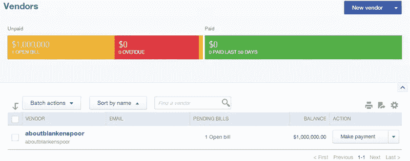

QuickBooks 是唯一允许你列出你的供应商的工具。你甚至可以根据你的欠款或已完成付款的状态来过滤它们。

## less 会计

我总是喜欢用一个声称比其他工具更容易使用的工具来完成一篇评论文章。或者正如 LessAccounting 所说的，他们比其他人吸得少。

LessAcounting 的功能最少:没有移动应用程序，没有工资单，没有集成的时间跟踪。

当谈到他们的销售页面时，他们可以从 Wave 学到很多东西。例如，没有简单的定价或专题页面，试用需要你的信用卡，虽然这对业务可能有好处，但我总是发现一个主要的障碍。

所以基本上他们做的都是会计，他们名字中的“少”代表减少你花在会计上的时间。这是如何实现的？

### 那么，为什么要减少会计呢？

### 更少点击

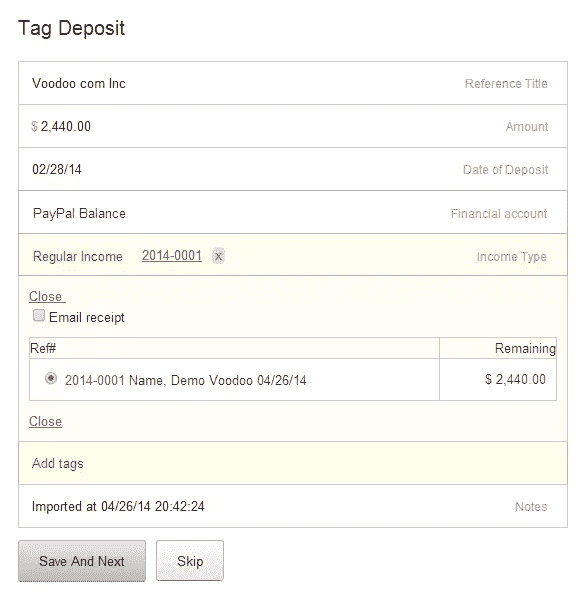

我必须承认，完成基本任务确实需要更少的步骤。例如，将进口付款与未结发票关联。

您可以立即用付款核销发票。听起来很简单，因为确实如此。在这种情况下，只需两次点击，你就完成了，它在每一页上都很容易。

### 较少计数

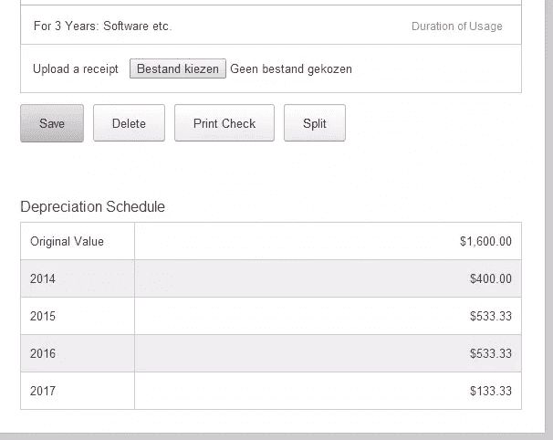

这是我在其他工具中没有见过的:折旧图表。你有几个选项可以选择，折旧就显示在你的交易屏幕上。

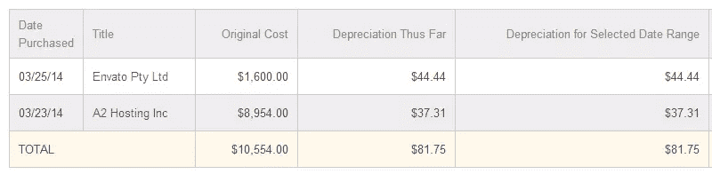

它甚至附有一份报告，这将使你的会计师非常高兴。

### 少猜

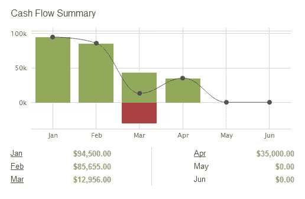

这个现金流量表可以在你的仪表板上找到，就在它应该在的地方。你不需要为此写报告，因为这张图表已经说明了一切。

### 较少里程管理

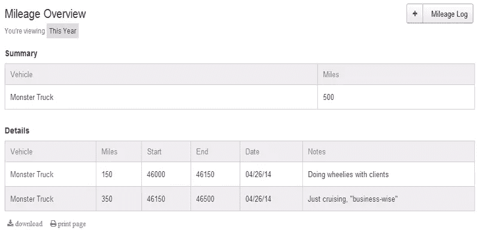

看起来像是会计师制造了这个工具。就像折旧报告一样，这是一个巧妙的功能。

只需添加一辆或多辆汽车，并开始跟踪您的里程。只需在需要时运行报告，就万事大吉了。

## 舍入

在彻底研究了这五个工具之后，很难选择一个整体赢家。他们都有自己的独特之处，使他们脱颖而出。

最后，这完全取决于你喜欢什么。一定要先试一试。

让我知道你对这些工具的看法，以及哪一个是你最喜欢的。

## 分享这篇文章