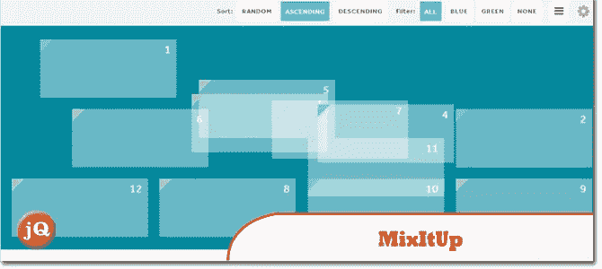
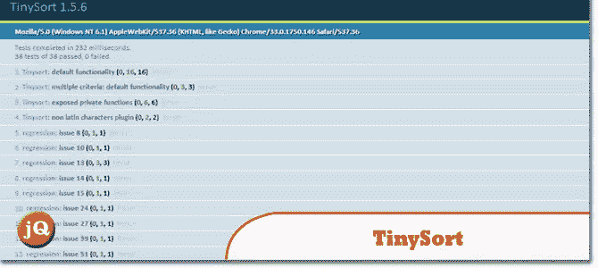
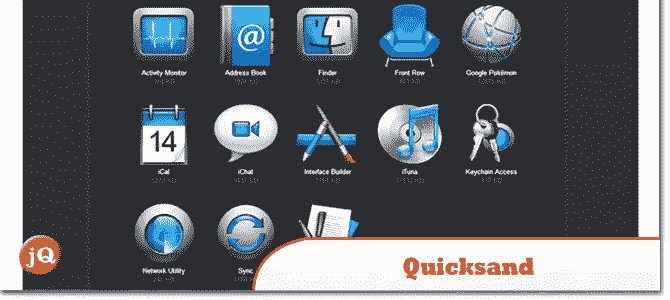
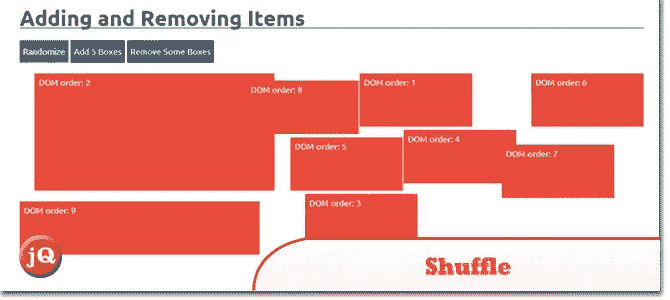

# 我最喜欢的 5 个 jQuery 过滤和排序插件

> 原文：<https://www.sitepoint.com/top-5-jquery-filter-sort-plugins/>

有如此多的 jQuery 插件用于过滤和排序，但这里是我目前最喜欢的五个，它们提供了各种各样的特性和效果。

## 1.同位素

一个[精致的 jQuery 插件](http://isotope.metafizzy.co/demos/fluid-responsive.html)用于神奇的布局。启用过滤、排序和动态布局。

## 2.MixItUp

一个提供动画过滤和排序的 jQuery 插件

## 3.TinySort

一个小而简单的 jQuery 插件,可以根据文本或者属性值，或者子节点的值对任何节点类型进行排序。查看一个[演示](http://tinysort.sjeiti.com/test/unit/)

## 4.流沙

这个插件让你用一个漂亮的洗牌动画来重新排序和过滤项目。查看一个[演示](http://razorjack.net/quicksand/docs-and-demos.html)

## 5.洗牌

一个用于排序、过滤和布局一组项目的 jQuery 插件。它性能好、响应快、速度快。

## 分享这篇文章