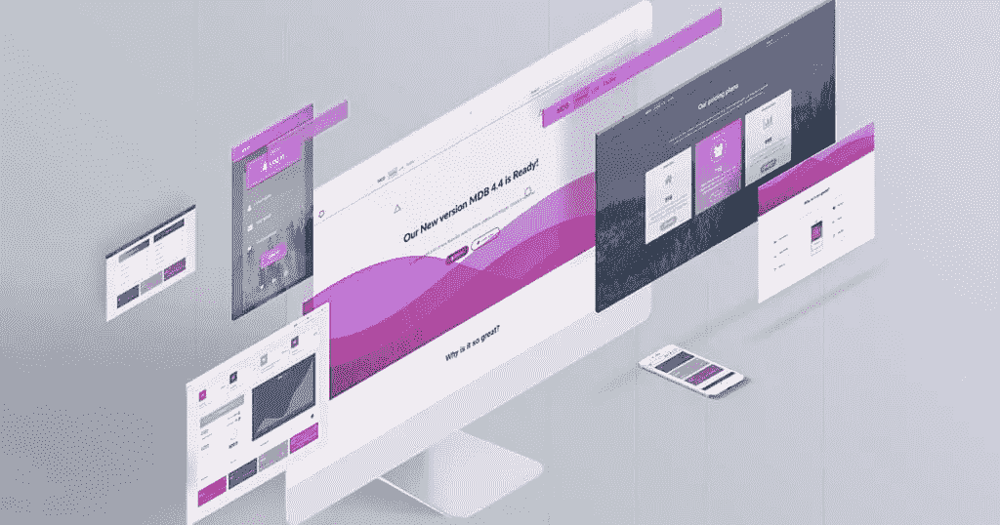
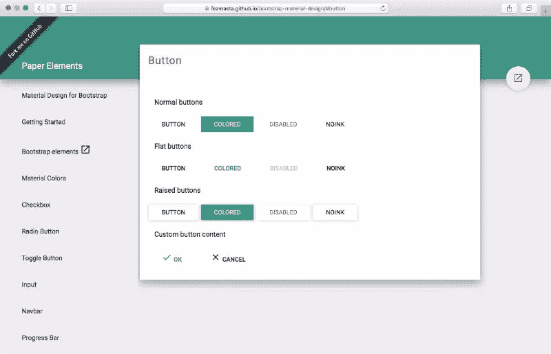
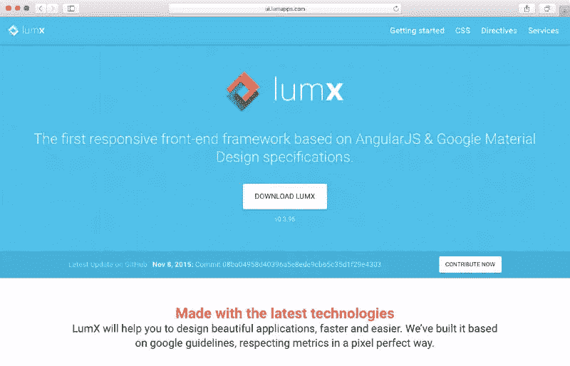
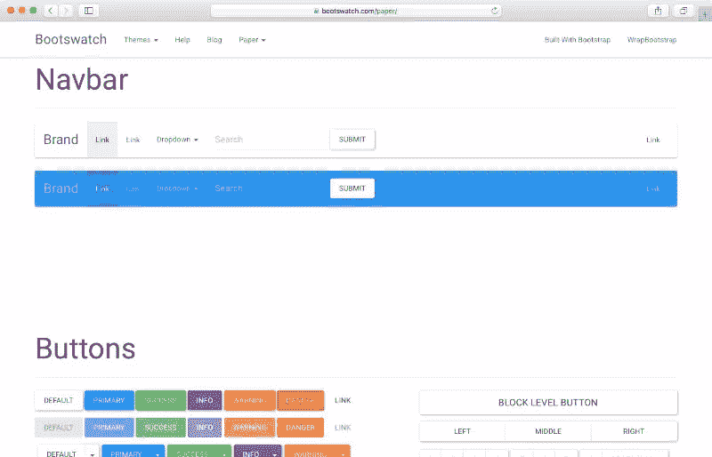

# 2015 年使用的五大材料设计框架——续集！

> 原文：<https://www.sitepoint.com/top-5-material-design-frameworks-use-2015-sequel/>

你现在可能已经知道了， [Material Design](https://www.google.com/design/spec/material-design/introduction.html) (代号量子纸)是 Google 开发的一种设计语言。

今年 5 月，我们发表了一篇名为[2015 年使用的 5 大材料设计框架](https://www.sitepoint.com/top-5-material-design-frameworks-use-2015/)的文章。从那时起，许多新的材料设计框架出现了，相当多的现有框架引起了我们的注意。

所以，这里是我们对其他五个有价值的材料设计框架的重拍，你绝对应该考虑在你的下一个项目中使用。

## 自举的材料设计

[Bootstrap 的材质设计](http://mdbootstrap.com/material-design-for-bootstrap/) (MDB)是一个强大的材质设计 UI 工具包，用于最流行的 HTML、CSS 和 JavaScript 框架——Bootstrap。这是迄今为止我们见过的最全面的材料设计框架之一。

自举的材料设计

该框架包括处理动画、颜色、排版、助手、悬停效果、阴影、图标、组件和 JavaScript 的 CSS。此外，它还提供了徽章、按钮、社交按钮、卡片、页脚、表单、素材框、抓图、分页、面板、视差、进度条、表格、图库和 JavaScript。

这显然是一个令人印象深刻的列表，该框架是功能最完整的产品之一，最适合用于企业级 web 开发项目。

## 铯绿柱石材料

Daemonite 的 [Material UI](http://daemonite.github.io/material/) 是基于 Google Material Design 的全响应、跨平台、前端界面。这个轻量级框架是在 HTML5 中构建的，同样使用了 Bootstrap、JS 和 CSS。

Daemonite 的框架于 6 月 23 日作为开源项目发布，托管在 [GitHub](https://github.com/daemonite/material) 上，目前有大约 1000 名明星，证明了它的受欢迎程度。

<small>达蒙尼特的材料界面</small>

这个框架提供了一个很好的组件(卡片、可折叠区域、下拉菜单、模态和吐司、导航、进度条、标签和平铺)和元素(按钮、表单元素(基本)、表单元素(物化)、图标和表格)的集合。

这是一个非常好的新框架，可以给你流畅的动画和过渡。对我们来说，使框架与众不同的组件是出色的材料日期选择器。试试看[这里](http://daemonite.github.io/material/ui-form-adv.html)。

## Fezvrasta 的自举材料设计

这个 [Bootstrap 主题](https://fezvrasta.github.io/bootstrap-material-design/)是将新材料设计准则整合到基于 Bootstrap 3 的应用中的最简单的方法之一。这个项目是开源的，它的知识库托管在 [GitHub](https://github.com/FezVrasta/bootstrap-material-design) 上，有大约 13200 颗星的批准。

<small>FEZVRASTA 的材料设计</small>

但是，请注意，该主题的存储库会发出警告:

> 这个主题仍在开发中，它可以在制作网站上使用，但我不能保证与以前的版本兼容。

由于这一点，我可能不会建议你在目前将重要的项目提交给这个主题。但是，你以后一定要注意这一点。

## lumX 材料设计

[lumX Material Design](http://ui.lumapps.com) 是首个基于 angular js&Google Material Design 规范的响应式前端框架。它的 [GitHub 知识库](https://github.com/lumapps/lumX)有大约 1300 颗星星，他们表示 lumX 将帮助你更快更容易地设计你的应用。

<small>lumX 材料设计</small>

它的 CSS 比一些较大的框架要轻，但是包括了通用的混合、排版、颜色、Flexbox、按钮、浮动、动作按钮、图标、列表、数据表、卡片、复选框、单选按钮、开关和工具栏。它也是一个稳定的框架，可以证明是 web 开发项目的一个好选择。

## 鞋样纸

Bootswatch 的[论文](http://bootswatch.com/paper/)与其说是框架，不如说是 Bootstrap 的材料设计*改编*。基本上是 Bootstrap 的免费主题集合。这个项目在 GitHub 上有大约 6680 颗星星，它的知识库可以在[这里](https://github.com/thomaspark/bootswatch)找到。

<small>boots 沃琪的纸</small>

尽管 Bootswatch 的 Paper 主题提供的多样性和功能比其他框架少得多，但它仍然是一个稳定的框架，具有平滑的过渡和动画。Paper 提供了导航条、按钮、排版、表格、表单、导航、指示器、进度、工具条、容器和对话框的演示。主题是好的，但这个主题没有什么与众不同或独特之处值得一提。

## 判决

2015 年见证了优秀材料设计框架数量的爆炸式增长。随着选择越来越多，决定哪一个最适合您的项目变得越来越困难。

如果你正在寻找一个 UI 密集型项目或者想要设计的完整性，我认为 Bootstrap 的材料设计是目前你最好的选择。

然而，人们不能真正忘记 Daemonic Material 中漂亮的 Material Datepicker 实现。

你最好的选择是要么选择本文提到的五个框架中的任何一个，要么选择前一篇文章中的五个框架。我们知道，所有这些框架都被开发人员广泛使用，并因频繁的发布周期和良好的文档而稳定。

*你对上述框架有什么想法？有没有发现其他值得使用的材质设计框架？*

## 分享这篇文章