# 项目管理的五大工具

> 原文：<https://www.sitepoint.com/top-5-tools-for-project-management/>

无论你是独自工作还是在团队中工作，密切关注你的项目是很重要的。项目管理工具旨在帮助您跟踪您的任务、团队成员和客户。

我们已经看了[前五名时间跟踪](https://www.sitepoint.com/5-time-tracking-tools-web-addicted-freelancers/)和[前五名 CRM 工具](https://www.sitepoint.com/top-5-crm-tools-freelancers-small-businesses/)，所以让我们对项目管理工具做同样的事情。

我根据受欢迎程度和读者的建议选择了这些工具，然后对它们的功能和可用性进行了比较。

所有列出的工具都提供免费试用或免费计划，因此您可以自己试用。

## [基地营](https://basecamp.com/)

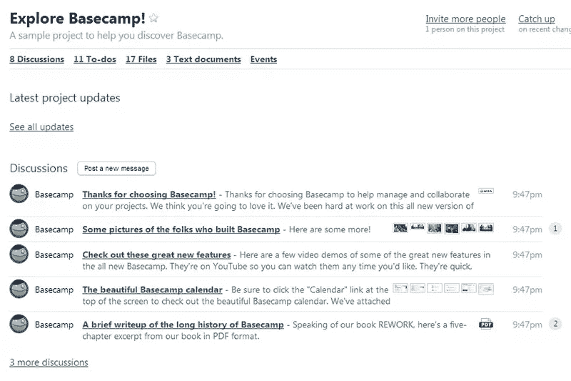

Basecamp 是最流行的项目管理工具之一。超过 285，000 家公司已经在使用它，而且每个月还有数千家公司在注册。不管你怎么看，那都令人印象深刻。

人们喜欢 Basecamp 的可用性，当您注册并加载示例项目时，很容易明白为什么。导航很简单，你可以马上开始使用 Basecamp。

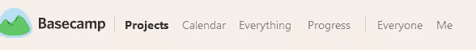

Basecamp 非常容易使用，你可能会想知道这是否真的是它的全部。不过，是的，导航里都有。

你可能会注意到导航中的 Everything 按钮，它给你一个页面视图，嗯，一切。一旦你熟悉了 Basecamp，它就没那么有用了，但这是个不错的尝试。

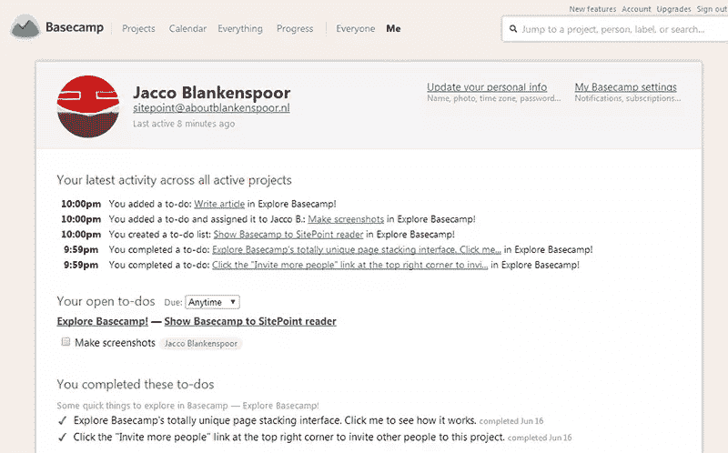

我个人喜欢“我”屏幕，它可以一目了然地显示你的所有活动，包括你正在处理的任务、你发布的消息和你添加的文件。

不幸的是，Basecamp 并不完美。你不能给多个用户分配一个任务，奇怪的是，没有可视化的报告。

定价非常简单，10 个项目每月 20 美元起，用户数量不限，存储容量为 3 GB。

## [体式](https://asana.com/)

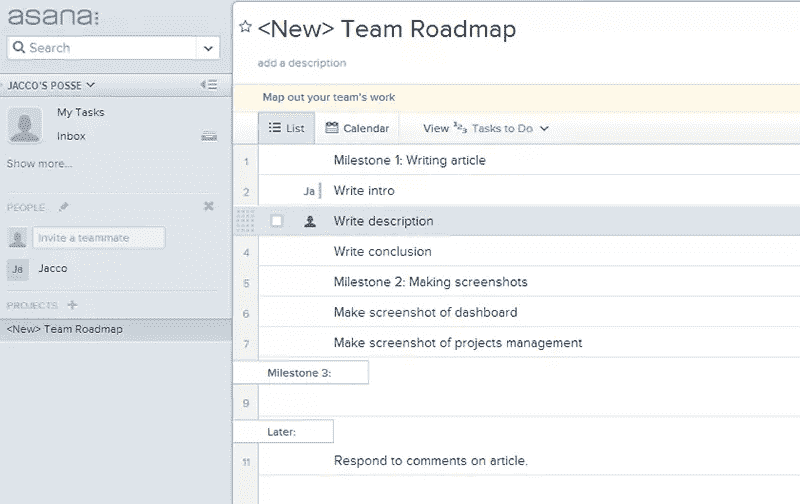

另一只顶级犬 Asana 采取了完全不同的方法。

要开始 Asana，您需要创建一个新项目并为其选择一个模板。模板包括 bug 搜索列表、基于里程碑的任务列表和想法列表。您也可以放弃模板，从一张白纸开始。

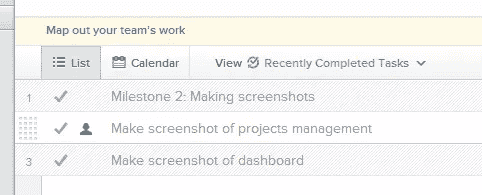

我选择了 milestone 模板，它允许添加按里程碑分组的任务。您可以轻松地将任务标记为已完成，或者完成里程碑本身。

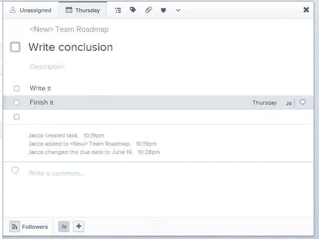

如果你只使用主任务列表，体式看起来有点稀疏。但是每个任务旁边都有一个小箭头，点击箭头会弹出一个新的屏幕，真正的奇迹就在这里发生了。在这里，您可以将顶层任务分解成子任务，并将它们分配给不同的人。您可以指定截止日期并添加文件或注释。其他用户甚至可以“喜欢”某个任务，或者“关注”某个特定用户以保持最新状态。

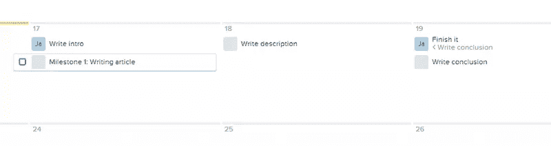

Asana 还提供了一个内置的日历，给你一个你自己或你的团队任务的可视化概述。日历支持与 Outlook 和谷歌日历同步。还有一个收件箱可以帮助你保持更新。

体式需要一些时间来适应，因为它有很多实际上很方便的小功能。但是一旦你掌握了它，它就是团队协作的一个很好的工具。

Asana 附带一个免费计划，支持多达 15 个用户。之后，价格急剧上升:50 个用户每月花费 300 美元，而你要为 100 个团队成员支付 800 美元。

## [波迪奥](https://podio.com/site)

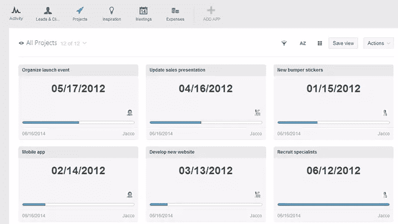

我在我的[五大 CRM 工具文章](https://www.sitepoint.com/top-5-crm-tools-freelancers-small-businesses/)中提到了 Podio，但是因为它主要是一个项目管理工具，所以我决定在这里也包括它。

Podio 实际上是一个应用程序的集合，但项目管理是其中更重要的一个。

选择 projects 部分后，您会看到当前所有项目的视图。

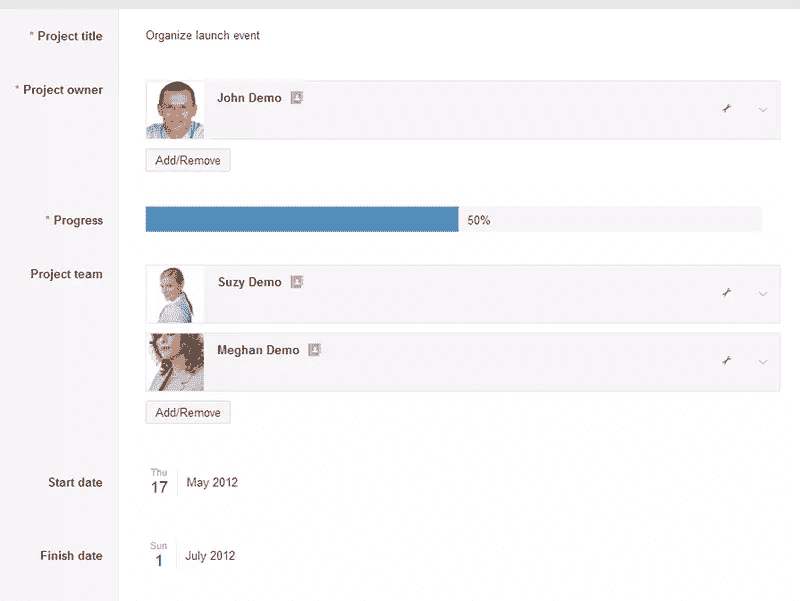

每个项目都有自己的进度条，点击它会显示成员、任务和日期的列表。您甚至可以将特定项目的费用直接添加到该卡中。

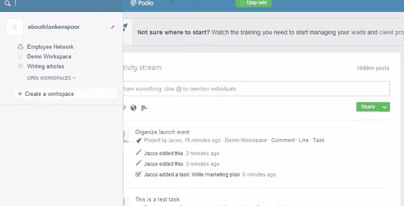

Podio 有一个很好的方式来展示谁参与了每个项目，包括指定的项目所有者。您可以在不同的工作空间对项目进行分组，并且很容易跟踪活动。这是当前将社交功能集成到企业工具中的趋势的一个很好的例子。

不过 Podio 也有一些缺点，导航是主要的缺点。这可能是一个有点缓慢和混乱的方式。通常，您会意识到您只是不小心导航回了仪表板，而不是仅仅跳回一页，然后当仪表板重新加载时，您不得不等待更长的时间。

Podio 对最多 5 个用户免费。额外用户每月 9 美元。

## 桑德格雷兹

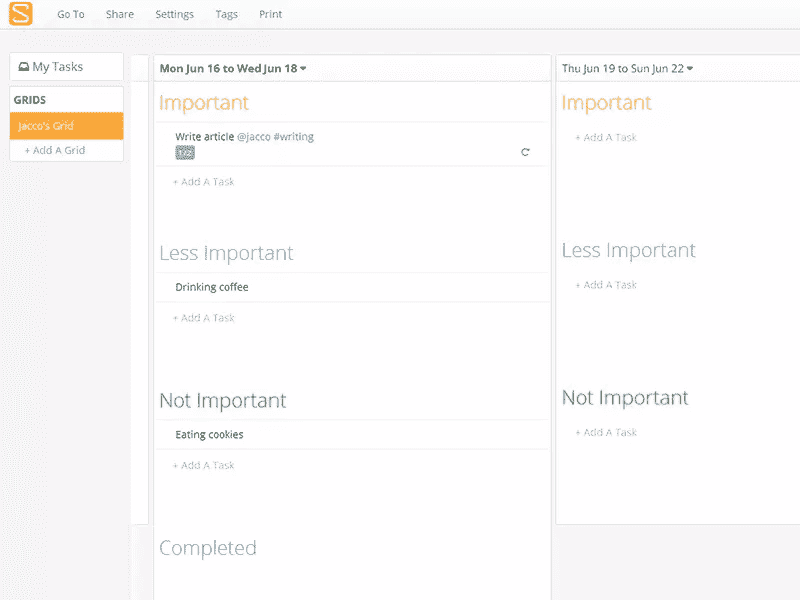

一位读者建议的 Sandglaz 是一个新工具，还没有很大的用户群，但它看起来肯定很有前途。

Sandglaz 基本上是一个任务列表豪华版，如果你正在寻找纯粹的任务管理，Sandglaz 是一个极好的选择。很容易直接开始使用它。如果你知道如何使用 Outlook 中的任务，你就不会有任何问题。

另一个优势是它可以帮助你区分任务的优先级。有些任务很关键，而有些任务完成起来很好，但不那么重要。Sandglaz 提供了一个不重要的部分，在那里你可以放下这些不太重要的任务，你可以在业余时间去做。

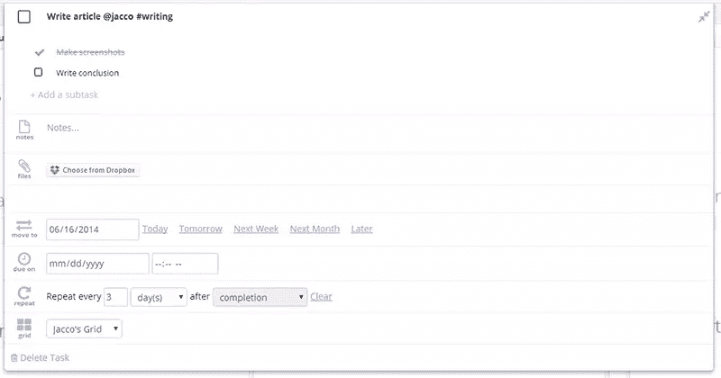

任务可以组合在网格中，每个任务都有自己的截止日期和子任务。您可以设置周期性任务，或者轻松地将任务移到不同的日期。

但是你也可以设定一个任务*必须*完成的截止日期(这样你就不能再推迟了)。这是确保任务完成同时保持灵活性的好方法。

如果你忘记将未完成的任务转移到第二天，Sandglaz 会帮你完成，这样你就不会错过。

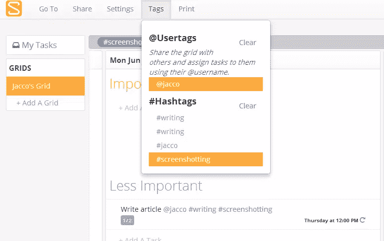

过滤你的任务或用户是通过@mentions 和#hashtags 来完成的。虽然我自己并不喜欢这些(也许我是个老古董)，但 Sandglaz 确实以一种方便的方式跟踪你的用户和散列标签。你只需要确保你的团队不会对他们失去控制，这样你就可以保持你的列表有条不紊。

Sandglaz 的价格是每个队员每月 5 美元。不幸的是，没有免费的计划。

## 特雷罗

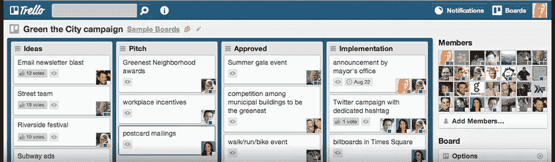

对于一种不同的——但很棒的——项目管理方式，我们最终求助于特雷罗。

Trello 是 SitePoint 用来跟踪我们每个月发布的几十篇文章并管理多个作家和编辑团队工作的工具。

Trello 分为板、柱和卡。这些是灵活的，允许您定义自己的工作流程。

在我们的例子中，我们为网站的每个部分使用一个单独的板，每个专栏代表一篇文章生命中的一个步骤，从概念到出版。

这是一个开放的空间环境，所以作家可以通过跳进去评论一张卡片来互相帮助。因为你可以为不同的主题使用不同的版块(或者像 SitePoint 那样的频道)，它永远不会变得杂乱。

在 SitePoint 的例子中，每张卡片代表一篇文章。团队成员可以将自己分配到卡片上，以显示他们正在处理某个项目。随着工作的进展，他们也可以订阅论坛以获得更新。

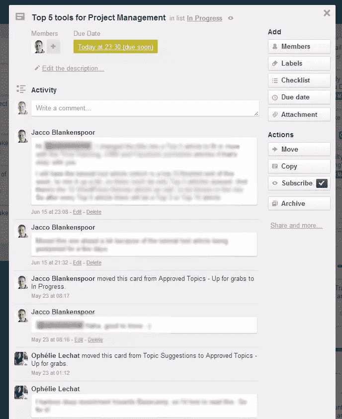

在每张卡片上，你可以添加一个截止日期，贴上彩色标签并附上文件。您可以使用评论来与其他订户交流、投票支持卡片或将其分配给其他成员。您还可以为子任务添加清单，并使用进度条完成。在每张卡片的底部是自卡片创建以来所做的所有更改的历史记录，这使得当您被分配到一项任务时可以很容易地跟上进度。

最后但并非最不重要的是，Trello 为 Android、iOS 和 Windows 提供了优秀的应用程序，因此你可以从手机或平板电脑上工作。

Trello 可以免费使用上述所有功能，用户数量不限。

他们还提供付费计划，增加了一些额外功能(例如自定义表情符号)和更严格的安全性。付费计划的价格是每个用户每月 5 美元。

## 结论

如你所见，有许多不同的方法来跟踪你的项目。

哪一个最适合你的团队工作方式？我们错过了你最喜欢的工具吗？

留下评论让我们知道！

## 分享这篇文章