# Android Studio 的 8 大插件

> 原文：<https://www.sitepoint.com/top-8-plugins-android-studio/>

[Android Studio](http://developer.android.com/tools/studio/index.html) 现在是谷歌官方 IDE，专为原生 Android 应用开发而设计。基于 JetBrains 的 [IntelliJ IDEA](https://www.jetbrains.com/idea/) ，它在 Google I/O 2013 上首次宣布作为 Eclipse 的继任者，并受到 Android 社区的普遍欢迎。经过漫长的测试阶段，最终版本于去年 12 月发布。

Android Studio 是一个功能齐全的开发环境，配备了为所有设备(从智能手表到汽车)开发 Android 应用程序所需的一切。总有改进的空间，Android Studio 提供了对第三方插件的支持，本文将列出一些最有用的插件。

## 1.硬件加速执行管理器

H.对于使用 Android 模拟器的开发人员来说，A.X.M 是更快执行应用程序的最佳方式。H.A.X.M 为英特尔系统上的 Android SDK 仿真器提供硬件加速。它使用基于虚拟化硬件 VT-X 构建的英特尔虚拟化技术(英特尔 VT)。这意味着处理器支持虚拟化，能够以最快的方式在模拟的 Android 环境中运行应用。我认为 H.A.X.M 是一个 Android 开发者可以拥有的最有用的插件，可以在模拟器上尽快运行最新的 Android 版本。

### 安装 H.a.X.M

打开 Android SDK 管理器，选择“英特尔 x86 模拟器加速器(HAXM 安装程序)”，接受许可证并安装软件包。

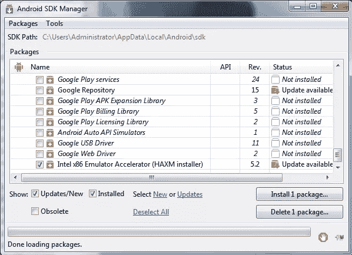

该进程已经下载了软件包，但没有安装 H.A.X.M .要完成安装，请转至上图所示的 SDK 路径`C:\Users\Administrator\AppData\Local\Android\sdk\`(此安装在 Windows 机器上)并尝试找到下载文件夹。我的是`C:\Users\Administrator\AppData\Local\Android\sdk\extras\intel`。打开安装文件夹`Hardware_Accelerated_Execution_Manager`，点击可执行文件`intelhaxm-android`，继续安装。安装完成后，您就可以使用模拟器了。


## 2.精灵尘！精灵尘！精灵尘！精灵尘！精灵尘！精灵尘！精灵尘！精灵尘！精灵尘！精灵尘！精灵尘！精灵尘！精灵尘！精灵尘！精灵尘！精灵尘


Genymotion 是测试您的 Android 应用程序的终极工具，使您能够运行 Android 的定制版本。它是为在 VirtualBox 中执行而构建的，配备了与虚拟 Android 环境交互所需的一整套传感器和功能。使用 Genymotion，您可以在各种虚拟开发设备上测试您的 Android 应用程序，它的模拟器比默认模拟器快得多。

每一个想要确保他们的应用程序在每一个支持的设备上都能流畅运行，并且在排除特定设备错误时有困难的开发者都应该使用这个伟大的插件。

要安装 Genymotion，请遵循我们之前的教程。

## 3.Android 可绘制导入程序

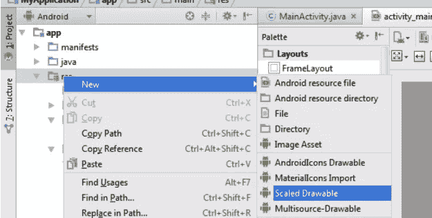

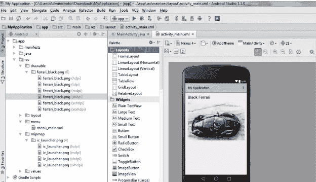

为了适应所有的 Android 屏幕尺寸和密度，每个 Android 项目都包含了 *drawable* 文件夹。任何有 Android 开发经验的开发者都知道，为了支持所有的屏幕尺寸，你必须为每种屏幕类型导入不同的 drawables。Android Drawable Importer 让这项工作变得更加容易。它减少了将缩放图像导入 Android 项目所需的工作量。Android Drawable Importer 增加了一个选项，可以导入不同分辨率的可绘制图像，或者将指定的图像缩放到定义的分辨率。这个插件加速了每个开发者的工作。

### 要安装 Drawable Importer:

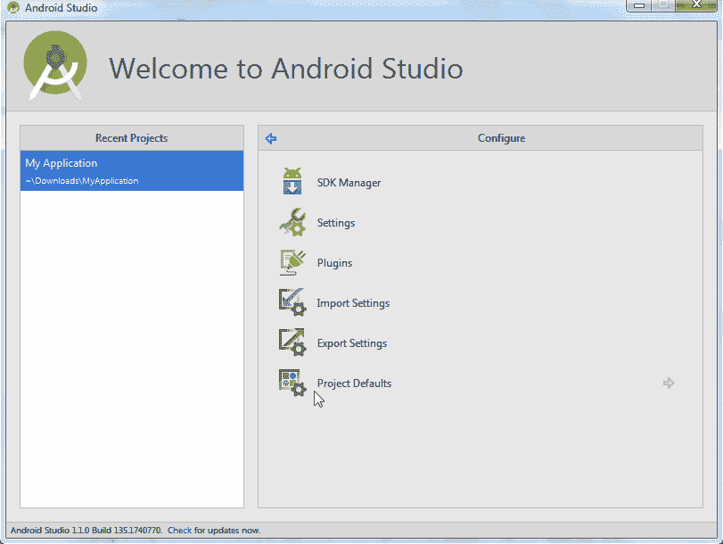

## 4.Android ButterKnife Zelezny

Android ButterKnife 是一个“用于 Android 的视图注入库”。它提供了一个更好的代码视图，使其可读性更好。ButterKnife 允许您专注于逻辑，而不是查找视图或添加侦听器的粘合代码。使用 ButterKnife 编程时，您必须对任意对象执行注入，它们采用以下形式:

```
@InjectView(R.id.title) TextView title;
```

如果有一两个注入，编写它们不是问题，但是如果有更多，就需要引用所有的布局 XML 来编写源文件。

Android ButterKnife Zelezny 是一个 Android Studio 插件，用于从活动、片段或适配器中选择的布局 XML 生成 ButterKnife 注入。该插件将提供生成 XML 对象注入的最快方法。

以下是使用 Android ButterKnife 之前代码的外观示例:

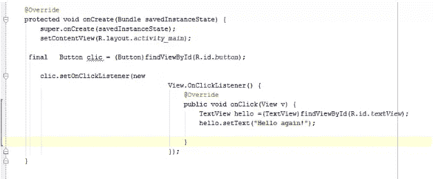

之后:

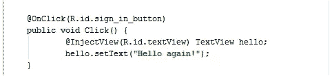

### 要安装 ButterKnife Zelezny:

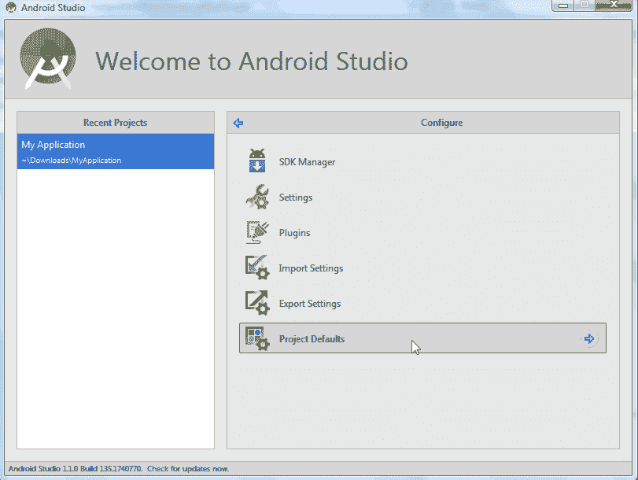

## 5.安卓赫萝颜色生成器

要开发 Android 应用程序，你需要一个出色的设计和布局。Android 赫萝颜色生成器是定制您的 Android 应用程序的最简单的方法，符合您自己的喜好。Android 赫萝颜色生成器是一个插件，允许你为自己的应用程序创建 Android 布局组件。这个插件将生成所有必要的与 XML drawables 和样式相关的资产，以便在您的项目中使用。

### 要安装赫萝颜色生成器:

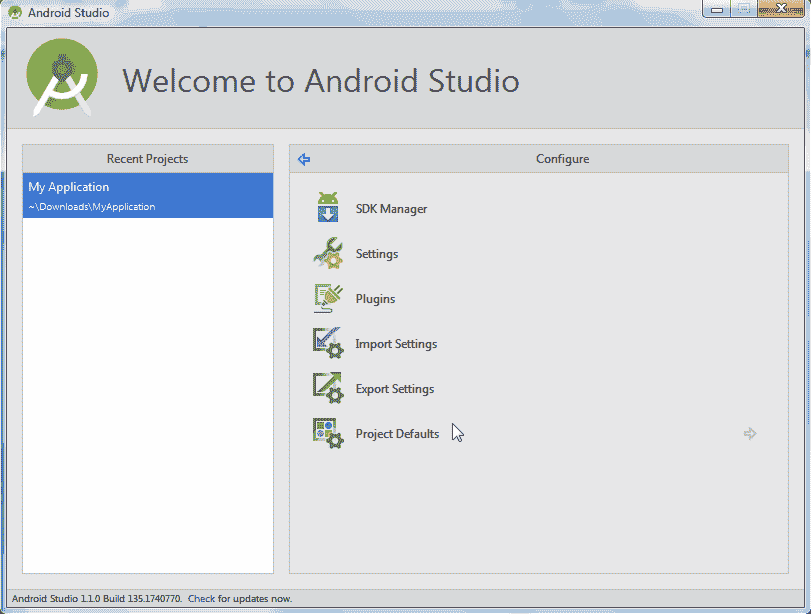

## 6.机器人记录器

Robotium Recorder 是一个测试自动化框架，用于在模拟器和 Android 设备上测试本地和混合移动应用程序。使用 Robotium Recorder 可以记录测试案例和用户操作。您可以在不同的 Android 活动上查看系统和用户测试场景的功能。

使用 Robotium Recorder，您可以看到应用程序在您的设备上运行时发生了什么，它是否按预期工作，或者它是否对用户操作做出了正确的反应。对于每个希望开发稳定的 Android 应用程序的人来说，这个插件有助于彻底的测试。

以下是 Robotium Recorder 上记录的我的应用示例:

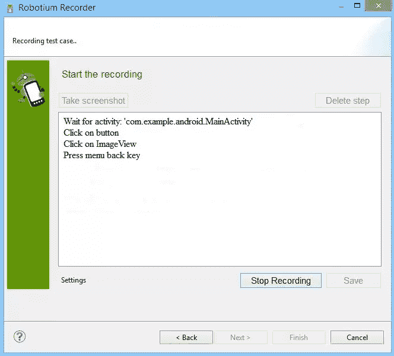

要安装 Robotium Recorder，请访问[官方页面](http://robotium.com)，并在安装部分根据您的操作系统选择 Robotium Recorder 的版本。

## 7.吉姆镜报

Android Studio 配备了可视化布局编辑器，但布局的静态预览可能还不够。使用静态预览是不可能预览动画，颜色和触摸区域的，所以吉姆镜像是一个插件，允许你在真实设备上测试你的布局。吉姆镜像可以让你在设备上预览 Android 布局，随着你的代码更新。这个插件在你开始编码之前提供了一个真实的环境。

### 要安装吉姆镜像:

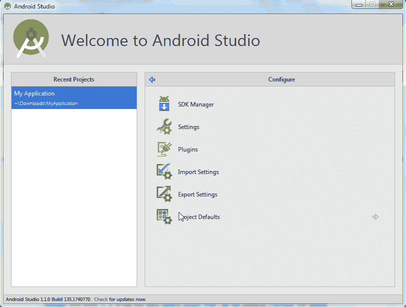

## 8.字符串-Xml-工具

Strings-xml-tools 是一个小而有用的插件，可以用来管理 Android 项目中的字符串资源。它提供了对 Android 本地化文件中的条目进行排序和添加缺失字符串的基本操作。该插件是有限的，但如果你的应用程序有大量的字符串资源，这个插件可能会有所帮助。

### 要安装 Android Strings.xml 工具:

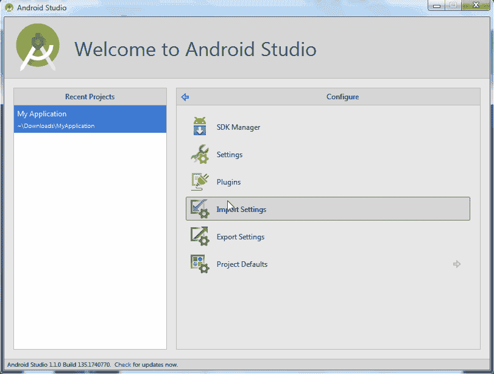

*渴望更多？瓦尔迪奥在这里写了一篇后续文章[。](https://www.sitepoint.com/9-more-essential-plugins-for-android-studio/)*

## 分享这篇文章