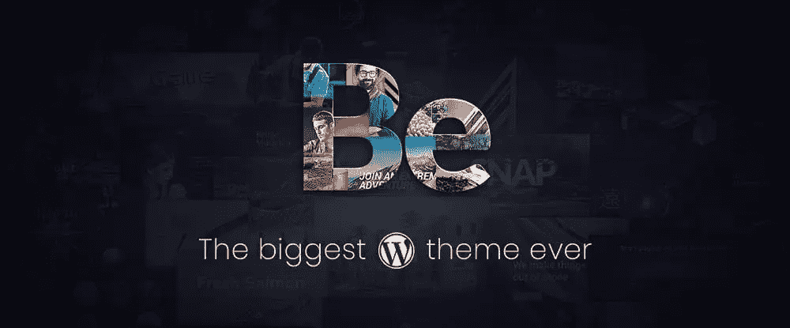
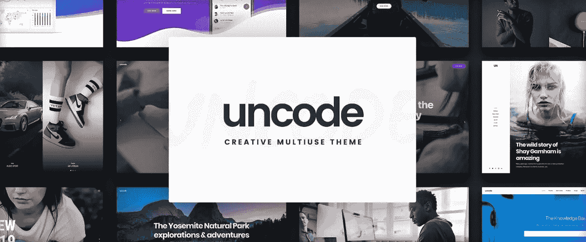
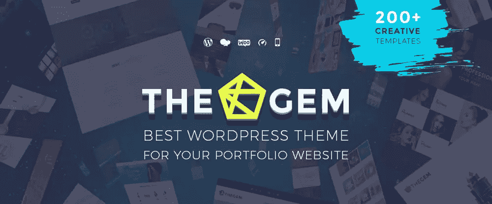
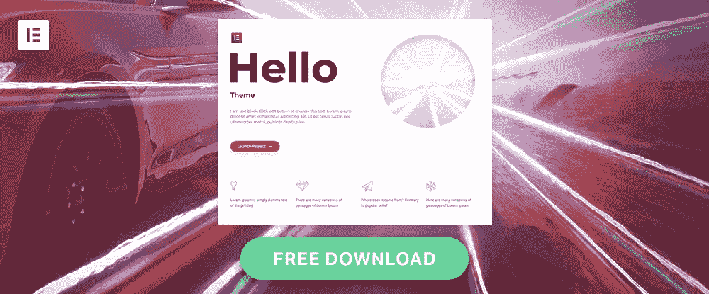
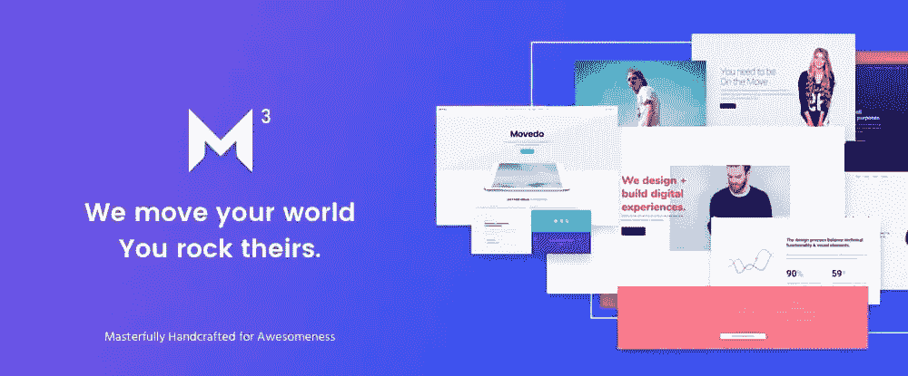
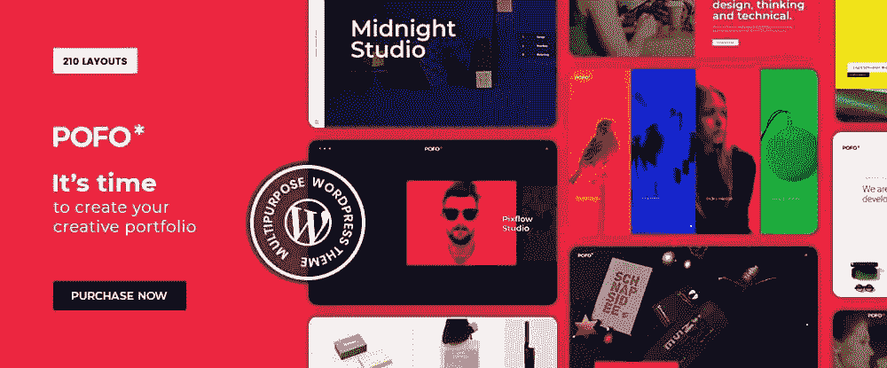

# 2019 年 8 大创意组合 WordPress 主题

> 原文：<https://www.sitepoint.com/top-8-portfolio-wordpress-themes-for-creatives-in-2019/>

*这篇赞助文章由我们的内容合作伙伴 [BAW 媒体](https://bawmedia.com)创作。感谢您对使 SitePoint 成为可能的合作伙伴的支持。*

创建一个像样的投资组合需要涵盖很多基础。展示你的作品可能实际上是最容易的部分；同时确保每一篇文章的文字都给出了恰当的上下文可能是一个挑战。它必须抓住人们的注意力，同时又不转移人们对作品本身的注意力。

你可以用很多主题来创建一个像样的作品集网站，但是如果你不确定你可能需要的功能，找到一个满意的会很困难。如果你的目标是创建一个不仅仅是“体面”的投资组合网站，你的搜索会更加困难。

你需要一个主题来提供一个简单的方法来组织你的工作，一个捆绑了插件的好组合的主题，一个能让你创造出可以与世界分享的东西的主题。

有很多可用的 WordPress 主题，包括我们准备的列表中最好的主题。

## 1.[成为主题](https://themes.muffingroup.com/be/splash/?utm_source=sitepoint.com&utm_medium=content&utm_campaign=top_portfolio_wp_themes)

Be Theme 拥有 web 设计人员构建高质量组合网站和任何其他类型网站所需的所有特性、功能和设计选项。由于它选择了 450 多个可定制的预建网站，它的 200 多个短代码库加上一个短代码生成器，您可以在 4 小时或更短的时间内创建一个非常棒的组合网站，完全不需要编码。

Be 主题，市场上最大的多功能 WordPress 主题是任何人的理想选择，无论他们的组合网站是第一次尝试，或者如果用户是一个成熟的网页设计专业人士。

Be Theme 的预建网站涵盖 30 多个行业领域和所有主要网站类型，从博客和作品集到企业或创意网站，再到一页纸。对于设计机构，或者任何寻找理想的投资组合构建工具的企业或个人来说，BeAgency 预建的 WordPress 主题将是一个极好的选择。

还有很多其他的；只需浏览图书馆，找到最适合你的。Be 主题是搜索引擎友好，响应迅速，并提供出色的支持。

## 2.钾

钾是用优雅来编码的。这个 WordPress 是由一个强大的精英作者为程序员和设计者创建的。它对开发者友好，但作为一个网页设计师，你会发现它很容易使用。

您将能够在 30 多种不同的作品集项目类型(七种主要类型和子选项)中进行选择，创建一个作品集网站，以您第一次使用时一直想要的方式展示您的作品，而无需您进行任何编码。

在顶级主题中排名最高，Kalium 提供了超越其擅长的组合网站设计的无限可能性。只需一次点击，您就可以从任何高质量的演示中克隆内容，此外还有丰富的布局设计、高级字体、捆绑插件和拖放内容元素可供使用。

## 3.[未编码](https://undsgn.com/uncode/?utm_source=sitepoint.com&utm_medium=content&utm_campaign=top_portfolio_wp_themes)

当一个有创意的 WordPress 主题包含了你所需要的一切，特别是如果你有一个作品集网站，这是值得仔细考虑的。Uncode 是 ThemeForest 有史以来最畅销的书籍之一，销量超过 50，000 本，虽然它绝对是首要的多用途创意主题，但公平地说，它的真正优势在于博客和组合网站设计，尽管你肯定可以将在线商店添加到列表中。

这个主题是挤满了布局模式，包括砖石/同位素和旋转木马，它具有先进的网格系统，移动人群的中心移动菜单功能，以及级联选项系统，让你难以置信的控制你的内容和布局。

要了解 Uncode 能为您做什么，请访问他们的网站并浏览用户创建的网站库。准备好接受感动和启发吧。

## 4.[宝石](https://codex-themes.com/thegem/meta-splash-preview/?sort_priority_group=meta-portfolio&utm_source=baw&utm_medium=post&utm_campaign=baw-portfolio)

在投资组合构建特性和能力方面，Gem 没有任何保留。如果你能创建的投资组合类型确实有任何设计限制，你将不得不寻找它们。

例如:TheGem 具有 20 多种灵活的组合布局、可变的文本对齐、灵活的网格系统、多列、间隙大小、加载、分页、悬停和动画选项。

## 5.[桥](https://qodeinteractive.com/wordpress-theme/bridge-creative-multi-purpose-wordpress-theme/?utm_source=baw&utm_medium=link&utm_campaign=bridge)

《桥》是最畅销的创意主题森林，适合任何人。使用 Bridge，您可以设计任何类型的网站，无论是商业网站还是个人网站。

这自然包括作品集网站，在那里你有将近 400 个演示，以及大量的布局风格、设计元素和模块、插件和滑块。超过 110，000 名满意的客户可以证明 Bridge 的卓越功能及其五星级支持。

## 6.[你好](https://elementor.com/hello-theme/?utm_source=sitepoint.com&utm_medium=pr&utm_campaign=bawmedia)

Hello 超级快速、免费、友好，是 Elementor 的理想主题。事实上，当 Elementor 更新时，大部分测试都是使用 Hello 完成的。

Hello 支持所有流行的 WordPress 插件，不会和任何一个冲突；由于它是轻量级和开源的，Hello 是一个没有边界的主题。

## 7. [Movedo WP 主题——我们的确改变了你的世界](https://themeforest.net/item/movedo-we-do-move-your-world/17923709?utm_source=bawmedia&utm_campaign=bawmedia_campaign)

Movedo rocks！没有别的说法了。当这个创造性的、多用途的主题的作者把它放在一起时，他们心里一定有一个很棒的想法。功能包括超级可塑的排版，超动态视差，图像似乎在移动，但不是，以及一系列其他好东西，你可以访问这些东西来建立一个与众不同的投资组合网站。

如果你的目的是创造伟大的东西，没有规定说你不能从中得到乐趣。

## 8. [Pofo](https://wpdemos.themezaa.com/pofo/?utm_source=sitepoint.com&utm_medium=content&utm_campaign=top_portfolio_wp_themes)

Pofo 是一个创造性的功能丰富的多用途主题，强调博客，投资组合和电子商务网站设计。它的功能包括 WPBakery 页面生成器，150 多个预建的设计元素，超过 25 个主页和 200 多个演示页面，只需单击一下即可导入。

如果用户愿意，他们可以导入自己的演示。Pofo 非常快速、灵活，并且经过了 SEO 优化。

## 结论

当你有一百个左右的多功能主题，这些主题具有创建像样的作品集网站的必要特征和能力时，找到正确的主题可能是一个挑战。在找到一个最适合你的之前，你可能要尝试几个。

当数量减少到 8 个时就容易多了。这仍然是一个挑战，因为这 8 个主题中的每一个似乎在某些方面都比其他的更好。这是一个不能失败的提议。选择一个你认为适合你的，然后出发吧！

## 分享这篇文章