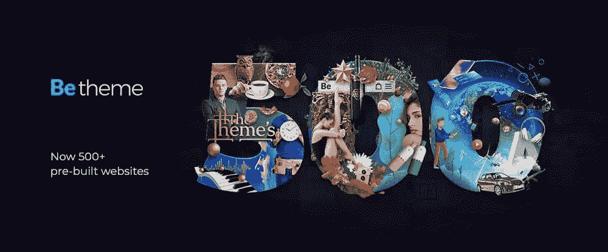
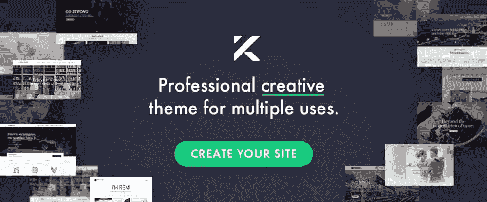
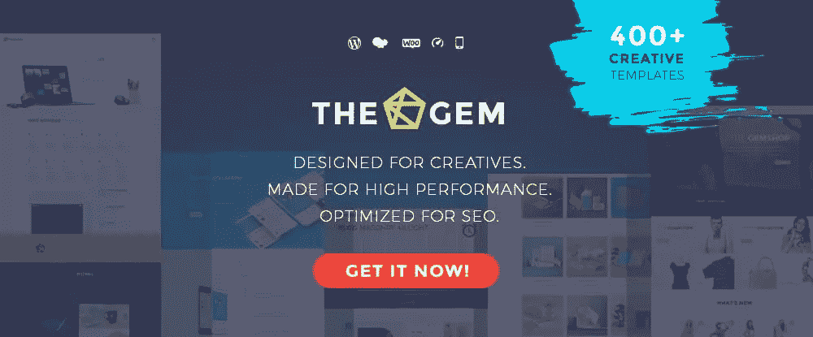
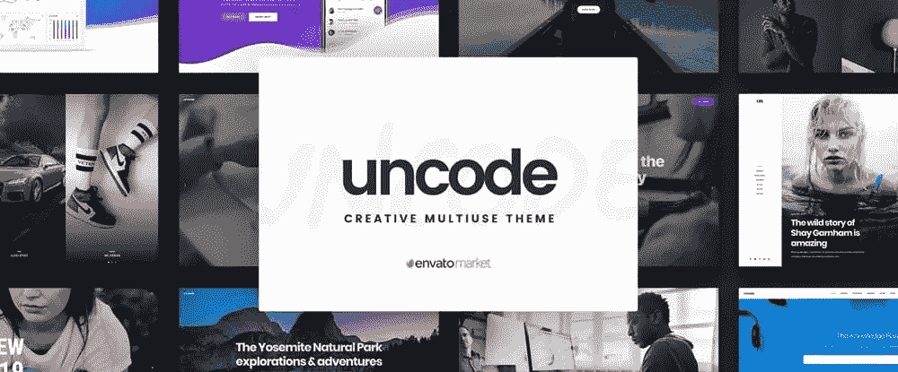
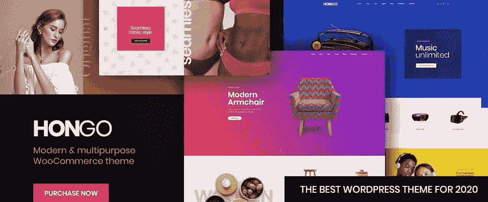
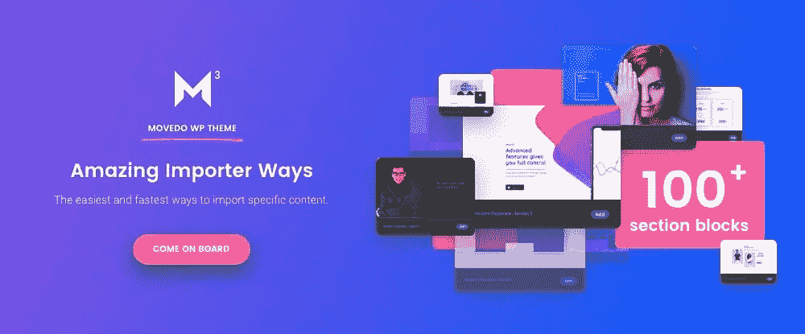

# 8 大 WordPress 多用途主题和它们的酷功能

> 原文：<https://www.sitepoint.com/top-wordpress-multipurpose-themes/>

*这篇赞助文章由我们的内容合作伙伴 [BAW 媒体](https://bawmedia.com)创作。感谢您对使 SitePoint 成为可能的合作伙伴的支持。*

一些人把多用途的 WordPress 主题视为网站建设工具，可以完成很多事情，但也有其局限性。

他们的论点是多用途主题分散得太开了。这就好比说，如果你能把一件事做得很好，那两件事你只能做一半。

那根本站不住脚。今天的多用途主题——尤其是像下面描述的那些顶级主题——几乎可以管理任何你向他们抛出的网站建设挑战，并满足你最大的期望——每一次。

既然百闻不如一见，我们建议您仔细研究以下主题，并尝试一两个主题！

你不会失望的。

## 1.[BeTheme–响应式多功能 WordPress 主题](https://themes.muffingroup.com/be/splash/?utm_source=sitepoint.com&utm_medium=content&utm_campaign=multipurposewp20)

我们将从最大的 WordPress 主题开始。BeTheme 的 500 多个网站中的任何一个都可以毫不费力地启动网站建设项目。它们是可定制的，所以一旦你替换了你自己的内容，网站建设工作就快完成了。

这些预建的网站

*   可定制
*   涵盖 30 多个行业领域、众多商业领域和每种网站类型
*   很有吸引力，并且具有专业设计的布局
*   有内置的 UX 功能，订阅最新的 UX 趋势

预建的网站集只是 BeTheme 的 40 多个核心功能之一，这些功能为用户提供了一个强大的设计工具箱，包括:

*   用于创建您自己设计的布局的布局生成工具
*   强大的拖放式松饼生成器/编辑器
*   一个管理/选项面板，给用户最大的设计灵活性，消除任何编码的需要
*   页眉、页脚和网格选项、调色板以及大量设计选项和元素，包括短代码
*   博客、作品集和商店页面布局

贝瑟姆是市场上最畅销的三个主题之一。点击横幅，了解更多关于这个流行的网站建设工具。

## 2.[总主题](https://total.wpexplorer.com/?utm_source=bawmedia&utm_medium=content&utm_campaign=allstarmultipurpose)

多用途主题作者经常面临的一个挑战是，当设计一个复杂的多功能工具时，他们还必须使它相当容易学习和使用。

Total 确实功能丰富，但它的设计方式使得初次使用它的用户很少或根本没有设计经验，使用起来没有问题，而高级用户所期望的所有特性和功能都在那里，随时可以使用。

*   Total 有效地推广了积木式或模块化设计方法，并结合了简单的拖放页面生成器(WPBakery)。
*   除了无限的颜色和自定义字体和图标之外，用户还可以随时访问 40 多种预制演示和 80 多种建筑模块以及 500 多种造型选项。
*   它包括 WooCommerce、Revolution Slider、LayerSlider 和 Templatera 插件以及支持性构件。
*   您还会发现表单和菜单的简码。
*   Total 有求必应，翻译就绪，儿童主题就绪。

点击横幅，查看 Total 的许多其他有用功能。

## 3. [Avada 主题](https://avada-theme.com/?utm_source=sitepoint.com&utm_medium=content&utm_campaign=multipurposewp20)

Avada 已经上市足够长的时间，成为世界上有史以来最畅销的主题。真正的原因不是它存在的时间长短，而是它能提供什么。Avada 强大的框架让用户能够以他们想要的方式设计他们想要的任何东西。

*   Avada 速度惊人，提供前端编辑，并包含演示、部分演示、预建网站和设计元素。
*   Avada 选择的拖放构建器是 Fusion Builder。
*   动态内容系统提供了无与伦比的灵活性。
*   主题和页面选项让您可以完全控制您的设计，并消除任何编码的需要。
*   Fusion Core 工具箱是 Avada 的引擎。
*   Avada 是 100% WooCommerce 就绪。

点击横幅了解更多信息。

## 4.钾

超级容易使用和维护，钾是一个创造性的，多用途的主题，特别适合博客和组合网站设计。

*   钾是快速的，100%响应每一个屏幕尺寸，并符合 GDPR。
*   Kalium 支持所有流行的 WordPress 插件。
*   包括 WPBakery 页面生成器、Elementor、Slider Revolution 和 WooCommerce 插件。
*   用户可以期待一流的客户支持。
*   这是 35000 个客户的最爱。

点击横幅了解更多信息。

## 5.[the gem–创意多用途高性能 WordPress 主题](https://preview.themeforest.net/item/thegem-creative-multipurpose-highperformance-wordpress-theme/full_screen_preview/16061685?utm_source=baw&utm_medium=post&utm_campaign=multipurpose-2020)

用户友好性部分取决于为用户提供必要的工具来完成手头的任务。对于终极 WordPress 工具箱 TheGem 来说，这从来都不是问题。

*   超过 400 个预建的网站和模板解决了每一种网站类型和风格，涵盖了每一个利基。
*   该软件包还具有 300+预先设计的部分模板和在线商店 WooCommerce 模板。
*   TheGem 完美的 SEO 友好代码保证了较高的谷歌排名。

点击了解更多，这是 ThemeForest 上最畅销的 WordPress 主题。

## 6.[未编码——创意多用途 WordPress 主题](https://undsgn.com/uncode/?utm_source=sitepoint.com&utm_medium=content&utm_campaign=multipurposewp20)

创新型的人特别喜欢不编码。要了解原因，请访问该网站并查看 Uncode 展示的令人印象深刻和鼓舞人心的用户自建网站。

*   Uncode 是机构、艺术家和博客的理想选择。
*   《Uncode》销量超过 60，000 册，是 Envato 的畅销书。
*   70 像素完美的概念将帮助您开始，400+线框模板有助于完成您的项目。
*   Uncode 的前端编辑器让你实时设计。

点击了解更多信息。

## 7.[Hongo-Modern&多功能 WooCommerce WordPress 主题](http://hongo.themezaa.com/landing/?utm_source=sitepoint.com&utm_medium=content&utm_campaign=multipurposewp20)

Hongo 速度快，搜索引擎优化友好，并带来了一套开箱即用的高级功能，使其成为公司网站、博客网站和 WooCommerce 商店设计的首选。

*   WooCommerce 的功能包括产品快速浏览、搜索过滤、比较、目录模式和愿望清单。
*   11 个独特的商店演示、250 个模板和 200 多个创意元素包含在该包中，还有 125 个以上的创意商店页面和 8 个优雅的产品页面样式。
*   它与众所周知的插件兼容，如 WPML、Yoast SEO、W3 Total Cache 和许多其他插件。

本乡是一个现代的，高度灵活的，可定制的多用途主题。单击上面的横幅了解更多信息。

## 8. [Movedo Premium WordPress 主题](https://bit.ly/2VrTMfc)

Movedo 快速、灵活、反应灵敏。这也是一个有趣的多用途主题——特别是如果你喜欢偶尔打破常规。

要创建一个使用移动来吸引用户注意力的网站，您将使用以下功能:

*   动态滚动
*   独特的动画
*   超动态视差效果

…以及其他吸引人的好东西，您可以用它们来创建震撼的网站！点击横幅了解更多信息。

## 包装

当你需要一个工具来帮助你设计和构建任何类型的网站时，多用途主题是一个显而易见的选择。

因为不是所有的多用途主题都像他们宣传的那样，所以仔细寻找一个肯定会实现的主题是很重要的。

这就是为什么我们提供这些顶级多用途 WordPress 主题供你检查和考虑。他们永远不会让你失望。

## 分享这篇文章