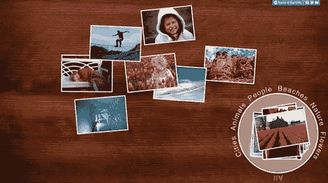

# 触摸浏览:超越平移、缩放和点击

> 原文：<https://www.sitepoint.com/touch-browsing-beyond-pan-zoom-and-tap/>

像 [Internet Explorer 10](http://ie.microsoft.com/testdrive/Browser/BrowserSurface/) 这样的新浏览器具有使用手势事件的高级触摸体验。有几个[第一步](http://blogs.msdn.com/b/ie/archive/2011/09/20/touch-input-for-ie10-and-metro-style-apps.aspx)你可以做，以确保帮助你的网站变得触摸友好，同时也让它在许多输入设备上工作良好，同时支持许多现代浏览器。在本文中，我将向您展示如何实现。

让我们从[浏览器界面](http://ie.microsoft.com/testdrive/Browser/BrowserSurface/)试驾演示中的手势事件开始:



*用户可以使用* [*浏览器表面演示*](http://ie.microsoft.com/testdrive/Browser/BrowserSurface/) 来拖动、挤压和旋转照片

这就引入了 JavaScript 中的[手势识别对象](http://msdn.microsoft.com/en-us/library/ie/hh968249(v=vs.85).aspx)。站点可以创建手势对象，决定要处理哪些指针(鼠标、笔或触摸接触)，并将手势事件指向所需的任何元素。然后，浏览器计算正在执行的手势，并通过事件通知页面。这使得开发人员能够构建手势体验，而这在任何其他浏览器中都是不可能的。这些包括多个并发的手势，例如，用手旋转两个拼图块。

让我们看看这在代码中是如何工作的。

## 创建手势对象

在站点中处理手势的第一步是实例化一个手势对象。

`var myGesture = new MSGesture();`

接下来，给手势一个目标元素。这是浏览器将触发手势事件的元素。它也是决定事件坐标空间的元素。

```
elm = document.getElementById("someElement"); 
myGesture.target = elm; 
elm.addEventListener("MSGestureChange", handleGesture);
```

最后，告诉手势对象在其手势识别中要处理哪些指针。

```
elm.addEventListener("MSPointerDown", function (evt) {
    // adds the current mouse, pen, or touch contact for gesture recognition 
    myGesture.addPointer(evt.pointerId); 
});
```

注意:不要忘记您需要使用 [`–ms-touch-action`](http://msdn.microsoft.com/en-us/library/ie/hh772044(v=vs.85).aspx) 来[配置元素不执行默认的触摸](http://blogs.msdn.com/b/ie/archive/2012/04/20/guidelines-for-building-touch-friendly-sites.aspx)动作，如平移和缩放，而是为输入提供指针事件。

## 处理手势事件

一旦一个手势对象有了一个有效的目标并且至少添加了一个指针，它将开始触发手势事件。手势事件有两种风格:静态手势(如点击或按住)和动态手势(如挤压、旋转或滑动)。

### 轻敲，水龙头

最基本的手势识别是点击。当检测到点击时，在手势对象的目标元素处触发`MSGestureTap`事件。与单击事件不同，点击手势仅在用户上下触摸(或按下鼠标按钮，或触摸笔)而不移动时触发。如果您想区分用户点击元素和拖动元素，这通常很有用。

### 按住

当用户用一个手指向下触摸，保持一会儿，然后抬起来不动时，就会发生按住手势。在按住交互期间，`MSGestureHold`事件针对手势的各种状态触发多次:

```
element.addEventListener("MSGestureHold", handleHold); 
function handleHold(evt) 
    { if (evt.detail & evt.MSGESTURE_FLAG_BEGIN) {
        // Begin signals the start of a gesture. For the Hold gesture, this means 
        the user has been holding long enough in place that the gesture 
        will become a complete press & hold if the finger is lifted. 
    } if (evt.detail & evt.MSGESTURE_FLAG_END) { 
        // End signals the end of the gesture. } 
    if (evt.detail & evt.MSGESTURE_FLAG_CANCEL) { 
        // Cancel signals the user started the gesture but cancelled it. For hold, 
        this occurs when the user drags away before lifting. This flag is 
        sent together with the End flag, signaling the gesture recognition 
        is complete. 
} 
}
```

### 动态手势(挤压、旋转、滑动和拖动)

动态手势，如收缩或旋转，以类似于 CSS 2D 变换的形式报告。动态手势触发三个事件:`MSGestureStart`、`MSGestureChange`(随着手势的继续重复触发)和`MSGestureEnd`。每个事件包含关于缩放(收缩)、旋转、平移和速度的[信息](http://msdn.microsoft.com/en-us/library/ie/hh772076(v=vs.85).aspx)。

因为动态手势报告变换，所以很容易使用`MSGesture`和 CSS 2D 变换来操作像照片或拼图这样的元素。例如，您可以启用元素的缩放、旋转和拖动，如下所示:

```
targetElement.addEventListener("MSGestureChange", manipulateElement); 
function manipulateElement(e) { 
    // Uncomment the following code if you want to disable the built-in inertia 
            provided by dynamic gesture recognition 
    // if (e.detail == e.MSGESTURE_FLAG_INERTIA) 
    // return;   
    var m = new MSCSSMatrix(e.target.style.transform); // Get the latest CSS transform on the element 
    e.target.style.transform = m 
        .translate(e.offsetX, e.offsetY) // Move the transform origin under the center of the gesture 
        .rotate(e.rotation * 180 / Math.PI) // Apply Rotation 
        .scale(e.scale) // Apply Scale 
        .translate(e.translationX, e.translationY) // Apply Translation 
        .translate(-e.offsetX, -e.offsetY); // Move the transform origin back 
}
```

通过分别使用 CTRL 或 SHIFT 修饰键旋转鼠标滚轮，鼠标支持缩放和旋转等动态手势。

您可以通过 [`MSGesture`对象](http://msdn.microsoft.com/en-us/library/ie/hh968249(v=vs.85).aspx)和 [`MSGesture`事件](http://msdn.microsoft.com/en-us/library/ie/hh772076(v=vs.85).aspx)的深入文档了解更多信息。

*本文经[授权](http://blogs.msdn.com/b/ie/archive/2012/06/20/go-beyond-pan-zoom-and-tap-using-gesture-events.aspx)转载。*

## 分享这篇文章