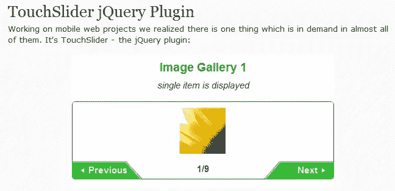
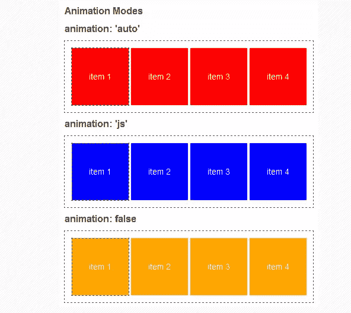
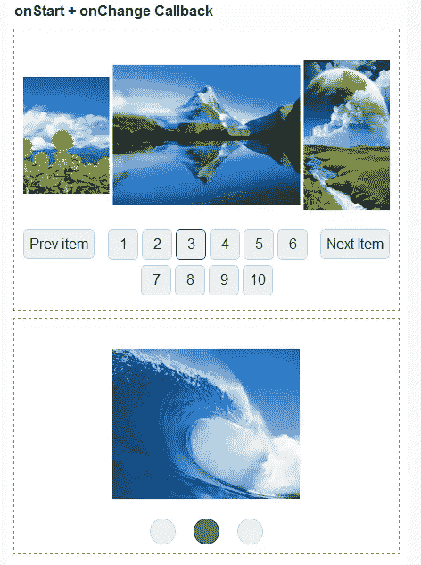

# 移动 TouchSlider jQuery 插件

> 原文：<https://www.sitepoint.com/touchslider-jquery-plugin/>

今天，我们有另一篇由[mobilizetoday.com](http://www.mobilizetoday.com)为一个伟大的新 jQuery 插件 TouchSlider 撰写的客座博文。

## 关于 TouchSlider

在做移动网络项目时，我们意识到几乎所有的项目都需要一样东西。这是 touch slider——jQuery 手机插件。制作插件的条件如下。手机屏幕较小，为了有效利用可用空间，我们需要一些东西来滚动内容，无论是图像还是文本。应该是基于 jQuery 的。可滚动区应该理解触摸事件，这使得它在 iPhone，Android 等触摸屏手机上很有用。为了提高性能，它应该基于 CSS 转换而不是原生 JavaScript。它应该可以在 iPhone 2 或 HTC Magic 等老款手机上快速运行。该插件应该有选项，以灵活和有用的不同需求。它还应该有 API 来添加回调函数。考虑到以上因素，我们创建了一个名为 TouchSlider 的插件。它的第一个版本在 2011 年 7 月被用于商业项目。2011 年 8 月，它在 GitHub 上发表。

## 触控滑动器演示

[演示](http://widgets.mobilizetoday.com/widgets/image-gallery.html)

## 特征

*自动(如果检测到，则使用 3D CSS 过渡)
* JavaScript (jQuery 方法将用于动画)
*无动画(滑块将在无动画的情况下工作，对于像 BlackBerry OS 5 这样不太支持 JavaScript 的浏览器很有用)

使用回调函数，您可以构建自定义设计的控件，如上一张/下一张幻灯片、按索引转到特定幻灯片、显示当前幻灯片索引等等。

## 关于作者

> MobilizeToday.com 是一个移动优化服务，可以很容易地把你现有的网站移动表示。

## 分享这篇文章