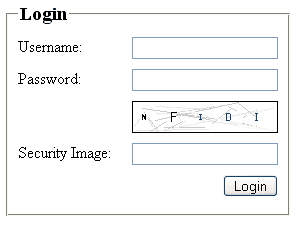

# 用图像强化表单的安全性

> 原文：<https://www.sitepoint.com/toughen-forms-security-image/>

如果您正在寻找一种方法来防止针对您的登录页面的暴力攻击、通过您的注册表单的自动注册或您的博客评论系统中的自动垃圾邮件，那么别再犹豫了！在本文中，我将引导您了解创建和集成安全映像的基本知识，就像在许多主流网站的注册页面上看到的那样。

安全图像是许多随机字符的视觉表示，这些字符容易被人阅读，但是很难被计算机程序解释。如果您将这样的图像集成到您的表单中，请您的站点访问者在单独的输入框中输入他们在图像中看到的字母，并将二者进行比较，您就可以很容易地将人类与机器区分开来。

##### 服务器要求

这个项目要求你有一个安装了 PHP 和 GD 库的 Web 服务器，所以如果你想尝试这个教程，确保你的主机环境支持这些包。我们将要讨论的例子写 GIF 图像，但是你可以很容易地替换相关的函数来输出 JPEG 或 PNG 图像，如果这是你的主机环境所支持的。

##### 创建可重用的安全图像类

首先，我们将创建一个可重用的 PHP 类，我们可以用它来生成安全图像；我们将以一个简单的登录屏幕来结束，演示这个类的用法。

我们的类将需要执行一些任务来生成合适的安全图像。它将需要:

1.  创建一个白色背景的空白图像。

3.  给图像添加一些随机的背景噪声。这将有助于混淆试图使用字符识别算法来识别图像中的字符的自动过程。

5.  对每个字符使用随机字体选择写出指定数量的随机字符。

7.  将图像写入用户的浏览器。为了增加灵活性，我们的类还将提供将图像写入文件的选项，尽管这不是本例的核心要求。

下面是我们的安全图像类的框架:

```
class SecurityImage { 

      var $oImage; 

      var $iWidth; 

      var $iHeight; 

      var $iNumChars; 

      var $iNumLines; 

      var $iSpacing; 

      var $sCode; 

      function SecurityImage( 

         $iWidth = 150, 

         $iHeight = 30, 

         $iNumChars = 5, 

         $iNumLines = 30 

      ) { 

      } 

      function DrawLines() { 

      } 

      function GenerateCode() { 

      } 

      function DrawCharacters() { 

      } 

      function Create($sFilename = '') { 

      } 

      function GetCode() { 

      } 

   }
```

这里，我们定义了一些类属性；这些将保存我们在生成图像时使用的重要信息。类构造函数将接受四个参数，允许我们改变生成的图像的外观。具体来说，我们可以选择图像的整体宽度和高度，我们希望图像显示的字符数，以及要绘制的背景线的数量(或噪点的数量)。

##### 对构造函数进行编码

构造函数将创建空白图像，为类属性分配参数，并定义图像的背景颜色。现在让我们添加代码:

```
function SecurityImage( 

   $iWidth = 150, 

   $iHeight = 30, 

   $iNumChars = 5, 

   $iNumLines = 30 

) { 

   // get parameters 

   $this->iWidth = $iWidth; 

   $this->iHeight = $iHeight; 

   $this->iNumChars = $iNumChars; 

   $this->iNumLines = $iNumLines; 

   // create new image 

   $this->oImage = imagecreate($iWidth, $iHeight); 

   // allocate white background colour 

   imagecolorallocate($this->oImage, 255, 255, 255); 

   // calculate spacing between characters based on width of image 

   $this->iSpacing = (int)($this->iWidth / $this->iNumChars);       

}
```

最后一行根据需要生成的字符数和我们指定的图像宽度来计算字符间距值。

##### 制造一些噪音

接下来，我们将添加代码来创建背景噪声(线条)。我们首先添加线条，因为我们希望字符在图像中位于它们之上，确保用户可以阅读字符。

```
function DrawLines() { 

   for ($i = 0; $i < $this->iNumLines; $i++) { 

      $iRandColour = rand(190, 250); 

      $iLineColour = imagecolorallocate($this->oImage, $iRandColour, $iRandColour, $iRandColour); 

      imageline($this->oImage, rand(0, $this->iWidth), rand(0, $this->iHeight), rand(0, $this->iWidth), rand(0, $this->iHeight), $iLineColour); 

   } 

}
```

当代码循环时，它会在随机位置创建随机长度的行。每条线都是用从 RGB 范围中选择的随机灰度绘制的。我选择了 190-250 的范围来充分模糊字符，使其不被任何可能试图解释它们的自动化过程所察觉，同时提供足够的对比度，使它们不需要眯着眼就可以容易地阅读！你会在下面看到，我们选择了一个较暗的灰度范围来写出字符。通过向类构造函数的 lines 参数传递一个更大或更小的值，可以增加或减少绘制的线条数，从而减少生成的噪声。

##### 在角色上

生成字符的代码分为两种方法。第一个函数`GenerateCode`生成代码，而第二个函数`DrawCharacters`将代码写入映像。

```
function GenerateCode() { 

   // reset code 

   $this->sCode = ''; 

   // loop through and generate the code letter by letter 

   for ($i = 0; $i < $this->iNumChars; $i++) { 

      // select random character and add to code string 

      $this->sCode .= chr(rand(65, 90)); 

   } 

}
```

`GenerateCode`方法首先清除`$this->sCode`变量，以防止之前生成的任何保存的字符混淆我们当前的图像生成工作。

然后，该方法循环，直到选择了类构造函数中请求的随机字符数。在循环的每一次迭代中，它会将选中的字符附加到`$this->sCode`变量中。

从 65 到 90 范围内的 ASCII 字符代码中选取大写字符。我们使用`rand`函数在这个范围内选择一个数字，然后将它传递给`chr`函数，将其转换成可读的字符进行显示。

我坚持使用大写字符，因为它们的 ASCII 码是一组连续的数字；这使得随机选择一个字符变得更加容易。包含小写字符或数字会给字符选择过程增加额外的复杂性。但是，如果您想执行这一步，您可以静态地声明一个要使用的字符数组，然后选择一个随机数作为字符选择的数组索引。以下代码说明了这一点:

```
// characters to use 

$aChars = array('A', 'B', 'C', '3', 'g'); 

// get number of characters 

$iTotal = count($aChars) - 1; 

// get random index 

$iIndex = rand(0, $iTotal); 

// selected character 

$this->sCode .= $aChars[$iIndex];
```

这段代码将替换`GenerateCode`方法中的下面一行:

```
// select random character 

$this->sCode .= chr(rand(65, 90));
```

生成这段代码后，我们调用`DrawCharacters`将选中的字符写入图像。

```
function DrawCharacters() { 

   // loop through and write out selected number of characters 

   for ($i = 0; $i < strlen($this->sCode); $i++) { 

      // select random font 

      $iCurrentFont = rand(1, 5); 

      // select random greyscale colour 

      $iRandColour = rand(0, 128); 

      $iTextColour = imagecolorallocate($this->oImage, $iRandColour, $iRandColour, $iRandColour); 

      // write text to image 

      imagestring($this->oImage, $iCurrentFont, $this->iSpacing / 3 + $i * $this->iSpacing, ($this->iHeight - imagefontheight($iCurrentFont)) / 2, $this->sCode[$i], $iTextColour); 

   } 

}
```

随着循环的每次迭代，`DrawCharacters`方法从 GD 库中内置的五种字体中随机选择一种字体。它们被简单地编号为 1 到 5。我们可以使用 FreeType 或 TrueType 字体，但是这意味着，为了让这个例子工作，我们必须考虑所需字体文件的位置。我将把添加对这些字体的支持留给您做练习！

在下一部分中，从 0 到 128 的 RGB 范围中选择一个随机灰度。如前所述，这比我们使用的绘制背景线的范围更暗，确保我们的图像显示足够的对比度以保持其可读性。您可能希望修改这些范围，以获得您认为的晦涩和可读性之间的最佳平衡。

最后，将字符写入图像。您会注意到我们将`$this->sCode`字符串视为一个数组，这使我们能够依次选择每个字符。

到目前为止，我们创建的三个方法——`DrawLines`、`GenerateCode`和`DrawCharacters`——都是私有的。任何调用该类的代码都不会直接使用它们，而是通过公共包装方法使用它们。在 PHP 4 中，没有办法将一个方法标记为 private，所以我们只能希望任何调用该类的人都表现良好，并使用我们提供的包装函数。

我们最好快点创建那个包装！它被形象地称为`Create`:

```
function Create($sFilename = '') {  

   // check for existence of GD GIF library  

   if (!function_exists('imagegif')) {  

      return false;  

   }  

   $this->DrawLines();  

   $this->GenerateCode();  

   $this->DrawCharacters();  

   // write out image to file or browser  

   if ($sFilename != '') {  

      // write stream to file  

      imagegif($this->oImage, $sFilename);  

   } else {  

      // tell browser that data is gif  

      header('Content-type: image/gif');  

      // write stream to browser  

      imagegif($this->oImage);  

   }  

   // free memory used in creating image  

   imagedestroy($this->oImage);  

   return true;  

}
```

它从检查`imagegif`函数的存在开始，因此，暗示了 GD 库的存在。如果没有找到，函数会直接退出并返回——毕竟，如果图像生成函数不存在，继续下去就没有意义了。

假设该函数安全通过该检查，则调用`DrawLines`、`GenerateCode`和`DrawCharacters`来执行这些至关重要的函数。

接下来，用`imagegif`创建图像，并保存到文件中，或者在我们的例子中，写入用户的浏览器。最后一步是释放进程使用的内存。

我们只需要再充实一个小方法，我们的类就完整了！简单地返回生成的随机字符的文本表示，如上所述，允许我们将这些字符与用户输入的输入进行比较。这就是，简短而甜蜜的:

```
function GetCode() {  

   return $this->sCode;  

}
```

##### 使用该类

是时候在实际应用程序中实现这个解决方案了。我们将创建一个简单的登录表单，提示用户输入他们的用户名和密码，但另外显示我们的安全图像，并要求他们键入他们看到的字符。我们将把图像显示的代码的文本表示分配给一个 PHP 会话变量。当用户提交表单时，我们将比较他们输入的代码和存储在会话变量中的字符。如果它们匹配，我们将向用户显示适当的祝贺消息。如果字符串不匹配，我们会让用户知道，并为他们提供一个返回并重试的链接。出于这个例子的目的，我们不用担心他们在表单的用户名和密码字段中输入了什么。

我们将在本节讨论的所有代码都包含在[这个可下载的代码档案](https://www.sitepoint.com/examples/securityimage/securityimage.zip)中。

***创建包装页面***

首先，我们将创建一个页面(security-image.php，可以在代码归档中找到),该页面将调用新类并传递任何必需的参数。

该页面首先包含包含`SecurityImage`类的文件(security-image.inc.php，包含在代码归档中)。接下来，我们调用`session_start`。任何使用会话的 PHP 页面都需要在任何其他输出被发送到浏览器之前调用它。它会创建一个新会话，或者恢复现有会话。

然后，我们选择传递给页面的任何`GET`变量，并将它们分配给相关的变量。如果一个特定的选项变量不存在一个`GET`变量，我们就指定一个默认值。然后我们调用`SecurityImage`构造函数，传递我们的参数，来创建这个类的一个新实例。

接下来，调用`Create`方法。如果成功返回，我们将生成的图像的相应文本代码赋给我们的会话变量。如果不成功，我们返回一个合适的错误消息:

```
<?php  

   // include security image class  

   require('includes/security-image.inc.php');  

   // start PHP session  

   session_start();  

   // get parameters  

   isset($_GET['width']) ? $iWidth = (int)$_GET['width'] : $iWidth = 150;  

   isset($_GET['height']) ? $iHeight = (int)$_GET['height'] : $iHeight = 30;  

   // create new image  

   $oSecurityImage = new SecurityImage($iWidth, $iHeight);  

   if ($oSecurityImage->Create()) {  

      // assign corresponding code to session variable   

      // for checking against user entered value  

      $_SESSION['code'] = $oSecurityImage->GetCode();  

   } else {  

      echo 'Image GIF library is not installed.';  

   }  

?>
```

将图像直接输出到浏览器的页面将从下一个页面中的 HTML 图像标记调用，该页面显示我们的登录表单。

***创建登录页面***

登录页面向自身提交，并具有显示表单和两个可能的结果消息的双重目的。

另外，我们的表单使用 CSS 进行语义编码。看不到一张表或 break 标签！

```
<?php  

  // start PHP session  

  session_start();  

?>  

<!DOCTYPE html PUBLIC "-//W3C//DTD XHTML 1.0 Strict//EN" "https://www.w3.org/TR/xhtml1/DTD/xhtml1-strict.dtd">  

<html  xml:lang="en" lang="en">  

<head>  

  <title>Security Image Test</title>  

  <meta http-equiv="Content-Type" content="text/html; charset=ISO-8859-1" />  

  <style type="text/css">  

     form { width: 18em; }  

     fieldset { display: block; float: left; }  

     legend { font-size: 1.2em; font-weight: bold; color: #000; }  

     #security img { float: right; border: 1px solid #000; }  

     label, input, #security img { margin: 5px 0; }  

     input, #login { float: right; }  

     label, #login { clear: both; }  

     label { float: left; width: 7em; }  

     #login { margin-top: 5px; }  

  </style>  

</head>  

<body>  

  <?php  

     // check for posted form  

     if (isset($_POST['login'])) {  

        // see if the code the user typed matched the generated code  

        if (!empty($_SESSION['code']) && strtoupper($_POST['code']) == $_SESSION['code']) {  

           unset($_SESSION['code']);  

           echo 'Congratulations, you entered the correct code.';  

        } else {  

           echo 'You have entered the wrong code. Please <a href="index.php">try again</a>.';  

        }  

     } else {  

  ?>  

  <form method="post" action="index.php">  

     <fieldset>  

        <legend>Login</legend>  

        <label for="username">Username:</label><input type="text" name="username" id="username" value="" />  

        <label for="password">Password:</label><input type="password" name="password" id="password" value="" />  

        <div id="security"></div>  

        <label for="code">Security Image:</label><input type="text" name="code" id="code" value="" />  

        <input type="submit" name="login" id="login" value="Login" />  

     </fieldset>  

  </form>  

  <?php  

     }  

  ?>  

</body>  

</html>
```

页面通过调用`session_start`函数开始。

接下来，编写 HTML 标题和定义表单可视化表示的 CSS 随后检查表单提交。如果表单已经提交，将根据保存的版本检查用户输入的代码，并显示相应的消息。如果表单尚未提交，则会显示该表单。因为我们不能确定我们的用户将只使用大写字符输入代码，所以在进行比较之前，`strtoupper`用于转换他们的输入。

***成品形态***

您可以在下面看到我们完成的表单的屏幕截图，以及安全图像:



至此，我们已经完成了安全映像实施！好好休息一下，思考一下将这个例子整合到表单中的可能性。

你可以在 PHP.net 找到更多关于 PHP GD 函数的信息。

## 分享这篇文章