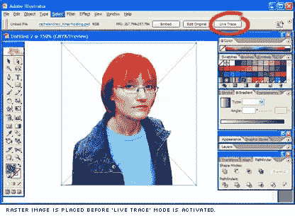
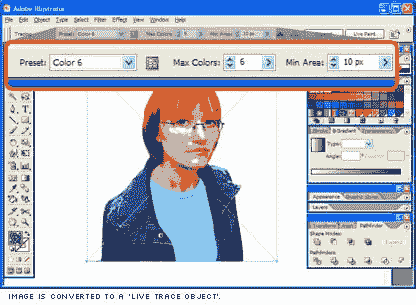
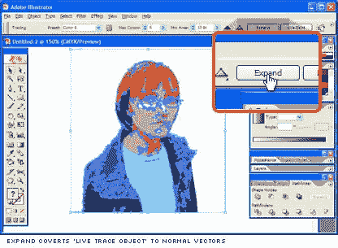
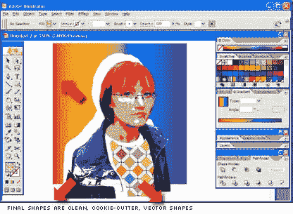

# Illustrator CS2 中的描摹

> 原文：<https://www.sitepoint.com/tracing-in-illustrator-cs2/>

虽然我将在设计视图中更详细地介绍 Adobe 的 Creative Site 2，但我想我应该看看一个吸引我注意力的新功能——“实时跟踪”。

到目前为止，我不得不说自动跟踪工具听起来总是像一个伟大的想法，但从来没有真正有用。我的经历大致是这样的:

1)摆弄颜色、灵敏度滑块和其他更神秘的选项。

2)描图。

3)印象一般但不是真正满意。

4)摆弄颜色、灵敏度滑块和其他更神秘的选项。

5)描图。

6)印象一般但并不真正满意。

7)重复步骤 1 到 6 四到五次。

8)获取一个我乐意开始使用的原始矢量图形。

9)从一个疯狂的马蜂窝开始工作，这个马蜂窝由缠结和交织的矢量形状组成。清理散乱点时，不时神秘地删除大量图形，迫使原路返回。

10)认输，手描。

好消息是，Adobe 现在可能已经通过 Illustrator 的新“实时跟踪”绘图模式解决了这个问题。

这里有一个快速测试，我用我们的 CSS 超级大师，雷切尔·安德鲁从她的 [CSS 选集](https://www.sitepoint.com/books/cssant1/)书籍封面中选取的图片进行了测试。

将图像放入 Illustrator 后，我选择了它并打开了“实时描摹”。从这一点上来说，你正在使用 Adobe 称为“实时跟踪对象”的东西，这不再是一个纯粹的光栅图像，也不是一个纯粹的矢量对象，它又是另外一个东西。

在此阶段，您可以完全自由地“调整”作品，控制颜色数量、线条和边缘质量以及最小渲染对象的大小。还有一套全面的预设，包括“照片高保真”，“漫画艺术”，“技术绘图”和“手绘草图”。这些通常是开始调优的好地方。

当你对你的作品感到满意时，你需要通过“扩展”按钮切换出“实时描摹”来将其转换回纯矢量对象。

现在我们有了矢量图。有什么大不了的，对吧？

“实时描摹”和以前内置的自动描摹功能的主要区别仅仅在于它所生成的作品的质量。它生成的矢量形状看起来就像是用“饼干切割器”制作的。没有形状重叠，它们完美地组合在一起，就像一个全新的拼图。这是一个丝网印刷的梦想。

当然，你总是想调整，编辑和改变原始转换，但它仍然是一个非常有效的方法来快速获得原始图像。

总之，非常有用，是 Illustrator 的一个非常方便的补充。

## 分享这篇文章