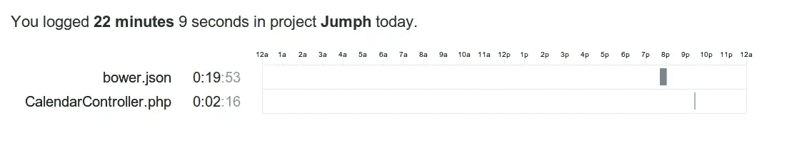
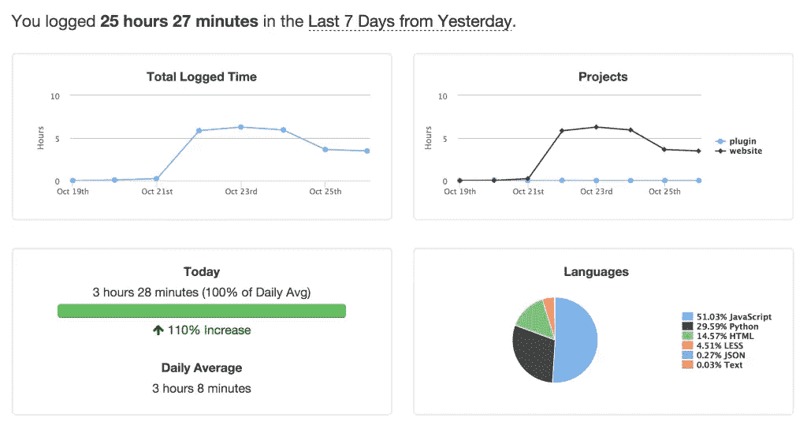
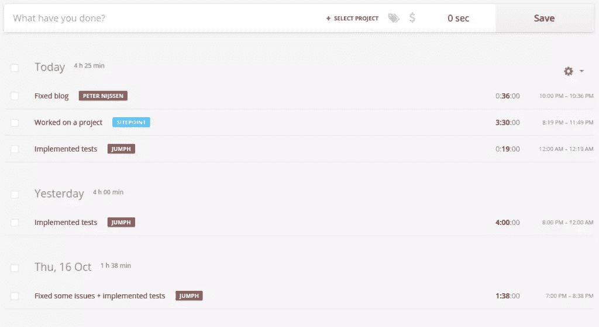

# 使用 WakaTime 跟踪您的编码效率

> 原文：<https://www.sitepoint.com/track-coding-productivity-wakatime/>

早在 6 月份，我写了一篇关于[的](http://www.codeivate.com/)[文章](https://www.sitepoint.com/codeivate-social-coding-rpg/)，它能够跟踪你当前编程使用的语言，以类似 RPG 的方式给你的虚拟个人资料打分。我收到的关于那篇文章的评论之一是一个名为 [WakaTime](https://wakatime.com/) 的工具的链接，它有类似的功能。然而，WakaTime 被宣传为一个时间追踪器，而不是一个测量你的编码习惯的工具。

当您使用编辑器时，WakaTime 会记录一些事情。首先，它记录了您正在处理的文件的绝对路径。这样，您可以清楚地看到在某个时间段内您一直在处理哪些文件。它还记录当前时间、触发事件的原因以及打开文件的当前语言语法。除此之外，如果可能的话，它还会跟踪您当前的项目和分支，以及当前文件的总行数。

这些记录要么存储在本地，直到你连接到互联网，要么存储在所谓的*心跳事件*中。这种心跳有三种不同的触发方式:

*   如果您经常使用编辑器，每两分钟一次
*   当您在文件之间切换时
*   当你在文件中写东西的时候

WakaTime 可以集成到更大范围的编辑器中。从 Sublime 这样的文本编辑器到 XCode 和 PhpStorm 这样的 IDE。对于本文，我们将使用与在 Codeivate 文章中相同的编辑器:Sublime Text 和 PhpStorm。如果你对如何在其他编辑器中安装 WakaTime 感兴趣，请看看[这一页](https://wakatime.com/help/getting-started/welcome)。

## 设置

首先要做的是[自己在 WakaTime 上注册](https://wakatime.com)。注册变得容易和顺利，没有必要激活自己。填写您的电子邮件地址和密码，您就可以立即登录了。WakaTime 直接问你想用哪个编辑器，你可以点击你喜欢的编辑器开始使用。你需要一个 API 密匙，可以在[这个页面](https://wakatime.com/#apikey)找到。

### 崇高的文本

在你配置 Sublime Text 之前，确保你已经安装了[包控制](https://sublime.wbond.net/)。打开包控制并选择安装一个包。搜索`WakaTime`并安装合适的软件包。

一旦 Sublime 完成安装包，它会在你的屏幕底部询问你的 WakaTime API 密钥。按下 enter 键后，您的 Sublime 编辑器就已经配置好了。

### PhpStorm

打开 PhpStorm，点击`file`->-T1。在首选项中，转到插件部分并点击`browse repositories`。搜索`WakaTime`，安装出现的插件。安装后，PhpStorm 会要求您重新启动。重新打开应用程序时，会出现一个弹出窗口，要求您输入 WakaTime 的 API 密钥。填写您从上一页复制的 API 密钥，并将其粘贴到框中。在您按下 enter 键之后，您的 PhpStorm 编辑器就已经配置好了。

### 网站

一旦你在编辑器中更改了一些文件，你会在 WakaTime 网站上注意到它正在记录你的进度和日志数据。

我已经提到过，WakaTime 更多的是一个时间跟踪工具，而不是一个跟踪你的编码习惯的工具。正如我们已经看到的，WakaTime 还跟踪您的项目名称。这样，它能够跟踪你在编辑器中的某个项目上花费了多少时间。它甚至可以跟踪你在每个文件上花了多少时间。

在花在一个项目上的时间旁边，你还可以看到你用某种编程语言花了多少时间。点击一种编程语言就会显示出你修改了哪些文件。知道你在某些文件上花了多少时间是很好的，因此你可以粗略地猜测实现某个特性花了多少时间。

## 与共衍生相比

WakaTime 更像是一个专业工具，可以跟踪你在某个项目上花费的时间，具有语言跟踪功能。Codeivate 更像是一个跟踪你的语言的工具，其中添加了一些社交元素，比如排行榜和“战斗”。

这种差异反映在价格上:如果你想保留你的历史，WakaTime 每月花费 9 美元。如果你坚持免费计划，你的历史只会持续七天。另一方面，Codeivate 可以免费使用。

WakaTime 的网站更容易理解，有更好的 UX。插件本身的安装要比 Codeivate 容易得多。然而，例如在 PhpStorm 中，你可以看到你的实际状态，而对于 WakaTime，你需要打开它的网站。

因此，如果你对社交方面更感兴趣，并且你只是想粗略地跟踪你正在使用的语言，那么 Codeivate 就是你要找的。如果你想跟踪你在项目上花了多少时间，WakaTime 绝对是一个不错的选择。

## 与 Toggl 比较

由于 WakaTime 更像是一个时间跟踪工具，所以将它与另一个时间跟踪服务进行比较是公平的。因为我们有一个很好的时间追踪器列表，已经在另一篇[文章](https://www.sitepoint.com/effective-programmers-secret-weapon-time-tracking/)中介绍过了，所以我决定使用另一个名为 [Toggl](https://www.toggl.com/) 的。

Toggl 更像是一个基于网络的工具，因为你的大部分工作都是在浏览器中完成的。Toggl 非常好用。你只需在你最喜欢的浏览器中打开它，选择一个项目，然后点击“开始”按钮。计时器开始运行，您可以开始处理项目。当你完成后，点击停止按钮，你花的时间被记录下来。

这是一个相当常见的过程，你会在大多数时间追踪器中看到。这样做的好处是，它还可以计算出你在回复邮件、给客户打电话或测试你的网络应用程序上花费的时间。在瓦卡提时间，这个时间是没有记录的。但 WakaTime 的一个优势是，如果你突然切换到一个不同的项目，它会自动记录在该项目上花费的时间，而使用 Toggl，你必须停止记录并开始一个新的会话。

Toggl 还允许你手动添加时间，以防你忘记点击开始按钮或者你不在电脑旁边。

## 结论

我确实喜欢 WakaTime 背后的想法，但我看到了一个问题，正如我在与 Toggl 的比较中已经概述的那样:在一个项目上花费的时间比你与编辑器一起工作的时间还要多。你可能需要计划拜访或电话，你可能需要发送电子邮件或测试应用程序。WakaTime 无法跟踪这个时间，也没有办法手动添加一些额外的时间。所以最终，你仍然需要找到另一个时间追踪器来追踪这些任务。我认为如果 WakaTime 能够解决这个问题，这个工具会更有用。然而，对我来说，我更喜欢 Toggl 的工作方式，因为我可以跟踪一切。起初，你可能需要习惯它，但是当它在你的系统中时，你正在记录一切。

你用什么工具来衡量你的编码效率？你试过 WakaTime 或者其他流行的工具吗，有什么小技巧吗？

## 分享这篇文章