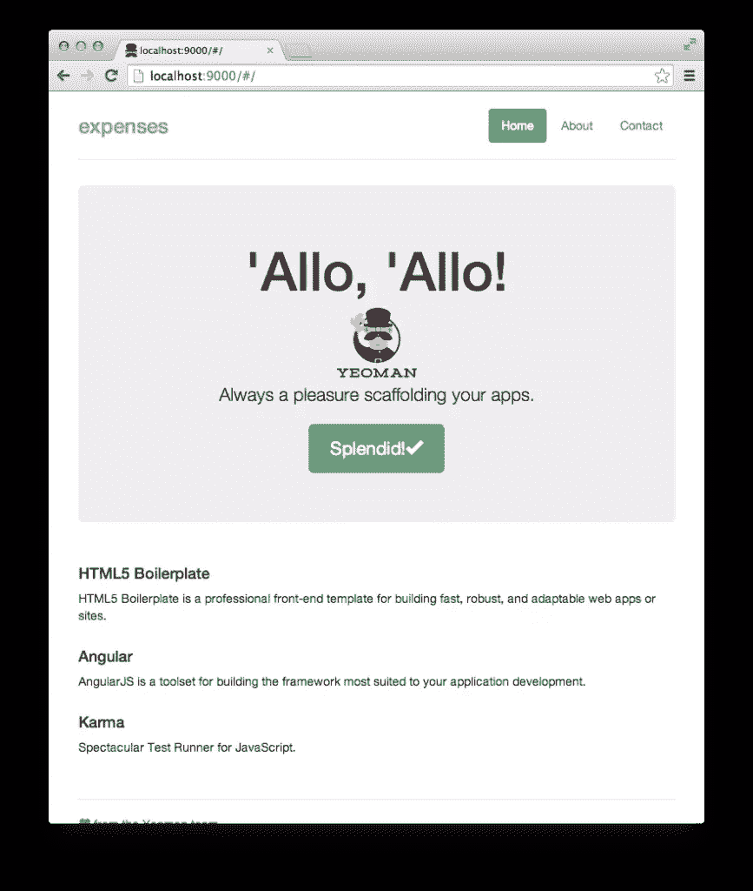
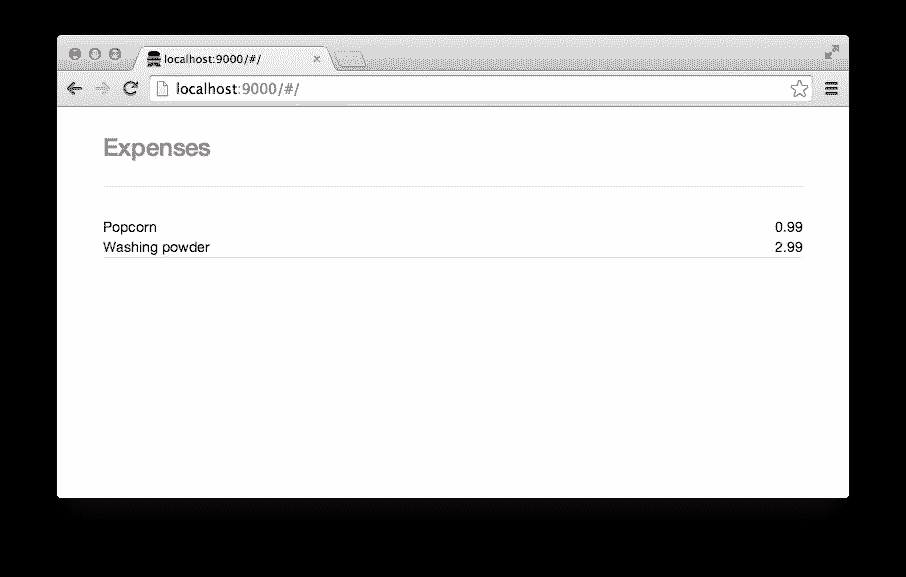
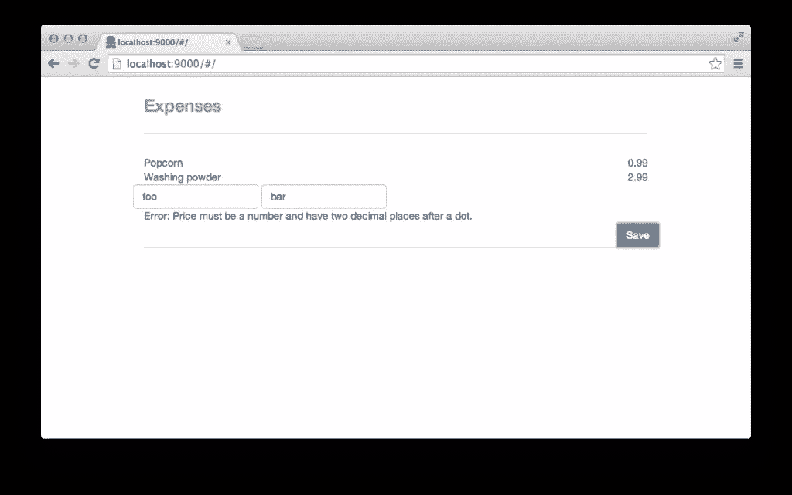

# 使用 CouchDB 和 Angular 跟踪费用

> 原文：<https://www.sitepoint.com/tracking-expenses-couchdb-angular/>

在本教程中，我们将构建一个应用程序，使用 CouchDB 作为后端，Angular 作为前端技术。CouchDB 是一个 NoSQL 数据库，也是较新的 JavaScript MVC 框架之一。令人兴奋的是，CouchDB 是一个带有 HTTP API 的数据库——我们的客户端应用程序将直接与数据库对话:CouchDB 将充当我们的客户端应用程序所需的唯一后端！

我们将专注于一个小应用程序来跟踪我们的支出。每一步都会有一个提交，有时提交还包括测试。测试不是本教程的主题，但是如果你感兴趣，你应该看看！你可以在 [GitHub](https://github.com/robertkowalski/couchdb-workshop) 上的一个资源库中找到本教程中使用的全部代码。

## 为什么是 CouchDB？

你们中的一些人可能会说，我们可以使用客户端替代方案。IndexedDB 或本地存储是在客户机上本地工作以持久存储数据的技术。但是使用数据库服务器有几个优点:我们可以将许多客户端连接到我们的应用程序。当你独自在另一家超市时，你的伴侣可以更新费用清单，也增加了费用。

使用 CouchDB 带来了好处:CouchDB 本身就“说”HTTP，所以我们不需要在数据库和应用程序之间再加一层。我们的 JavaScript 应用程序可以使用 CouchDB 提供的 RESTful 接口直接与 CouchDB 数据库对话！

而且，如果我们想对我们的数据库使用复制，那就像切面包一样容易:因为 CouchDB 是为创建分布式数据库系统而设计的。

## 要求

对于本教程，您需要安装最新版本的 CouchDB (1.6)和最新版本的 stable Node.js(目前是 0.10.x)。

### 安装 Node.js & Yo

作为 Mac 用户，你可以在[节点主页](http://nodejs.org/)上获得官方安装程序。另一种在 Linux 和 OSX 上管理 Node.js 安装的方法是 Tim Caswell 开发的令人敬畏的 nvm 。

我们将安装你脚手架我们的应用程序。在创建骨骼的过程中，你会问我们一些问题。你问我们是否要使用 SASS，如果你不确定，就回答“不”——但我们肯定要包括自举和预选的角度模块。

在 shell 中，我们键入:

```
npm install -g yo generator-angular grunt-cli couchapp
mkdir expenses && cd expenses
yo angular expenses
```

作为我们搭建的一部分，Yo 为我们创建了一个 Gruntfile (Gruntfile.js)。Grunt 是 JavaScript 中的一个任务运行器，它有很多已经编写好的插件来自动执行任务，让您的生活更加轻松。

使用命令`grunt serve`启动一个开发服务器，在繁重的任务完成后`http://127.0.0.1:9000`应该会在浏览器中打开。下图显示了这种情况的一个示例。



### 安装 CouchDB

在很多平台上都有安装 CouchDB 的很棒的文档——有针对所有主要操作系统的包，在 OSX 你可以用 brew 安装 CouchDB。

## 使用 CouchDB 的第一步

让我们启动第一个 CouchDB 实例并创建一个数据库:

```
couchdb & # start a CouchDB
curl -X PUT http://127.0.0.1:5984/expenses # create the database expenses
```

CouchDB 的回答是:

```
{"ok":true}
```

我们刚刚使用 HTTP 创建了第一个数据库！

让我们进一步探索 CouchDB 的 HTTP API:我们现在可以插入第一个文档，假设我们想要跟踪我们购买的一些爆米花(我们的应用程序稍后将需要这些对 CouchDB 的调用)。

```
curl -X POST http://127.0.0.1:5984/expenses -H "Content-Type: application/json" -d '{"name": "Popcorn", "price": "0.99"}'
```

CouchDB 回答:

```
{"ok":true,"id":"39414de82e814b6e1ca754c61b000efe","rev":"1-2b0a863dc254239204aa5b132fda8f58"}``
```

我们现在可以使用 GET 请求和 CouchDB 分配给我们的文档的 id 来访问文档，因为我们没有提供特定的 id:

```
curl -X GET http://127.0.0.1:5984/expenses/39414de82e814b6e1ca754c61b000efe
```

CouchDB 回答:

```
{"_id":"39414de82e814b6e1ca754c61b000efe","_rev":"1-2b0a863dc254239204aa5b132fda8f58","name":"Popcorn","price":"0.99"}
```

之后，我们插入另一个文档:

```
curl -X POST http://127.0.0.1:5984/expenses -H "Content-Type: application/json" -d '{"name": "Washing powder", "price": "2.99"}'
```

## 配置:带 CouchDB 的 CORS

我们的客户端将从 CouchDB 本身之外的另一个位置通过 HTTP 进行通信。为了在我们的浏览器中实现这一点，我们必须在 CouchDB 中启用 CORS(跨源资源共享)。

在这种情况下，我们想要修改`local.ini`来进行本地定制更改。可以通过 HTTP 修改配置。在部分`https`中，我们启用 CORS，然后用通配符配置我们的源:

```
curl -X PUT http://localhost:5984/_config/httpd/enable_cors -d '"true"'
curl -X PUT http://localhost:5984/_config/cors/origins -d '"*"'
```

通过这两个命令，我们改变了 CouchDB 的`local.ini`。您可以使用`couchdb -c`找到`local.ini`的位置。

**重要！**请注意，如果您将应用程序部署到生产环境，您可能需要更改 origin 部分。这里提供的所有设置都只是为了开发！

## 角度和依赖注入

在`app/scripts/app.js`中，我们将找到我们应用程序的主 JavaScript 文件，它实际上是一个所谓的 Angular 模块。这个模块加载一些其他模块作为依赖(例如`ngCookies`)。在这个文件中，我们还找到了使用`$routeprovider`的应用程序的客户端路由。

这个文件中的`$routeprovider`是 Angular 的依赖注入(DI)的一个很好的例子。通过定义想要使用的服务的名称，Angular 将其注入给定的函数范围。你可以在[文档](https://docs.angularjs.org/guide/di)中找到更多关于 Angular 的依赖注入的信息。

由于我们希望将连接到 CouchDB 所需的数据放在一个中心位置，所以让我们尝试使用带有常量的 DI。我们使用链接将它们添加到我们的模块中:

```
.constant('appSettings', {
  db: 'http://127.0.0.1:5984/expenses'
});
```

到目前为止，我们拥有的唯一控制器是位于`app/scripts/controllers/main.js`中的`MainCtrl`，它是在最初搭建时创建的。定义了`MainCtrl`，注入了`$scope`。我们将在后面看到如何使用范围。

我们现在可以将`appSettings`添加到函数参数中来注入它们，就像我们之前看到的`$routeprovider`一样:

```
.controller('MainCtrl', function ($scope, appSettings) {
  console.log(appSettings);
});
```

现在，您应该能够在浏览器的调试控制台上记录输出。恭喜你！您已经成功地使用了依赖注入。完整的提交可以在:[https://github . com/robertkowalski/couch db-workshop/commit/d6b 635 a 182 df 78 BC 22 a2 e 93 af 86162 f 479 D8 b 351](https://github.com/robertkowalski/couchdb-workshop/commit/d6b635a182df78bc22a2e93af86162f479d8b351)找到。

## 获取结果

在下一步中，我们将注入`$http`服务来从 CouchDB 获取数据并更新视图。传统数据库处理的是分解到表中的数据，而 CouchDB 使用的是非结构化文档，可以使用 map 和 reduce 函数通过一个称为视图的概念对这些文档进行聚合、过滤和连接。视图是由设计文档定义的，设计文档是一种特殊的文档。

您可以自己编写视图，并通过 curl 将其发送到 CouchDB，在`http://localhost:5984/_utils`使用图形界面，或者通过像 CouchApp 这样的工具——有很多像 [CouchApp](https://github.com/mikeal/node.couchapp.js) ( `npm install -g couchapp`)这样的工具可以使视图的开发和部署更加容易。

这是我们的视图的样子:

```
{
  "_id":"_design/expenses",
  "views": {
    "byName": {
      "map": "function (doc) {
        emit(doc.name, doc.price);
      }"
    }
  }
}
```

`_id`对我们很重要，因为它定义了我们稍后查询视图的路径。当我们创建一个设计文档时，`_id`属性以`_design`为前缀。我们将我们的视图命名为`byName`,它只包含一个基本的 map 函数，该函数将我们数据库中每个文档的 name 属性作为键，price 作为值。

让我们使用 curl 将其发送到 CouchDB:

```
curl -X POST http://127.0.0.1:5984/expenses -H "Content-Type: application/json" -d '{"_id":"_design/expenses","views": {"byName": {"map": "function (doc) {emit(doc.name, doc.price);}"}}}'
```

CouchDB 的回应是:

```
{"ok":true,"id":"_design/expenses","rev":"1-71127e7155cf2f780cae2f9fff1ef3bc"}
```

我们现在有了一个视图，可以在以下位置查询:

```
http://localhost:5984/expenses/_design/expenses/_view/byName
```

如果你对像 CouchApp 这样的工具感兴趣(提示:你以后必须使用它)，[这里有一个提交](https://github.com/robertkowalski/couchdb-workshop/commit/5f157be5ce68e18e98cd970401ca2e7e328ed948)，它展示了如何使用它(使用`npm run bootstrap`来部署设计文档)。

你还记得我们一开始的卷曲要求吗？我们现在将用 JavaScript 实现它们。Angular 提供了`$http`服务，可以注入如下图:

```
.controller('MainCtrl', function ($scope, $http, appSettings) {
```

然后，我们添加一个函数来使用`$http`服务获取我们的项目:

```
function getItems () {
  $http.get(appSettings.db + '/_design/expenses/_view/byName')
    .success(function (data) {
      $scope.items = data.rows;
    });
}
getItems();
```

`$http`服务返回一个承诺，它将为我们提供来自 CouchDB 视图的 JSON 数据。我们正在将数据添加到`$scope.items`。使用`$scope`,我们可以设置和更新视图中的值。如果模型的值发生变化，视图会自动更新。角度的双向绑定同步了视图和模型之间的数据。在控制器改变模型之后，它将立即更新视图，并且当视图中的值改变时，也更新模型。

在我们删除了大部分样板标记之后，让我们添加一些带有表达式的 HTML 来显示我们在`app/views/main.html`中的项目:

```
<div>{{ item[0].key }}</div>
<div>{{ item[0].value }}</div>
```

我们将看到在“使用 CouchDB 的第一步”一节中添加的第一项:


该器件的[提交](https://github.com/robertkowalski/couchdb-workshop/commit/9609ae513df58c0831d260ff2b173c14ba00e709)可在 GitHub 上获得。

### 使用指令:`ng-repeat`

我们现在应该看到第一个项目，但所有其他项目呢？

我们可以在这里使用`ng-repeat`指令，它将为我们从更长的列表中构建标记。一般来说，我们可以说 Angular 中的指令将行为附加到 DOM 元素上。Angular 中还有很多其他预定义的指令，你也可以定义自己的指令。在这种情况下，我们将`ng-repeat="item in items"`添加到外部的`div`，它将从`$scope.items`开始迭代我们的数组`items`。

类`pull-left`和`pull-right`是引导 CSS 的一部分，为我们提供浮动元素。由于元素是浮动的，我们应用了一个`clearfix`，它也包含在 Bootstrap 中:

```
<div ng-repeat="item in items">
  <div class="clearfix">
    <div class="pull-left">{{ item.key }}</div>
    <div class="pull-right">{{ item.value }}</div>
  </div>
</div>
```

如果刷新页面，项目会在 DOM 检查器中呈现为:

```
<!-- ngRepeat: item in items -->
<div ng-repeat="item in items" class="ng-scope">
  <div class="clearfix">
    <div class="pull-left ng-binding">Popcorn</div>
    <div class="pull-right ng-binding">0.99</div>
  </div>
</div>
<!-- end ngRepeat: item in items -->
<div ng-repeat="item in items" class="ng-scope">
  <div class="clearfix">
    <div class="pull-left ng-binding">Washing powder</div>
    <div class="pull-right ng-binding">2.99</div>
  </div>
</div>
<!-- end ngRepeat: item in items -->
```

我们现在有了一个不错的小列表，但是除了使用 curl 之外，仍然没有办法用我们的应用程序提交新项目。到目前为止的应用程序在 [this commit](https://github.com/robertkowalski/couchdb-workshop/commit/ff663c21644e0b2be7bad4615e1465f8f7980b96) 中可用，如下图所示。



## 创建用于提交项目的表单

我们将添加一个有两个输入的表单:一个输入商品名称，另一个输入价格。该表单还有一个提交项目的按钮。

Bootstrap 中带有`class="row"`的`div`用于以响应方式设计我们的应用程序。像`form-control`和`btn btn-primary`这样的引导类用于设计按钮和输入的样式。

表单还获得了一个`novalidate`属性:它禁用了浏览器的原生表单验证，因此我们可以稍后使用 Angular 来验证我们的表单:

```
<form class="form-inline" role="form" novalidate>
  <div class="row">
    <div class="form-group">
      <label class="sr-only" for="item-name">Your item</label>
      <input
        class="form-control"
        id="item-name"
        name="item-name"
        placeholder="Your item" />
    </div>
    <div class="form-group">
      <label class="sr-only" for="item-price">Price</label>
      <input
        class="form-control"
        id="item-price"
        name="item-price"
        placeholder="Price" />
    </div>
  </div>
  <div class="row">
    <button
      class="btn btn-primary pull-right"
      type="submit">Save</button>
  </div>
</form>
```

表单的提交位于[https://github . com/robertkowalski/couch db-workshop/commit/d 678 c 51 dfff 16210 f1 CD 8843 FBE 55 c 97 DC 25 a 408](https://github.com/robertkowalski/couchdb-workshop/commit/d678c51dfff16210f1cd8843fbe55c97dc25a408)。

## 在 CouchDB 中保存数据

使用`ng-model`,我们可以观察和访问控制器中的输入值，然后将它们发送给 CouchDB。对于我们的价格输入，我们将添加属性`ng-model="price"`:

```
<input
  class="form-control"
  ng-model="price"
  id="item-price"
  name="item-price"
  placeholder="Price" />
```

名称的输入将获得属性`ng-model="name"`。看起来是这样的:

```
<input
  class="form-control"
  ng-model="price"
  id="item-price"
  name="item-price"
  placeholder="Price" />
```

我们还在最后一个项目下添加了一个小的状态框。我们将需要它来显示错误。

```
<div class="status">
  {{ status }}
</div>
```

我们现在可以用`$scope.price`和`$scope.name`访问控制器中的值。范围将视图连接到我们的控制器。看看模型-视图-控制器(MVC)模式，范围就是我们的模型。Angular 有时也被称为 MVVM (Model-View-View-Model)框架——所有这些 JavaScript MVC 框架通常被称为 MVW (Model-View-Whatever ),因为它们之间有许多细微的差别。

但是我们如何提交表单呢？

发送表单的一种常见方式是在视图中定义一个与`ng-submit`指令相结合的`$scope`函数。我们的函数将构建我们想要发送给 CouchDB 的 JSON。创建 JSON 后，`processForm`将调用`postItem`，它将 JSON 发送到 CouchDB:

```
$scope.processForm = function () {
  var item = {
    name: $scope.name,
    price: $scope.price
  };
  postItem(item);
};
```

```
function postItem (item) {
  // optimistic ui update
  $scope.items.push({key: $scope.name, value: $scope.price});
  // send post request
  $http.post(appSettings.db, item)
    .success(function () {
      $scope.status = '';
    }).error(function (res) {
      $scope.status = 'Error: ' + res.reason;
      // refetch items from server
      getItems();
    });
}
```

在我们的函数中发生了很多事情:

在将 HTTP 请求发送到数据库之前，我们正在对用户界面进行乐观更新，因此用户会立即看到更新，我们的应用程序会感觉更快。为此，我们将该项目添加到范围内的其他项目中。Angular 将为我们更新视图。

然后，我们在后台对我们的项目进行后请求，如果成功，我们将从状态字段中删除任何(以前的)错误消息。

如果出现错误，我们将向视图中写入一条错误消息。CouchDB 会告诉我们为什么返回的 JSON 的`reason`属性中会出现错误。为了再次获得一致的视图，我们在收到错误后重新提取了项目列表。

在我们的表单上，我们现在可以添加指令`ng-submit`,当我们提交表单时，该指令将在作用域上调用我们的函数:

```
<form class="form-inline" role="form" novalidate ng-submit="processForm()">
```

就是这样！Angular 帮助我们保持我们的观点与时俱进！检查最新的[提交](https://github.com/robertkowalski/couchdb-workshop/commit/ecf67d3c55fce4e6b62ffee900214fe2e88e5925)。

## 添加验证

您可能已经注意到，我们可以在费用应用程序中输入各种值。人们可以在价格中添加像`foo`这样的无效字符串，然后发送给服务器。因此，让我们添加一些服务器端验证:CouchDB 能够在更新时验证文档。我们只需在设计文档中添加一个带有功能的`validate_doc_update`字段。这个函数应该在数据无效的情况下抛出一个异常。

该函数有四个参数，如下所示:

```
validate_doc_update: function (newDoc, oldDoc, userCtx, secObj) {
  // ...
}
```

`newDoc`是将被创建或用于更新的文档。还有用于更复杂验证的参数`oldDoc`、`userCtx`和`secObj`，但是我们将只使用`newDoc`进行验证:

如果你还没有使用过已经提到过的 CouchApp，我真的建议你现在就使用它，因为它使得处理更大的设计文档更加容易。这是 CouchApp 的设计文档:

```
var ddoc = {
  _id: '_design/expenses',
  views: {},
  lists: {},
  shows: {},
  validate_doc_update: function (newDoc, oldDoc, userCtx, secObj) {
    if (newDoc._deleted === true) {
      return;
    }
    if (!newDoc.name) {
      throw({forbidden: 'Document must have an item name.'});
    }
    if (!newDoc.price) {
      throw({forbidden: 'Document must have a price.'});
    }
    if (!/\d+\.\d\d/.test(newDoc.price)) {
      throw({forbidden: 'Price must be a number and have two decimal places after a dot.'});
    }
  }
};

// _design/expenses/_view/byName
ddoc.views.byName = {
  map: function (doc) {
    emit(doc.name, doc.price);
  }
};

module.exports = ddoc;
```

在我们的验证中，字段`name`和`price`不能是`undefined`。此外，我们正在使用正则表达式测试价格的格式。如果我们只想删除文档，我们不需要任何验证。我们使用以下命令更新我们的设计文档:

```
couchapp push couchdb/views.js http://localhost:5984/expenses
```

当我们现在尝试保存无效值时，我们应该会看到错误，如下图所示:



下面是相关的[提交](https://github.com/robertkowalski/couchdb-workshop/commit/a44384211c152e059c2c56b18e708a4db29268d6)。

## 向前端添加验证

现在我们在服务器上有了一些验证，这很棒，但是如果我们不需要请求来验证我们的文档，那不是更棒吗？让我们使用 Angular 添加一些验证。

我们的两个输入都是必需的，所以它们有一个`required`属性。你还记得我们设计文档的 validate 函数中的正则表达式吗？指令`ng-pattern`使用正则表达式检查我们的输入:

```
<input
  class="form-control"
  ng-model="price"
  id="item-price"
  name="item-price"
  placeholder="Price"
  required
  ng-pattern="/\d+\.\d\d$/"/>
```

使用`name-of-the-form.$invalid`我们可以测试我们的一个输入是否无效。因为我们的表单有名称属性`form`，我们将使用`form.$invalid`。我们可以将这个值与一个类似于`ng-disabled`的指令结合起来，当表单中有无效值或缺少值时，这个指令将禁用我们的提交按钮:

```
<button
  class="btn btn-primary pull-right"
  type="submit"
  ng-disabled="form.$invalid">Save</button>
```

就是这样！只用几行 HTML 代码，我们就获得了很好的验证。检查最新的[提交](https://github.com/robertkowalski/couchdb-workshop/commit/c290530024e28850e9e3c72e86afe34513a0de88)，包括测试。

## 结论

我们已经学习了如何使用 CouchDB 和 Angular 构建一个小应用程序。Angular 和 CouchDB 为我们做了很多繁重的工作。我们看了一下:

*   CouchDB HTTP 接口
*   CouchDB 视图和验证
*   Angular 依赖注入
*   Angular 的双向数据绑定
*   角度指令
*   在角度中使用验证

Angular 和 CouchDB 是很好的开发工具，它们在我们开发应用程序的过程中帮了我们很多。我希望您对 CouchDB 和 Angular 有了初步的了解，如果您感兴趣，还有许多主题可以看看:

*   在 CouchDB 本身上托管应用程序
*   更新文档
*   编写您自己的指令
*   分身术
*   在我们看来使用 reduce 函数
*   测试角度应用

## 分享这篇文章