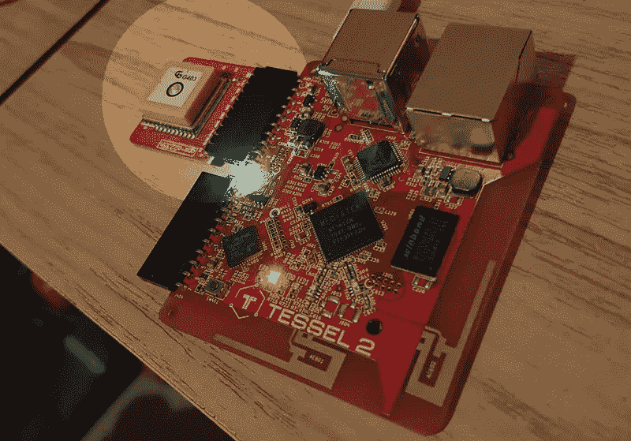
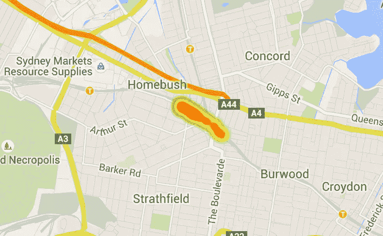

# 用 Tessel 2 追踪 GPS 数据

> 原文：<https://www.sitepoint.com/tracking-gps-data-with-the-tessel-2/>


*这是 SitePoint 的 IoT 周！整个星期，我们都在发布关于互联网和物理世界的交集的文章，所以请继续查看[物联网标签](https://www.sitepoint.com/blog/)的最新更新。*

Tessel 2 是一个以 JavaScript 为中心的微控制器，它有一系列预构建的模块，您可以附加这些模块来扩展它的功能。在本文中，我们将探讨在将 GPS 模块连接到 Tessel 2 时可以做些什么。

如果你是使用 Tessel 2 的新手，我在今年早些时候介绍了开始使用 Tessel 2 的基础知识。阅读第一部分，掌握在 Wi-Fi 上设置 Tessel 并向其推送代码的基础知识。它还教你如何让你的 Tessel 上的 led 疯狂闪烁。非常有价值的技能要知道！

## 连接 GPS 模块

要为您的 Tessel 带来一些 GPS 功能，请将其连接到 Tessel 2 上的端口 A，这是离 USB 电源连接器最近的一个端口:



正如你在上面看到的，你会想把它和那个大而笨重的矩形钻头和电子元件朝上连接起来。如果您查看引脚连接器，您会看到一个写着 GND 的连接器，这应该与 Tessel 2 的端口 a 上的 GND 相匹配。基本上，如果您连接不正确，会有很多迹象！

## 启动我们的 GPS Tessel 应用程序

为您的 Tessel 应用程序创建一个名为“gps”的文件夹(或者您喜欢的任何名称)。在终端/命令提示符下转到该文件夹，键入以下内容来初始化一个新项目:

```
t2 init
```

然后，在 npm 中运行以下命令来安装 GPS 模块:

```
npm install gps-a2235h
```

`gps-a2235h`应与您的 GPS 模块上的名称相匹配(这一点很重要，以防将来的 GPS 模块有所不同)。

如果你发现你得到一个类似这样的错误信息:

```
> cd examples ; pakmanager build || echo 'Could not build pakmanager package. Please make sure pakmanager is globally installed'

sh: pakmanager: command not found
Could not build pakmanager package. Please make sure pakmanager is globally installed
```

您将希望首先像这样全局安装它(然后再次尝试 gps 模块安装):

```
npm install pakmanager -g
```

## 我们 Tessel 的 JavaScript

我们的 Tessel 2 JavaScript 代码相对简单，如下所示:

```
var tessel = require("tessel"),
gpsLib = require("gps-a2235h"),
gps = gpsLib.use(tessel.port["A"]),
WebSocket = require('ws'),
ws = new WebSocket('ws://192.168.0.30:5000'),
latestCoords;

gps.setCoordinateFormat({
'format': 'deg-dec'
});

gps.on('ready', function() {
console.log('GPS module now searching for satellites...');

gps.on('coordinates', function(coords) {
console.log('Lat:', coords.lat, '\tLon:', coords.lon, '\tTimestamp:', coords.timestamp);
latestCoords = coords.lat + ',' + coords.lon;
});

gps.on('fix', function(data) {
console.log(data.numSat, 'fixed.');
});

gps.on('dropped', function(){
console.log('GPS signal dropped');
});
});

gps.on('error', function(err){
console.log('GPS Error: ', err);
});

ws.on('open', function() {
setInterval(function() {
if (latestCoords !== undefined) {
console.log('Trying to send coords of ' + latestCoords);

try {
ws.send(latestCoords, function ack(error) {
console.log('Error detected while sending: ' + error);
});
} catch (e) {
console.log('Error caught while sending: ' + error);
}
} else {
console.log('No coords coming through');
}
}, 10000);
});
```

让我们看看这里到底发生了什么。我们首先需要 Tessel 模块和我们的 GPS 模块:

```
var tessel = require("tessel"),
gpsLib = require("gps-a2235h"),
```

然后，我们通过告诉它我们的 Tessel 的物理 GPS 模块位于哪个端口来设置 GPS 模块。我把我的放在端口 A，我是这样定义的:

```
gps = gpsLib.use(tessel.port["A"]),
```

为了在我们的 Tessel 和服务器之间来回发送数据，我们将使用 WebSockets。由于 Tessel 2 运行 JavaScript 和 npm 模块，我们可以在 Tessel 上运行常用的`ws` WebSocket 模块。我们添加了`ws`模块，并设置它来监视我们的服务器位置。我全部在本地运行，我的 Mac 运行连接到我的 4G 路由器的节点服务器，我的 Tessel 也连接到同一个 4G 路由器。这允许我直接使用 IP 地址来引用服务器。

```
WebSocket = require('ws'),
ws = new WebSocket('ws://192.168.0.30:5000'),
```

如果您想让它在 web 上运行，您可以将它托管在一个可公开访问的服务器上，并将 WebSocket 设置更改为:

```
ws = new WebSocket('ws://www.myfancynodeserver.com'),
```

最后，我们设置一个名为`latestCoords`的变量，用来存储 GPS 模块返回给 Tessel 的最新坐标。

### Tessel 的 GPS 功能

在我们的变量和模块声明之后，我们进入 Tessel 的实际功能，这些功能都集中在 Tessel 的`gps-a2235h`模块提供的 GPS 功能上。

首先，我们设置返回的 GPS 坐标的格式。您可以尝试一系列不同的选项，包括`'deg-min-sec'`、`'deg-dec'`、`'deg-min-dec'`和`'utm'`。对于我们的例子，我们将使用`'deg-dec'`，它产生的度数看起来像这样:`[ 31, 46, 5401.2, 'E' ]`。要设置格式，我们使用以下内容:

```
gps.setCoordinateFormat({
'format': 'deg-dec'
});
```

为了在 GPS 数据到达时做出响应，我们需要首先等待接收来自 GPS 模块的`"ready"`事件。像许多其他 JavaScript 框架一样，我们为此使用了`on()`函数。我们所有的 GPS 事件检测都发生在这个范围内:

```
gps.on('ready', function() {
console.log('GPS module now searching for satellites...');

// Further functionality will be here.
});
```

我们将关注的最有用的 GPS 事件是`'coordinates'`事件。当这个事件触发时，我们的 GPS 模块已经返回了它的位置的一系列坐标。在我们的例子中，它在一个名为`coords`的变量中提供了这些信息，这个变量既包含经度`coords.lon`又包含纬度`coords.lat`。我们将这两个值放在一个字符串中，并保存在`latestCoords`中:

```
gps.on('coordinates', function(coords) {
console.log('Lat:', coords.lat, '\tLon:', coords.lon, '\tTimestamp:', coords.timestamp);
latestCoords = coords.lat + ',' + coords.lon;
});
```

您可以关注的另一个事件是`'fix'`事件。这将返回我们的模块能够定位到多少 GPS 卫星来计算位置。在悉尼时，我的演示通常会找到五个或六个，所以你可以将此作为常规数字的基线。当这些值通过时，我使用以下命令记录它们:

```
gps.on('fix', function(data) {
console.log(data.numSat, 'fixed.');
});
```

如果 GPS 信号由于某种原因丢失，将触发`'dropped'`事件。我们这样记录:

```
gps.on('dropped', function(){
console.log('GPS signal dropped');
});
```

在`'ready'`事件之外，如果出现 GPS 错误，模块根本无法搜索到卫星，我们使用`'error'`事件进行检测:

```
gps.on('error', function(err){
console.log('GPS Error: ', err);
});
```

### 发送定期 WebSocket 更新

我们设置了一个简单的间隔计时器，每 10 秒运行一次，而不是不断地发送 GPS 信号，这可能有点过于频繁和不必要。一旦我们的 WebSocket 连接打开并准备就绪，这就开始了:

```
ws.on('open', function() {
setInterval(function() {
// Our functionality will be in here
}, 10000);
});
```

在我们的`setInterval`中，我们检查是否有任何坐标存储在`latestCoords`中。如果是这样，我们尝试通过我们的 WebSocket 连接发送它们。这被放置在一个 try/catch 循环中，以避免在出现任何问题时崩溃我们的 Tessel:

```
if (latestCoords !== undefined) {
console.log('Trying to send coords of ' + latestCoords);

try {
ws.send(latestCoords, function ack(error) {
console.log('Error detected while sending: ' + error);
});
} catch (e) {
console.log('Error caught while sending: ' + error);
}
}
```

## 我们的 Node.js 服务器

我们的 Node.js 服务器是一个典型的 WebSocket 服务器，它监视 WebSocket 消息，然后将这些消息广播给连接到 WebSocket 服务器的所有客户机。这将把坐标从我们的 Tessel 广播到任何正在等待查找最新坐标的 web 浏览器:

```
var http = require('http'),
url = require('url'),
express = require('express'),
app = express(),
bodyParser = require('body-parser'),
server = require('http').Server(app),
WebSocketServer = require('ws').Server,
wss = new WebSocketServer({server: server}),
port = process.env.PORT || 5000,
latestCoords;

app.use(bodyParser.json());

app.use(express.static(__dirname + '/public'));

wss.on('connection', function connection(ws) {
ws.on('message', function incoming(message) {
console.log('received: %s', message);

if (message) {
latestCoords = message;
broadcast(latestCoords);
}
});
});

function broadcast(message) {
if (message) {
wss.clients.forEach(function each(client) {
client.send(message);
});
}
}

server.listen(port, function() {
console.log('Listening on ' + port);
});
```

它还运行 Express，允许我们通过它提供网页。我们将静态 web 内容添加到“服务器”文件夹的“/public”文件夹中，这是由我们的节点服务器定义的:

```
app.use(express.static(__dirname + '/public'));
```

这是我们放置前端代码以显示地图的地方——但是需要注意的是，您可以在任何地方托管这些内容。我把它放在同一个服务器上，只是为了让本教程的所有内容尽可能独立。

## 添加谷歌地图

为了简单起见，我们的前端都在一个单独的`public/index.html`文件中。我不会涉及使用谷歌地图 API 的绝对基础知识，因为我们之前已经在 SitePoint 的[以正确的方式利用谷歌地图 JavaScript API](https://www.sitepoint.com/google-maps-javascript-api-the-right-way/)中涉及过，甚至还有一个由 Robert Dickerson 开设的名为[谷歌地图 API 介绍](https://www.sitepoint.com/premium/courses/introduction-to-google-maps-api-2895)的完整在线课程。

如果你想继续下去，并且已经知道谷歌地图是如何工作的，请继续！这是我们的基本 HTML 布局:

```
<!DOCTYPE html>
<html>
<head>
<title>MAPS!</title>
<style> html, body {
height: 100%;
margin: 0;
padding: 0;
}
#map {
height: 100%;
} </style>
</head>
<body>
<div id="map"></div>
</body>
</html>
```

在 body 标签的底部，我内联了我的 JavaScript——您可以将它放在一个单独的文件中，或者放在您喜欢的地方。JavaScript 是这样开始的:

```
var clientWebSocket = new WebSocket('ws://192.168.0.30:5000'),
map,
markers = [],
heatmap,
centered = false;
```

`clientWebSocket`变量是我们存储客户端 WebSocket 的地方，它连接到我们正在运行的 Node.js 服务器。`map`将是我们的谷歌地图，`markers`将是我们的 Tessel 返回的坐标数组，`heatmap`将是谷歌地图 API 热图，`centered`只是跟踪地图是否以我们的位置为中心，而不是我们默认提供的通用纬度/经度。

一旦 Google Maps 回调函数运行，JavaScript 中的所有其他内容都由初始化。我将 Google Maps API 放入我的项目中，如下所示:

```
<script src="https://maps.googleapis.com/maps/api/js?key=YOURKEY&libraries=visualization&callback=initMap"
async defer></script>
```

然后一切都在`initMap()`函数中运行:

```
function initMap() {
map = new google.maps.Map(document.getElementById('map'), {
center: {lat: -34.397, lng: 150.644},
zoom: 12
});

// The rest of our WebSocket functionality will be here
}
```

之后，我们设置了对任何 WebSocket 消息的检查。如果我们收到它们，我们将它们过滤成`{lat: -34.397, lng: 150.644}`的格式，并在控制台中记录它们:

```
clientWebSocket.onmessage = function(e) {
var latLngRaw = e.data.replace(/  /g, ''),
latLngSplit = latLngRaw.split(','),
lat = latLngSplit[0] * (latLngSplit[1] === 'S' ? -1 : 1),
lng = latLngSplit[2] * (latLngSplit[3] === 'W' ? -1 : 1),
pos = {lat: lat, lng: lng};

console.log(pos);

// Google Map marker functionality will go here
}
```

之后，我们将它添加到我们的`markers`数组中。如果我们既有纬度值又有经度值，那么我们就可以这样做了。我们还将地图置于初始位置的中心:

```
if (!isNaN(pos.lat) && !isNaN(pos.lng)) {
marker = new google.maps.LatLng(lat, lng);

markers.push(marker);

if (!centered) {
map.setCenter(marker);
centered = true;
}
}

// Heatmap functionality will go here
```

最后，对于更新后的`markers`阵列，我们使用 Google Maps API 将其添加到热图中(或将热图重置为更新后的阵列):

```
if (heatmap) heatmap.setMap(null);
heatmap = new google.maps.visualization.HeatmapLayer({
data: markers
});
heatmap.setMap(map);
```

*您可能不需要对`null`位进行初始设置(这将导致每次更新时闪烁)，但是我将它添加在那里以确保地图出于性能目的是清晰的(不希望一次添加多个阵列，因为我的 GPS 热图在运行一段时间后会变得非常大！).请随意删除它，看看它运行得有多好。我可能会在我自己的版本中删除它。*

拥有一种对任何 WebSocket 错误做出反应的方法也是一种很好的做法:

```
clientWebSocket.onerror = function(error) {
console.log('Error with WebSocket: ' + error);
};
```

## 在活动

如果我们首先通过运行以下命令来运行服务器:

```
node index.js
```

然后，通过运行以下命令运行我们的 Tessel GPS 代码:

```
t2 run index.js
```

最初，在 Tessel 应用程序的终端上，我们会看到:

```
0 'fixed.'
0 'fixed.'
0 'fixed.'
0 'fixed.'
0 'fixed.'
```

这表明还没有发现卫星。尽量确保它能看到天空——这将有助于你的机会！一旦它找到一些卫星，你会看到:

```
3 'fixed.'
Lat: [ 33.8666, 'S' ] Lon: [ 151.08533333333332, 'E' ] Timestamp: 75903.769
Lat: [ 33.8666, 'S' ] Lon: [ 151.08533333333332, 'E' ] Timestamp: 75903.769
3 'fixed.'
Lat: [ 33.866595, 'S' ] Lon: [ 151.085355, 'E' ] Timestamp: 75904.765
Lat: [ 33.866595, 'S' ] Lon: [ 151.085355, 'E' ] Timestamp: 75904.765
```

在 Node.js 服务器上，一旦坐标开始出现，您将在终端中看到以下内容:

```
received: 34.27340792375617,S,146.02321379585192,E
received: 33.786892811069265,S,147.00557255884632,E
received: 32.00388987502083,S,145.91804205672815,E
received: 34.48931397567503,S,148.91048887046054,E
received: 34.59769207518548,S,145.09519725223072,E
received: 33.53758704382926,S,145.1981749490369,E
received: 33.66241379012354,S,149.52391665312462,E
```

如果我们转到`http://localhost:5000`，用谷歌地图加载我们的前端网络界面，我们应该会看到一张谷歌地图，上面有 GPS 发现区域的热图。我在去悉尼中央商务区的火车上运行了这个，它看起来是这样的:



## 结论

这就结束了一个使用 Tessel 2 和 GPS 模块获取 GPS 数据的有趣项目。使用热图实际上可以让你看到 GPS 跟踪越来越精确，我觉得这很有趣。在家里运行 GPS 应用程序一整天，开始是跟踪离我几个门的位置，但后来我可以看到随着时间的推移，GPS 热图慢慢地越来越接近我的实际位置。相当整洁！

如果你有一个 Tessel 2，并用它做了一些有趣的东西，我很想听听你做了什么！请在下面的评论中告诉我，或者在 Twitter 上通过 [@thatpatrickguy](https://www.twitter.com/thatpatrickguy) 与我联系。

## 分享这篇文章