# 如何使用 Weglot 插件翻译 WordPress 网站

> 原文：<https://www.sitepoint.com/translate-wordpress-websites-using-weglot/>

*这篇关于如何翻译 WordPress 网站的文章[最初由 Torque 杂志](https://torquemag.io/2018/05/translate-your-wordpress-website-weglot-translate/)发表，经允许在此转载。*

将你的 WordPress 网站翻译成其他语言是一个聪明的方法，可以获得更广泛的受众，增加你的流量。如果你的网站只有一种语言，你可能会失去很多潜在的线索和转换。

幸运的是，你不需要说多种语言来翻译你的网站——使用 [Weglot Translate](https://wordpress.org/plugins/weglot/) 插件，这个过程很简单。使用这个，你可以自动翻译你的 WordPress 站点的每一部分，并且手动微调你的翻译。

在这篇文章中，我们将讨论为什么你可能想要翻译你的网站。然后我们将介绍 Weglot Translate 插件及其主要特性，并向您介绍如何使用它向您的站点添加更多语言。我们还将探索插件的一些关键定制选项。我们开始吧！

## 为什么你应该翻译你的 WordPress 网站

据估计，世界上有将近 7000 种不同的语言，然而超过一半的 T2 网站只使用一种语言:英语。这在某种程度上是有道理的，因为它是互联网用户最常用的语言[。然而，这是目前唯一的一个。就发言人数而言，它几乎与中文持平，中文出现在所有网站中的比例不到 2%。同样，尽管有 5 亿用户说西班牙语，但只有 5%多一点的网站使用这种语言。](https://www.internetworldstats.com/stats7.htm)

简而言之，仅用英文发布你的网站，你就有效地限制了它的范围。如果你的网站有一个国际焦点，比如电子商务业务，你不应该期望所有用户都能流利地使用一种语言。因此，许多网站正在采取措施提供翻译内容，以便更受更广泛受众的欢迎。例如，WordPress 有一个多语言团队，他们致力于将这个平台翻译成尽可能多的语言。

除了让你的网站[更容易访问](https://make.wordpress.org/accessibility/)之外，翻译对你也有很多好处:

*   你可以瞄准更多的观众。
*   如果你为你页面的每个翻译版本创建一个独特的 URL，它会提高你的搜索引擎优化排名。
*   它增加了潜在转换的数量，因为如果网站是用他们的母语，人们更有可能转换。
*   你可以和你的观众建立信任。

考虑到这些，你应该考虑让你的网站更加国际化。但是，在此之前，我们先来看看一些关键的注意事项。

## 在翻译你的网站之前你需要考虑什么

在你翻译你的网站之前，有一些事情你应该记住。首先，您需要考虑实现和兼容性。我们稍后会更详细地讨论这个问题，但是你需要使用一个在你的站点上容易实现的解决方案，比如一个 WordPress 插件。

您还需要考虑您想要使用哪些语言。这可以通过调查你的[网站的分析](https://torquemag.io/2016/02/6-things-google-analytics-can-tell-you-about-your-wordpress-website/)来实现，看看你的访问者来自哪里。你还应该进行[关键词研究](https://torquemag.io/2016/10/wordpress-seo-find-the-right-keywords-for-your-site/)，重点是多语言关键词。这应该让你对谁是你的访问者有一个坚实的概念，哪些语言可以帮助你增加你的观众。

我们还建议研究“[语言对](https://www.sajan.com/spotlight-language-pairs-overview/)”。基本上，这是你的内容当前使用的语言和潜在的翻译语言的组合。简而言之，考虑最常见的语言对，以及哪些对你的网站最有意义。

最后，你需要找到一个适合你的翻译解决方案。现在让我们来看一些。

## 看看 WordPress 特有的翻译解决方案

翻译网站最基本的方法就是雇佣一名翻译。虽然这可以产生好的结果，但也不是没有问题。你可能需要为你想使用的每一种语言配备一个翻译，这可能会很贵。如果你的网站很大，这也将花费大量的时间，更不用说随着你的网站增长的维护。

更有效的选择是使用机器翻译。如果你用过谷歌翻译，你会对这个概念很熟悉。本质上，这是一个自动的过程，翻译你的网站，没有人的互动。这种方法省时很多，通常也更便宜，但也是出了名的不完美。因此，您需要确保您使用的解决方案能够定制生成的翻译。

有几个 WordPress 插件你可以用，比如 [Weglot 翻译](https://wordpress.org/plugins/weglot/)、 [WPML](https://wpml.org/) 、 [Polylang](https://wordpress.org/plugins/polylang/) 。你需要确保你选择的插件与你的网站和其他插件兼容。例如，如果你的网站运行 WooCommerce，而你的插件是不兼容的，那么大量的内容将无法翻译。

### Weglot 翻译简介

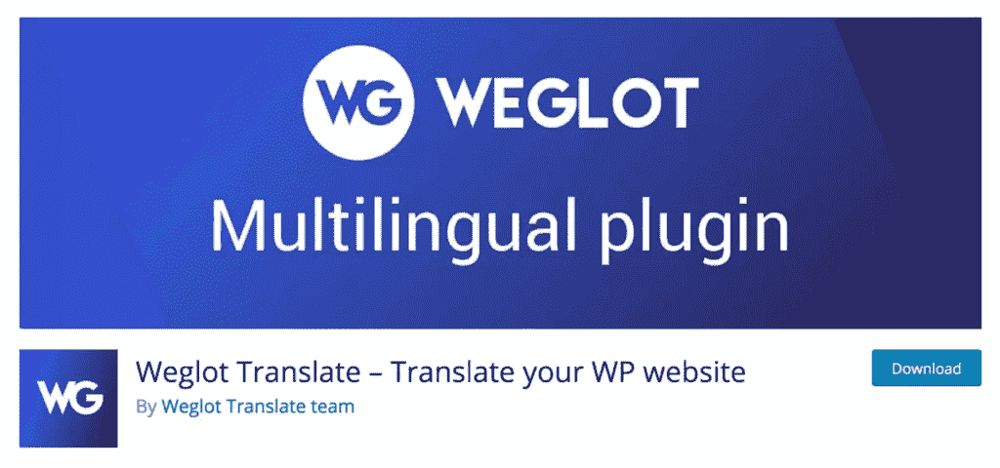

Weglot Translate 是一个插件，可以让你自动创建整个 WordPress 站点的完整翻译版本。这个插件是最容易使用的选项之一，可以在几秒钟内翻译你的网站。它提供了 100 多种不同的语言，完全兼容所有的主题和插件，包括电子商务解决方案[，如 WooCommerce](https://torquemag.io/2016/04/woocommerce-tutorial/) 。Weglot 也有专业翻译的链接，如果需要，你可以选择订购翻译。

## 关键特征

*   翻译你的整个 WordPress 网站，并完全兼容任何主题或插件，包括 [WooCommerce](https://wordpress.org/plugins/woocommerce/) 。
*   由于即插即用的快速设置，只需极少的配置。
*   自动为多语言页面应用 Google 的 SEO [最佳实践。](https://support.google.com/webmasters/answer/182192?hl=en)
*   让您完全控制您的内容和翻译，实现轻松协作。

价格:Weglot 提供一个免费版本和几个[高级计划](https://weglot.com/pricing)，起价大约每月 12 美元(9.90 欧元)。

## 如何使用 Weglot 翻译插件翻译你的 WordPress 网站

现在让我们通过使用 Weglot Translate 翻译一个站点来将所有这些理论付诸实践。我们将使用一个运行 WooCommerce 和[店面主题](https://woocommerce.com/storefront/)的网站，但 Weglot Translate 与所有 WordPress 网站兼容，无论主题和插件如何。

我们的网站目前只有英语版本，但我们想创建一个瑞典语版本。以下是原始网站:

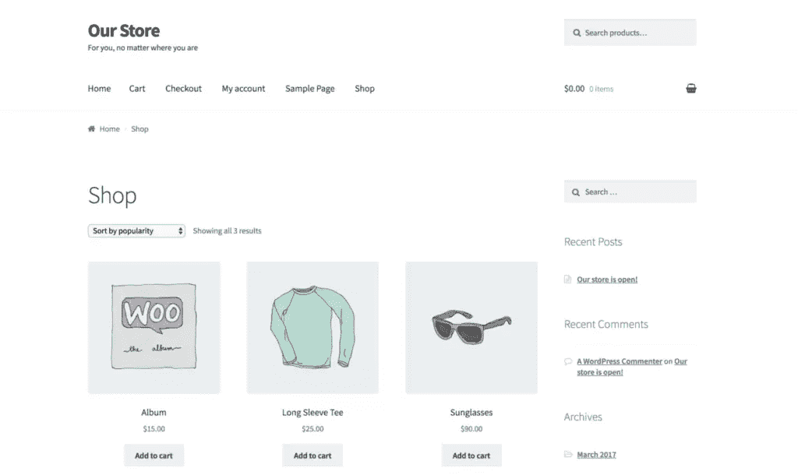

首先，你需要[从 WordPress.org 插件目录下载、安装并激活](https://codex.wordpress.org/Managing_Plugins#Automatic_Plugin_Installation)Weglot 翻译插件。

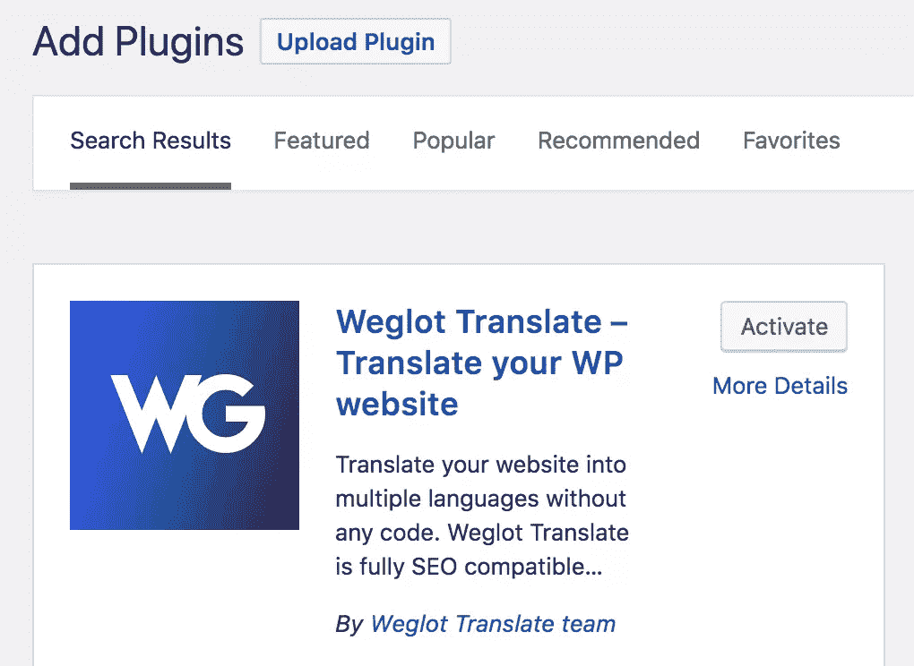

接下来，你需要一个 API 密匙，你可以通过注册一个 Weglot 账户免费获得。您将看到您的 API 密钥出现，以及到您的个人仪表板的链接。我们一会儿会回到这个话题，但是现在，复制你的密钥并回到你的 WordPress 站点。

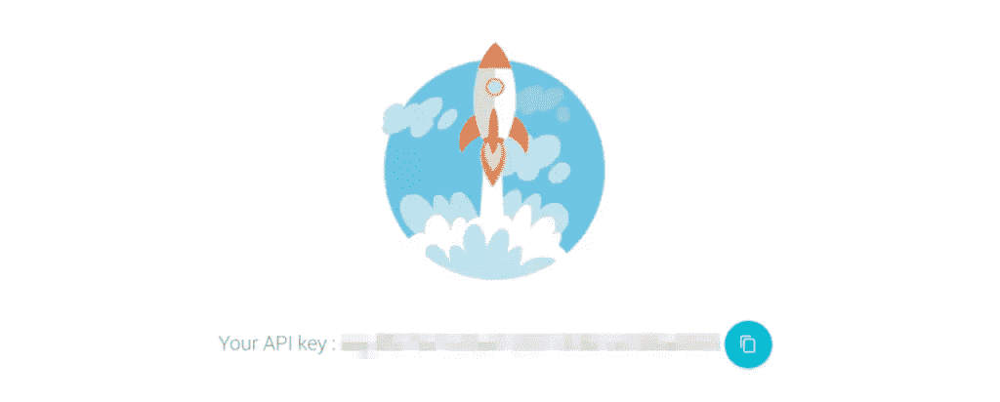

在你的 WordPress 仪表盘上点击新的 Weglot 选项，你将被带到你的翻译配置页面。在这里，你可以为你的网站创建新的翻译，并决定它在 WordPress 中的显示方式:

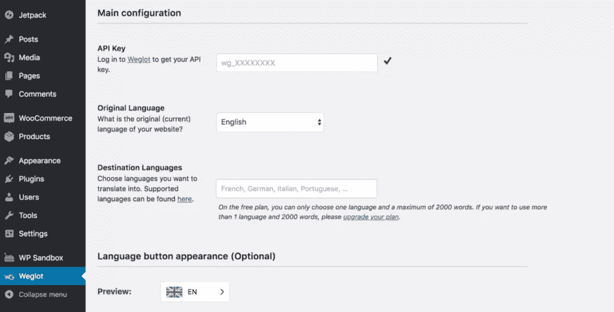

首先在第一个字段中粘贴您的 API 键，然后开始创建您的第一个翻译。保持原始语言设置为*英语*，然后选择*瑞典语*作为*目的语言*。

下一节让您决定语言选择器将如何出现在您的站点上。您可以设置它的外观，以及它在页面上的默认显示位置:

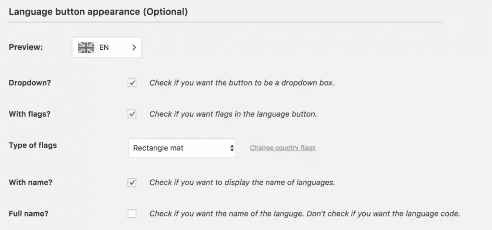

最后，您可以添加排除项，将翻译限制在网站的特定部分:

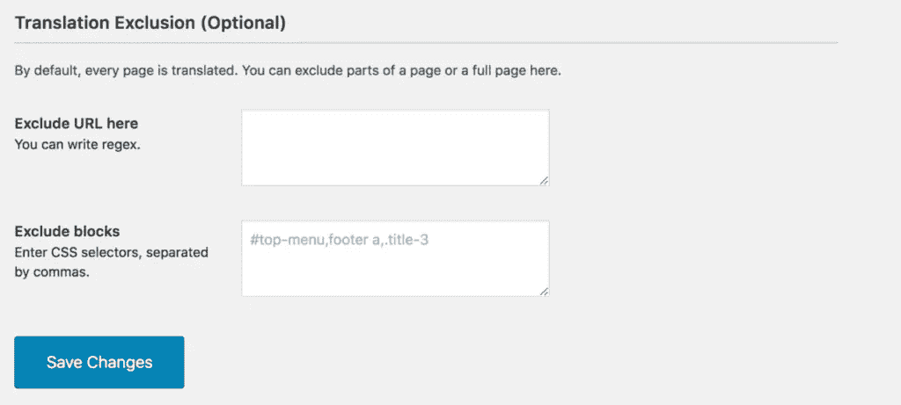

完成后点击*保存更改*，你的网站将会是多语言的！为了检查结果，打开您的站点并找到您创建的选择器。默认情况下，它会出现在右下角:

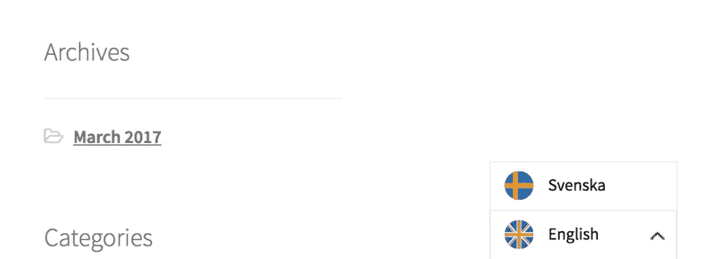

选择*瑞典语*，网站将加载代表该语言的 URL 的新扩展名。在这种情况下，`/sv/`。

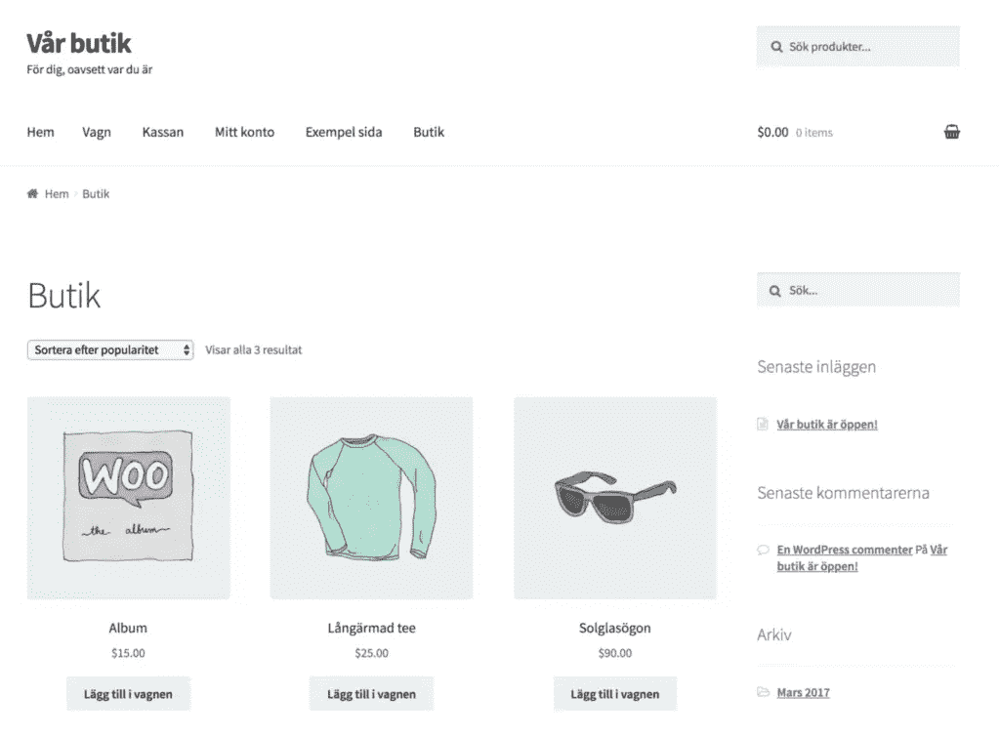

这看起来很棒，但因为翻译是自动的，它可能需要一些小的微调来使它完美。你可以通过返回到你的 Weglot 仪表板很容易地做到这一点，你可以通过 WordPress:

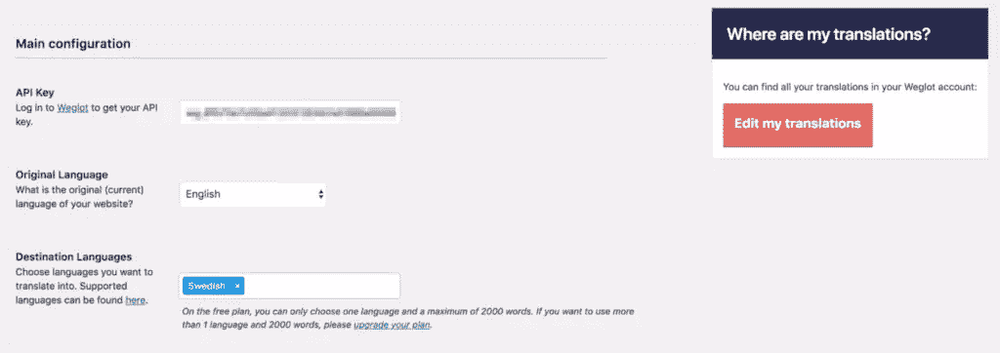

点击*编辑我的翻译*访问您的仪表板。在这里，您可以点击*翻译列表*，查看您网站上所有已翻译的内容:

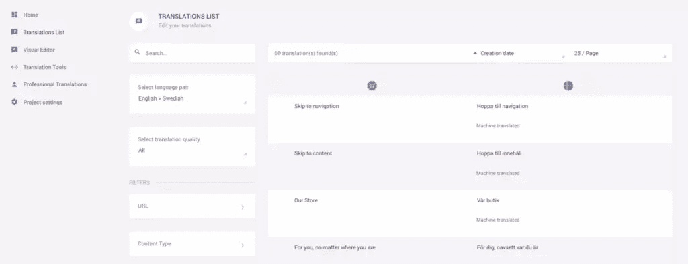

您可以看到所有的元素都被机器翻译了，但是您可以通过简单地选择翻译并键入替换来编辑一个元素。

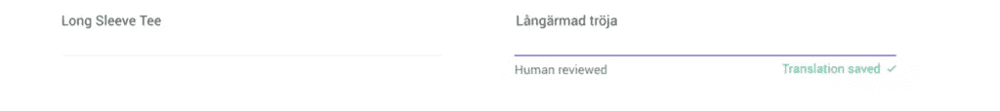

您会注意到翻译后的元素会被自动保存，并标记为*人工审查*。它还会在您的网站上实时更新:

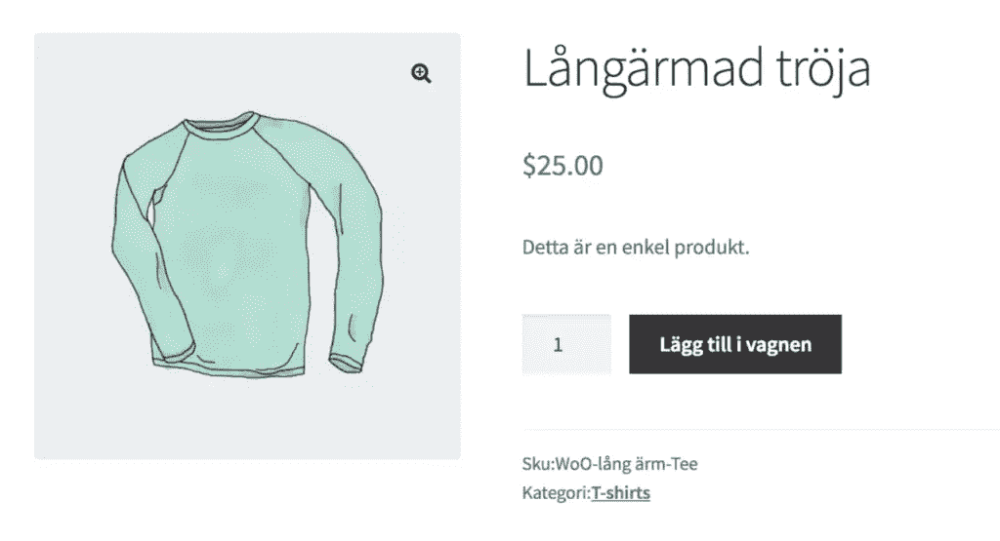

您也可以使用 Weglot 可视化编辑器直接在您的页面上添加和编辑翻译。

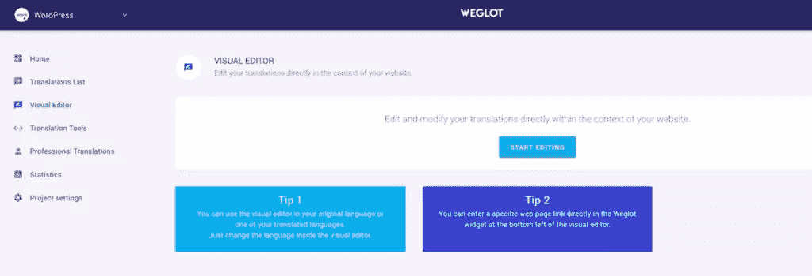

当你点击*开始编辑*时，你当前的站点就会加载。将鼠标悬停在任何页面元素上，您会注意到出现一个绿色按钮覆盖图:

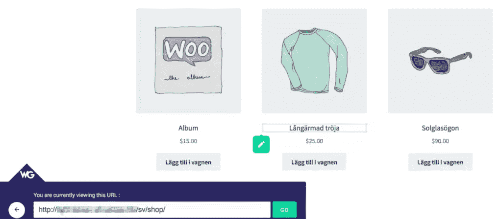

您可以单击此处添加或编辑所选元素的翻译。将出现一个弹出窗口，您可以在其中看到原文和当前翻译:

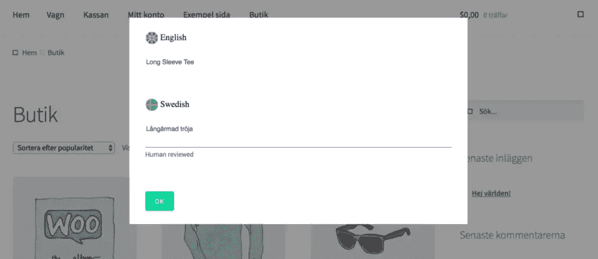

根据您的要求进行更改，然后单击 OK 保存。新的翻译将立即出现在你的网站上，就像以前一样。这样，我们为我们的网站创建了一个全新的翻译！当然，无论你想翻译多少种语言，你都应该重复这个步骤。

## 结论

将你的网站翻译成多种语言似乎是一个不可能的目标，尤其是如果你自己不会说多种语言的话。然而，多亏了 Weglot Translate 插件，你可以快速创建一个网站，获得迎合非母语人士的所有好处，但没有时间消耗和麻烦。

在这篇文章中，我们已经全面讨论了这些好处，包括它如何让你接触到更广泛的国际受众，以及增加你的搜索引擎优化排名和 T4 转化率。我们建议花点时间考虑你的网站将受益于哪些语言，然后使用 Weglot Translate 轻松地将翻译添加到你的网站！

## 分享这篇文章