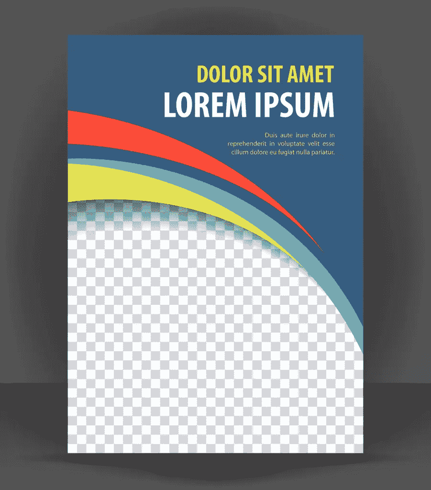

# trans hporm——一种不同的模板引擎

> 原文：<https://www.sitepoint.com/transphporm-a-different-kind-of-template-engine/>

如果这个世界需要一样东西，那肯定是另一个 PHP 模板引擎！但是等等，这个不一样！

许多 PHP 模板引擎( [Smarty](http://www.smarty.net/) 、 [Blade](http://laravel.com/docs/5.1/blade) 、 [Twig](http://twig.sensiolabs.org) …)只不过是抽象的 PHP 代码，使得编写循环、if/then/else 块和显示变量比普通 PHP 更简单。这些传统的模板引擎要求设计者理解特殊的语法。模板引擎也必须到位并可操作，以便解析数据，从而完整地呈现最终设计。这没有错。



trans hporm 遵循一种不同的方法，通常被称为“模板动画”。这意味着网页设计者创建了包含占位符内容(如“Lorem Ipsum ”)的**整个** HTML/CSS/JS 页面，然后模板引擎出现，并在最终呈现之前用新数据替换部分 DOM。

模板动画的好处是设计者不必知道后端代码、模板语言或任何特殊的语法。他们可以使用任何他们想要的工具来创建 100%功能性的 HTML 页面。

设计人员工作时，服务器端软件甚至不需要运行。这意味着设计人员不必等待后端提供数据供他们使用。

基本上，设计师可以这样做:

```
<h1>A Good Title Here</h1>
<p>A subtitle</p>

<p>Some awesome text for clients to see.</p> 
```

而不是这个:

```
<h1>{$futuretitle|upper}</h1>
<p>{$futuresubtitle|capitalize:true|default:'Default Text'}</p>

<p>{$futureawesometext}</p> 
```

第一个例子中的占位符内容将被 Transphporm 替换。在第二个示例中，模板引擎必须能够正常工作并解析模板，以便看到设计者设想的最终设计。

注意关注点的分离是如何达到接近 100%的。设计者不需要知道特殊的语法或代码。在服务器端，Transphporm 不需要硬编码任何 HTML 标签。前端没有逻辑和代码，后端也没有硬编码的表示和节点。

注意:后端可能仍然产生合理的 HTML 标签，比如通过所见即所得编辑器创建的标签。即 img、a、p、strong、em 等。，但做对的时候千万不要挡关卡。

让我们看看这是如何工作的。如果你想跟随，请[准备一个新的环境](https://www.sitepoint.com/quick-tip-get-homestead-vagrant-vm-running/)。

## 安装传输平台

在我们项目的`public`文件夹中，我们将通过 Composer 安装包。

```
composer require level-2/transphporm:dev-master 
```

然后，我们创建一个新的`index.php`文件，内容如下:

```
<?php

require 'vendor/autoload.php'; 
```

*注意:频繁运行`composer update`，因为 Transphporm 是一个活动项目。在撰写本文期间，它更新了几次。*

## 创建您的页面

Transphporm 在设计层面不需要前端语法或特殊代码。在将输出呈现到浏览器之前，我们将使用类似 CSS 的选择语言来查找和替换内容。

根据模板动画的本质，理论上我可以从网上抓取任何现成的模板，只要它是有效的**XHTML**。这意味着`<meta charset='utf-8' />`而不是当前 HTML5 中的`<meta charset='utf-8'>`。现代实践是不使用自结束标记，但是为了 XML 有效，我们必须这样做。注意，您的*最终呈现*可以是 HTML5，但是您为 Transphporm 创建的模板必须是 XHTML。这就是使用 PHP 的 XML 方法的本质。

Transphporm 对象需要两个值。一个是代表设计者模板的有效 XHTML 标记。它可以是整个页面，也可以只是在更大的主题中使用的 XHTML 片段。另一个是包含替换逻辑的 TSS(trans hporm 样式表)指令。

参考 [github 页面](https://github.com/Level-2/Transphporm)获取完整的文档，因为我只能在这篇文章的长度内详细描述。

将此添加到`index.php`文件:

```
$page = 'home.xml';

$tss = 'home.tss';

$template = new \Transphporm\Builder($page, $tss);

echo $template->output()->body; 
```

现在用这个基本的 XHTML 模板创建`home.xml`文件:

```
<!DOCTYPE html>
<html lang="en">
    <head>
        <meta charset="utf-8" />

        <title>HTML5 TEMPLATE</title>

        <style> body { padding: 20px; font-size:1em; }
            header nav { background-color:#ACEAD0; padding:15px 10px; }
            header nav ul { padding:0; }
            header nav li { display:inline; list-style:none; margin-right:15px; }
            header nav a { text-decoration:none; }
            article header h1 { margin-bottom:4px; color:#34769E; font-size:2em; }
            article header h2 { margin:0; font-size: .8em; color:#555; }
            article p { font-family:Arial, sans; color:#444; line-height:1.4em; }
            footer { background-color: #444; padding:10px; }
            footer p { color:#E2E2E2; } </style>

    </head>

    <body>
        <header>
            <nav>
                <ul>
                    <li><a href="#">Home</a></li>
                    <li><a href="#">The Goods</a></li>
                    <li><a href="#">Favorites</a></li>
                    <li><a href="#">Media</a></li>
                    <li><a href="#">Contact</a></li>
                </ul>
            </nav>
        </header>

        <main>
            <article>
                <header>
                    <h1>Page Title</h1>
                    <h2>By Jehoshaphat on Jan 1, 2015</h2>
                </header>

                <p>Lorem ipsum dolor sit amet, consectetur adipisicing elit. Ut voluptas deserunt in quam itaque consequatur at recusandae, veritatis placeat porro cum magni eos iure vero, obcaecati est molestiae quos enim.</p>

                <p data-p="yes">Lorem ipsum dolor sit amet, consectetur adipisicing elit. Commodi sed asperiores cum explicabo praesentium, mollitia possimus nam. Aperiam autem doloribus hic. Ex quae quia fugiat, fugit eaque quam adipisci nemo.</p>

                <ul>
                  <li>A list item 1</li>
                </ul>
            </article>
        </main>

        <footer>
            <p>footer stuff</p>
        </footer>

    </body>
</html> 
```

现在用这个创建一个`home.tss`文件:

```
article h1 {content: "My New Page Title"} 
```

TSS 指令使用类似 CSS 的语法“选择”h1。“查找作为文章标签的子标签的 h1”。请注意，特殊性很重要。如果你有许多文章标签或 h1 标签，它们都将被选择和改变！

对于像`<li>`这样的重复节点来说尤其如此。如果我们的模板中有多个列表项，那么每个单独的列表项都将被整个重复的数据集所替换！

如果您的`index.php`、`home.xml`和`home.tss`文件已经正确创建，您应该能够打开网站并查看模板。模板有`<h1>Page Title</h1>`,但是在浏览器中呈现时，您应该实际看到“我的新页面标题”。

Transphporm 支持常见的 CSS 语法，包括:

*   `.classname`
*   `tagname.classname`
*   `direct > descendant`
*   `#id`
*   `element[attribute="value"]`或简称为`element[attribute]`

不支持的方法包括`~`和`+`。

除了这些选择器，Transphporm 还支持伪元素，包括:

*   `element:before`
*   `element:after`
*   `element:nth-child(n)`
*   `element:even`
*   `element:odd`

你可以像在 CSS 中一样将选择器链接在一起。

```
article header > p {content: "First paragraph after the article header section"} 
```

这是简单的事情，希望是直截了当的。

此时，您肯定在想“但是我不想在 TSS 指令中硬编码文本！”

好吧，这就是乐趣的开始。

## 处理数据

让我们假设这个项目有点复杂。您不太可能将新的`<h1>`内容硬编码到 TSS 文件中！您可能会有不止一条内容需要更新。

我将创建一个名为`$data`的对象，并给它赋值。

将`index.php`更新为:

```
require 'vendor/autoload.php';

// Some fancy routing to setup the page.
$page = 'home.xml';
$tss  = 'home.tss';

// Some fancy controller/model action to get data.
$data = new stdClass;

$data->pagetitle = "Awesome Page";
$data->title     = "Article Title";
$data->subtitle  = "By Zack";

$template = new \Transphporm\Builder($page, $tss);

echo $template->output($data)->body; 
```

现在我们有了作为对象的`$data`。我们还将`$data`添加到了`output()`方法中。

home.tss 文件现在可以更新为:

```
title {content: data(pagetitle)}
article h1 {content: data(title)}
article h1 > h2 {content: data(subtitle)} 
```

我们使用的名为`content`的属性接受名为`data()`的值。这类似于在 CSS 中你可以提供`rgba()`作为`color`的值。

此时，我们可以利用 CSS 语法替换任何内容。注意，我们甚至替换了`<head>`部分的内容。

## DOM 关注

在这一点上，你可能在想，设计者和程序员不必互相交谈；但在某种程度上，他们确实如此。设计者必须使用正确的 XHTML，否则引擎会崩溃(错误处理可能会随着时间的推移而改进)。

您可能想知道如果设计者更改了 DOM 并因此破坏了 TSS 选择会发生什么。这种情况可能会发生，尤其是如果您更多地依赖于 DOM 树，而不是考虑周全的 id 和类。我宁愿使用`id="posttitle"`而不是依赖`main article header > h1`，后者可能并不总是一成不变的。

### 多重偏音

我们还可以利用多个 XML 文件来组装最终的模板。

下面是一个 TSS 文件示例:

```
@import 'another.tss';

aside {content: template("sidebar.xml")} 
```

我们可以使用`@import`来包含其他 TSS 文件。我们还可以使用`template()`将部分 xml 分配给选中的节点，如上所示。任何跟在之后*的 TSS 指令都会影响包含的 xml 文件。*

这样，您就可以精心设计 xml 片段和 TSS 指令的导入，以组装最终的页面。就像 CSS 一样，一切都是自顶向下编译的。

不仅如此，您还可以用包含的模板的部分内容替换内容。在上面的例子中，我包含了整个`sidebar.xml`文件。但是如果我只想要那个文件中的`<aside>`呢？只要这样做:

```
aside {content: template("sidebar.xml", "#extra aside")} 
```

这只会将`<aside>`从 ID 为“extra”的元素下拉出。这样做的好处是，设计者仍然可以使用完整的模板，即使您可能只提取某些元素。这也意味着，正如您可以将图像组合到一个文件中，并根据需要使用 CSS 显示它们一样，您也可以将模板元素组合到一个文件中，并只提取您需要的部分。

## 高级指令

你可能会担心，如果设计者将设计分成许多部分，这是否违背了模板动画的目的，因为现在你需要 Transphporm 将它重新组合起来？算是吧。

这是因为“主”模板仍然包含设计者的完整模型。那里没什么变化。“真正的”最终标记将在分音内。这使得设计师的工作稍微复杂一点，因为他们必须在视觉上编辑主要设计，然后复制和修改部分内容以用于制作。如果他们更新主页面，他们可能也要更新部分页面。

如果你回头参考我们的基本 HTML 模板，partials 可以很容易地用于页眉、菜单、主要内容区域、页脚等。但是把这些放在局部并不影响设计者能够保持基本模板的完整和视觉上的完整性。稍后，部分标记将简单地替换占位符标记。

正如我们刚刚看到的，分部本身可以是一个更大的复杂或完整页面的一部分。

### 重复数据

Transphporm 可以通过使用一个`repeat()`属性来处理重复数据。

我们的模板有一个无序列表。我们可以通过使用`$data`传递一个对象数组来填充它。让我们给`index.php`添加一个水果对象数组。

```
$fruits = []; // Master array of all fruits

$fruit = new stdClass;
$fruit->name = 'Apple';

$fruits[] = $fruit;

$fruit = new stdClass;
$fruit->name = 'Pear';

$fruits[] = $fruit;

$data->fruits = $fruits; 
```

现在在 TSS 文件中:

```
article ul li {repeat: data(fruits); content: iteration(name)} 
```

如果您已经将数据添加到`index.php`并更新了 TSS 文件，那么无序列表现在应该有两个`<li>`节点，分别列出“Apple”和“Pear”。

之前:

```
<ul>
    <li>A list item 1</li>
</ul> 
```

之后:

```
<ul>
    <li>Apple</li>
    <li>Pear</li>
</ul> 
```

注意我们是如何使用分号分隔的两个属性“repeat”和“content”。就像在单个节点上设置 CSS 中的高度、宽度、颜色和边框一样，您可以使用 Transphporm 的单个选择来应用多个转换。

我们将`data(fruits)`传递给了`repeat`函数。这将重复选中的节点(T2)，包括它的结束标签。然后，我们使用`iteration()`告诉它要显示每个水果对象中的什么数据。

*注意:除了`data()`和`iteration()`之外，还有其他可用的转换，包括`format`，它接受值“大写”、“小写”、“标题大小写”、“日期”，也可以处理数字。*

### 属性

Transphporm 可以用属性做一些有趣的事情。

假设我们想要隐藏等于“苹果”的`<li>`。要做到这一点，我们可以检查当前的迭代，并基于此进行选择。

```
article ul li:iteration[name='Apple'] {display: none;} 
```

注意它是如何像伪元素一样工作的，在`<li>`后面使用冒号，在方括号中匹配一个`name=value`对。还要注意，trans hporm 可以用熟悉的 CSS 指令`display:none`轻松地隐藏元素(尽管使用 trans hporm，元素被完全从 DOM 中移除，而不仅仅是隐藏)。

在我们的模板中，第二段有`data-p="yes"`。让我们根据这个值来隐藏它。

```
article p[data-p="yes"] {display:none} 
```

注意当使用 Transphporm 函数`iteration`时，这里的`p`后面没有冒号。我们选择了不使用冒号的普通 CSS 属性语法。

您还可以设置属性本身的内容。文档中的示例使用了“mailto”链接，如下所示:

```
a:attr(href) {content: "mailto:", iteration(email)} 
```

同样，`attr`是一个跨平台函数，所以使用冒号。还要注意“(href)”是对属性本身的直接选择，没有使用任何值。

这里发生了一些很酷的事情——内容被设置为“mailto:”但是我们使用了逗号和迭代的值。使用逗号时，Transphporm 将连接多个值，例如:

```
p {content: "This ", "is ", "really ", "long"} 
```

因此，在前面的“mailto”示例中，将组装一个合适的属性`href="mailto:someemail@example.com"`。

### 头球

Transphporm 不发送标头。你将不得不使用普通的 PHP 函数。

`output()`方法返回一个具有两个属性的对象。一个是包含渲染 HTML 的`body`,另一个是包含标题数组的`headers`。

设置 header 的方法是选择`<html>`元素，用内置的伪元素`:header`来设置。

```
html:header[location] {content: "/another-url"} 
```

要使用以这种方式设置的头，您必须读取 Transphporm 返回的数组，获取这些值并用 PHP 的`header()`函数设置它们。文档中有如何操作的说明。

### 条件变化

可以根据应用程序其他部分的逻辑来更改元素。假设你的程序有这样一个函数:

```
class Security {
  public function LoggedIn() {
    // Some logic
    return false;
  }
}

$data = new Security; // Be sure to pass $data to the output() method as usual 
```

现在，您可以读取该值并确定适当的操作:

```
#welcome:data[LoggedIn=""] {display:none} 
```

这可能非常方便！

需要注意的是，对于模板动画，我们通常从一个包含所有特性的完整模板开始，然后去掉不属于它的部分。我们将构建具有“已登录”特性的模板，然后如果不需要，就从 DOM 中删除它们。

这被描述为“自顶向下”的方法，与“自底向上”的方法相反，在“自底向上”的方法中，只存在最少的标记，我们根据需要添加内容。

这两种方法都适用于 Transphporm。

### 分离显示和逻辑的优势

将显示逻辑从标记中分离出来的一个好处是它们完全分离了。这意味着任何给定的 XML 不必属于任何给定的 TSS。事实上，有些 XML 可以与不同的 ts 一起使用，有些 ts 可以与任何其他 XML 一起使用。

这方面的一个例子是使用 TSS 重新填充表单。单个 TSS 可用于重新填充任何给定的表单模板。它看起来像这样:

```
form textarea {content: data(attr(name))}
form input[type="text"]:attr(value) {content: data(attr(name))} 
```

函数`attr(name)`读取所选元素的“name”属性。如果 textarea 元素的“name”属性是“comments ”,那么它将编译为:

```
form textarea {content: data(comments)} 
```

`data(comments)`这里引用了我们之前已经使用过的传入的`$data`对象，但是如果传递的是`$_POST`本身的话，它也可以工作得很好。

上述 TSS 中的第二行是选择所有类型为“text”的表单输入元素。然后特别选择`value`属性本身，这是填充表单时放置内容的地方。数据同样来自`data(xyz)`，其中“xyz”是所选元素的`name`属性。反过来，`name`属性将匹配来自`$_POST`或`$data`对象的数据。

最终结果是，在任何需要重新填充表单的地方，都可以简单地包含一个 TSS 文件，如下所示:

```
import 'form-populate.tss'; 
```

作为传递`$_POST`的一个例子，您可以在 PHP 中这样做:

```
$data->title = "Article Title";
$data->formData = $_POST; 
```

一旦`$_POST`通过`$data`被传入，一个绑定特性可以明确地将`formData`链接到该表单元素下使用的所有 TSS。

```
form {bind: data(formData)}
/* Now that formData is bound to form, it can be accessed directly */
form input:attr(value) {content: data(attr(name))} 
```

绑定只是意味着我可以调用`data(key)`而不是`data(formData[key])`，因为`data()`的上下文被直接修改为引用`formData`。

### 语言独立性

应该注意的是，解耦意味着任何语言都可以用来处理 TSS 文件，而无需对模板进行任何更改。作者已经用 Javascript 构建了一个姐妹编译器，就 TSS 和 XML 模板而言，它是 100%兼容的。在 Github 上的 [Transjsform](https://github.com/Level-2/Tranjsform) 找到它。

## 挑战

使用模板动画兼顾了设计者和编码者。设计者可以创建他们的模板和片段，而不用真正关心后端或模板引擎。只需要有效的 XHTML。另一方面，程序员只需要能够轻松找到需要替换内容的 DOM 元素。

然而，程序员和设计人员需要一个计划好的文件结构来放置主要和次要的模板、片段等等。

还没有得到很好照顾的人是编辑/作家。

有 XHTML 模板没问题。某处有 TSS 逻辑没问题。数据可以来自控制器，并被组装成一个单独的`$data`对象。但是作者在哪里写呢？

显然，将需要某种形式的编辑接口来将作者连接到特定的内容/TSS 以更新它。模板本身不包含任何信息来通知后端哪些节点需要内容编辑，哪些不需要。

需要某种形式的元数据来说明“这一段需要自定义数据，但这一段不需要”。程序员还需要知道哪些部分将被部分替换。根据其他一些应用程序逻辑，甚至可能有一个部分的多个版本。

正因为如此，我们不能真的声称设计师和编码员之间有 100%的分离，因为他们仍然需要某种程度的关于事物整体结构的一致性。

### 让编辑学 TSS？

模板动画的一个原因是防止设计者必须学习模板语言或语法。如果你只是让一个作者学习 TSS 语法，这是一个毫无意义的目标！对于一个*设计师*来说，学习一个模板语法可能比教一个作者 CSS 语法要容易得多。

如果设计者同时也是内容编辑，那么他们无论如何都要学习 TSS，那么为什么不干脆学习一门现有的成熟的模板语言呢？如果编辑不知道 CSS 语法，对他们来说没有什么是直观的。

TSS 的一部分用于组装页面，另一部分用于分配文本。编辑者进一步只需要访问这些转换中的一些转换。一些转换可能本质上是结构性的，而另一些是面向内容的。

这里真正的关注点分离必须包括编辑以及程序员和设计师。没有现存的 CMS 能够照原样采用 Transphporm。一个复杂的模板可能包含数百个带有许多不同逻辑路径的转换。内容编辑需要所见即所得。

总之，这对于让 Transphporm 对每个人都可用提出了一个有趣的挑战。

需要注意的是，作者目前正在开发一个解析器，编辑器可以提交 Markdown 作为内容，Transphporm 会将其解析成 HTML 输出。这个特性应该很快就会被添加进来，并且让我们离编辑界面更近了一步。

### 贮藏

正如这里的所写的那样，正在实现基本的缓存。如果没有缓存，PHP 目前必须遍历 XHTML 并解析每个页面加载的 TSS。在当前的迭代中，这可能会在使用 Transphporm 时产生性能问题。

## 结论

使用类似 CSS 的语法来选择 DOM 元素是一个非常有趣的概念。设计师可能会从学习新语法中得到解脱，他们可以模拟出 100%完整的设计，而不用担心后端。这也意味着人们应该能够下载任何 XHTML、现成的模板，并通过最小的 DOM 更改相对快速地开始使用。

看看这个项目如何成熟会很有趣。为管理 TSS 转换和内容编辑而创建的第一个 CMS 界面将会非常有趣。

如果你不喜欢常规模板引擎的工作方式，也许 Transphporm 更适合你？看一看，让我们知道！

## 分享这篇文章