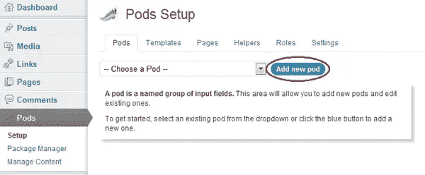
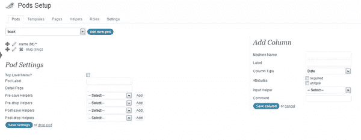
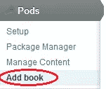
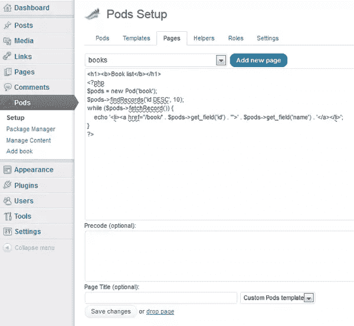

# 把 WordPress 变成一个带有 Pods 框架的 CMS

> 原文：<https://www.sitepoint.com/turn-wordpress-into-a-cms-with-pods-framework/>

如果有人提到内容管理系统这个术语，可能会想到 WordPress、Joomla、Drupal 等。但是 WordPress 开箱即用支持的内容类型只有页面和文章，这对于大多数网站来说是没问题的，但是如果你想要更多呢？幸运的是，您可以使用 Pods 框架；这是一个 WordPress 插件，可以让你添加自定义内容类型和管理到你的 WordPress 安装中。

我将向你展示 Pods 框架的一些功能，给你一个快速教程，告诉你我们如何用它来制作一个图书馆网站。该网站将包含一个我们目前拥有的所有书籍的概述页面，当用户点击一本书的链接时，他会看到它的详细信息。

## 添加内容类型

首先你必须安装框架。就像你一直做的那样，在你的 WordPress 后端使用插件安装程序；插件的全称是 [Pods CMS 框架](http://wordpress.org/extend/plugins/pods/ "WordPress - Pods CMS Framework - WordPress Plugins")。

安装后，单击侧面菜单中的窗格菜单项。正如描述所说，pod 是一组已命名的输入字段，这意味着它是一种自定义内容类型，具有您定义的属性。单击“添加新窗格”按钮，创建一个名为“书籍”的窗格。



创建图书窗格后，屏幕会发生变化以显示其属性:



默认情况下，我们的新 pod 已经有了列 name 和 slug。在这个例子中，我们不需要 slug，所以只需点击它左边的红色 X 就可以删除它。然而，这本书确实需要更多的信息，比如它的出版商、描述、流派、作者、出版日期和书的封面。让我们现在创建它们。

在右边你会看到“添加列”部分。在“机器名称”字段中输入适当的列名，并使用“单行文本”作为列类型，发布日期和描述除外。发布日期的类型应为日期，描述应为“段落文本”。至于封面，我们可以只存储一个图像的 URL 字符串。

## 页面和模板

配置完窗格后，返回侧面窗格菜单，然后单击添加图书。



添加几本您喜欢的书作为示例，提供必要的信息并保存您的工作。


为了正确显示我们的页面，我们需要做一个小的主题修改。转到主题的目录(在这个例子中我使用 Twentyeleven)并创建一个名为`pods.php`的新文件。内容应该是:

```
<?php
/*
Template Name: Custom Pods template
*/

get_header();
?>
<div id="primary">
<div style="width: 93%;" id="content" role="main">
<article id="post-0" class="post page hentry">
<?php pods_content(); ?>
</article>
</div>
</div>
<?php
get_sidebar();
get_footer();
?>
```

确保在文件的顶部包含模板名称注释。这样，WordPress 将把它作为模板文件来检测，并按照你给它命名的方式来命名它。

现在，为了让我们的访问者看到图书收藏，我们需要创建列表页面来显示当前数据库中的所有图书。转到 Pods 的“设置”菜单，然后转到“页面”选项卡，然后单击“添加新页面”。把它命名为“书籍”。

现在您应该会看到一个文本字段，您可以在其中输入该页面所需的代码。可以包括 HTML，Javascript，CSS，PHP。使用以下内容:

```
<h1><b>Book List</b></h1>
<?php
$pods = new Pod('book');
$pods->findRecords('id DESC', 10);
while ($pods->fetchRecord()) {
echo '<li><a href="/book/' . $pods->get_field('id') . '">' . $pods->get_field('name') . '</a></li>'; //Create a link to each different book
}
?>
```

然后，将页面模板选择设置为“自定义窗格模板”并保存您的工作。



为了正确查看页面，我们需要做一个额外的配置更改。前往“设置”>“永久链接”,选择“自定义结构”,然后在文本字段中键入“/%postname%/”。现在，您应该能够通过转到`yoursite.com/books`来查看您刚刚创建的页面。

我们仍然需要创建一个显示图书信息的页面，因此再次单击 Pods“添加新页面”按钮，并使用名称“book/*”。*很重要，因为它是 URL 中的通配符，在我们的例子中是书的 id。

我们可以用`pods_url_variable()`函数检索第一个通配符值(在我们的例子中是唯一的一个)。

这是我们的 books/*页面使用的代码:

```
<?php
// store the book’s id into $bookId
$bookId = pods_url_variable(1);

// retrieves all book entries which fullfill the parameter requirement
$params = array('where'=>'t.id = '. $bookId);
$book = new Pod('book', $params);

// the pods is mostly a data class which contains multiple pod objects
while ($book->fetchRecord()) {
// use get_field() to retrieve the value of a specific field
echo '<h1>' . $book->get_field('name') . '</h1><br />';
echo 'get_field('cover') . '" /><br />';
echo 'Autor: ' . $book->get_field('autor') . '<br />';
echo 'Publisher: ' . $book->get_field('publisher') . '<br />';
echo 'Release date: ' . $book->get_field('release') . '<br />';
}
?>
```

现在，我们可以轻松地管理我们的图书收藏，并向世界展示。你可以看到，有了 Pods 框架，你可以很容易地用 WordPress 创建一个强大的网站。实际上，可能性几乎是无限的，因为使用通配符可以模拟其他框架可能使用的路由系统。

有关不同 Pod 方法的更多信息，您可以[访问 Pod Codex](http://podsframework.org/codex/ "Docs - Pods Framework for WordPress")和[在 Pod 论坛](http://podsframework.org/forums/forum/general-discussion/ "General Discussion - Pods Framework for WordPress")寻求支持。

图片 via[Fotolia](http://us.fotolia.com/?utm_source=sitepoint&utm_medium=website_link&utm=campaign=sitepoint "Royalty Free Stock Photos at Fotolia.com")

## 分享这篇文章