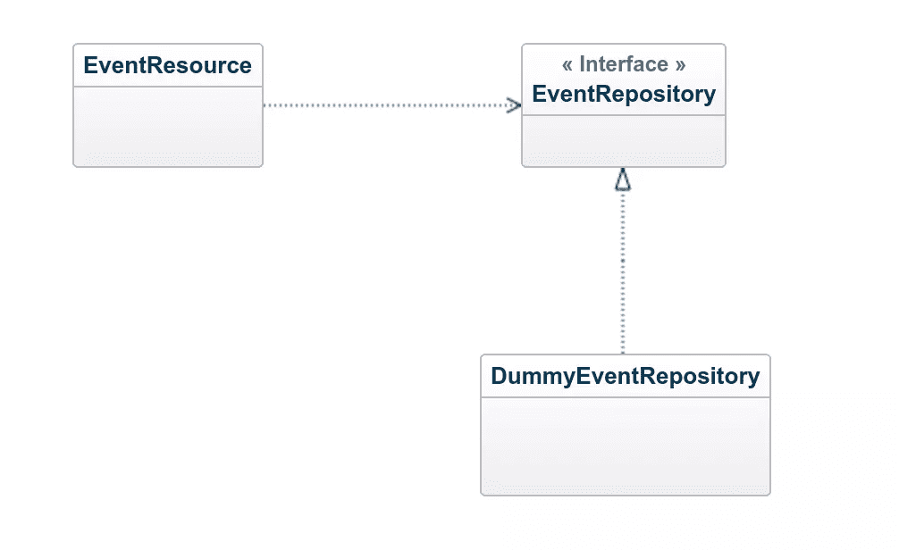

# Dropwizard 入门–CRUD 操作

> 原文：<https://www.sitepoint.com/tutorial-getting-started-dropwizard-crud/>

### 目录 

*   [快速回顾](#quickrecap)
*   [引入数据存储](#introducingadatastore)
*   [实现 EventRepository](#implementingeventrepository)
*   [事件资源、事件存储库和事件存储库](#eventresourceeventrepositoryanddummyeventrepository)
*   [检索所有事件](#retrievingallevents)
*   [检索单个事件](#retrievingasingleevent)
*   [创建新事件](#creatinganewevent)
*   [修改现有事件](#modifyinganexistingevent)
*   [删除事件](#deletinganevent)
*   [总结](#summary)
*   [评论](#comments)

Dropwizard 是一个用于构建 RESTful web 服务的 Java 框架。本质上，它是一个*胶合*框架，将流行的、经过实战检验的 Java 库和框架捆绑在一起，使构建新的 RESTful web 服务变得更加容易。这篇文章探讨了如何在资源上实现创建、读取、更新、删除操作(CRUD)。

[上次](https://www.sitepoint.com/tutorial-getting-started-dropwizard/ "Getting Started With Dropwizard")我们开始了用 Dropwizard 构建一个简单的 [RESTful](https://www.sitepoint.com/what-does-restful-really-mean/ "What Does RESTful Really Mean?") web 服务的旅程。我们的目标是为一个假设的事件应用程序构建一个后端，允许您根据搜索标准搜索事件。它应该能够提供一个事件列表，添加新的事件和修改现有的。请务必阅读[上一篇文章](https://www.sitepoint.com/tutorial-getting-started-dropwizard/ "Getting Started With Dropwizard"),因为我们将继续上次的内容。如果你想继续，克隆[GitHub 库](https://github.com/indrekots/events-service "GitHub repository containing the Events app")并检查`register-resource`标签。

## 快速回顾

在上一篇文章中，我们创建了一个新的 Dropwizard 项目，添加了自定义配置，创建了一个表示和一个非常基本的资源。因为我们没有现成的数据存储，所以客户端只能向`/events`发出 GET 请求并接收硬编码的数据。在本后续教程中，我们将扩展应用程序的特性集，以满足我们最初设定的需求。

## 介绍数据存储

本教程将涵盖如何为我们的应用程序实现 [CRUD](https://en.wikipedia.org/wiki/Create,_read,_update_and_delete "Create, Read, Update, Delete") 功能。为了使事情简单，并且不使您陷入数据库细节的困境，我不打算设置一个。相反，我们将实现一个由`java.util.List`支持的非常基本的内存数据库。

为了实现更好的代码重用，最好依赖抽象，这在 Java 术语中意味着不依赖具体类型。因此，我们将在一个接口中声明内存数据存储的公共 API。

在`com.mycompany.core`包中创建一个名为`EventRepository`的新接口。

```
public interface EventRepository {

} 
```

我们将在本文的其余部分扩展这个接口，根据需要添加方法。

### 实现 EventRepository

我们创建了一个接口，定义了`EventRepository`的公共 API。现在我们需要提出一个实现。

请注意，下面的类绝不是您要部署到生产环境中的解决方案。首先，因为我们要将事件存储在一个列表中，所以我们会遇到并发问题。这个列表是一个共享资源，这意味着它必须是线程安全的(T2)。由于并发不是本文的主题，所以假设您是唯一的用户。这个想法不是担心数据的存储，而是如何在`EventResource`中创建方法，这样我们就可以满足我们最初设定的需求。

在`com.mycompany.core`包中创建一个名为`DummyEventRepository`的新类，并使其实现`EventRepository`接口。

```
public class DummyEventRepository implements EventRepository {

    private static final String DATA_SOURCE = "dummy_data.json";

    private List<Event> events;

    public DummyEventRepository() {
        try {
            initData();
        } catch (IOException e) {
            throw new RuntimeException(
                    DATA_SOURCE + " missing or is unreadable", e);
        }
    }

    private void initData() throws IOException {
        URL url = Resources.getResource(DATA_SOURCE);
        String json = Resources.toString(url, Charsets.UTF_8);
        ObjectMapper mapper = new ObjectMapper();
        CollectionType type = mapper
                .getTypeFactory()
                .constructCollectionType(List.class, Event.class);
        events = mapper.readValue(json, type);
    }

} 
```

当`DummyEventRepository`被实例化时，调用`initData`。这个方法读取一个包含虚拟数据的 JSON 文件，该文件将用于填充内存中的数据存储。JSON 文件用 [Guava 的](https://github.com/google/guava "Google Core Libraries for Java 6+") `Resource`类读取，用 Jackson 的`ObjectMapper`类解析。创建一个名为`dummy_data.json`的新 JSON 文档，并将其放在`src/main/resources`中。以下是我将使用的数据。

```
[
    {
        "id": 1,
        "name": "Czech National Symphony Orchestra - I. Concert",
        "description": "PERFORMERS: Libor Pešek - conductor, Natalie Clein - violoncello",
        "location": "náměstí Republiky 5, Praha 1 - Staré Město, 110 00",
        "date": "2016-10-25T19:30+0200"
    },
    {
        "id": 2,
        "name": "Salsa Festival",
        "description": "World class shows & performances by some of the best artists in the world.",
        "location": "Copenhagen",
        "date": "2017-05-05T17:00+0200"
    },
    {
        "id": 3,
        "name": "National Restaurant Day",
        "description": "As autumn arrives the National Restaurant Day kicks off, awaiting the lovers of gastronomy for the 11th time.",
        "location": "Budapest, Hungary",
        "date": "2016-10-16T12:00+0200"
    },
    {
        "id": 4,
        "name": "UEFA Europa League: Austria Vienna vs. Roma",
        "description": "Don't miss this spectacular game and get tickets to see Austria Vienna v Roma now, before they run out.",
        "location": "Ernst-Happel Stadion, Vienna, Austria",
        "date": "2016-11-03T19:00+0200"
    }
] 
```

### 事件资源、事件存储库和事件存储库

在下图中，您可以看到这三种类型在起作用。EventResource 负责处理 HTTP 请求。当它需要访问或修改数据时，它将这个问题委托给`EventRepository`的一个实例。`DummyEventRepository`是`EventRepository`的实现，它将作为内存中的数据存储。



`EventResource`需要引用`EventRepository`的实现来完成它的工作。我不想直接实例化`EventResource`类中的`DummyEventRepository`。这将违反[依赖性反转原则](https://en.wikipedia.org/wiki/Dependency_inversion_principle "Wikipedia article on the dependency inversion principle")。它对其他类的具体实现知道得越少越好。因此，我给`EventResource`类添加了一个构造函数参数，它可以用来注入`EventRepository`的具体实现。

```
private EventRepository repository;

public EventResource(EventRepository repository) {
    this.repository = repository;
} 
```

最后，我们需要连接我们的对象图。在我们应用程序的`run`方法中，获取对`DummyEventRepository`实例的引用，并将其传递给`EventResource`。

```
@Override
public void run(EventsConfiguration configuration,
        Environment environment) {
    //irrelevant code not shown
    EventRepository repository = new DummyEventRepository();
    EventResource eventResource = new EventResource(repository);
    environment.jersey().register(eventResource);
} 
```

## 正在检索所有事件

我们可以通过重构`EventResource`类中的`allEvents`方法来开始使用我们新创建的`EventRepository`。此时，它会返回一个动态创建的事件列表。但是，如果它从内存中的数据存储中返回所有事件，那就更有意义了。因此，让我们进行必要的修改来实现这一点。

修改`EventRepository`接口，并声明一个查找所有事件的方法。

```
List<Event> findAll(); 
```

创建在`DummyEventRepository`类的接口中声明的方法的实现。现在您需要做的就是返回事件列表。

```
@Override
public List<Event> findAll() {
    return events;
} 
```

现在修改`EventResource`，将所有事件的搜索委托给`EventRepository`的一个实现。

```
@GET
public List<Event> allEvents() {
    return repository.findAll();
} 
```

当运行应用程序时，您应该看到一个事件列表，这些事件是在访问`http://localhost:8080/api/events`时从`EventRepository`检索的，而不是像我们在上一篇文章中那样获得硬编码数据。

实际上，你不想一下子得到所有的数据。可能会有数千条记录，检索所有记录会产生不必要的开销。在前端，只显示一小部分事件是合理的。例如，当你用谷歌搜索时，你会得到分布在多个页面上的结果。这种行为称为分页。虽然这是一个重要的特性，但我们将在以后的文章中介绍它。

## 检索单个事件

在 RESTful API 中，检索单个资源通常通过其 ID 来完成。例如，如果我们对读取 ID 为 123 的事件的状态感兴趣，我们应该向`/events/123`发出 GET 请求。但是，我们如何在不进行复杂的字符串操作的情况下轻松访问 ID 呢？解决方案是`@PathParam`注释。

让我们看看如何在代码中使用它。将以下方法添加到`EventResource`。

```
@GET
@Path("{id}")
public Event event(@PathParam("id") LongParam id) {
    //method body shown later
} 
```

首先，我们声明这个方法应该响应在 HTTP 路径中包含 ID 的 GET 请求。记得在`EventResource`类的开始，我们使用`@Path("events")`来表示资源的路径以`/events`开始。用`@Path`注释对方法进行注释会向资源路径添加另一个段。`id`周围的花括号表示这应该被视为路径参数。使用`LongParam`类型确保从路径中读取的`id`值必须是`Long`类型。否则，Dropwizard 将返回 HTTP 400 响应。

通过 ID 查找事件相对容易。向`EventRepository`接口添加另一个方法。

```
Optional<Event> findById(Long id); 
```

该方法返回一个类型为`Event`的`Optional`。我使用 Optionals 来处理具有给定 ID 的事件可能不存在的情况。下面是这个方法在`DummyEventRepository`中的实现。

```
@Override
public Optional<Event> findById(Long id) {
    return events.stream().filter(e -> e.getId() == id).findFirst();
} 
```

现在让我们回到完成`EventResource`类中的`event`方法。由于请求的事件可能不存在，我们应该准备好向客户端返回一个适当的结果。

```
@GET
@Path("{id}")
public Event event(@PathParam("id") LongParam id) {
    return repository.findById(id.get())
            .orElseThrow(() ->
                    new WebApplicationException("Event not found", 404));
} 
```

使用选项使得处理被检索对象可能是`null`的情况变得非常简单和简洁。在此示例中，如果事件存在，则将其返回给客户端。否则抛出一个新的`WebApplicationException`、[(JavaEE](http://docs.oracle.com/javaee/7/api/javax/ws/rs/WebApplicationException.html)的运行时异常)。Dropwizard 负责处理异常，并向客户端返回一条错误消息。

## 创建新事件

创建新事件是使用 HTTP POST 谓词完成的。为了让事情顺利进行，让我们首先编写所需的代码，以便向我们的数据存储添加一个新事件。因为我们目前将记录存储在一个列表中，所以添加新事件非常简单。

向`EventRepository`接口添加一个名为`save`的新方法。存储库将为正在保存的事件分配一个 ID，我们希望将它传递回客户端。因此，返回类型应设置为`Event`。

```
Event save(Event event); 
```

下面是 save 方法的一个实现，您应该将它放在`DummyEventRepository`类中。

```
@Override
public Event save(Event event) {
    Optional<Long> maxId = events.stream()
            .map(Event::getId)
            .max(Long::compare);
    long nextId = maxId.map(x -> x + 1).orElse(1L);
    event.setId(nextId);
    events.add(event);
    return event;
} 
```

因为我们试图避免使用实际的数据库进行演示，所以我们必须自己做一些数据库会为我们做的工作。例如，当创建一个新事件时，我们事先不知道它的 ID。因此，我使用 Streams API 来查找当前的最大 ID 值，将它递增 1 以获得下一个 ID，并将其分配给新的事件对象。当没有存储事件时，一个新事件将获得一个 ID 1。当然，数据库在为 ID 生成下一个值方面做得更好，但是因为这个小的演示应用程序可能永远不会看到大量的数据，所以应该没问题。

一旦我们完成了新事件的保存，让我们在`EventRepository`类中进行必要的修改。添加以下方法。

```
@POST
public Event create(Event event) {
    return repository.save(event);
} 
```

为了使 Jersey 能够接收 HTTP POST 请求，我们需要做的就是在我们的资源类中用`@POST`注释一个方法。读取请求实体也是为您完成的。将类型为`Event`的参数添加到方法声明中，通知 Jersey 解析请求的主体，并将其映射到`Event`的实例。请记住，不执行任何验证。如果请求体中的字段都不匹配`Event`类中的字段，那么仍然会创建一个新的`Event`实例，但是它的所有实例字段都将是`null`(除了`id`是 0L [，因为它是一个原始类型](https://docs.oracle.com/javase/tutorial/java/nutsandbolts/datatypes.html "Default values for primitive types in Java")。

为了进行测试，我将使用 curl 命令行实用程序。

```
curl -X POST http://localhost:8080/api/events \
    -d '{"name": "My Birthday", "description": "Time to celebrate!", "location": "My place", "date": "2016-10-27T19:00+0200"}' \
    -H "Content-Type: application/json" 
```

对该命令的响应应该如下。

```
{
    "id":5,
    "name":"My Birthday",
    "description":"Time to celebrate!",
    "location":"My place",
    "date":"2016-10-27T20:00+0300"
} 
```

HTTP POST 方法不是等幂的。这意味着，如果多次执行同一个请求，每次请求都会在服务器上创建新的状态。


## 修改现有事件

为了更新现有的事件，我们将使用 HTTP PUT 方法。PUT 是一个幂等方法，这意味着多次执行相同的请求不会在服务器上创建额外的状态。与检索单个事件一样，我们需要使用`@PathParam`注释从路径中读取事件的 ID。在我们对资源类进行必要的修改之前，让我们实现事件更新逻辑。

在`EventRepository`接口中声明一个`update`方法。

```
Optional<Event> update(Long id, Event event); 
```

我们还应该将更新后的实体反馈给客户端。具有给定 ID 的事件可能不存在。因此我使用类型`Event`的`Optional`作为返回类型。为了使更新事件更容易，我创建了一个新方法`updateExceptId`,它将被调用的事件的名称、描述、位置和日期更新为提供给该方法的事件的名称、描述、位置和日期。

下面是应该放在`DummyEventRepository`中的`update`方法的结果实现。

```
@Override
public Optional<Event> update(Long id, Event event) {
    Optional<Event> existingEvent = findById(id);
    existingEvent.ifPresent(e -> e.updateExceptId(event));
    return existingEvent;
} 
```

接下来，您将看到如何在`EventResource`类中实现接收 PUT 请求的方法。

```
@PUT
@Path("{id}")
public Event update(@PathParam("id") LongParam id, Event event) {
    return repository.update(id.get(), event)
            .orElseThrow(() ->
                    new WebApplicationException("Event not found", 404));
} 
```

从技术上讲，现在对你来说应该没有什么新东西了。当我们查看如何检索单个事件时，我们查看了如何使用`@PathParam`注释从路径中读取 ID。后来，当我们实现添加新事件时，您看到了 Jersey 如何将 JSON 主体映射到事件实体中。

## 删除事件

虽然我们在最初的需求中并没有把它设定为一个目标，但是让我们来看看如何删除一个事件。HTTP 规范定义了用于删除资源的删除方法。这是一个幂等运算。

首先，我要实现删除逻辑。我们的存储库接口需要一个额外的方法。

```
void delete(Long id); 
```

接下来，我们需要在`DummyEventRepository`中实现。

```
@Override
public void delete(Long id) {
    events.removeIf(e -> e.getId() == id);
} 
```

现在让我们继续实现一个删除事件的 REST 端点。将下面的方法添加到`EventResource`类。

```
@DELETE
@Path("{id}")
public Response delete(@PathParam("id") LongParam id) {
    repository.delete(id.get());
    return Response.ok().build();
} 
```

就像读取单个事件一样，我们使用`@PathParam`注释从 HTTP 路径获取事件的 ID。但现在不同的是返回类型。由于没有要返回的事件，该方法的返回类型为`Response`。这样我们可以发送回一个没有内容的 HTTP 200 OK 响应。

## 摘要

恭喜你！现在你应该很好的理解了 Dropwizard 是关于什么的。在[上一篇文章](https://www.sitepoint.com/tutorial-getting-started-dropwizard/ "Getting started with Dropwizard")中，我们研究了如何创建一个新的 Dropwizard 应用程序并对其进行配置。同时给出了应用程序结构的快速概述。在本文中，您学习了如何实现一个简单的 RESTful API，使您能够创建、读取、更新和删除事件。我们几乎达到了我们的目标。除了搜索之外，我们已经实现了最初设定的所有功能。我鼓励您使用这个应用程序并实现一个您认为缺少的特性。

Dropwizard 有更多我们无法介绍的高级功能。例如，每个 Dropwizard 应用程序都有一个管理界面，允许您使用[健康检查](http://metrics.dropwizard.io/3.1.0/manual/healthchecks/)来监控您的应用程序。此外，应用程序开发的一个非常重要的部分是测试。我们将在以后的文章中讨论这些以及更多内容。

## 分享这篇文章