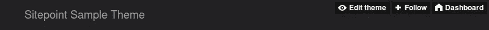
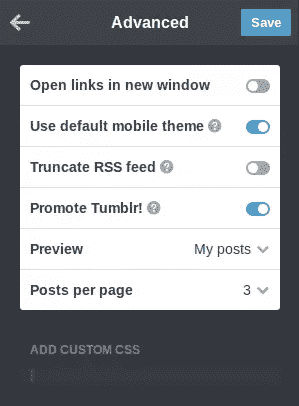

# 用 Bootstrap 构建一个简单的 Tumblr 主题

> 原文：<https://www.sitepoint.com/tutorial-tumblr-theme-with-bootstrap/>

如果你曾经看过所有精彩的 Tumblr 主题，并想知道如何从头开始构建一个 Tumblr 主题，那么这篇教程就是为你准备的。在这篇文章中，我将向你展示如何使用 Bootstrap 和 Tumblr 的特殊操作符为你的 Tumblr 博客创建一个主题。

以下是您需要开始的内容:

*   Tumblr 账户
*   基本了解 [Bootstrap](http://getbootstrap.com/) ，流行的前端框架。

## 我们的基本 HTML 和引导资源

Tumblr 主题只是一个使用 Tumblr 特殊操作符的 HTML 文件。首先，我们将使用我们最喜欢的文本编辑器创建一个新文件，并向其中添加以下样本 HTML 代码:

```
<!DOCTYPE html>
<html lang="en">
  <head>
    <meta charset="utf-8">
    <meta http-equiv="X-UA-Compatible" content="IE=edge">
    <meta name="viewport" content="width=device-width, initial-scale=1">
  </head>
  <body>
  </body>
</html>
```

接下来，我们将添加必要的引导资源。 [Bootstrap CDN](http://www.bootstrapcdn.com/) 可以轻松将文件添加到你的 Tumblr 主题中。只需将以下内容放入主题的`head`:

```
<!-- Bootstrap CSS -->
<link href="https://maxcdn.bootstrapcdn.com/bootstrap/4.0.0/css/bootstrap.min.css" rel="stylesheet">
```

另外，在结束的`body`标签前添加以下内容:

```
<!-- Bootstrap JS -->
<script src="https://maxcdn.bootstrapcdn.com/bootstrap/4.0.0/js/bootstrap.min.js">  </script>
```

## 添加自定义样式

这个 Tumblr 主题将会有一个 550 像素宽的窄布局。它还将有一个 50px 高的固定位置的页眉。将以下内容添加到主题的`head`中，以处理这些需求:

```
<style type="text/css">
  body {
    padding-top: 60px;
  }

  .container {
    width: 550px;
  }
</style>
```

## 创建 Tumblr 主题标题

我们将使用 Bootstrap 的`navbar`为我们的 Tumblr 主题创建一个标题。这允许我们使用我们的第一个 Tumblr 变量:`{Title}`。`{Title}`变量指的是博客的标题。下面的代码被添加到主题的`body`中:

```
<nav class="navbar fixed-top navbar-dark bg-dark">
  <a class="navbar-brand" href="#">{Title}</a>
</nav>
```

在 HTML `<title>`标签中使用`{Title}`变量也是一个好主意:

```
<title>{Title}</title>
```

如果你现在将这个主题应用到你的 Tumblr 博客上，它看起来会像这样，下面只有空白:



## 创建一个容器来存放帖子

接下来，我们将添加一个`div`来作为所有 Tumblr 帖子的容器。在`nav`元素下添加以下代码:

```
<div class="container">
</div>
```

你可能已经知道，Tumblr 允许你在博客上添加不同类型的文章。为了简单起见，我们将处理以下帖子类型:

*   文本
*   照片
*   引用

`{block:Posts}`是一个 Tumblr **块**，它给我们一个博客上所有帖子的列表。

在文章容器中添加以下代码:

```
{block:Posts}
{/block:Posts}
```

接下来，为了确定当前帖子的类型，我们将使用以下块:

*   `{block:Text}`
*   `{block:Photo}`
*   `{block:Quote}`

对于任何帖子，只会呈现其中的一个。

## 处理文本帖子

文本帖子通常有一个标题和一个正文，可以分别使用变量`{Title}`和`{Body}`来访问。在`{block:Posts}`标签中添加以下代码。

```
{block:Text}
  <h2>{Title}</h2>
  <p>{Body}</p>
{/block:Text}
```

## 处理照片帖子

照片帖子有一个标题和一张照片。可以使用`{Caption}`变量访问标题。访问照片有点复杂。为了让您更容易在博客中使用一致的图像大小，Tumblr 为您提供了缩放版本的照片。

例如，为了确保你的照片宽度不超过 500 像素，你可以使用变量`{PhotoURL-500}`。类似地，如果你想确保照片宽度不超过 100 像素，你可以使用变量`{PhotoURL-100}`。

对于这个 Tumblr 主题，我将使用`{PhotoURL-500}`。

我们可以使用[自举卡](http://getbootstrap.com/docs/4.0/components/card/)来显示照片和它的标题。

处理照片帖子的代码将如下所示:

```
{block:Photo}
  <div class="card">
    
    <div class="card-body">
      <h5 class="card-title">{Caption}</h5>
    </div>
  </div>
{/block:Photo}
```

## 处理报价帖子

在这种类型的文章中，你必须使用直观命名的变量`{Quote}`和`{Source}`。Bootstrap 通过`blockquote`类和`blockquote-footer`类将自己的样式应用于 HTML `<blockquote>`元素，因此我们可以在我们的主题中直接使用它:

```
{block:Quote}
  <blockquote class="blockquote">
    <p>{Quote}</p>
    <footer class="blockquote-footer">{Source}</footer>
  </blockquote>
{/block:Quote}
```

## 处理分页

此时，如果您将 Tumblr 主题应用到您的博客中，它将看起来很完整。但是，Tumblr 每次只显示固定数量的帖子。

您可以在**高级选项**页面中更改该数字。正如您在截图中看到的，我已经将每页的**帖子**值设置为 3:



目前，如果你在你的博客上添加了太多的文章，最早的文章将不再被访问。因此，您必须在主题中处理分页。

Tumblr 有两个变量可以帮助解决这个问题:`{PreviousPage}`和`{NextPage}`。这些变量的值是链接，所以你必须把它们放在`<a>`标签里。为了确保这些链接只在有有效的上一页或下一页时才显示，我们分别在`{block:PreviousPage}`和`{block:NextPage}`块中使用了`{PreviousPage}`和`{NextPage}`变量。

我们可以使用 [Bootstrap 的按钮类](http://getbootstrap.com/docs/4.0/components/buttons/)来设计我们的分页链接。

以下代码将被添加到`{block:Posts}`块之后:

```
<p class="text-center">
  {block:PreviousPage}
    <a href="{PreviousPage}" class="btn btn-secondary">Previous</a>
  {/block:PreviousPage}
  {block:NextPage}
    <a href="{NextPage}" class="btn btn-secondary">Next</a>
  {/block:NextPage}
</p>
```

## 将主题应用到 Tumblr

访问您的 Tumblr 仪表盘，选择一个博客，然后点击*自定义*。在下一个屏幕中，点击*编辑 HTML* 链接。你会看到一个文本编辑器，显示你当前主题的 HTML 内容。用我们刚刚构建的新 Tumblr 主题的代码替换这些内容。先按*更新预览*按钮，然后按*保存*按钮应用新主题。

*注意*:由于我们对引导文件使用外部链接，预览可能看起来不正确。然而，在按下*保存*按钮后，当你访问你的博客时，你应该会看到正确应用的引导样式。


## 结论

我们现在有了一个简单但完整的 Tumblr 主题，它使用了最新版本的 Bootstrap。你可以随时参考 [Tumblr 的文档](https://www.tumblr.com/docs/en/custom_themes)来扩展这个主题。

如果你有使用 Bootstrap 或其他框架处理 Tumblr 主题的经验，请在评论中告诉我们。

如果你已经掌握了 Bootstrap 的基础知识，但想知道如何将 Bootstrap 技能提升到一个新的水平，请查看我们的[用 Bootstrap 4](https://www.sitepoint.com/premium/courses/building-your-first-website-with-bootstrap-4-2995) 建立你的第一个网站课程，快速而有趣地了解 Bootstrap 的强大功能。

## 分享这篇文章