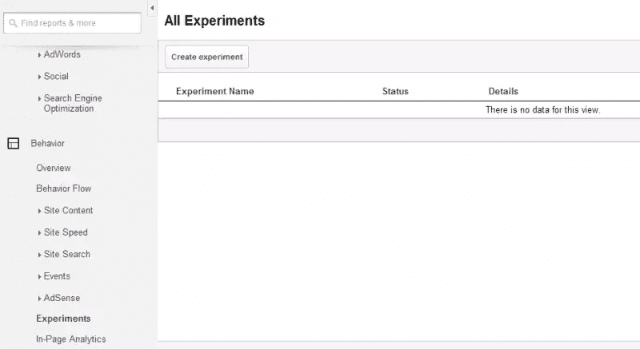

# 调整你的网站？用谷歌实验安全地做它

> 原文：<https://www.sitepoint.com/tweaking-website-safely-google-experiments/>

你可能知道谷歌分析的实验功能，但如果你从未使用过它，这可能会有点吓人。

不过，没必要害怕:建立一个实验实际上很简单。在本文中，我们将一步一步地介绍如何设置 Google Experiments，但首先让我们花点时间回顾一下该工具提供的好处。

## Google Experiements 是做什么的？

Google Experiments 将你的页面从 Google 获得的部分流量发送到你创建的一个变体，这意味着你可以比较你的网站的稍微不同的版本，看看哪个表现最好。实际上，这意味着你可以测试任何东西——网站文案、图片、布局——看看哪一个在用户点击或转化方面反应最好，然后再进行新的设计。

使用谷歌实验，这是不可能失去的-如果用户对新的变化反应不佳，只需翻回到你的网站的原始版本。

一旦你熟悉了这个过程，它就是一个你可以反复使用的工具。

## 定义你的目标

任何在线营销活动的第一步都是**明确定义你的目标**，谷歌实验也不例外。

你的网页改变的目的是什么？更多的转换，页面中特定链接的更多点击，更低的跳出率？

首先明确你的目标，并准确地知道你想测试哪个假设是成功实验的关键。如果你正在努力想出主意，不要担心，我们已经在这篇文章的末尾为你提供了一些建议。

## 为测试准备您的站点

一旦你知道你的目标是什么，为了建立谷歌实验，你需要做的下一件事就是在你的网站上有两个稍微不同的页面版本。

为了保持测试可控，最好是*尽可能少的修改*。对于一些测试来说，这可能意味着你所要改变的只是注册按钮上的副本！也就是说，确保你所做的一些改变足够大胆，引人注目，否则你的结果很可能是不确定的，你将浪费你的时间。

不要忘记保持你的测试页面不可见——从主导航菜单中隐藏它，这样你网站的其他用户就不会感到困惑。在你修改过的页面中[包含`rel=canonical`标签是个好主意(尤其是当文本与原始页面非常相似的时候)，以确保不会因为重复内容而被处罚。安全总比后悔好！](http://gatipoftheday.com/use-canonical-or-noindexnofollow-for-content-experiment-variations/)

好消息是，当你到达这个阶段的时候，已经成功了一半。您甚至还没有打开您的分析帐户！

## 配置谷歌分析实验

戴上护目镜和实验服了吗？然后就该进入实验了。

打开 **Google Analytics >报告页面>行为>实验**，点击**创建实验**。

现在，Google Analytics 会要求您配置一些选项:

### 1.选择目标和流量分割

在这里，你需要告诉 Analytics 你的实验目标是什么。您可以从三个选项中选择:**电子商务**、**网站使用**或**创建新目标**。

如果您使用电子商务部分的指标(如收入或交易)，您需要首先在您的分析帐户中[设置电子商务跟踪](https://support.google.com/analytics/answer/1009612?hl=en)。

**创建一个新目标**将带您进入一个页面，在这里您需要设定一个目标。有四种目标类型可供选择，包括最终目标页面、页面持续时间、浏览页面数量或您设置的具体事件。设定一个目标并不困难，[谷歌在这里给出了如何实现的建议。](https://support.google.com/analytics/answer/1032415?hl=en)

接下来，您将选择发送到新页面的流量百分比。如果你想限制风险，保持这个百分比较低。然而，如果你在运营一个低流量的网站，50:50 的比例是你最好的选择，这样你就可以确保你的结果是基于一个合适的样本量。

在这个部分的高级选项中也有一些有趣的东西。您可以设置像置信度阈值这样的参数，它指定了 Google Analytics 对结果的置信度。实验可能需要稍微多一点的时间来达到增加的置信阈值。

### 2.配置您的实验

这一步很简单——只需添加测试和控制页面的 URL。

### 3.设置您的实验代码

将控制页面的`head`标签中提供的代码复制并粘贴到您的站点上。

### 4.回顾并开始

你已经准备好了！

只要你愿意，你可以回到**行为>实验**来看看你的测试进展如何。

## 根据您的结果采取行动

谷歌内容实验有几种可能的结果:

### 一切都糟透了！

您的变体页面没有按照您的计划运行吗？你正在失去点击量和转化率吗？不要慌！只需进入实验，点击**停止实验**。

### 实验自然结束

实验最多持续三个月。可能是这样的情况，你的结局是自然的，没有决定性的结果。在这种情况下，你可能希望尝试一个后续实验或测试一些完全不同的东西。

### 我们有赢家了！

理想的结果是，你的站点的测试版本之一是一个明显的赢家。如果这是新版本，明智的做法是考虑用新的变化更新原始页面(或许，考虑让你办公室的其他人带你出去吃午饭！).您需要在您的网站上手动执行此操作——无法自动应用谷歌分析的更改。

## 测试什么，不测试什么

安全了吗？很好。为了让你开始，这里有一些你可以对你的网站进行修改的想法，这将有助于良好的谷歌实验测试，以及你根本不应该费心测试的三件事。

### 谷歌实验测试的 5 个想法

*   **行动号召按钮**。尺寸、位置、颜色……关于你应该在登录页面上使用哪种注册按钮，有[大量不同的理论](http://www.smashingmagazine.com/2009/10/13/call-to-action-buttons-examples-and-best-practices/)。使用谷歌实验来发现哪个最有可能抓住你的读者的注意力。
*   **页眉页脚**。我们做了一个有趣的实验，我们将页脚从我们网站的联系页面中完全移除，从而消除了任何可能妨碍转化的潜在干扰。而且成功了！
*   **图像**。你听说过[人物照片让广告更有力量吗](http://www.sophisticatededge.com/why-pictures-of-people-help-in-advertising.html)？有了谷歌实验，你可以检查这是否是真的。
*   **复制**。谷歌实验不必局限于设计。为什么不试着让你最强的文案来重新审视你主页上的一些文字呢？
*   **布局**。你应该在页面的顶部、底部或中间放置一个链接来鼓励更多的点击吗？消除盲点的内容并使你的布局适应[我们阅读屏幕的方式](http://www.nngroup.com/articles/f-shaped-pattern-reading-web-content/)对点击和转化率有显著影响吗？

### 3 件不需要测试的事情

*   **你的新 logo** 。公司品牌应该尽可能保持一致。改变网站不同部分的中心设计元素，比如徽标，会让用户感到困惑，也会淡化你的品牌。
*   **英国英语还是美国英语**？在你网站的一个页面上，这两者之间的差别可能太小，不足以提供确凿的证据。
*   **你“知道”会起作用的事情**。如果你确信改变一个页面的元素会有积极的影响，你可能会得出自己的结论，不管你从数据中读到了什么。测试前有预感和怀疑是可以的，但是你应该试着以开放的心态对待你的实验。

## 冒聪明的风险

尝试新想法是网络营销的一个重要部分——不冒一些风险，你就无法取得成功。也就是说，最好是在潜在损害有限的可控环境中进行。

谷歌实验给了你两个世界最好的东西——一个安全的创新空间。你所需要做的就是学习如何使用这个工具，但是正如你所看到的，这并不难。事实上，你可能会发现，决定测试什么(并编写副本或创建图形)比在分析中配置实验需要更长的时间。

你的实验进行得怎么样？请在评论中告诉我们！

## 分享这篇文章