# 将 CSS 带入主流的 20 个网站

> 原文：<https://www.sitepoint.com/twenty-sites-that-elevated-css/>

当我开始为这篇文章收集站点时，我认为这很容易，因为有这么多人对 CSS 做出了巨大贡献。但后来我意识到，与其说是人，不如说是网站。有哪些网站有高级 CSS？有太多了，当我把这些网站从人群中分离出来时，这比我想象的要困难得多。

我决定把清单分成两部分:明显的和不那么明显的。显而易见的是每个人都会立即想到的网站，如果我把它们从列表中删除，会引起不小的轰动。那些不太明显的站点可能在一开始会被我们忽略，但是它们对 CSS 整体进步的贡献是值得肯定的。

##### 明显的事实

**[CSS 禅苑](http://www.csszengarden.com/)**

2003 年，David Shea 推出了只有五个设计的 CSS Zen Garden，从那时起，它就一直处于 CSS web 革命的前沿。对于许多年轻的开发者来说，甚至在你破解你的第一本 CSS 书之前，你已经熟悉了 Zen Garden，并且已经在思考你的提交会是什么样子。这个网站让很多人对 CSS 的力量感到非常兴奋，可以说是 CSS 在网络上最有影响力的站点。

**[迈耶韦布](http://www.meyerweb.com/)**

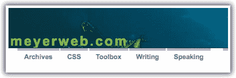

自称 CSS 绝地的埃里克·迈耶掌管着 meyerweb.com。Eric 为 CSS 所做的并不神秘。Meyerweb [工具箱](http://meyerweb.com/eric/tools/)和 [CSS 工作](http://meyerweb.com/eric/css/)区域充满了像 S5(一个 XHTML/CSS 演示程序)、CSS 文件(诊断和重置)、CSS 测试、CSS2 原型测试套件和内联模型文档(我知道，你已经流口水了)。到目前为止，这个网站最酷的地方(除了博客本身)是 [CSS/Edge](http://meyerweb.com/eric/css/edge/) ，Eric 在那里放了很多 CSS 演示和他正在使用的巧妙技术。

**[一列相隔](http://www.alistapart.com/)**

很难用语言来描述 List Apart 的工作人员为推进 CSS 到底做了什么，更不用说整个网络了。他们的一些最伟大的 CSS 成就(在我看来)包括: [CSS 精灵](http://www.alistapart.com/articles/sprites)、[CSS 滑动门](http://www.alistapart.com/articles/slidingdoors/)、[CSS 渐进增强](http://www.alistapart.com/articles/progressiveenhancementwithcss)和[从表格黑客到 CSS 布局:一个网页设计师的旅程](http://www.alistapart.com/articles/journey)。他们写了这么多关于 CSS 的文章，如果你碰巧落在后面，就不可能全部读完(相信我，我刚刚浏览了整个列表)；你只能希望你能跟上他们的每月出版物，这样你就能成为第一个发现新的伟大的 CSS 技术的人。

**[W3Schools](http://www.w3schools.com/)**

当你问一个一般性的编码问题时，W3Schools 似乎总是在搜索结果的顶部。他们有各种教程，从 XHTML 这样的基础主题到 RDF 这样的高级主题。但这是关于 CSS 的。W3Schools 在网上有一些最棒的初学者和新手 CSS 教程，无论你是刚入门还是刚刚复习完术语，这都是一个学习的好地方。

**[CSS3.info](http://www.css3.info/)**

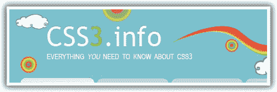

每个 CSS 宠臣都知道，这个网站是首要的网站，当谈到找到所有的重要信息，对最新的属性来说，在 CSS 的光。CSS3.info 背后的[团队确保该网站包含你能在 CSS3 上找到的最新相关信息。说真的，我还没有找到一个网站能提供和这个网站一样的洞察力。就 CSS 的未来而言，当你想去掉所有的糟粕，专注于重要的信息时，这就是你要去的地方。](http://www.css3.info/about/)

**[位置决定一切](http://positioniseverything.net/)**

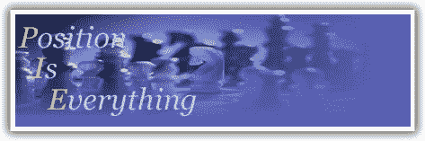

P.I.E .是一个致力于每天让我们抓狂的浏览器怪癖的网站。通过学习 CSS 的来龙去脉，这个网站节省了我们许多人调试的时间，因为我们不必自己找出[躲猫猫错误](http://www.positioniseverything.net/explorer/peekaboo.html)或盒子模型的怪异之处。这个网站对于任何 CSS 开发人员来说都是一笔巨大的财富，它的内容甚至成为了网站开发人员面试问题的一个话题。

**[神圣 CSS 泽尔德曼！](http://dezwozhere.com/links.html)**

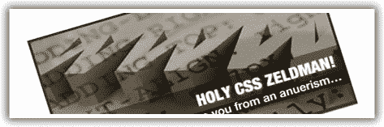

神圣的 CSS 泽尔德曼！是一个伟大的 Web 标准相关链接的集合，类似于 CSS 的 digg RSS 提要。从我记事起，这个网站就存在了，虽然我不会说一个网站很棒，只是因为它很经典，或者因为它的名字里有 Zeldman。这个网站之所以存在，是因为它收集了这么多优秀的 CSS 网站，并将它们放在一个集合中，供开发人员按照他们认为合适的方式进行分类，这也是 CSS 今天被视为这样的一个重要原因。

**[CSS-Tricks](http://css-tricks.com/)**

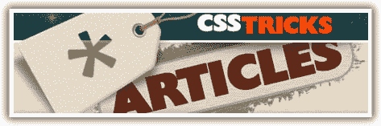

Chris Coyier 的 screencasts 在互联网上的流行博客中掀起了一场视频革命，并推动了 CSS 的学习，而不仅仅是阅读冗长乏味的文章。从初学者教程到更高级的主题，如条件样式表，CSS-Tricks 采取了一步一步的，可视化的 CSS 方法-人们似乎真的很喜欢它。克里斯还运营着一个流行的 CSS/JavaScript 链接共享网站，名为 [Script & Style](http://scriptandstyle.com/) 。

**CSS 图库，如 [CSS 狂热](http://cssmania.com/)、 [CSS 混音](http://cssremix.com/)、 [CSS 网站](http://www.css-website.com/)、 [CSS 金库](http://cssvault.com/)**

所有 CSS 画廊的目标都是把 CSS 带入主流，所以我怎么能把它们从这个列表中去掉呢，对吗？当我收集网站时，我不断出现各种各样的画廊；我想避免将它们分散在整个列表中，因为我认为这样会减少这篇文章的篇幅。然而，画廊展示了各种 CSS 作品的真实例子，向这些网站提交作品的人都是站在网页设计和开发第一线的人。他们值得世界上所有的荣誉，因为他们让 CSS 和 web 标准在互联网上保持活力。

**CSS 模板网站如[怪物模板](http://www.monstertemplates.com/)和[开源模板](http://www.opensourcetemplates.org/)**

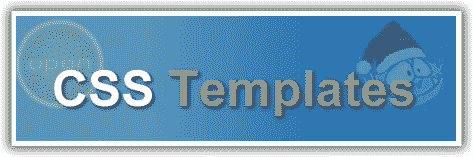

就像 CSS 图库一样，CSS 模板站点有一个崇高的目标，那就是从根本上提高整个互联网上站点的质量，将模板分发给那些通常用几张表拼凑一个站点的人。CSS 模板网站，如开源模板和 Monster 模板，通过使其更容易使用，并通过删除一些更令人沮丧的 CSS 元素，如浏览器测试，进一步推动了 CSS 事业。

##### 不那么明显

**ESPN.com**

诚然，我完全忘记了 ESPN 在 CSS 宣传中的重要性，直到一位同事提醒了我。但我很高兴他们这样做了，因为没有它，这个列表真的会不完整。对于那些不知道的人来说，ESPN.com 是第一个从表格转换到 CSS 的主要网站之一。早在 2003 年，通过切换到 CSS，ESPN.com 每天节省了大约 2tb 的带宽。这是一个[高度宣传的](http://www.mikeindustries.com/blog/archive/2003/06/espn-interview)举动，为其他大型网站做同样的事情铺平了道路。

**W3.org**

W3.org？耶！每当你需要知道一个 CSS 属性的信息时，这里就是你要去的地方。当我在写我的最后两篇 SitePoint 文章时，我花了很多时间研究“CSS 的未来”，并花了很多时间阅读 CSS3 规范。他们拥有从[旋转盒模型](https://www.w3.org/TR/css3-box/#rotating)到 [CSS3 用户界面模型](https://www.w3.org/TR/css3-ui/)的一切。说真的，有谁能比写文章的人更好地接收最新的 CSS 新闻呢？

**[jQuery](http://jquery.com/)**

如今 jQuery 无处不在，如果你是一个最新的开发者，这是完全不可避免的。它让普通的 CSS 开发人员通过其出色的 CSS 选择器集成立即成为 JavaScript 大师，并让普通的 JavaScript 开发人员对高级 CSS 的工作方式有了深入的了解。

jQuery 还允许高级 CSS 特性(在大规模浏览器大战中挣扎求生)蓬勃发展，并以将 CSS3 引入开发人员日常工具箱的方式呈现在 Web 上。

**[第 508 节](http://www.section508.gov/)**

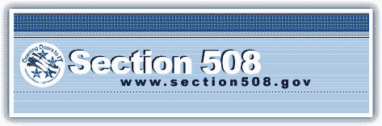

第 508 条是对美国国会 1998 年通过的《康复法案》的修正案。具体来说，它是关于残疾人获取电子信息的途径——相当于在建筑物上安装一个斜坡。这也有助于产生渐进增强的分层设计思想。

在渐进增强的三层中，第二层——表示层——是专为 CSS 设置的。我认为可以肯定地说，如果没有像 508 条款这样的修正案，CSS 将很难在如此短的时间内取得如此大的成就。

**[CSS-讨论](http://www.css-discuss.org/)**

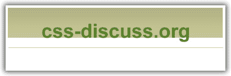

好吧，我会第一个承认这是更多的邮件列表，但这一切都始于网站。CSS-discuse 邮件列表收集了常见的 CSS 问题和来自开发人员的新闻，并将它们提供给大众，这样我们就可以集思广益，为我们遇到的问题提出创造性的解决方案。即使你只是邮件列表的一个安静的观察者，你也可以学到很多关于 CSS 的技巧和窍门。

**[西方文明](http://www.westciv.com/)**

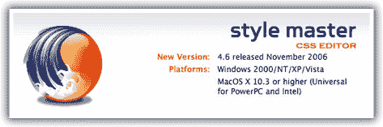

这个列表的大部分包含了我个人学习 CSS 的网站。StyleMaster 和 WestCiv 在我学习 CSS 的过程中发挥了巨大的作用，为我设计和开发的网站带来了先进的技术。StyleMaster 是为 PC 和 Mac 操作系统发布的首批 CSS 编辑器之一。它过去有——现在仍然有——许多内置的 CSS 特性，帮助开发人员(比如我)探索和测试 CSS 的局限性。

WestCiv 还在他们的网站上发布了许多 CSS 教程，这是我所发现的最好的 CSS 介绍。

**YUI CSS 库:[网格](http://developer.yahoo.com/yui/grids/)、[重置](http://developer.yahoo.com/yui/reset/)、[底纹](http://developer.yahoo.com/yui/base/)、[字体](http://developer.yahoo.com/yui/fonts/)、**

YUI 团队有一些最好的前端开发人员，他们用自己的 CSS 库超越了自己。该库包含 CSS 重置、基础、网格系统和字体文件。全世界的开发者都在使用为 YUI CSS 库开发的 CSS 文件。它也为当今许多最流行的 CSS 框架铺平了道路。

**[我爱排版](http://www.ilovetypography.com/)**

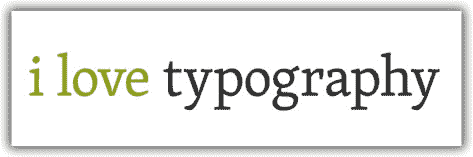

像`position`、`float`这样的属性，还有`text-indent:-9999px`这样的东西，都是 CSS 的摇滚明星(忍着我)。随着怪物的出现，很容易会有一处房产在混乱中丢失。我爱印刷术通过强调可读性的重要性将许多 CSS 属性带入了聚光灯下:行高、字母间距、空白和字体大小/系列。

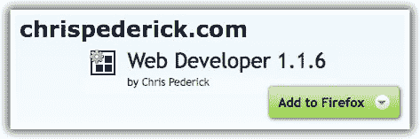

在我为这篇文章所做的研究接近尾声时，我在我的 Web Developer Extension 的特性中寻找想法来完善这个列表，这时我突然想到这个扩展本身，对我来说，是一个巨大的 CSS 影响。 [Firefox Web 开发者扩展](https://addons.mozilla.org/en-US/firefox/addon/60)是由一个叫 Chris Pederick 的家伙开发的，它在开发者社区的受欢迎程度上可以与 [Firebug](https://addons.mozilla.org/en-US/firefox/addon/1843) 和 [Greasemonkey](https://addons.mozilla.org/en-US/firefox/addon/748) 等扩展相媲美。这是我用来学习 CSS 的第一个扩展。Chris 仍然通过他的网站发布流行的 Firefox 扩展。

**[MySpace](http://www.myspace.com/)**

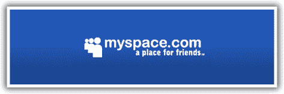

MySpace？真的吗？是的，MySpace 为 CSS 做了很多。当我们谈论将任何东西带入主流时，我们必须考虑主流 web 开发者之外的东西。MySpace 将 CSS 带给了对此毫不关心的观众。定制 MySpace 页面的数百万人都见过 CSS 即使他们不能理解，他们也看到了。考虑一下这个对话:

非技术人员:那么，你是做什么的？
**蒂姆:**我在做网页设计与开发，专业是 CSS。
**非技术人员:**CSS 是什么？蒂姆:你知道你用来让你的 MySpace 页面看起来很可怕的那段代码吗？那就是 CSS。
**非技术人员:**哦，好的。我有过这样的对话，尽管我不愿意承认。

所以，这就是我的清单，从 CSS 禅园到 MySpace。我只能希望每个人都阅读所有的描述而不只是浏览，因为有些部分我真的很期待听到意见。写这样一篇文章最棒的部分是发现每个人都要说什么，包括它可能引起的附带辩论。我期待听到反馈。

## 分享这篇文章