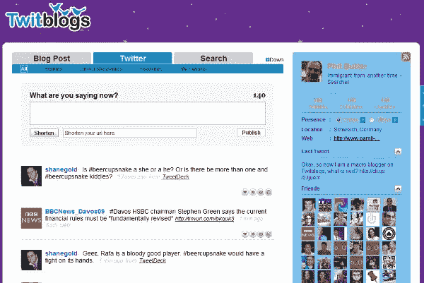
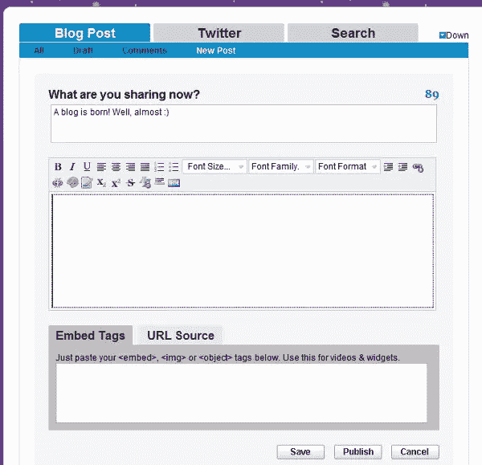
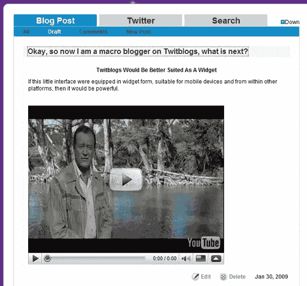
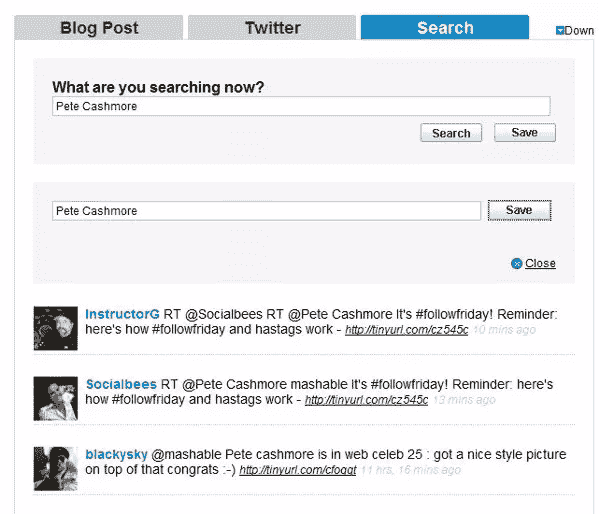

# Twitblogs Alpha 的目标是介于博客和 Twitter 之间

> 原文：<https://www.sitepoint.com/twitblogs-middleman/>

 它允许任何 Twitter 用户像往常一样发 tweet，或者使用 Twitter 发微博，包括图像、声音、视频和丰富的文本。这将最终为那些选择钻研它的人提供更深入、更多样的体验。本质上，这项服务为任何 Twitter 推文提供了一个“背景故事”。

##### 它是如何工作的

Twitblogs 界面简洁明了。用户实际上看到的是一个三个标签的顶部导航界面，侧边栏反映了他们的 Twitter 账户。顶部的标签反映了它提供的功能:分别是博客、Twitter 和搜索。在下面的屏幕截图中，可以看到这些基本功能和其他元素。

##### 博客

博客界面是这个小推文增强器的核心。提供了一个简单的文本编辑器，以及照片和图像功能。使用 extras 发布推文只需要输入标准的 140 个字符的推文，输入任何 URL(然后被缩短)，然后根据需要添加更多文本和其他媒体。最终结果是 Twitter 上的一个更新，带有返回完整条目的链接。输入界面和生成的 post 如下所示。

显示所有方面的输入编辑器。

这里的推文工作起来就像在 Twitter 网站上一样简单；或许更顺利。不需要太多的细节，很明显这个工具对很多人来说是多么的有用和有趣。对于那些对 140 个字符的限制感到沮丧的人来说，这是一篇完整的博客文章和一条微小的推文之间的一个愉快的妥协。

##### 搜索

Twitblogs 提供了一个很好的搜索功能，可以非常有效地在 Twitter 上找到人或相关的推文。保存这些搜索的能力是一个有用的附加功能。下面是一个搜索结果以及保存功能，它帮助我找到了与一个朋友相关的东西。

找到和老皮特有关的东西很容易。

##### 其他方面

根据 Twitblogs 开发团队的说法，在接下来的一周左右，他们打算发布几个关键功能，其中包括: [Growl](http://growl.info/) 通知支持，Twitter 标签中的线程对话，搜索中的自动刷新，twitblo.gs 版本的缩短网址，以及其他改进。

##### 结论

Twitblogs 由罗杰·康德拉特、桑托什·潘达和萨姆·塞西共同创立。到目前为止，创始人没有严格的角色，但罗杰是营销和公共关系主管，山姆的简历看起来像业务发展，桑托什类似于首席技术官。我向 Roger 建议，Twitblogs 将成为一个有趣的小工具形式的工具，他同意了——建议我等着看下一步会发生什么。Twitblogs 现在充满了大量的错误和故障，让体验变得相当，嗯，令人不快。这些似乎主要是 Javascript 问题，团队向我保证，他们将为许多功能采用更纯粹的 CSS 格式。

尽管还处于早期发展阶段，Twitblogs 有着明显的潜力。根据 Roger 的说法，他们已经与 Amazon 和 Sun Microsystems 建立了关系。从一个博客作者的角度来看，它目前用处不大，但我认为最终的工具是一个便携形式的交流平台。它作为一个小工具是有意义的，但对话是从 Twitter 上开始的，可以用来进行更深入的对话，并在任何地方快速、轻松地体验它。我认为这是这个工具的发展方向，实际上这正是 Twitter 首先需要的。

## 分享这篇文章