# 15 个高效的 Twitter 品牌简介

> 原文：<https://www.sitepoint.com/twitter-bios/>

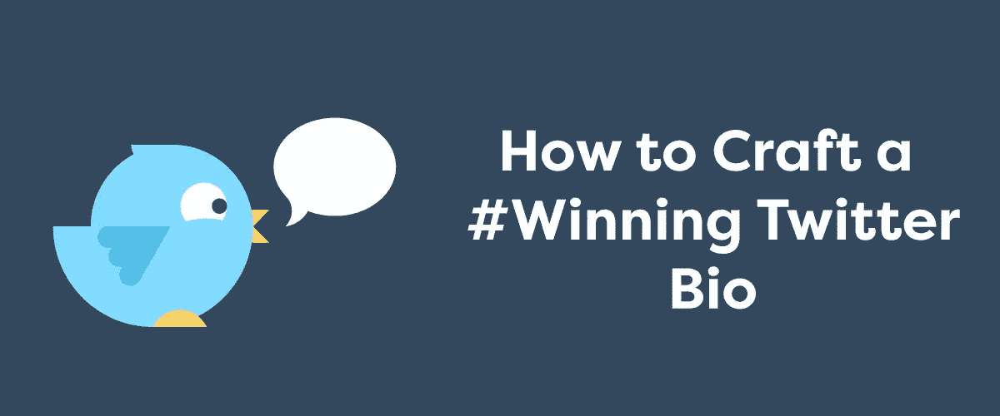

为你的品牌制作一份出色的 Twitter 简历真的很难。

毕竟，你必须传达你的公司是做什么的，为什么人们应该关注你，你的关注者可以期待什么样的推文——再加上注入你的品牌的个性和声音，这样你的观众就会感觉到你和你的公司有一种个人联系。

尽管如此，你只有 160 个角色。

为了给你一些启发，我们收集了 15 个最令人印象深刻的品牌 Twitter 简历。它们从励志到幽默到发人深省。

## 1.声音

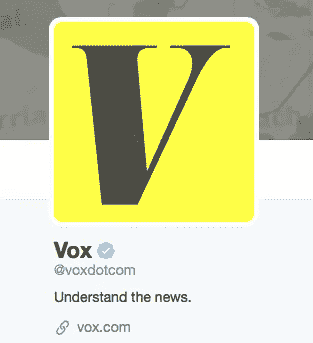

Vox 的简介简短而甜蜜，理由很充分:该出版物的目标受众是 25 至 34 岁的数字原住民，他们希望自己的信息能够快速清晰地传递。

简历甚至更有效，因为它是一个行动号召，激发一个人的自豪感。谁不想了解新闻？

最终，仅用三个词，Vox 就创造了一部吸引千禧一代、吸引追随者并强化其品牌承诺的传记。

## 2.[星巴克](https://twitter.com/Starbucks?lang=en)

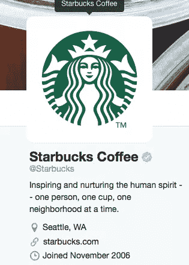

这家公司最大的成功之一是将自己定位为一家本地的、面向社区的企业——尽管它在 65 个国家拥有超过 21，000 个分支机构。

通过用崇高的术语描述它的目的，并强调其业务的“一次一杯饮料”方面，星巴克强化了这一“本地”主题。它的 Twitter 简历是品牌一致性的一个很好的例子。

## 3.[加起来](https://twitter.com/IHOP)

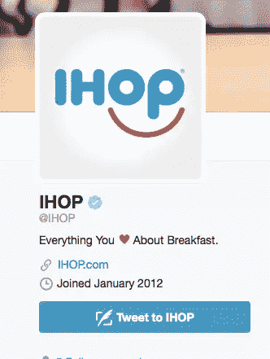

IHOP 因其 Twitter 账户获得了大量关注，这要归功于在千禧一代中真正引起共鸣的时髦、年轻的声音。

乍一看，这家煎饼连锁店的 Twitter 简历似乎有点随意；然而，iHop 的简历与其推文一样具有战略意义。心形表情符号展示了 IHOP 的文化素养，同时直接向读者表达强调了“我们是你的酷朋友”的氛围。

## 4.捷蓝航空

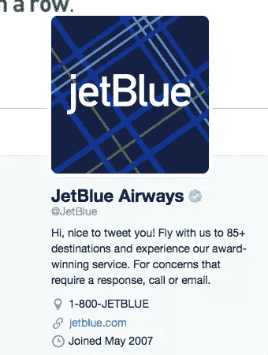

捷蓝航空公司的简历充满活力，令人愉快，以服务为导向。换句话说，它完全符合捷蓝航空的核心价值观。

第一行让你会心一笑，第二行叫出捷蓝的产品，第三行将客户服务咨询引向适当的渠道。干得好，捷蓝航空。

## 5.[香奈儿](https://twitter.com/CHANEL)

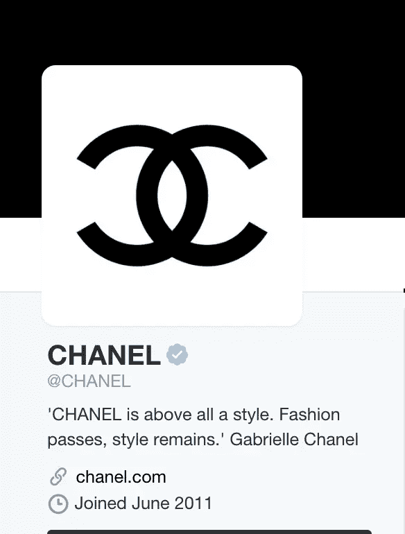

没有多少品牌能够幸运地拥有一句名言来完美地总结它们的传统、经典和形象。所以如果你有一个，你最好用它。

这句话也激励你成为香奈儿的客户，或者如果你已经是一个，继续购买香奈儿的产品。这意味着，通过这样做，你加入了一个永远时尚的专属群体。相当有效。

## 6.科切拉

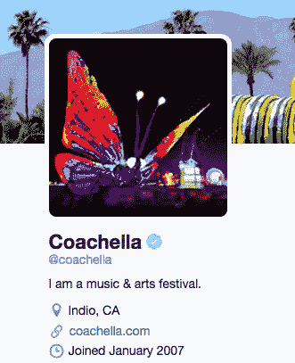

我们喜欢这种出人意料的描述。你能想象美国银行说“我是一家银行公司”或者麦当劳说“我是一家全球快餐连锁店”吗？科切拉有点古怪，用第一人称指代“它自己”，不愧是独一无二、有点疯狂的人。

## 7.[特斯拉](https://twitter.com/TeslaMotors)

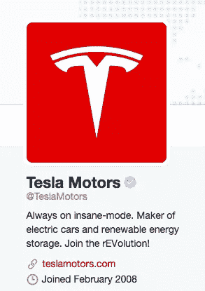

最新的特斯拉型号[有一个名为“疯狂模式](http://www.popsci.com/tesla-model-s-now-insane-mode)的按钮，因此其简介的第一行既是对该公司不断创新的引用，也是与客户的内部玩笑。精彩的开场之后是对特斯拉产品的精彩总结和有趣的战斗口号。

## 8. [Evernote](https://twitter.com/evernote)

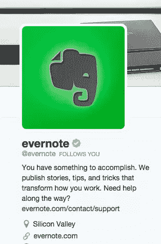

这份简历让你对成为 Evernote 用户感觉良好——毕竟，它暗示你使用该产品是因为你有重要的事情要做。这也给了你一个非常具体的理由去关注这个客户:你会得到如何更有效率的建议。

## 9.[希拉里·克林顿](https://twitter.com/HillaryClinton)

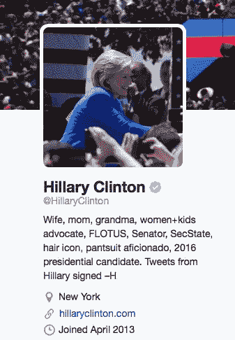

希拉里·克林顿经常被批评过于保守，更不用说机器人、不可理喻和冷漠了。这就是为什么她的推特简历如此天才。

它以她的三个最“温暖而模糊”的角色(妻子、妈妈和奶奶)开始，然后列出了她的职业立场。对她的套装和发型的引用提醒你她是一个文化偶像，同时也向你展示她可以自嘲。

## 10. [Salesforce](https://twitter.com/salesforce)

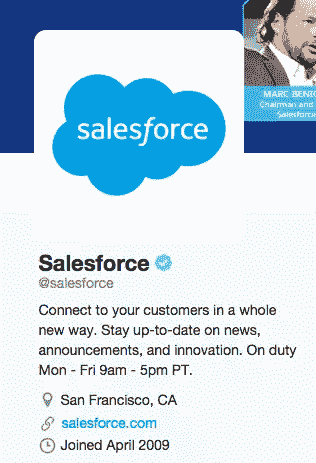

Salesforce 可能没有最有创意的 Twitter 简历，但它非常有效。它设法宣传为什么你应该使用它的产品和关注它的 Twitter 账户。此外，您还将了解如何联系服务代表的宝贵信息。

## 11. [WeWork](https://twitter.com/WeWork)

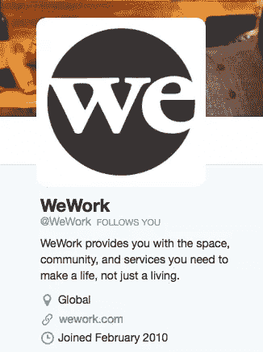

WeWork 是一家办公室租赁公司，最近估值为 100 亿美元。它的一行解释出色地总结了 WeWork 提供的产品，同时强调了这些产品将如何改善您的生活。WeWork 本质上是在说，“当然，其他公司帮你赚钱，但我们帮你做你喜欢的事情。”

## 12.[维多利亚的秘密](https://twitter.com/VictoriasSecret)

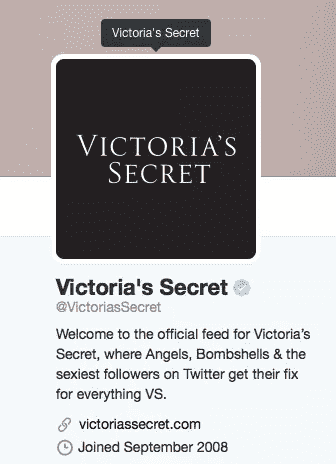

这份简历并不微妙——但话说回来，维多利亚的秘密品牌也不微妙。通过将其追随者与天使和重磅炸弹分组，再加上称他们为“Twitter 上最性感的追随者”，VS 让他们感觉自己是在一个有特权的，稍微有点淘气的群体中。如果你读了简历却不跟进，就好像你承认自己不性感。

## 13.[Gmail 收件箱](https://twitter.com/inboxbygmail)

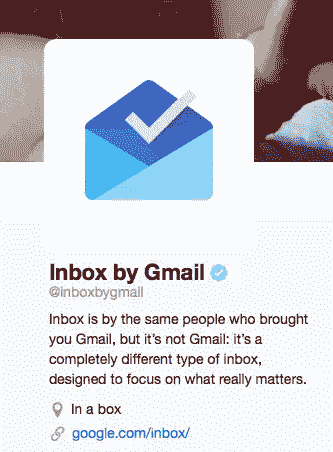

收件箱有一个公关问题:它是一个由 Gmail 设计并由 Gmail 支持的电子邮件平台…但它实际上不是 Gmail。这篇简历很好地解释了收件箱和 Gmail 的不同之处，同时仍然利用了 Gmail 的名称。创造性地使用 Twitter 的定位功能可以加分。

## 14.[群集线器](https://twitter.com/GrubHub)

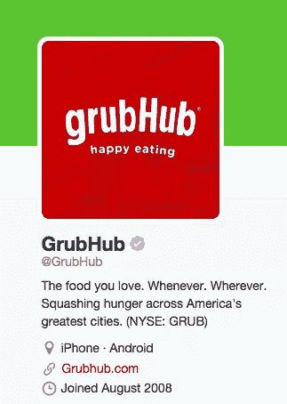

GrubHub 一直在试图抓住年轻观众(其在 T2 的持续增长表明该公司是成功的)。它随意、不废话的声音会赢得年轻人的支持；另外，主题——我们不会浪费你的时间——反映了使用 GrubHub 是多么方便快捷。

## 15.[通用电气](https://twitter.com/generalelectric)

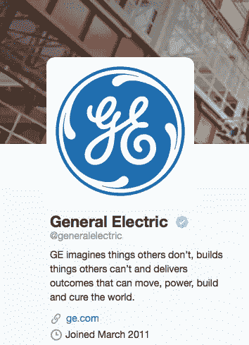

很难从传统意义上推销通用电气，因为该公司涉足从航空和家电到医疗保健和能源的众多领域。

所以在它的简历中，公司并不试图列出它的每一个部分——甚至是最重要的部分。相反，它打出了鼓舞人心的牌，将其行动提升为人道主义使命。

## 分享这篇文章