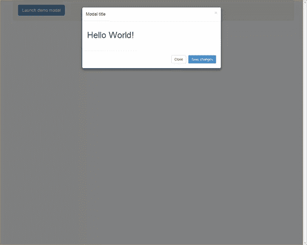
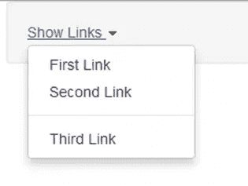
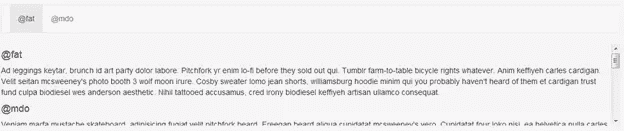

# Twitter Bootstrap 3–JavaScript 组件

> 原文：<https://www.sitepoint.com/twitter-bootstrap-3-javascript-components/>

Twitter Bootstrap 恰好是当今互联网上最简单也是最好的 CSS 框架。它允许没有 CSS 知识的开发人员毫不费力地构建基本模板。但这并不能阻止设计师使用 Bootstrap。

Twitter Bootstrap 拥有最好的一套强大的 JavaScript 组件。现在，这些组件易于使用，并且可以在您的 web 项目中使用。

在本教程中，我将讨论一些最好的 Twitter Bootstrap 的 JavaScript 组件以及如何使用它们。

## 我们开始吧！

首先，我们需要 getbootstrap.com 的 Twitter Bootstrap 3 设置，一个网络浏览器(最好是谷歌浏览器)和一个好的文本编辑器(我用的是 Sublime Edit)。我们首先应该明白的是，Bootstrap 的 JavaScript 组件是用 jQuery 编写的。所以我们需要 jQuery 来和他们一起工作。

下载 Bootstrap 3 之后，复制 dist 文件夹的内容并粘贴到一个新的工作空间中。

你一定在想，当我们要学习 JavaScript 时，为什么我们需要 CSS 和 fonts 文件夹？有许多引导 JavaScript 组件依赖 CSS 才能正常工作。所以除非你包含了引导 CSS，否则它不会正常工作。

Twitter Bootstrap 3 还允许我们单独使用每个模块，而不是下载所有的 JavaScript 组件。我们将在本教程的最后看到如何使用一个单独的模块，而不是包括所有的组件。

本教程中解释的一些主要 Twitter 引导 JavaScript 组件是:

1.  情态的
2.  掉下
3.  ScrollSpy(滚动新闻)
4.  标签
5.  工具提示
6.  波普沃
7.  警报

我们将在本教程中逐一介绍。我们还将对每个组件进行一些实验，以便得到一个定制的 Bootstrap 3 JavaScript 组件。在这里看看我们的[演示页面](http://extremecss.com/demos/bs_javascript/)。

## 情态的

模态是一个对话框提示，就像传统的警告一样。它有一些高级特性，比如模态标题、模态主体、模态页脚、关闭按钮和右上角的关闭符号。它可以在许多应用中用作确认窗口，例如在付款或删除帐户之前等。

```
<!-- Button trigger modal -->
<button class="btn btn-primary btn-lg" data-toggle="modal" data-target="#myModal">
  Launch demo modal
</button>

<!-- Modal -->
<div class="modal fade" id="myModal" tabindex="-1" role="dialog" aria-labelledby="myModalLabel" aria-hidden="true">
  <div class="modal-dialog">
    <div class="modal-content">
      <div class="modal-header">
        <button type="button" class="close" data-dismiss="modal" aria-hidden="true">&times;</button>
        <h4 class="modal-title" id="myModalLabel">Modal title</h4>
      </div>
      <div class="modal-body">
        <h1>Hello World!</h1>
      </div>
      <div class="modal-footer">
        <button type="button" class="btn btn-default" data-dismiss="modal">Close</button>
        <button type="button" class="btn btn-primary">Save changes</button>
      </div>
    </div><!-- /.modal-content -->
  </div><!-- /.modal-dialog -->
</div><!-- /.modal -->
```



Bootstrap Modal 有三个部分:页眉、正文和页脚。你可以决定在每个盒子里放什么。

## 掉下

在 Twitter Bootstrap 3 中创建下拉菜单变得非常容易。你只需要理解正确的标记要求。您可以在导航栏或任何 div 中使用这个下拉菜单。

```
<div class="dropdown">
  <a data-toggle="dropdown" href="#">Show Links <b class="caret"></b></a>
  <ul class="dropdown-menu" role="menu">
    <li><a href="#">First Link</a></li>
    <li><a href="#">Second Link</a></li>
    <li role="presentation" class="divider"></li>
    <li><a href="#">Third Link</a></li>
  </ul>
</div>
```



首先，您必须将类“dropdown”赋予任何您想将其视为下拉元素的父元素。在我的例子中，我使用了一个 div 元素。你甚至可以制作一个 li 元素作为“下拉菜单”。然后，您必须在 dropdown 元素中立即放置一个“

要在 li 元素之间添加分隔符，请将 class 为“divider”的新 emplty li 元素添加到列表中。

如果您不喜欢 data-*属性，那么您甚至可以使用 jQuery 触发下拉菜单。给 link 元素一个惟一的 id，并调用 dropdown 方法，如下所示:

```
$('#myDropDown').dropdown();
```

## ScrollSpy(滚动新闻)

ScrollSpy 是添加到 Twitter 引导库中的一个有趣的 JavaScript 模块。它基本上是导航菜单和下面内容的组合。它的作用是在您向下滚动内容区域时更新导航栏中的活动项目。

要使用 ScrollSpy 特性，您必须向 body 元素添加 data-spy="scroll "和 data-target="#top-navigation "属性。这里#top-navigation 是我的导航栏的 id。确保导航栏中的链接是内部链接。请参见[演示页面](http://extremecss.com/demos/bs_javascript/)查看真实示例。



## 制表符

Twitter Bootstrap 3 的标签从传统的 jQuery 标签中获得灵感。它们看起来和功能都很相似。要使用引导选项卡，您需要定义两个独立的部分:选项卡导航和选项卡区域。

标记如下所示:

```
<!-- Nav tabs -->
<ul class="nav nav-tabs">
  <li class="active"><a href="#home" data-toggle="tab">Home</a></li>
  <li><a href="#profile" data-toggle="tab">Profile</a></li>
  <li><a href="#messages" data-toggle="tab">Messages</a></li>
  <li><a href="#settings" data-toggle="tab">Settings</a></li>
</ul>

<!-- Tab panes -->
<div class="tab-content">
  <div class="tab-pane active" id="home">...</div>
  <div class="tab-pane" id="profile">...</div>
  <div class="tab-pane" id="messages">...</div>
  <div class="tab-pane" id="settings">...</div>
</div>
```

导航是使用带有类“nav-tabs”的 ul 元素创建的，而附加的类“nav”用于应用导航 CSS 样式。每个 li 元素都由一个内部链接组成，该链接应该将属性“data-toggle”定义为“tab”。这将触发 Twitter Bootstrap 的标签 JavaScript，并显示相应的标签区域。

来到选项卡区域，它由一组 div 元素组成。父 div 应该有一个“tab-content”类，子 div 应该有一个“tab-pane”类。每个选项卡窗格必须有一个与选项卡导航中定义的内部链接相对应的 id。在上面的例子中，我将第一个选项卡窗格的一个类设置为活动的。这使得它在默认情况下可见。

## 工具提示

ToolTip 是 Twitter Bootstrap 3 提供的一个极其有用的 JavaScript 插件。它有助于在任何 HTML 元素上显示帮助文本。它也是跨浏览器兼容的！

要使用工具提示，标记如下所示:

```
<button id="myButton" type="button" class="btn btn-default" data-toggle="tooltip" data-placement="left" title="" data-original-title="Tooltip on left">Tooltip on left</button>
```

上面的标记显示了一个具有工具提示功能的按钮。Bootstrap 使用属性“data-toggle”来标识它必须在哪个元素上显示工具提示。属性“data-original”用于定义工具提示中的内容。属性“数据放置”用于帮助引导在哪里显示工具提示。

出于性能原因，默认情况下，Bootstrap 不会初始化工具提示和弹出窗口组件。您必须使用以下 jQuery 手动初始化它们:

```
$('#myButton').tooltip();
```

## 松饼

如果你曾经是 iBook 的铁杆读者，那么你就会明白什么是爆米花。它们是 ToolTip 的扩展版本，有更多的功能。您可以在 Popovers 中显示更多 HTML 元素，如 img 标签、链接、附加 div 等。

```
<button type="button" class="btn btn-default" data-toggle="popover" data-placement="left" data-content="Vivamus sagittis lacus vel augue laoreet rutrum faucibus." data-original-title="" title="">
          Popover on left
        </button>
```

HTML 代码段显示一个具有弹出功能的按钮。它还有一组您必须理解的定制数据属性。

属性“data-toggle”标识哪个元素必须控制弹出窗口。属性“数据-内容”包含应该在弹出窗口中显示的数据。
属性“数据放置”告诉弹出框应该出现在哪一边。

在上面的例子中，数据必须是纯文本。如果您想在 popover 中显示 HTML 内容，那么您必须添加附加属性“data-html”作为 true。HTML 数据内容必须放在双引号内，必要时使用转义字符。

弹出窗口中 HTML 数据内容的标记应该如下所示:

```
<button id="myPopover" type="button" class="btn btn-default" data-toggle="popover" data-placement="left" data-html="true" data-content="<a href=\"http://www.google.com\">Go to google</a>" data-original-title="" title="">
          Popover on left
        </button>
```

使用下面的 jQuery 初始化弹出窗口:

```
$('#myButton').popover();
```

## 警报

Twitter Bootstrap 的提醒不像弹出窗口。它们是一组 div，带有预定义的背景颜色和一个消除按钮。标记如下所示:

```
<div class="alert alert-warning fade in">
        <button type="button" class="close" data-dismiss="alert" aria-hidden="true">×</button>
        <strong>Holy guacamole!</strong> Best check yo self, you're not looking too good.
      </div>
```

上面的警报有一个浅黄色的背景，因为它是一个警告消息。您可以通过将警报级别更改为“警报-危险”来将颜色更改为红色。每个警报 div 必须有一个关闭按钮，上面定义了一组数据属性。属性“data-dissolve”在单击时隐藏警报 div。

## 结论

您现在可能对 Twitter Bootstrap 如何帮助我们编写 JavaScript 组件有了更好的理解，而无需在代码中编写一行 jQuery。这些 JavaScript 组件是 Twitter Bootstrap 框架在当今网络中如此流行的主要原因之一。

它不仅成为零 CSS 知识的开发者的框架，也成为设计师提高设计周转时间的框架。在我的下一篇教程中，我将解释如何使用 Twitter Bootstrap 3 的 Carousel 组件创建滑块。

希望你喜欢看我的帖子。如果你有任何疑问，请在评论区留言。我很乐意帮忙。

如果你是 Twitter Bootstrap 的新手，那么请访问我在 Sitepoint 上的[作者页面](https://www.sitepoint.com/author/sfrahman/),阅读我以前的 Twitter Bootstrap 教程。

[演示页面](http://extremecss.com/demos/bs_javascript/)

## 分享这篇文章