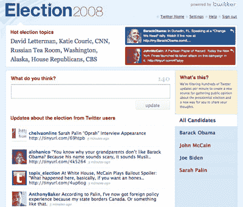

# Twitter 推出选举混搭，可能更多

> 原文：<https://www.sitepoint.com/twitter-launches-election-mashup-could-be-so-much-more/>

距离美国总统大选只有一个多月了，许多网站都争先恐后地加入进来，推出候选人观察页面。像 [YouTube](http://www.youtube.com/youchoose) ， [Digg](http://digg.com/elections/) ， [MySpace](http://www.myspace.com/index.cfm?fuseaction=impact) 甚至 [PriceGrabber](http://www.pricegrabber.com/home_election.php) 这样的网站已经存在很久了。一家迟到的公司是 Twitter，它今晚发布了一个选举混搭。鉴于 Twitter 在美国选举周期中一直是选举聊天的温床，该公司试图通过官方渠道进行宣传是有道理的。

这个网站被简单地称为“选举 2008”，它拉进它知道是关于美国大选的推文，实时传输它们，并将它们解析成候选人及其竞选伙伴巴拉克·奥巴马、约翰·麦凯恩、乔·拜登和萨拉·佩林的单独主题页面。页面顶部有与选举相关的热门话题，链接到相关的 Twitter 搜索，以及候选人自己的最新推文。

登录后，用户可以直接在页面上发微博，正常的“你在做什么？”问题被更具话题性的“你怎么看？”

与第三方 Twitter 选举混搭 [Politweets](http://politweets.com/) 相比，Twitter 混搭可能更好一些，它也解析与选举相关的推文，并且已经存在至少半年了。它实时更新，包括热门话题花絮，指出聊天的趋势(尽管 Politweets 也从 Flickr、YouTube 和维基百科获取相关数据，这很好)。

然而，这两个网站都没有达到可能的水平，我特别希望从 Twitter 的官方选举混搭中获得更多。当然，这不仅仅适用于政治。Twitter 是各种未被充分利用的信息的金矿。正如 Joseph Smarr、Dave Morin 和 Nova Spivack 在本周的 EmTech 会议上[所说，在归档和管理人们现在创造的所有有价值的社会数据方面，有一个必须解决的主要问题。](https://www.facebook.com/sitepoint/)

Twitter 的选举混搭就是一个很好的例子。每周 7 天、每天 24 小时都有大量令人惊叹的数据流，但它们并没有被正确归档(至少对用户来说没有任何有用的方式)，当然也没有被管理或挖掘出全部潜力。

在看到本周早些时候发布的新脸书词典的预览后，很难不对 Twitter 的选举频道感到失望。人口统计信息在哪里？趋势图在哪里一拉[扭](http://twist.flaptor.com/)？情绪图表在哪里？Summize 被 Twitter 收购，现在为他们的搜索引擎(可能还有新的选举页面)提供支持，它实际上在[阅读 Twitter 上的情绪](http://www.briansolis.com/2008/05/summize-listens-to-conversations-and.html)方面做了很多工作——事实上，它最初是一个专门确定情绪的评论搜索引擎。那么，为什么它没有在这里得到应用呢？

Twitter 上每天都有大量非常有用的数据被创造出来，所以很遗憾没有人将这些数据归档，并以真正有用的方式挖掘它们。对于政治迷来说，观看一系列与选举相关的推文可能很有趣，但它不是超级有用的，并且在高内容时段(如今晚的辩论期间)可能无法关注。感觉 Twitter 在他们本可以做一些真正特别的事情的时候，选择了简单的方式。

正如我所说，这不仅仅适用于政治。从 Twitter 上收集的情绪、趋势和人口统计数据可能有广泛的有用研究应用。例如，想象一下，如果你可以跟踪关于史蒂夫·乔布斯主题演讲的推文中的情绪，然后逐年比较它们，看看现实扭曲场有多强。或者想象一下，如果我们可以在推特上看到关于特定运动队的人口统计数据，看看球迷们在哪里真正参与进来。可能性是无限的。我们希望有人在 Twitter 或其他地方正致力于这样的事情(如果你是，请给我们发电子邮件！).

## 分享这篇文章