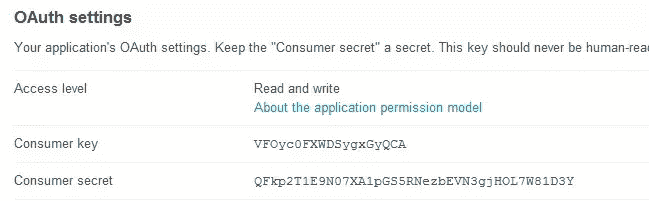
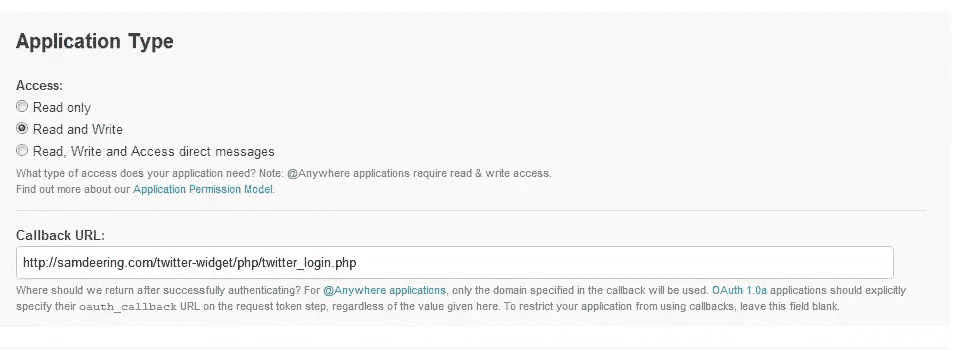
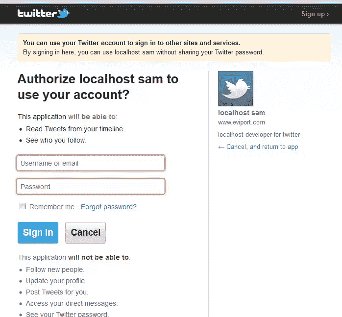
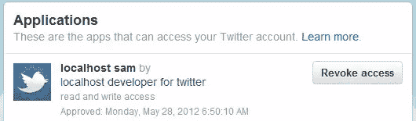
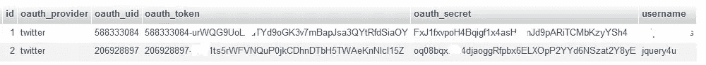

# Twitter oAuth 如何在场景环境中工作

> 原文：<https://www.sitepoint.com/twitter-oauth-works-twitter-context/>

## oAuth 场景“Twitter 先生”

把 Twitter 的认证想象成询问**oAuth**先生去**Twitter ers 先生家** 的方向。只有得到推特先生的许可，奥特先生才能给你指路。另外，oAuth 先生非常健忘，让你打电话给 Twitter 先生问路。你必须打电话给推特先生问路。他请你留下电话号码，他会给你回电话。他直接回来告诉你方向，然后你去那里。你敲门，然后推特先生回答并问你密码，他给你一把钥匙，然后关上门。你现在必须用钥匙开门，当门开着的时候，你可以随心所欲地进出。门是自锁的，所以如果你关门，你必须再次用钥匙开门。如果你丢了钥匙，或者 Twitter 先生从你手里拿走了钥匙，那么你必须再次敲门并索要钥匙。

Ok。让我们把它放入上下文中，在这个场景中，oAuth 先生是 oAuth 的 **PHP Twitter 库，Twitter 先生是 Twitter 应用** 的 **，密钥是访问令牌，门后是 Twitter REST API ，Twitter 先生的房子。因此，为了安全地访问 Twitter REST API，我们必须:**

 **### 1.得到许可去问问去推特先生家的路。

这一步包括**创建一个 Twitter 开发人员应用程序**来获取消费者密钥和消费者秘密(请求指示的许可)。(如果您希望发布 tweets 以及获取用户信息，您还必须将访问级别设置为:读取和写入)。

### 2.向奥特先生打听去推特先生家的路。

使用两个开发者密钥，你可以从 oAuth 库(推特先生的电话号码)获得一个授权 url。然后，您必须使用您的**请求令牌**重定向到该 url(调用 Twitter 先生)。你可以指定一个**回叫 url** 或者使用开发者应用程序设置中指定的回叫(必须设置其中一个以便 Twitter 先生回叫你指示)。Twitter API 将使用回调，并向您发送一个**验证令牌**。

### 3.敲推特先生的门。

使用你的验证令牌，你可以申请一个**访问令牌**(敲门，Twitter 先生回答并接受你的验证代码，给你一把钥匙，然后他关上了门)。

### 4.用钥匙开门。

我们可以使用访问令牌来查询 **Twitter REST API** 。将访问令牌存储在 **PHP 会话变量**中也可能很方便(将打开的门想象为会话，如果会话结束，门就会关闭，您必须再次使用密钥来打开新的会话)。我们现在可以安全地发布推文或获取用户信息。

## 一些进一步的想法

Twitter 先生收回密钥——如果用户“撤销”对应用程序的访问，那么你必须返回并再次请求许可。

**通过在会话变量中存储方向节省时间(丢失密钥)**–如果用户清除其会话(丢失密钥)，则我们必须请求新的访问令牌。

**通过记下方向来节省时间**–我们可以将 oAuth 令牌存储在数据库中，以便我们可以重用它们来生成新的访问令牌(从而避免询问许可步骤)。

## 分享这篇文章**