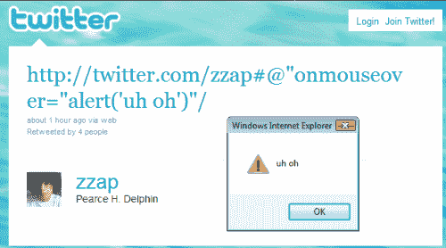

# 推特被成千上万的推特蠕虫攻击

> 原文：<https://www.sitepoint.com/twitter-xss-worm-attack/>

Twitter 修复了一个跨站点脚本(XSS)漏洞，该漏洞导致数千条消息在整个系统中传播。令人难以置信的是，一个简单的 JavaScript onmouseover 函数调用就暴露了这个安全缺陷。继今天早些时候 [RainbowTwtr](http://twitter.com/RainbowTwtr) 的帖子之后， [zzap](http://twitter.com/zzap) 和 [judofyr](http://twitter.com/judofyr) 首先利用了它:

将鼠标悬停在消息上方会引发 JavaScript 警报，几小时后，垃圾邮件发送者就会利用该漏洞重定向到其他网站、更改背景并转发消息。幸运的是， [Twitter 在垃圾邮件发送者试图窃取 cookies 或从外部网站加载更大的 JavaScript 有效载荷之前修复了问题](http://status.twitter.com/post/1161435117/xss-attack-identified-and-patched)。

应该注意的是，这个漏洞影响了 Twitter.com，也可能影响了在网络浏览器中打开的第三方系统。安全公司 F-Secure 建议用户使用 TweetDeck 等应用程序，直到问题得到解决。然而，所有用户都会看到流氓推文。

系统被影响了几个小时，在上搜索[揭示了漏洞的范围。有几个问题让我感到惊讶:](http://twitter.com/#search?q=onmouseover)

1.  Twitter 为什么没有立即关闭这项服务？
2.  为什么用户输入没有被完全净化？我们都会犯编程错误，但这是一个相当基本的问题。
3.  为什么没有早点发现漏洞？(也许是在最近的一次更新中引入的？)

请[发微博告诉我](http://twitter.com/craigbuckler)你的答案。转念一想…

## 分享这篇文章